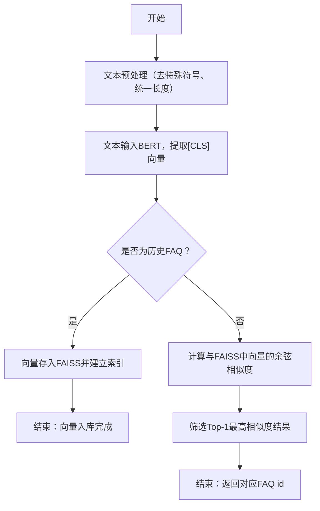

# 作业1
## 后端工作：
### 核心数据库的设计和搭建
1. 根据问题的提问方式和关联问题的展示，需要设计的核心表有 FAQ 主表、相似问法表、关联问题表。
- FAQ 主表用于存储标准问答的信息，需要包含的关键字段有：FAQ 唯一 ID、问题标题、标准回答、创建时间、生效时间、更新时间、生效状态、排序权重、扩展备注等。
- 相似问法表 用于存储用户对同一标准问题的不同表达方式，关键字段：唯一 ID、对应的 FAQ 主表 ID、相似问法内容、排序权重、创建时间、生效状态、更新时间等。
- 关联问题表 用于存储 FAQ 之间的关联关系，可在问答详情页底部 “相关问题” 推荐展示，关键字段：记录 ID、提问的 FAQ ID、关联的 FAQ ID、关联类型、关联程度、创建时间、生效状态、更新时间等。
2. 基于以上核心数据库设计，搭建测试和正式双环境，设计对应的数据隔离与同步逻辑。
### 开发各类业务接口
开发包括 FAQ 的录入、编辑、失效、转移，以及批量导入导出等功能接口。
## 算法工作
### 用户提问与历史 FAQ 的相似度匹配
1. 选用合适的 BERT 模型，对用户提问和历史 FAQ 的文本做语义编码，使用 Bert 提取深层的语义特征向量，存储向量数据库；
2. 再基于生成的向量做相似度计算，实现精准匹配。
### 大模型辅助
可使用大模型，直接通过用户提问，生成关联问题。

# 作业2
## 技术方案
### 1. 文本预处理
对历史 FAQ 标题、相似问法及用户提问做统一清洗，去除特殊符号、无异议词等，完成文本处理
### 2. 文本编码
将预处理后的文本输入 Bert 模型，取模型最后一层的 [CLS] 向量作为文本的语义特征向量，输出统一的固定维度向量
### 3. 建立向量数据库
将所有 FAQ 的语义向量存入向量数据库中
### 4. 相似度计算
用户的提问，经过 Bert 模型处理转为予以向量后，计算与向量数据库中的余弦相似度，取通过阈值的 top1
### 5. 返回结果
根据向量数据库，提供给后端 FAQ 的id，后端查询数据库返回用户标准答案和相关问题
## 流程图

