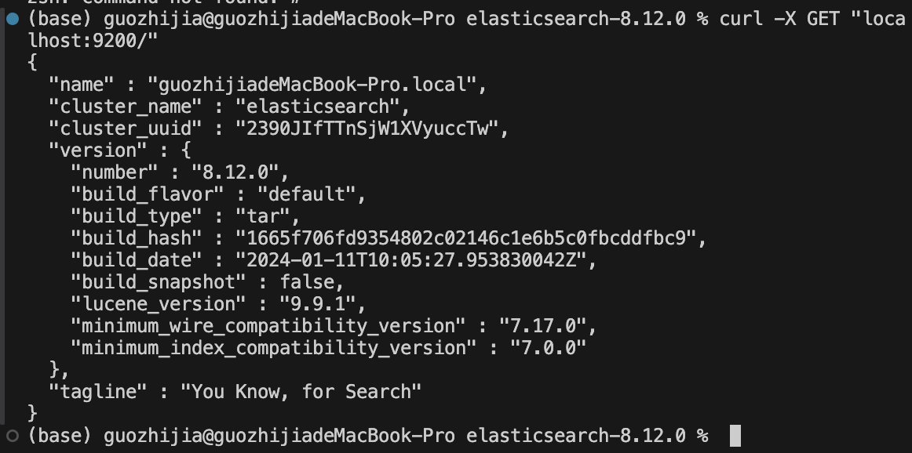

# 1. 本地配置 ES 环境
## 运行图片


# 2. ES 测试
## 运行记录
```bash
(nlp_learn) guozhijia@guozhijiadeMacBook-Pro Week06 % python ./04_ES测试.py
--- 正在测试 Elasticsearch 连接 ---
连接成功！
{
  "name": "guozhijiadeMacBook-Pro.local",
  "cluster_name": "elasticsearch",
  "cluster_uuid": "2390JIfTTnSjW1XVyuccTw",
  "version": {
    "number": "8.12.0",
    "build_flavor": "default",
    "build_type": "tar",
    "build_hash": "1665f706fd9354802c02146c1e6b5c0fbcddfbc9",
    "build_date": "2024-01-11T10:05:27.953830042Z",
    "build_snapshot": false,
    "lucene_version": "9.9.1",
    "minimum_wire_compatibility_version": "7.17.0",
    "minimum_index_compatibility_version": "7.0.0"
  },
  "tagline": "You Know, for Search"
}

==================================================

--- 正在测试常见的 Elasticsearch 内置分词器 ---

使用分词器：standard
原始文本: 'Hello, world! This is a test.'
分词结果: ['hello', 'world', 'this', 'is', 'a', 'test']

使用分词器：simple
原始文本: 'Hello, world! This is a test.'
分词结果: ['hello', 'world', 'this', 'is', 'a', 'test']

使用分词器：whitespace
原始文本: 'Hello, world! This is a test.'
分词结果: ['Hello,', 'world!', 'This', 'is', 'a', 'test.']

使用分词器：english
原始文本: 'Hello, world! This is a test.'
分词结果: ['hello', 'world', 'test']

==================================================

--- 正在测试 IK 分词器 ---

使用 IK 分词器：ik_smart
原始文本: '我在使用Elasticsearch，这是我的测试。'
分词结果: ['我', '在', '使用', 'elasticsearch', '这是', '我', '的', '测试']

使用 IK 分词器：ik_max_word
原始文本: '我在使用Elasticsearch，这是我的测试。'
分词结果: ['我', '在', '使用', 'elasticsearch', '这是', '我', '的', '测试']
```

# 3. ES 基础
## 运行记录
```bash
(nlp_learn) guozhijia@guozhijiadeMacBook-Pro Week06 % /Users/guozhijia/anaconda3/envs/nl
p_learn/bin/python 05_ES基础.py
连接成功！
/Users/guozhijia/Documents/八斗/第6周：RAG工程化实现/Week06/05_ES基础.py:52: DeprecationWarning: The 'body' parameter is deprecated for the 'create' API and will be removed in a future version. Instead use API parameters directly. See https://github.com/elastic/elasticsearch-py/issues/1698 for more information
  es_client.indices.create(index=index_name, body=mapping)
索引 'blog_posts_py' 创建成功。
文档已插入: 'Elasticsearch 入门指南'
文档已插入: '深入理解IK分词器'

--- 1. 查询标题中的 '入门指南' ---
/Users/guozhijia/Documents/八斗/第6周：RAG工程化实现/Week06/05_ES基础.py:87: DeprecationWarning: The 'body' parameter is deprecated for the 'search' API and will be removed in a future version. Instead use API parameters directly. See https://github.com/elastic/elasticsearch-py/issues/1698 for more information
  response = es_client.search(index=index_name, body=query)
找到 1 条文档：
得分：1.6575259，文档：Elasticsearch 入门指南

--- 2. 结合全文（搜索技术）和精确匹配（作者：张三） ---
找到 1 条文档：
得分：1.4113983，文档：Elasticsearch 入门指南
```