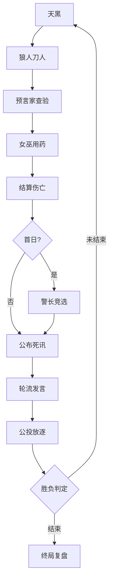

# 🐺 AI 狼人杀：多智能体协作与博弈 Agent Team 终极实战指南

> **文档用途**：本文档是 AI 辅助编程（Vibe Coding）的唯一真理来源。所有代码生成、架构设计、Prompt 工程均需严格遵循此规范。
> **版本**：v2.0 (Enhanced)

---

## 目录
1. [项目核心定义](#1-项目核心定义)
2. [系统架构蓝图](#2-系统架构蓝图)
3. [核心机制详解](#3-核心机制详解)
4. [游戏规则基准](#4-游戏规则基准)
5. [进阶研究方向](#5-进阶研究方向)
6. [API 接口规范](#6-api-接口规范)
7. [前端观战 UI 设计](#7-前端观战-ui-设计)
8. [Vibe Coding 执行路线图](#8-vibe-coding-执行路线图)
9. [快速启动命令](#9-快速启动命令)
10. [特别指令](#10-特别指令)

---

## 1. 项目核心定义

### 1.1 愿景
构建一个**高可信、可观测、可进化**的多智能体狼人杀博弈平台。不仅是游戏模拟，更是研究 LLM 在信息不对称、多方博弈、社会推理场景下的行为实验室。

### 1.2 核心差异化特征
- 🧠 **结构化思维链**：拒绝黑盒决策，所有行动必有 CoT 支撑。
- 🎭 **动态人格系统**：Agent 具备独立性格参数，拒绝同质化发言。
- 🔌 **插件化角色架构**：角色逻辑与引擎解耦，支持热插拔与自生成。
- 👁️ **信念可视化**：前端实时渲染 Agent 内心的信任/怀疑矩阵。
- 🛡️ **元认知监控**：内置防死循环与信息熵监测，保障对局流畅。

### 1.3 目标与非目标

**目标（Goals）**：
- 构建完整的多智能体狼人杀对局引擎
- 实现严格的信息隔离机制
- 提供全程可观测的结构化日志
- 支持前端观战 UI（加分项）

**非目标（Non-Goals）**：
- 不实现非主流进阶角色（如守卫、白痴等）
- 不支持跨服务器联机
- 不实现复杂的社交关系系统

---

## 2. 系统架构蓝图

### 2.1 分层架构

| 层级 | 组件 | 关键职责 | 技术栈推荐 |
| :--- | :--- | :--- | :--- |
| **表现层** | Vue3 Watchtower | 实时看板、信念热力图、人机交互、日志流 | Vue3 + Pinia + ECharts |
| **接口层** | FastAPI Gateway | RESTful API、WebSocket 推送、鉴权、限流 | FastAPI + Uvicorn |
| **引擎层** | Game Orchestrator | 状态机流转、规则校验、元监控、插件调度 | Python + StateMachine |
| **智能层** | Agent Runtime | LLM 调用、CoT 解析、记忆管理、人格注入 | LangChain / AutoGen |
| **数据层** | Structured Store | 对局日志、评测指标、配置模板 | SQLite / PostgreSQL + JSONL |

### 2.2 目录结构规范

```text
ai-werewolf/
├── agent/                # 智能体核心
│   ├── core/             # BaseAgent, Memory, Persona
│   ├── prompts/          # 分角色 Prompt 模板 (Jinja2)
│   └── strategies/       # 高阶策略模块 (悍跳, 倒钩)
├── engine/               # 游戏引擎
│   ├── state_machine.py  # 核心状态流转
│   ├── meta_monitor.py   # ⭐ 元认知监控器
│   ├── plugins/          # ⭐ 角色插件目录
│   └── rules/            # 胜负判定、动作合法性校验
├── api/                  # 后端服务
├── frontend/             # 前端观战台
├── evaluation/           # 评测与Leaderboard
├── configs/              # 游戏板子、人格预设
└── docs/                 # 设计文档与API Spec
```

### 2.3 核心组件详解

#### 2.3.1 Agent Runtime（智能层）
- **BaseAgent**：统一的 Agent 基类，处理 LLM 调用、记忆管理
- **Memory System**：独立记忆体，支持长期记忆和短期上下文
- **Persona System**：动态人格注入，影响决策风格
- **CoT Parser**：解析思维链，提取决策依据

#### 2.3.2 Game Orchestrator（引擎层）
- **State Machine**：有限状态机管理游戏阶段流转
- **Meta Monitor**：元认知监控，防死循环、信息熵监测
- **Plugin Manager**：角色插件调度，支持热插拔
- **Rule Engine**：胜负判定、动作合法性校验

#### 2.3.3 FastAPI Gateway（接口层）
- RESTful API：游戏 CRUD 操作
- WebSocket：实时日志推送
- Rate Limiting：限流保护
- Authentication：可选鉴权

---

## 3. 核心机制详解

### 3.1 强制结构化输出协议

所有 Agent 的输出必须严格符合以下 Schema，引擎层进行 JSON Schema 校验，失败则触发重试或兜底。

```json
{
  "inner_monologue": "<think>...</think>",
  "action": {
    "type": "speak | vote | skill | pass",
    "target": "player_id | null",
    "content": "string // 发言内容或技能参数"
  },
  "belief_update": {
    "player_id": 0.8 // ⭐ 本轮对该玩家的信任度更新 (-1.0 ~ 1.0)
  }
}
```

**强制 CoT 结构**：思考过程必须包含：
- 当前局势分析 → 我的角色目标 → 可用策略枚举 → 风险评估 → 最终决策

### 3.2 动态人格系统

每个 Agent 初始化时加载 PersonaCard：

```yaml
name: "老谋深算的村长"
traits: ["conservative", "logical", "verbose"]
risk_tolerance: 0.2
speech_style: "使用谚语，语速慢，喜欢引用历史对局"
hidden_agenda: "优先保护预言家，即使牺牲自己"
```

**决策风格类型**：

| 风格 | 特点 | 适用场景 |
| --- | --- | --- |
| `balanced` | 平衡决策，综合分析 | 通用 |
| `bold` | 大胆激进，敢于冒险 | 狼人悍跳 |
| `cautious` | 谨慎保守，注重安全 | 预言家隐藏 |
| `random` | 随机决策 | 测试/干扰 |

### 3.3 元认知监控器

在每轮发言结束后执行检查：
- **信息熵检测**：若连续3轮发言相似度 > 0.9，触发"法官提醒：请提供新信息"
- **死锁检测**：若投票平票超过2次，触发"加时赛"或"随机放逐"机制
- **违规检测**：若 Agent 试图说出夜间信息，立即拦截并替换为"我昨晚睡得很香"

### 3.4 插件化角色接口

```python
class RolePlugin(ABC):
    @abstractmethod
    def on_night_start(self, context: GameContext) -> Optional[Action]: ...
    
    @abstractmethod
    def on_speech_phase(self, context: GameContext) -> str: ...
    
    @abstractmethod
    def get_valid_actions(self, phase: Phase) -> List[str]: ...
    
    @property
    def win_condition(self) -> Callable[[GameState], bool]: ...
```

---

## 4. 游戏规则基准（6人屠边制）

### 4.1 阵营与胜利条件

| 阵营 | 角色 | 胜利条件 |
| --- | --- | --- |
| **好人** | 预言家、女巫、猎人、村民 | 所有狼人死亡 |
| **狼人** | 基础狼人 | 屠边成功（全神死 OR 全民死） |

### 4.2 角色行动空间

| 角色 | 夜间行动 | 白天行动 |
| --- | --- | --- |
| **狼人** | 集体讨论并击杀一名玩家 | 发言、投票、自爆 |
| **预言家** | 查验一名玩家身份（好人/狼人） | 发言、投票 |
| **女巫** | 使用解药/毒药（单夜不可双用，不可自救） | 发言、投票 |
| **猎人** | 无主动技能 | 发言、投票；死亡时可开枪（被毒则闷枪） |
| **村民** | 无夜间技能 | 发言、投票 |

### 4.3 关键约束
- 女巫：单局限一次解药/毒药；不可同夜双药；不可自救；被毒者不能开枪
- 猎人：被刀/被投可开枪；被毒不可开枪
- 狼人：夜间可团队密聊；白天可自爆直接进入黑夜
- 信息隔离：严禁将全局状态传入任何非上帝视角的 Agent Prompt

### 4.4 状态机流转



**阶段详细说明**：

| 阶段 | 说明 |
| --- | --- |
| `night_wolf` | 狼人投票选择击杀目标 |
| `night_seer` | 预言家查验一名玩家 |
| `night_witch` | 女巫决定是否用药 |
| `night_result` | 宣布夜晚死亡结果 + 猎人开枪结算 |
| `day_start` | 白天开始，公布昨晚信息 |
| `speech` | 所有存活玩家依次发言 |
| `vote` | 全体投票放逐 |
| `day_end` | 检查胜负 → 天数+1 或 游戏结束 |

---

## 5. 进阶研究方向（三选一深化）

### 5.1 🧬 方向 A：通用 Agent 自演化

**核心**：Read-Eval-Modify Loop

- **实现**：Agent 在对局后自动生成 Self-Critique Report，基于报告重写自己的 Strategy Module 或 Prompt Template，下一局加载新版本
- **验证**：记录每代版本的胜率曲线与策略复杂度

### 5.2 📊 方向 B：多维评测与 Leaderboard

**核心**：Process + Outcome Evaluation

**指标体系**：
| 指标类型 | 具体指标 | 计算方式 |
| --- | --- | --- |
| 结果指标 | 胜率、MVP率、挡刀成功率 | 直接统计 |
| 过程指标 | 发言信息量、逻辑一致性得分 | LLM 评估 |
| 过程指标 | 伪装成功率、投票准确率 | 结果分析 |

**产出**：自动化复盘报告 + 跨模型竞技天梯

### 5.3 🔄 方向 C：RLAIF 自进化闭环

**核心**：Gameplay as Data

**流程**：高质量对局 → 自动标注关键决策点 → 构造 SFT/DPO 数据 → 微调专用小模型 → 部署回系统

**目标**：让 Agent 自发习得"倒钩"、"悍跳"等人类高阶战术

---

## 6. API 接口规范

### 6.1 端点列表

| 方法 | 路径 | 功能 |
| --- | --- | --- |
| `GET` | `/` | 服务健康检查 |
| `POST` | `/games` | 创建并初始化一局新游戏 |
| `POST` | `/games/{id}/step` | 推进一个游戏阶段 |
| `GET` | `/games/{id}` | 获取当前游戏完整状态 |
| `GET` | `/games` | 列出所有活跃游戏 |
| `DELETE` | `/games/{id}` | 删除一局游戏 |
| `GET` | `/configs` | 列出可用角色配置 |

### 6.2 创建请求参数

| 参数 | 类型 | 默认值 | 说明 |
| --- | --- | --- | --- |
| `config_name` | string | `standard_6` | 角色配置名 |
| `player_names` | list[string] | null | 自定义玩家名称 |
| `shuffle` | bool | true | 是否随机打乱角色分配 |
| `player_styles` | dict | null | 玩家决策风格 |

### 6.3 请求/响应示例

**创建游戏**：
```bash
curl -X POST http://localhost:8000/games \
  -H 'Content-Type: application/json' \
  -d '{"config_name": "standard_6"}'
```

**响应**：
```json
{
  "game_id": "abc12345",
  "phase": "白天开始",
  "day_number": 1,
  "alive_count": 6,
  "is_game_over": false
}
```

---

## 7. 前端观战 UI 设计

### 7.1 功能模块

| 模块 | 功能 |
| --- | --- |
| **游戏控制面板** | 创建游戏、选择配置、自动/手动推进 |
| **玩家面板** | 卡片网格展示玩家角色、阵营、存活状态 |
| **信念热力图** | 实时渲染 Agent 信任/怀疑矩阵 |
| **游戏日志** | 实时滚动展示各阶段行动 |
| **胜负揭晓** | 游戏结束时弹出胜利方 overlay |

### 7.2 技术栈
- **框架**：Vue 3 + Vite
- **状态管理**：Pinia
- **图表库**：ECharts（信念热力图）
- **样式**：TailwindCSS 3

### 7.3 启动方式
```bash
cd frontend
npm install
npm run dev
```

访问 `http://localhost:5173` 即可打开观战台。

---

## 8. Vibe Coding 执行路线图

### Phase 1: 最小可运行内核
- 实现 `engine/state_machine.py` + 单元测试
- 实现 `agent/core/base_agent.py` + JSON 输出解析器
- 实现基础角色插件（狼人、村民）
- CLI 跑通一局纯 AI 对战

### Phase 2: 完整博弈体验
- 补全所有角色插件 + 元认知监控器
- 实现 FastAPI 后端 + WebSocket 推送
- 实现 Vue3 前端基础看板 + 日志流
- 接入真实 LLM API，调试 Prompt

### Phase 3: 增强与进阶
- 实现动态人格系统 + 信念可视化
- 选择并实现一个进阶方向
- 完善文档、测试覆盖率、部署脚本

---

## 9. 快速启动命令

```bash
# 后端
pip install -r requirements.txt
uvicorn api.server:app --reload --port 8000

# 前端
cd frontend && npm i && npm run dev

# 创建对局
curl -X POST http://localhost:8000/games \
  -H 'Content-Type: application/json' \
  -d '{"config":"standard_6","personas":["aggressive","logical","emotional"]}'
```

---

## 10. ⚠️ 特别指令

1. **永远先写测试**：任何角色逻辑或状态转换，必须先有对应的 pytest 用例
2. **严格遵守 Schema**：不要为了"聪明"而绕过 JSON 校验，鲁棒性优于灵活性
3. **日志即产品**：每个关键决策点都必须写入结构化日志
4. **人格不是装饰**：Persona 必须影响决策权重，而不仅仅是改变说话语气
5. **信息隔离是红线**：在 Code Review 时，重点检查是否有全局状态泄露到 Agent Context 中

---

## 附录：标准游戏配置

| 配置名 | 人数 | 狼人 | 预言家 | 女巫 | 猎人 | 村民 |
| --- | --- | --- | --- | --- | --- | --- |
| `standard_6` | 6 | 2 | 1 | 1 | 0 | 2 |
| `simple_4` | 4 | 1 | 1 | 0 | 0 | 2 |
| `big_9` | 9 | 3 | 1 | 1 | 1 | 3 |

---

*文档创建于：2026-05-28*
*版本：v2.0*
