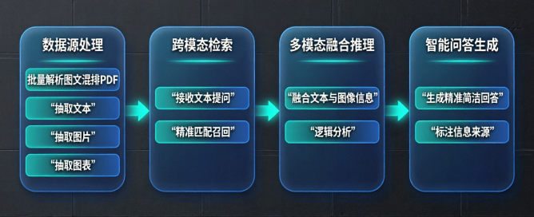

# 使用claude code 结合 05-multimodal-rag-chatbot 的需求，需要你 vibe coding一份，需要实现现有接口；
    写清楚需求
    写测试逻辑
    cc 逐步完成，架构 和 初步代码完成即可。

## 项目目标

搭建多模态RAG图文问答系统，依托图文混合PDF知识库，实现图文联动智能问答，解决纯文本问答无法结合图片、图表内容推理作答的痛点，适配企业知识库、教育资料等实际业务场景。

## 核心功能

- 数据源处理：批量解析多份图文混排PDF，抽取文档内文本、图片、图表等全类型多模态信息，搭建图文统一知识库。

- 跨模态检索能力：接收用户文本类图文相关提问，精准从知识库中匹配召回关联文本段落、对应图片、图表或它们的组合。

- 多模态融合推理：融合检索到的文本与图像信息，完成图文结合逻辑分析，支撑图表数据分析、实物设备识别类复杂问答。

- 智能问答生成：基于图文检索结果生成精准简洁回答，作答内容标注清晰信息来源，明确对应PDF名称、页码及对应图表位置。

## 验收评估标准

- 评估指标侧重于答案的准确性、完整性、信息关联性以及可解释性（即是否能指明信息来源）。

## 实现架构

## 技术栈

前端：VUE3 + Vite + TypeScript

后端：FastAPI + LangChain + mysql + miluvs + Qwen-VL + CLIP + mineru + bge + kafka

## 详细设计

- pdf内容解析：使用mineru将pdf转markdown

- pdf内容存储：markdown和图片文件存在本地

- pdf内容检索：使用CLIP模型进行文本和图像的检索，并返回最相关的结果。

- 内容问答：使用Qwen-VL模型进行多模态问答，将用户提问和检索到的文本和图像进行推理，生成答案。

## 接口定义

- 数据管理的接口：上传文档存储为pdf、向待文档解析的topic插入一条记录

- 多模态问答接口：
  - 步骤一：获取用户提问 + 知识库id
  - 步骤二：提问embedding，检索（文本、图）
  - 步骤三：图文排版

- worker服务：
  - 步骤一：消费文档解析的topic
  - 步骤二：对文档进行解析(mineru)
  - 步骤三：文档切分chunk、chunk embedding、存储在向量数据库中

web_page_upload(生产者)：文件上传，上传的文件保存在本地，并且将需要解析的文件发送到kafka中。
offline_precess_worker(消费者，慢慢处理)：离线解析任务，从kafka消费，调用mineru 
web_page_chat:用户提问，触发rag的过程，检索到文本+图（原始地址转换为新的地址），进行回答

## 测试用例

