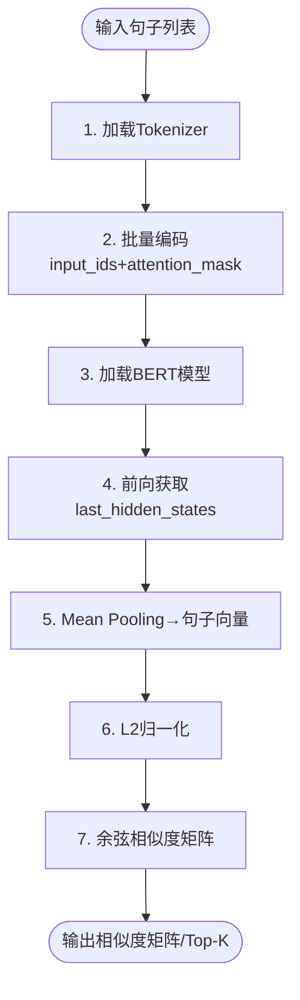
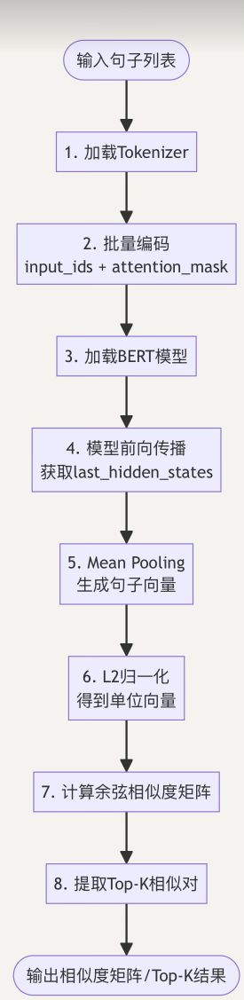

如何使用bert 进行文本编码，并且使用bert 进行相似度计算，需要写清楚技术方案，并给出流程图

# 基于 BERT 的文本编码与相似度计算技术方案

应用场景：中文/英文任意长度句子、段落级别的语义相似度任务  
硬件条件：CPU 可跑，GPU 加速更快
代码运行环境：Python≥3.8, transformers≥4.30, torch≥2.0

---

## 1 技术选型

1.预训练模型：中文 `bert-base-chinese`，英文 `bert-base-uncased`，通用语义强，体积小，推理快
2.池化策略：Mean Pooling。BERT 的 [CLS] 主要用来“看全局”，但中文/长句里 512 个 token 的语义分散在各处；
    平均能把整句信息都收进来，避免尾部 token 被忽略。
3.相似度计算：Cosine Similarity 余弦相似度，0~1 归一化，无需额外参数，支持批矩阵加速
4.长文本处理策略：截断 + 分段取平均， 512 子句滑动窗口，向量再平均，效果≈Longformer

---

## 2 实现流程图

---

## 3 常见问题以及解决方法
问题1：语义相近的句子计算相似度<0.3
解决方法：增加batch size，使用Mean Pooling，使用Cosine Similarity

问题2：长文本处理
解决方法：截断 + 分段取平均， 512 子句滑动窗口，向量再平均

问题3：训练过程中CUDA out of memory
解决方法：批量太大，减少batch size 或使用fp16 训练

