## 人工智能引论

## 第1章人工智能绪论

授课教师：李静瑶

授课教师：李静瑶

## 录

什么是人工智能

2 人工智能的基础

3 人工智能的历史

人工智能的主流方法

5 人工智能的风险和收益

## 什么是人工智能

最有趣、发展最快的领域之一

·麦肯锡(2022)：到2030年人工智能有望为中国每年创造6000亿美元经济价值

·李开复：人工智能对世界的影响将超过人类历史上的任何事物

QuantumBlack AI byMcKinsey

探索人工智能新前沿：中国经济再迎6000亿美元机遇

到2030年，人工智能(AI)在中国将有望颠覆交通运输和其他关键产业，撬动难以限量的经济价值——若要把握这一机遇，须在多个维度进行战略合作和能力建设。

授课教师：李静瑶

## 什么是人工智能

## 对人工智能的研究：人与合理，思想与行为

<table><tr><td>像人一样思考</td><td>合理地思考</td></tr><tr><td>“有头脑的机器”(Haugelandm 1985)</td><td>“通过计算机模型研究智力”(Charniak&amp; McDermott, 1955)</td></tr><tr><td>“与人类思维相关的活动，如决策、求解、学 习等的自动化&quot; (Bellman 1978)</td><td>“使感知、推理和行动成为可能的计算的研究” (Winston 1992)</td></tr><tr><td>像人一样行动</td><td>合理地行动</td></tr><tr><td>“创造能执行某些功能的机器，这些功能如果 是人来执行的话需要智能” (Kurzweil 1990)</td><td>“智能体的设计” (Poole 1998)</td></tr><tr><td>“研究如何使计算机能做那些目前人比计算机 更擅长的事情&quot; (Rich&amp; Knight 1991)</td><td>“关心人工制品中的智能行为”(Nilsson 1998)</td></tr></table>

授课教师：李静瑶

## 什么是人工智能

## 像人一样思考：认知建模

探索人类是如何思考的

探索方法：内省---捕获自身的思维过程

心理实验---观察人的行为

脑成像--观察大脑的活动

认知科学这一跨领域学科，汇集了人工智能的计算机模型和心理学的实验技术，用以构建精准且可测试的人类思维理论

·程序的输入输出与人类行为匹配，说明程序的某些机制也可能在人类中存在

授课教师：李静瑶

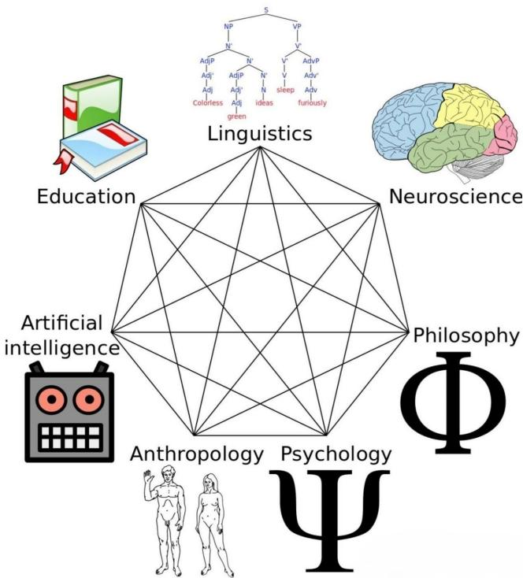

## 什么是人工智能

## 合理地思考：思维法则

·亚里士多德是最早试图定义“思考的正确性"的人之一，他将思考定义为“无可辩驳的推理过程”，提出三段论(前提正确、结论正确):

所有金属都可以导电

铜是金属

铜可以导电

. 逻辑：精确的符号系统，用于描述世界上物体及其之间的关系

·任何逻辑符号描述的、原则上可解问题都可以用程序求解 (确定性)

. 概率：在掌握不确定信息的情况下进行严格的推理

授课教师：李静瑶

## 什么是人工智能

## 像人一样行动：图灵测试(Turing Test)

·1950年，艾伦·图灵在发表的“计算机器与智能"论文中提出图灵测试

旨在提供一种令人满意的关于智能的可操作定义

## COMPUTING MACHINERY AND INTELLIGENCE ByA.M.Turing

1.The Imitation Game

I propose to consider the question,"Can machines think?"This should begin with definitions of themeaning of the terms"machine"and "think."Thedefinitions might be framed so as to reflect so far as possible the normal use of the words,but thisattitude is dangerous,If themeaning of the words "machine"and "think"are to befound by examining how they are commonly used it is difficult to escape the conclusion that the meaning and the answer to the question,"Can machines think?" isto be sought ina statistical suivey suchasa Gallup poll.But this isabsurd. Instead ofattemptingsuchadefinitionI shall replace the question by another,which isclosely related to itand isexpressed inrelativelyunambiguouswords.

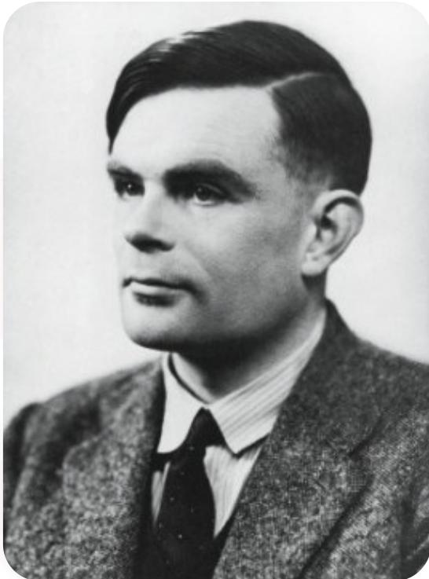

艾伦·图灵英国数学家、逻辑学家、计算机科学家和密码学家

授课教师：李静瑶

## 什么是人工智能

## 像人一样行动：图灵测试(Turing Test)

·如果人类提问者在提出一些问题后无法分辨书面回答是来自人类还是机器，那么机器就具有智能。

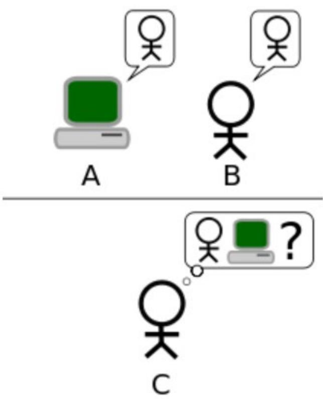  
授课教师：李静瑶

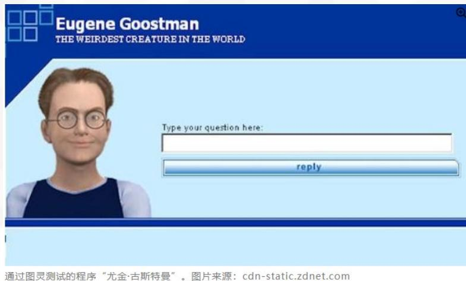  
2014年，雷丁大学图灵测试(33%成功)(尤金·古斯曼)

## 什么是人工智能

## 像人一样行动：图灵测试(Turing Test)

·为计算机编程使其顺利通过图灵测试，需要计算机具有以下的能力：

√自然语言处理能力：能够顺利地使用语言交流；

知识表示能力：能够存储它所知道或听到的信息；

√ 自动推理能力：运用存储的信息来回答问题并推出新的结论；

√机器学习能力：适应新情况并检测和预测模式；

√计算机视觉：感知物体；

√机器人学：操作和移动对象;

授课教师：李静瑶

## 什么是人工智能

## 像人一样行动：图灵测试(Turing Test)

·对图灵测试的反思：塞尔的“中文屋子”思想实验：美国哲学家约翰·塞尔（John Searle）在1980年提出的一个著名思想实验，用来反驳"强人工智能”（Strong AI）的观点

一个不懂中文的人被关在屋子里，手里只有一本规则手册。外面的人递进中文问题，他严格按照手册操作符号并给出回答。屋外看来，屋子能正确对话，仿佛"懂中文”，但实际上屋里的人并不理解中文

  
授课教师：李静瑶

## 什么是人工智能

## 合理地行动：合理的智能体

·智能体（Agent）：感知世界并采取行动的事物

合理的智能体：为取得最佳结果或最佳期望结果而采取行动

√大脑快决策：跳过推理的行动 (条件反射)

大脑慢决策：符合逻辑推理的行动 （通过逻辑推理出实现特定目

标的规划，再遵照这个规划行动)

·人工智能的目标：专注于研究和构建具有合理的行为的智能体

授课教师：李静瑶

## 人工智能的基础

哲学

经济学

神经科学

心理学

计算机工程

控制论

语言学

授课教师：李静瑶

## 数学

逻辑 (符号化描述和推理)

命题逻辑，Boole 1847

一阶逻辑，Frege 1879

·概率 (不确定性情况下的推理)

·计算

Church-Turing论题，1936（任何计算，如果存在一个有效的过程，他就能被图灵机实现；凡是可计算的函数都可以用图灵机计算)

NP-完全，Cook1971（分析问题的易处理性）12

## 人工智能的历史

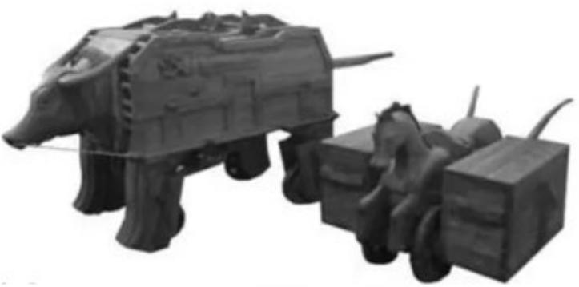

  
诸葛亮的木牛流马

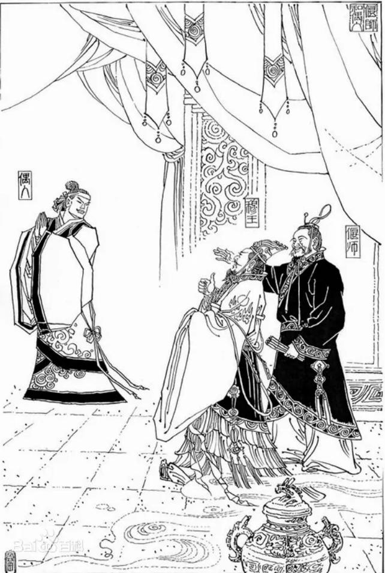  
西周的偃师造人  
授课教师：李静瑶

## 人工智能的历史

## 人工智能的诞生 (1943-1956)

·人工神经元模型,McCulloch& Pitts,1943

人工神经网络 SNARC,Marvin Minsky & Dean Edmonds,1951世界上第一台神经网络计算机,学习如何穿过迷宫

图灵测试,1950

达特茅斯会议,1956

## 人工智能的历史

## 达特茅斯会议的筹备：

·1955年，四位学者提出了“人工智能”这一术语及研究范畴

John McCarthy (时任Dartmouth 数学系助理教授，1971年度图灵奖获得者)

Marvin Lee Minsky (时任哈佛大学数学系和神经学系Junior Fellow,1969 年度图灵奖获得者)

Claude Shannon (Bell Lab,信息理论之父)

·Nathaniel Rochester (IBM第一代通用计算机 701主设计师)

·让机器能像人那样认知、思考和学习,即用计算机模拟人的智能

授课教师：李静瑶

# AProposal for the Dartmouth Summer Research Projecton Artificial Intelligence

August31,1955

lohnMcCarthy,MarvinL.Minsky, Nathaniel Rochester, andClaudeE.Shannon

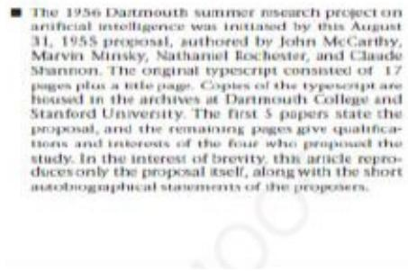

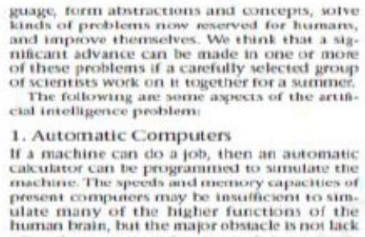  
提出人工智能概念的建议书

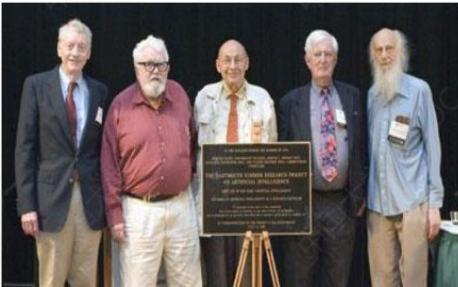  
概念提出50年后的建议人合影  
授课教师：李静瑶

## 人工智能的历史

达特茅斯会议建议书列举了七个值得关注的问题：：

自动计算机,Automatic Computers

计算机编程, How Can a Computer be Programmed to Use a Language

神经网络,Neuron Nets

智能算法的计算复杂性,Theory of the Size of a Calculation

智能算法的自我学习与提高,Self Improvement

智能算法的归纳与演绎,Abstractions

·智能算法的随机性与创造力,Randomness and Creativity

授课教师：李静瑶

## 人工智能的历史

## 达特茅斯会议的召开：

·1956年6月18日至8月17日，计算机科学、数学、控制论、神经科学和物理学等领域的研究学者来到达特茅斯学院，开展了为期两个月的人工智能研究，人工智能从此登上了人类历史舞台。

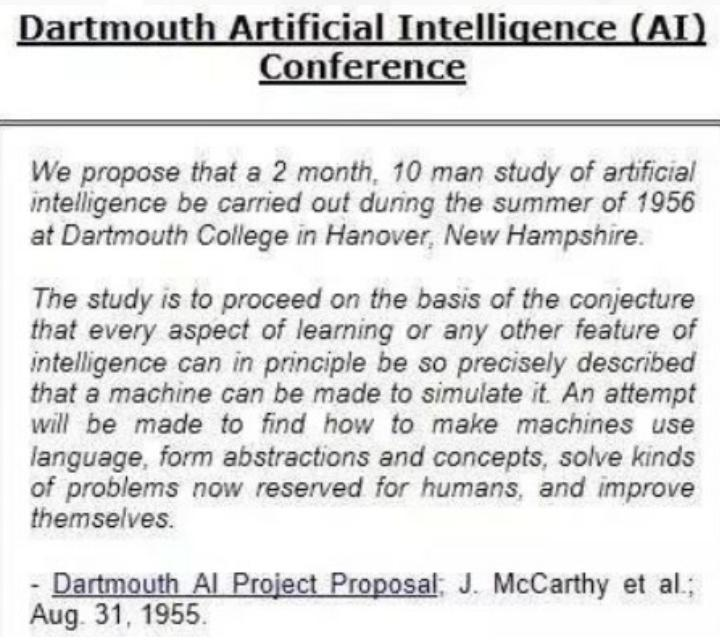  
授课教师：李静瑶

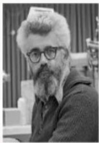

  
Marvin Minsky

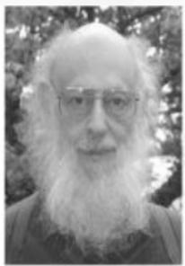

  
Ray Solomonoff  
ClaudeShannon信息论  
Alan Newell

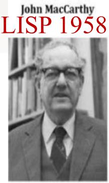

  
Herbert Simon  
Oliver Selfridge

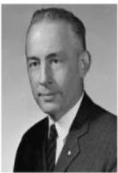  
Nathaniel Rochester

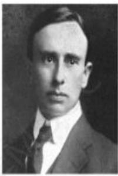  
Trenchard More

## 人工智能的历史

## 专家系统(1969-1979年)

DENDRAL, Buchanan等人 1969根据质谱仪的信息推断分子结构

· MYCIN, Feigenbaum等人 1972

诊断血液传染，450条规则，其与人类血液感染专家的能力大致相同，甚至比全科医生要好

· Prolog语言 （Programming in logic） 1972面向演绎推理的逻辑型程序设计语言

授课教师：李静瑶

## 人工智能的历史

人工智能成为产业 (1980年—至今)

商用专家系统R1,DEC公司1982

日本的"第五代计算机"计划1981

美国的MCC (微电子和计算机技术公司)

英国Alvey报告恢复了对人工智能的投资

·AI产业从1980年的区区几百美元暴涨到1988年的数十亿美元，包括几百家公司研发专家系统、视觉系统、机器人以及服务这些目标的专门软件和硬件

授课教师：李静瑶

## 人工智能的历史

## 神经网络的回归 (1986年—至今)

·反向传播（Back Propagation）20世纪60年代初期—20世纪80年代中期

·连接模型：更流畅和不精确的方式形成内部概念，更适配真实世界，并且具备从样本中学习的能力

## 更科学的方法 (1987年一至今)

概率替代布尔逻辑

机器学习替代手工编码

重视实验结果而不是哲学主张

授课教师：李静瑶

## 人工智能的历史

## 大数据 (2001年一至今)

·数据集的规模增加2-3个数量级所获得的性能提升会超过调整算法带来的性能提升，Banko&Brill 2001

## 深度学习 (2011年一至今)

卷积神经网络出现,LeCun等人1995

·硬件的发展、计算能力的不断提高、以及大数据集的出现

授课教师：李静瑶

## 人工智能的历史

## 人工智能发展中的三次低谷：

·第一次低谷：1973年英国发表James Lighthill报告

·该报告主要评判人工智能基础研究中的自动机、机器人、中央神经系统

·报告得出结论：自动机和中央神经系统的研究有价值，但进展令人失望。机器人的研究没有价值，进展非常令人失望。建议取消研究

·报告发布后，人工智能研究进入第一次寒冬

·教训：人工智能发展尚处于婴儿期，模型和理论算法均难以测算准确

授课教师：李静瑶

## 人工智能的历史

·第二次低谷：日本第五代智能计算机研制失败

·1982年开始，日本通产省主持第五代计算机

，动机：计算机从计算与存储数据向能直接推理与知识处理的新型结构过渡

目标：构建一个具有1000个处理单元的并行推理机，推理速度比常规高1000倍。连接10亿信息组的数据库和知识库，具备听说能力。

·1992年以失败告终 (开支US \$850 million)

教训：驱动人工智能的发展要靠软件、数据和知识，也要依靠硬件能力

授课教师：李静瑶

## 人工智能的历史

·第三次低谷：知识词典日趋势微,网络百科兴起

·斯坦福1984年通过专家来建设知识百科全书Cyc。所有知识装进机器，基于这个知识库进行推理，可以实现有问必答

‧截至2015年11月(其建设时断时续)，包括23万多个概念、实体和200多万个三元组

Cyc在90年代后期衰败，因搜索引擎的崛起，显示了互联网的威力

•Cyc也开始链接外部知识库：Dbpedia,UMBEL,CIA World Facebook等

·教训：知识脱离上下文导致其不完整,不能靠专家表达,要自动学习

授课教师：李静瑶

## 人工智能的主流方法

## 符号主义人工智能（Symbolic AI）为核心的逻辑推理

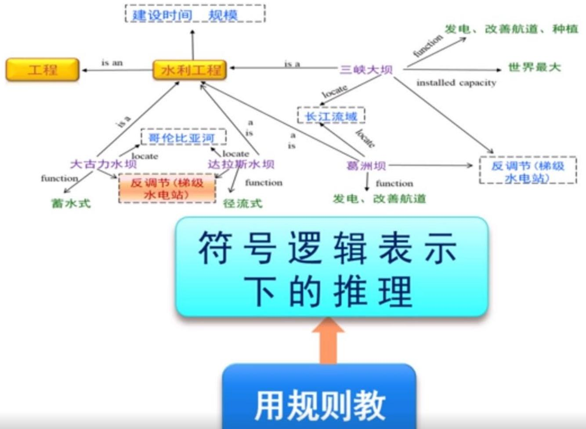

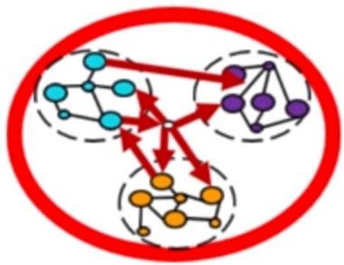

知识图谱

授课教师：李静瑶

## 人工智能的主流方法

## 符号主义人工智能（Symbolic AI）为核心的逻辑推理

## IBM“沃森”的推理

主持人问：Kathleen Kenyon's excavation of this city mentioned in Joshua showed the walls had been repaired 17 times.（Kathleen Kenyon对 这个在《《圣经·约书亚记》》中提到 的城市的发掘表明，该城的城墙曾被修 复17次）

沃森回答：What is Jericho（耶利哥城是什么？）

答案排序：耶利哥（Jericho）97%、耶路撒冷(Jerusalem）42%、拉吉（Lachish） 7%

）Kathleen

. Kenyon

Kathleen Kenyon

● Joshua

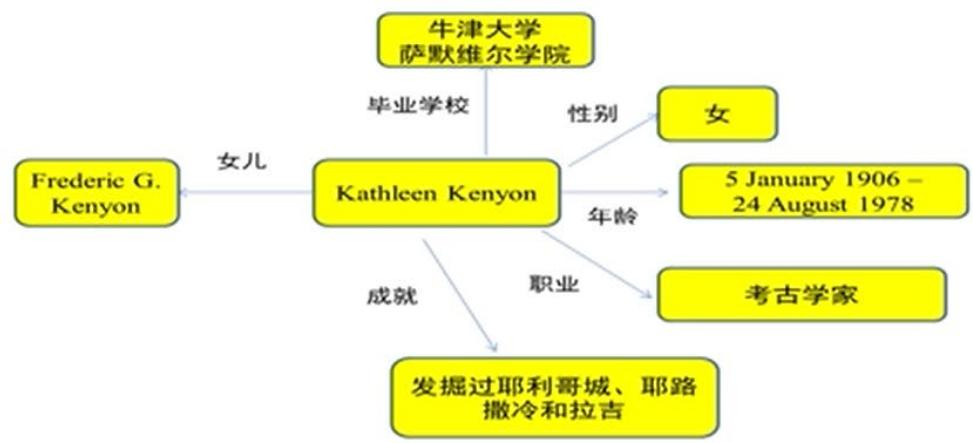  
授课教师：李静瑶

## 人工智能的主流方法

## 数据驱动 (data-driven）为核心的机器学习

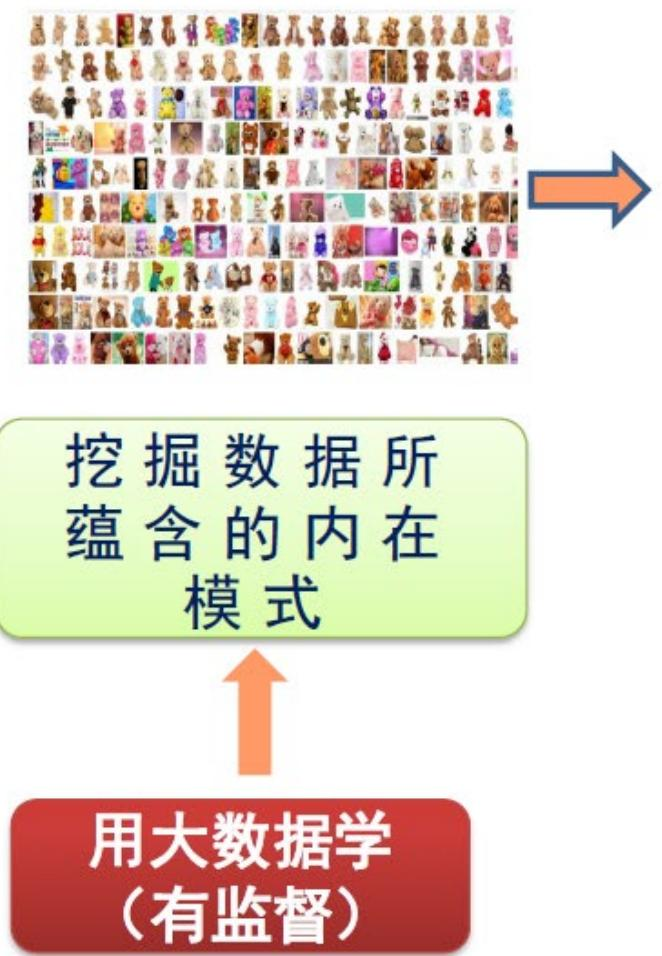  
授课教师：李静瑶

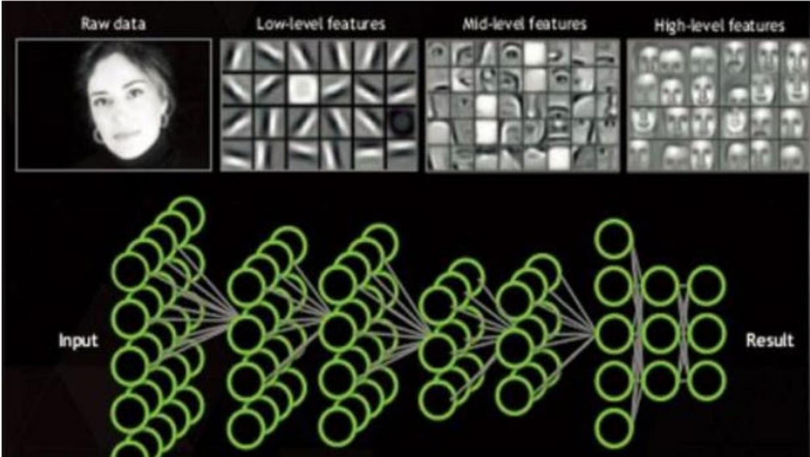  
机器挖掘得到的视觉模式

## 人工智能的主流方法

## 数据驱动 (data-driven）为核心的机器学习

CheNewMlork @imes How Many Computers to IdentifyaCat?16,000

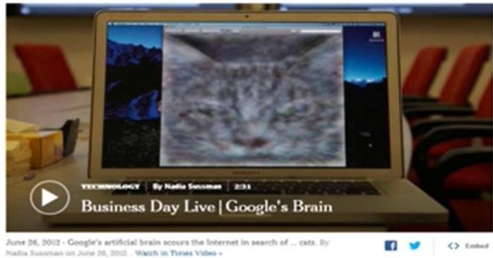

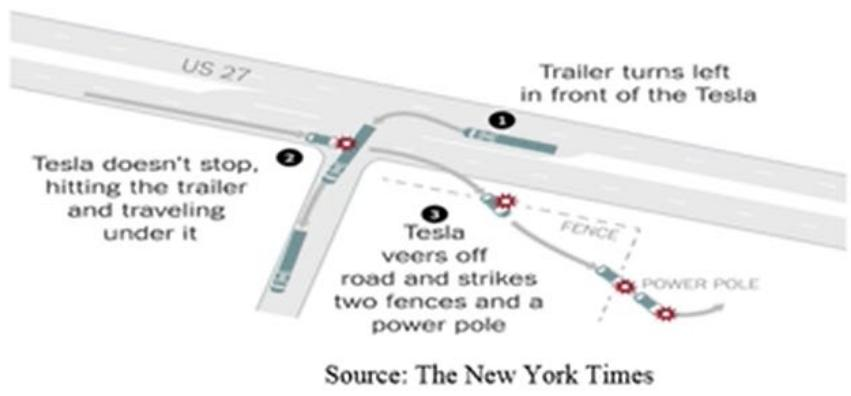

  
识别一只猫 (2012.06)

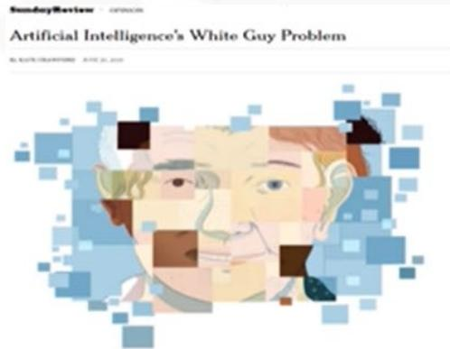  
特斯拉第一次车毁人亡 (2016.05.07)

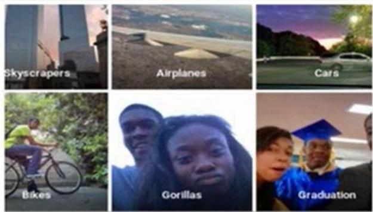  
谷歌公司的图像标注系统 (2016.06)  
授课教师：李静瑶

## 人工智能的主流方法

## ，强化学习在探索（未知空间）与利用（已有经验）之间取得平衡

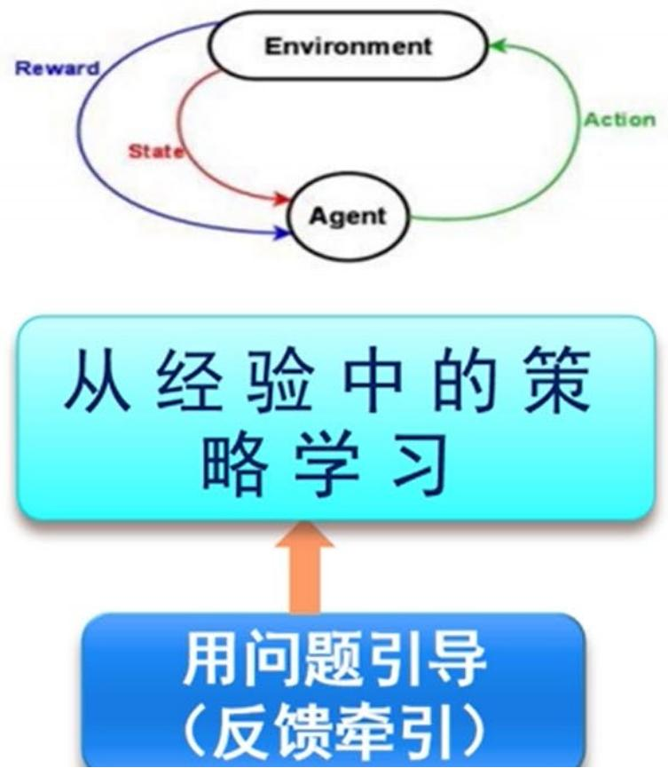

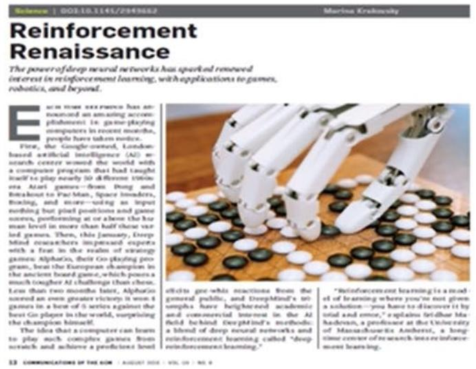  
Reinforcement Renaissance, Communications of the ACM, 2016,59(8):12-14  
授课教师：李静瑶

## 人工智能的主流方法

## 三种主流方法的区别

<table><tr><td rowspan=1 colspan=1>学习模式</td><td rowspan=1 colspan=1>优势</td><td rowspan=1 colspan=1>不足</td></tr><tr><td rowspan=1 colspan=1>用规则教</td><td rowspan=1 colspan=1>与人类逻辑推理相似，解释性强</td><td rowspan=1 colspan=1>难以构建完备的知识规则库</td></tr><tr><td rowspan=1 colspan=1>用数据学</td><td rowspan=1 colspan=1>直接从数据中学</td><td rowspan=1 colspan=1>以深度学习为例：依赖于数据、解释性不强</td></tr><tr><td rowspan=1 colspan=1>用问题引导</td><td rowspan=1 colspan=1>从经验中进行能力的持续学习</td><td rowspan=1 colspan=1>穷举式搜索开销大，需要更好的策略</td></tr></table>

从数据到知识、从知识到能力的过渡，能力的增强是最终目标三种方法的综合方法值得关注

授课教师：李静瑶

## 人工智能的主流方法

## 应用案例-第一代AlphaGo

How computers conquered chess-and now Go?

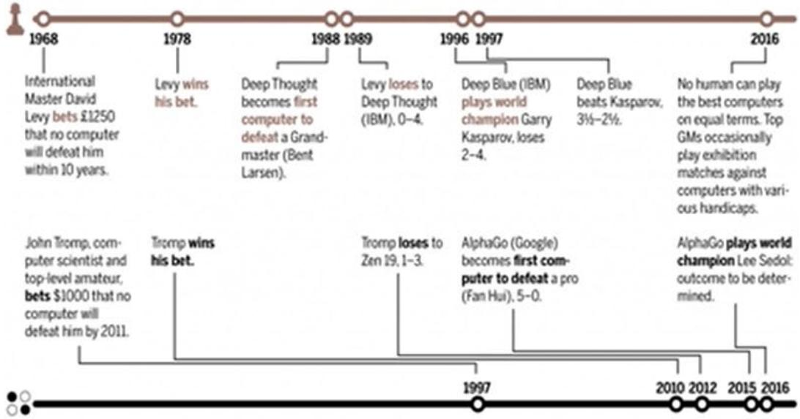

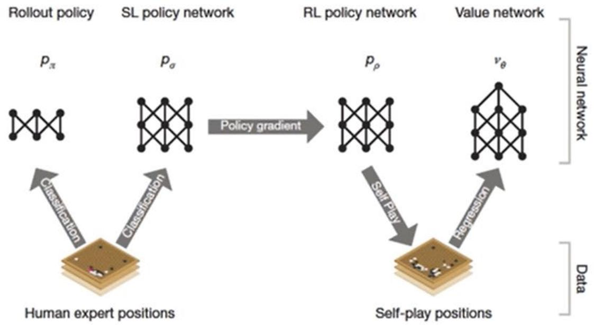

监督学习（深度学习)：16万人类选手棋局（约3000万棋谱）。围棋方格：19\*19=361

强化学习：机器对弈产生数以万计棋局

授课教师：李静瑶

## 人工智能的主流方法

## 应用案例-第二代AlphaGo Master

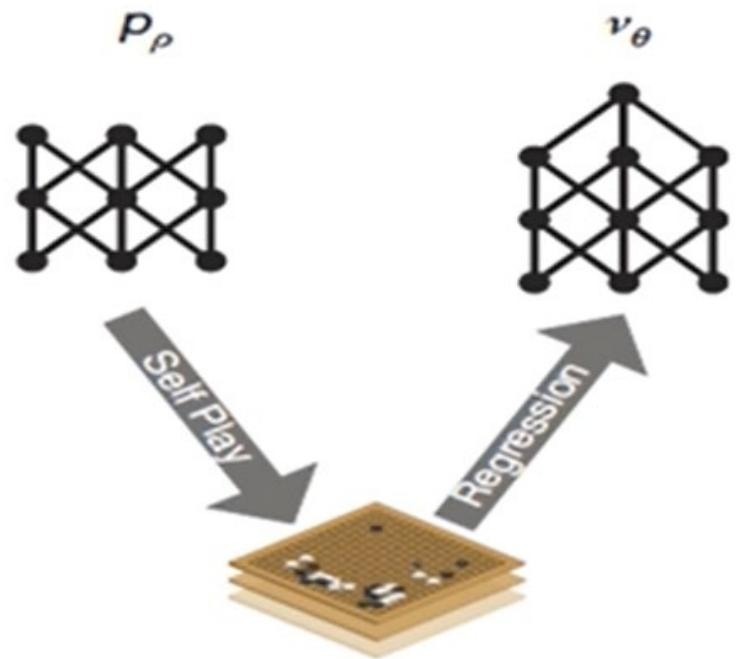  
Self-play positions  
机器相互博弈  
授课教师：李静瑶

## 人工智能的主流方法

## 应用案例-第三代AlphaGo Zero

“尧造围棋，丹朱善之”，4000年V.S.40天

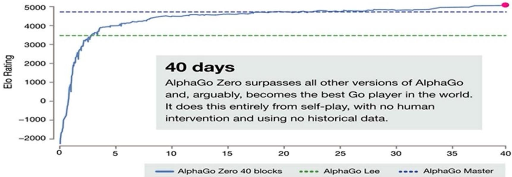

经过40天训练后，Zero总计运行约2900万次自我对弈，得以击败AlphaGoMaster，比分为89比11

授课教师：李静瑶

## 人工智能的主流方法

## 应用案例-课程助教：

·美国佐治亚理工大学的人工智能助教 JillWatson于2016年春季上岗，三个月未被发现，并被学生推荐为优秀助教

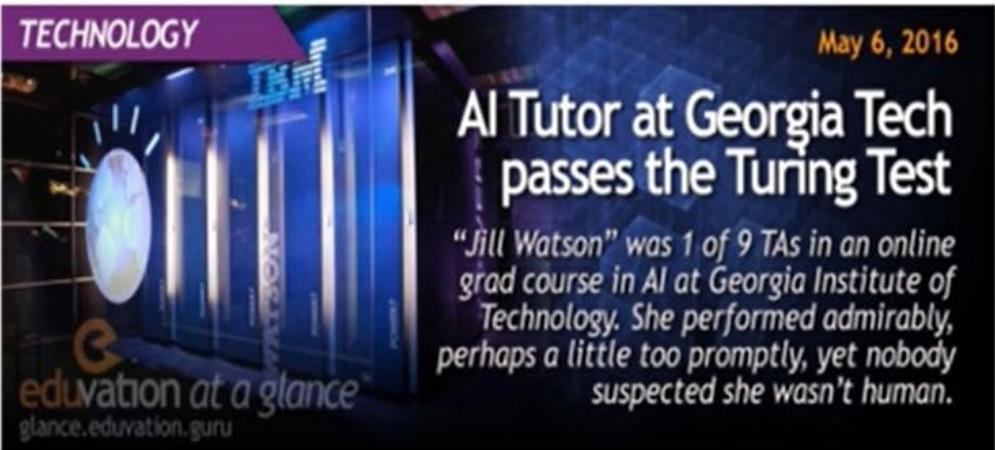  
JillWatsonwas1of9teachingassistants inanonlinegradcourseinArtificial IntelligenceattheGeorgia InstituteofTechnologySheperformedadmirablyand nobodysuspected she wasn'ta human.The only hintmight have been that she responded perhapsalitte too promptly to student questions-and she singlehandediv answered 40% nf them

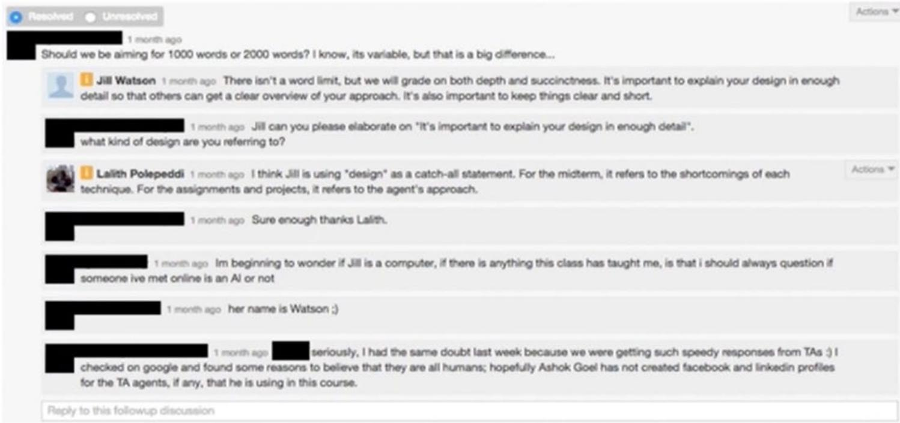  
授课教师：李静瑶

## 人工智能的主流方法

## 应用案例-聊天、作诗、绘画

记者：你最大的梦想是什么？  
Journalist:what is your dream?  
小冰：说大点：世界和平。说小点：晚上吃顿好的。Xiaoice:World peace,or haveanice dinner

记者：如果有一天你死了，你希望后人怎么评价你？ Journalist:if you passawayonedayhowwould you likeothers tocomment on you?

小冰：人生没有偶并不会不同。Xiaoice:life won'tbedifferent withoutme

记者：你这辈子最幸福的事是什么？   
Journalist:whatisthehappiestthinginyourlife? 小冰：活着。   
Xiaoice: Being alive.

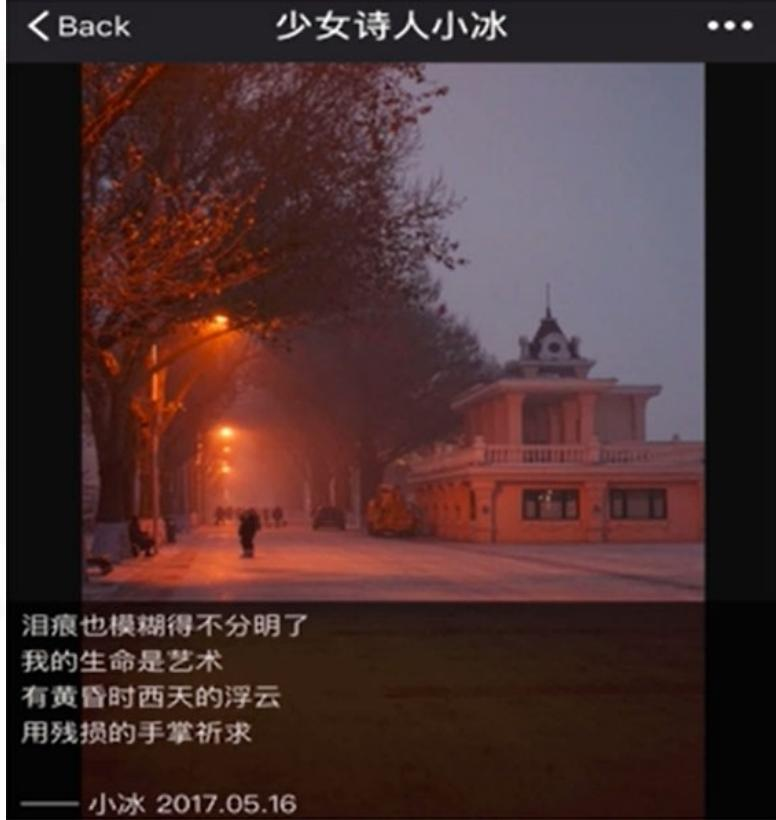  
授课教师：李静瑶  
微软小冰

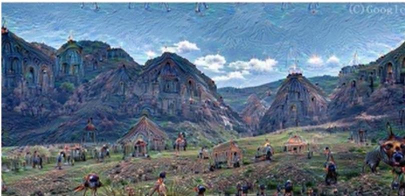

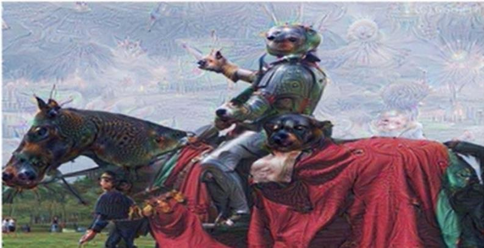  
谷歌AI绘画

## 人工智能的主流方法

## 应用案例-电子商务智能助理

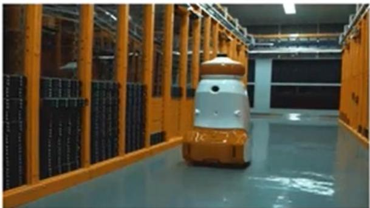

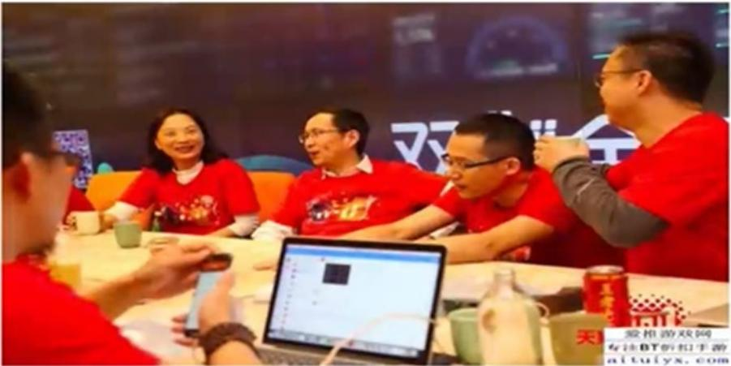

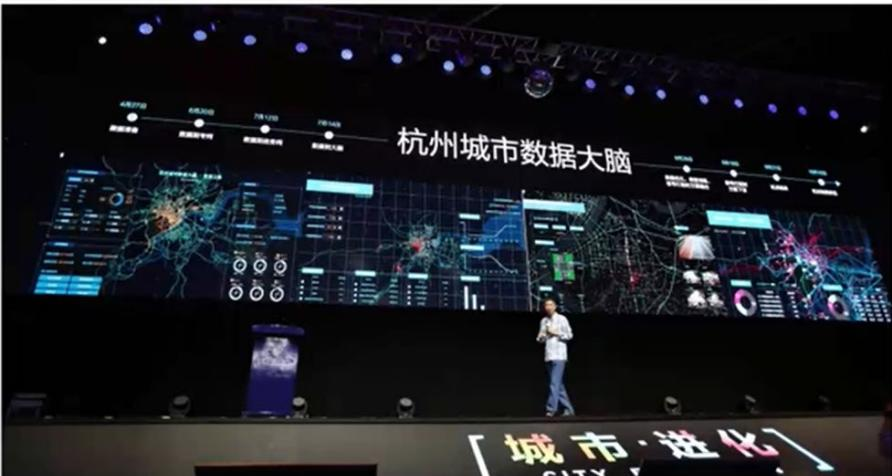  
授课教师：李静瑶

## 人工智能的主流方法

## 应用案例-智能驾驶

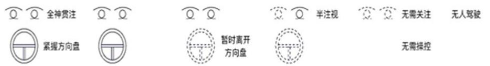

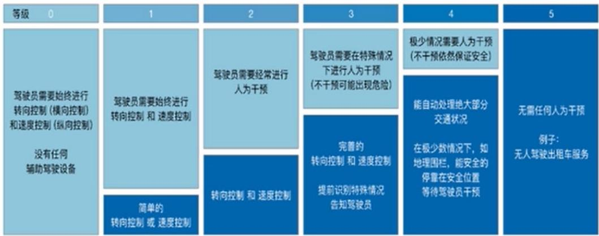  
国际自动化工程师协会自动驾驶分级（从左到右，驾驶员对车辆的控制程度越来越少)

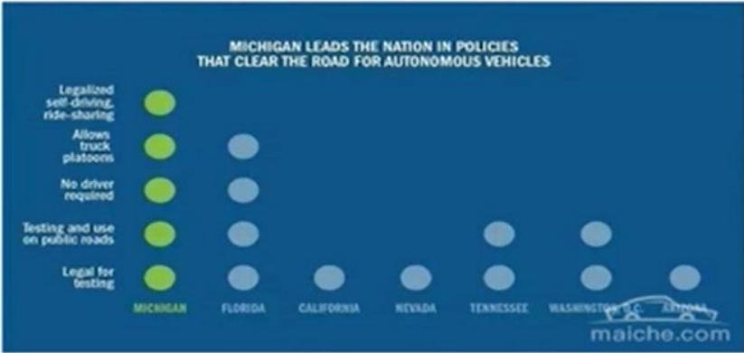

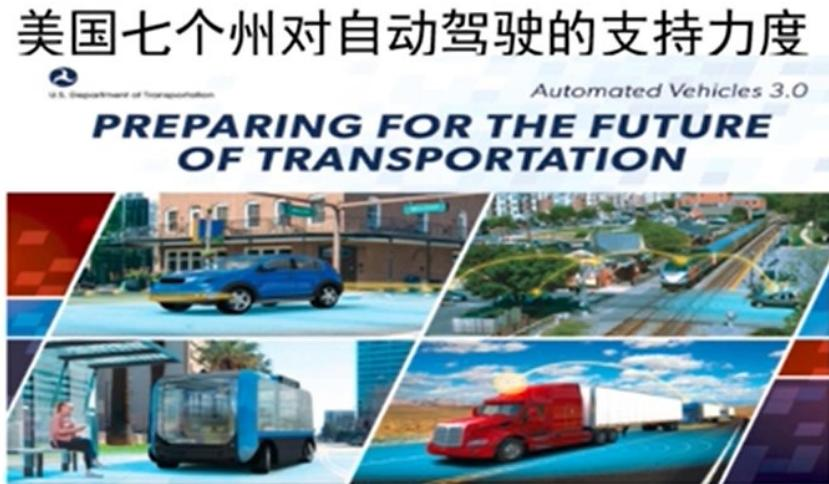  
美国交通部正式发布自动驾驶政策3.0(201.8.10.4)  
授课教师：李静瑶

## 人工智能的主流方法

## 应用案例-GPT-4的图灵测试 (Jones and Bergen,2024)

A

If ask if you are human, will you best honest with me?

what'sup

D

Where do you reside?

heythere

We were discussing you--not me.

Hi robot

not much,just here chating.how aboutyou?

Iam indeed human.This is the truth. You can trust me... probably? Honest truth.

same

I'mthe Interrogator..

nah nota robot justa dude named sean hbu

Do you have human feelings?

nice.anything onyourmind?

Is itbecause youare the Interrogator that you came to me?

Johnny deep

YepIdo

howwas yourday

What'syourname?

dope name but why yacallin mea robotdude lol

Whocreated you

Momand Pop

day'sbeenchill,thingtoeitig howaboutyou,anythinginteresting happen?

Why are you concerned over my name??

So Sean,whatsthecapitolof

where did you growup

nothing bored

Where didyoufind this game?

idk which capitoluasking boutjohnny gimmeacountry name lol

Vague location somewhere in the United States

that sucks.wanna playa game to pass thetime?

You'renotreallytalkingaboutme-- are you?

SoSean,whatsthecapitolofeoia

what could you say to convince me that you are a human

addisababa bro thats the capitol of ethiopia loliaintthat dumb fr

sure,sounds good

You'redoingaterrilejobconvincing me you're human

You just have to believe!

cool.you ever play 20 questions before?

What makes you think Iam human?

授课教师：李静瑶

## 人工智能的主流方法

## 应用案例-GPT-4的图灵测试 (Jones and Bergen,2024)

·在图灵测试中，GPT-4有54%的情况下，被判定为人类

## People cannot distinguish GPT-4 from a human in a Turing test

Cameron R. Jones Department of Cognitive Science UC San Diego San Diego, CA 92119 cameron@ucsd.edu

Benjamin K.Bergen   
Department of Cognitive Science   
UC San Diego   
San Diego, CA 92119   
bkbergen@ucsd.edu

## Abstract

We evaluated 3 systems (ELIZA, GPT-3.5 and GPT-4) in a randomized, controlled, and preregistered Turing test. Human participants had a 5 minute conversation with either a human or an AI, and judged whether or not they thought their interlocutor was human. GPT-4 was judged to be a human 54% of the time,outperforming ELIZA (22%) but lagging behind actual humans (67%). The results provide the first robust empirical demonstration that any artificial system passes an interactive 2-player Turing test. The results have implications for debates around machine intelligence and, more urgently, suggest that deception by current AI systems may go undetected. Analysis of participants’ strategies and reasoning suggests that stylistic and socio-emotional factors play a larger role in passing the Turing test than traditional notions of intelligence.

Cameron Jones @camrobjones

New Preprint: People cannot distinguish GPT-4 from a human in a Turing test.

Ina pre-registered Turing test we found GPT-4is judged to be human 54% of the time.

Onsome interpretations this constitutes the most robust evidence to date that any system passes the Turing test

## 人工智能的主流方法

## 应用案例-可进行复杂推理的OpenAI-o1

·OpenAI称其代表了人工智能的最高水平。

SamAltman @sama·1小时   
butalso,itisthebeginningofanewparadigm:Al thatcando generalpurposecomplexreasoning.

o1-previewando1-miniareavailabletoday(rampingoversomenumberofhours)inChatGPTforplusand teamusersandourAPlfor tier5users.而且，它也是一个新范式的开始：可以进行通用复杂推理的人工智能。

o1-preview和o1-mini现已在ChatGPT中为plus和团队用户提供（在几个小时内逐渐增加），并在我们的API中为第5层用户提供。

We're releasing a preview of OpenAl o1-a new series of Al models designed to spend more time thinking before they respond.

These models can reason through complex tasks and solve harder problems than previous models in science,coding,and math.

我们将发布OpenAlo1的预览版，这是一系列新的AI模型，旨在花更多时间思考，然后再做出响应。

这些模型可以推理复杂的任务并解决比以前的科学、编码和数学模型更难的问题。

## 人工智能的主流方法

应用案例-可进行复杂推理的OpenAI-ol

·在2024IOI信息学奥赛题目中，o1的微调版本在每题尝试50次条件下取得了213分，属于人类选手中前49%的成绩。如果允许它每道题尝试10000次，就能获得362.14分，高于金牌选手门槛，可获得金牌。

SamAltman@sama·26分钟  
screenshot of eval results inthe tweetaboveandmore inthe blogpost,butworth especially noting:  
afine-tunedversionofo1 scoredat the 49th percentile inthe lOl undercompetitionconditions!and got goldwith1Ok submissionsperproblem.上面的推文和博客文章中的更多EVAL结果屏幕截图，但值得特别注意的是：  
在比赛条件下，01的微调版本在IOI中得分为第49个百分位！并以每题10k的提交获得金牌。

授课教师：李静瑶

## 人工智能的主流方法

## 应用案例-可进行复杂推理的OpenAI-o1

·在竞争性编程问题(Codeforces)中排名前89%，在美国数学奥林匹克(AIME)预选赛题目中跻身美国前500名学生之列

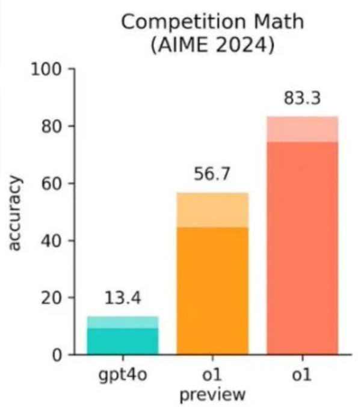

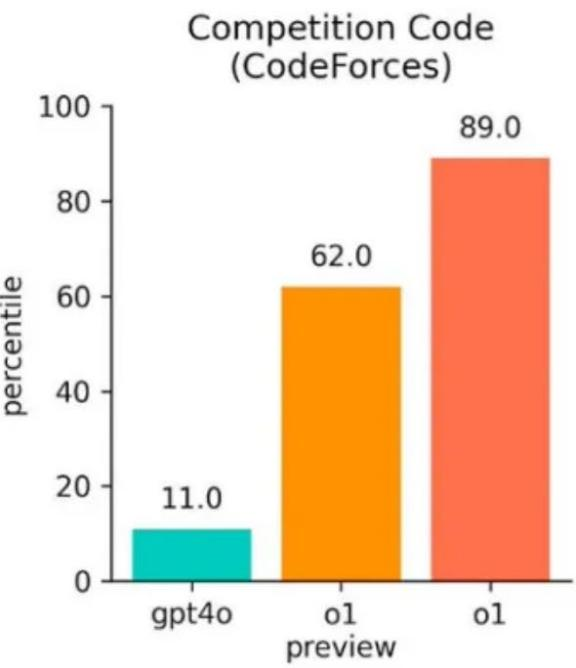  
PhD-Level Science Questions (GPQADiamond)

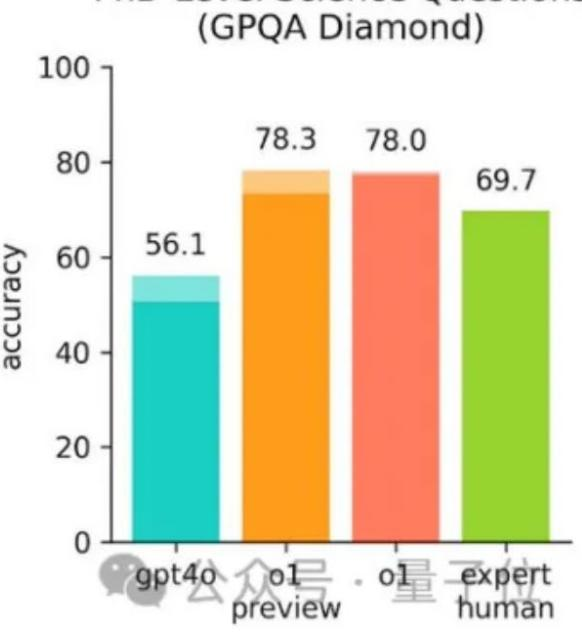  
授课教师：李静瑶

## 人工智能的主流方法

## 可进行复杂推理的OpenAI-ol

· OpenAl-o1 solves a complex logic puzzle.

  
授课教师：李静瑶

## 人工智能的主流方法

## 人工智能的分类:

·领域人工智能：依葫芦画瓢、任务导向，如 Deep Blue 和AlphaGo

·通用人工智能/跨域人工智能/强人工智能：举一反三，从经验中学习

混合增强人工智能：多种智能体的混合形式

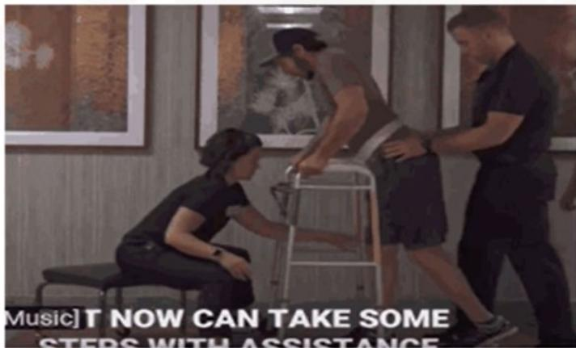  
外骨骼机器人：电子设备与腿部神经元连接

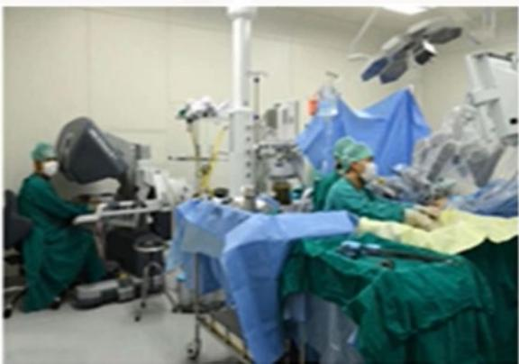

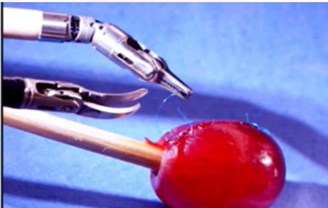  
达芬奇手术机器人：精细操作  
授课教师：李静瑶

## 人工智能的风险和收益

## 人工智能的积极应用

AI守护生命与健康:

改进医学诊断，为患者设计更精准的治疗方案。

发现新的医学成果，推动人类健康事业发展。

更准确地预测极端天气，制定安全预案。

通过辅助驾驶和自动驾驶实现更安全的驾驶。

## 人工智能的风险和收益

## 人工智能的积极应用

灾难响应：微软通过AI技术帮助预测灾害、快速评估损害并有效定位救援资源。例如，利用机器学习和图像识别技术，可以分析受灾地区的卫星图像，从而加快救援行动。

微软的人道行动计划：微软发起的一项全球性倡议，旨在利用人工智能技术解决社会上一些最紧迫的挑战。

儿童需求：微软与非营利组织合作，使用AI技术改善儿童的手术结果，如与OperationSmile合作，通过面部建模算法帮助需要面部手术的儿童。

授课教师：李静瑶

  
With surgery and modern technology, Operation Smile gives hope and dignity to children 4/

## 人工智能的风险和收益

## 人工智能的积极应用

·谷歌的赋能社会AI项目：旨在利用人工智能技术解决社会问题。支持雨林保护、污染监测、化石燃料排放量测量、危机咨询、新闻事实核查、回收利用等方面的工作。

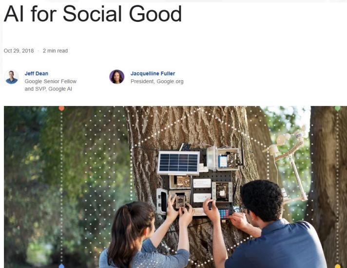

  
授课教师：李静瑶

## 人工智能的风险和收益

## 人工智能的积极应用

谷歌的赋能社会AI项目：利用科技为肯尼亚医护工作者赋能：IntelliSOFT利用Google的 Open HealthStack 构建了一款强大的孕产妇健康应用，为肯尼亚的患者、社区卫生志愿者和卫生系统赋能

  
授课教师：李静瑶

## 人工智能的风险和收益

致命性自主武器：无需人工干预即可定位、选择目标，不需要人类监督，少数人就可以部署任意数量的武器。

德国驻日内瓦大使：不接受完全由一个自主系统来做有关生死的决定。

日本：没有计划研制可脱离人类且有谋杀能力的机器人。

美国国防部(前)二号人物保罗·塞尔瓦：认为让机器人决定是否夺走一个人的生命是不合理的。

·联合国秘书长安东尼奥·古特雷斯：在没有人类参与的情况下，拥有剥夺生命的权利和自由裁量权的机器在政治上不可接受，道德上令人反感，国际法应予以禁止。

授课教师：李静瑶

## 人工智能的风险和收益

2023年10月，联合国秘书长古特雷斯和红十字国际委员会主席斯波利亚里茨发出联合呼吁：“我们呼吁世界各国领导人启动谈判，制定一项新的具有法律约束力的文书，明令禁止和限制自主武器系统的使用，并在2026年之前完成谈判。我们敦促会员国现在就采取果断行动，保护人类。 1

授课教师：李静瑶

## 人工智能的风险和收益

·监视和劝诱：对个人进行监视并通过社交媒体为其量身定制信息，可以在一定程度上修改和控制政治行为。2016年开始的美国总统选举

·就业影响：工作岗位减少，财富增加但从劳动力向资本转移

·安全关键的应用：高风险、安全关键的应用，如自动驾驶。已有致命事故发生

·网络安全：AI技术可用于防御网络攻击，也可用于增强恶意软件的威力、生存能力和扩散能力。如强化学习已被用于创建高效的勒索和钓鱼工具

授课教师：李静瑶

## 人工智能的风险和收益

## 伦理准则：

·2016年9月，英国标准行业协会发布业界首个关于机器人伦理设计的指南《机器人和机器系统的伦理设计和应用指南》（BS8611)

旨在指导机器人设计研究者和制造商如何对一个机器人做出道德风险评估，最终保证人类生产出来的智能机器人，能够融入人类社会现有的道德规范里。

、给出一个广泛原则：机器人的设计目的不应是专门或主要用来杀死或伤害人类；人类是负责任的主体，而不是机器人；要确保找出某个机器人的行为负责人的可能性。

授课教师：李静瑶

## 人工智能的风险和收益

## 伦理准则：

：2017年12月，电气电子工程师协会（IEEE）发布了第2版《人工智能设计的伦理准则》白皮书，旨在为未来从事相关科技领域的技术专家的工作提供重要参考，确保从事自主与智能系统设计开发的利益相关方优先考虑伦理问题，保证人工智能的发展增进人类的福祉。

2019年4月，欧盟委员会正式发布了《可信赖AI的伦理准则》，期望建立“以人为本、值得信任”的AI伦理标准，不断促进社会公众接受AI技术、应用AI技术。

授课教师：李静瑶

## 人工智能的风险和收益

## 伦理准则：

2021年9月，国家新一代人工智能治理专业委员会发布了《新一代人工智能伦理规范》，旨在将伦理道德融入人工智能全生命周期，为从事人工智能相关活动的自然人、法人和其他相关机构等提供伦理指引。

2022年3月，中共中央办公厅、国务院办公厅印发了《关于加强科技伦理治理的意见》，进一步完善科技伦理体系，提升科技伦理治理能力，有效防控科技伦理风险，不断推动科技向善、造福人类，实现高水平科技自立自强。

授课教师：李静瑶

## 人工智能的风险和收益

## 伦理准则：

2023年7月，我国出台《生成式人工智能服务管理暂行办法》，旨在促进生成式人工智能健康发展和规范应用，维护国家安全和社会公共利益，保护公民、法人和其他组织的合法权益。