## 人工智能引论

## 第2章智能体

授课教师：李静瑶

授课教师：李静瑶

## "养龙虾

## "养龙虾"到底是啥

"养龙虾”是2026年3月爆火的网络热词，核心是部署、调教开源Al智能体OpenClaw，和水产养殖无关。

## 一、先搞懂：它到底是什么


OpenClaw=能自己动手操作电脑/手机的AI打工仔

## 1.普通AI

## 2.龙虾AI

·只给文字答案

·不碰设备


·你发指令，它自己打开软件、点鼠标、敲键盘、自动完成


3.图标是红色龙虾，网友戏称“养龙虾”

养龙虾去啦！

授课教师：李静瑶


养龙虾去啦！

## 二、它能帮你干啥（最实用场景）


## 文件管理：

自动整理桌面、分类文件、备份、重命名、PDF转文字


## 办公自动化：

写周报、做表格、发邮件、 整理聊天记录、生成报告


## Q信息处理：

联网搜索、网页抓取、内容总结、监控数据


## 定时任务：

每天9点发日报、 每周自动备份、定时提醒


多端操作：

绑定微信/钉钉/飞书，聊天框直接发指令

## “养龙虾

## “养龙虾"爆火，官方发布风险提示！

新华社 2026年3月10日20:06 北京 887人


近期，OpenClaw（"小龙虾"，曾用名Clawdbot、Moltbot）应用下载与使用情况火爆，国内主流云平台均提供了一键部署服务。此款智能体软件依据自然语言指令直接操控计算机完成相关操作。为实现"自主执行任务"的能力，该应用被授予了较高的系统权限，包括访问本地文件系统、读取环境变量、调用外部服务应用程序编程接口（API)以及安装扩展功能等。然而，由于其默认的安全配置极为脆弱，攻击者一旦发现突破□，便能轻易获取系统的完全控制权。

授课教师：李静瑶

智能体和环境

## 录

正确的行为一理性的概念

3 环境的性质

4 智能体的结构

Al Agent 商业化

## 智能体和环境

智能体（Intelligent Agent）定义的演变:

15世纪,“one who acts”执行动作的人/物,“effective,powerful”有效的，强大的

1550年,“any natural force or substance which produces a phenomenon” 产生一个现象的力量或物质

1590年,“deputy,representative”代理

授课教师：李静瑶

## 智能体和环境

## 智能体（Intelligent Agent）定义的演变:

Agent概念由麻省理工学院的认知科学家与人工智能先驱的Marvin Minsky在 “Society of Mind (心智社会)”一书中提出，将生物界个体社会行为的概念引入到计算机学科领域 (1986)

2025年11月， "智能体”入选2025年度十大科普热词

2026年3月5日，《2026年国务院政府工作报告》提出，打造智能经济新形态，促进新一代智能终端和智能体加快推广

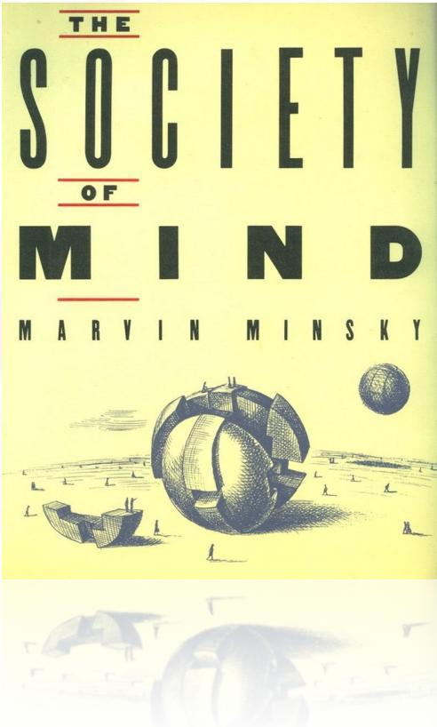  
授课教师：李静瑶

## 智能体和环境

## 智能体：

：任何通过传感器（sensor）感知环境（environment）并通过执行器(actuator）作用于该环境的事物都可以被视为智能体

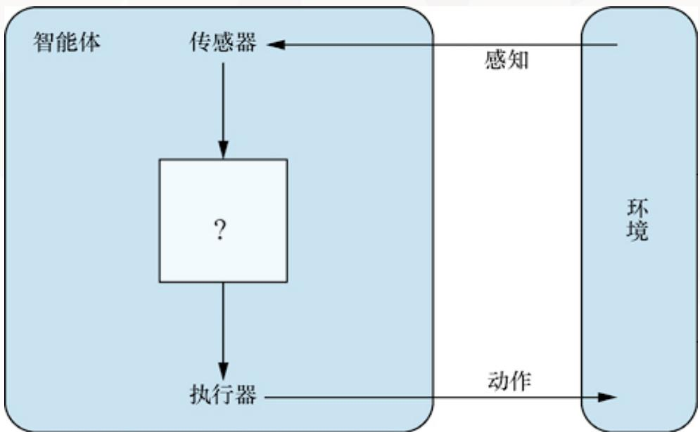

·输入：感知序列

映射：智能体函数 (智能体程序)

输出：执行动作并影响环境

授课教师：李静瑶

## 智能体和环境

## 智能体案例:

<table><tr><td rowspan=1 colspan=1>分类</td><td rowspan=1 colspan=1>传感器</td><td rowspan=1 colspan=1>执行器</td></tr><tr><td rowspan=1 colspan=1>人类智能体</td><td rowspan=1 colspan=1>眼睛、耳朵、皮肤</td><td rowspan=1 colspan=1>手脚、声道</td></tr><tr><td rowspan=1 colspan=1>机器人智能体</td><td rowspan=1 colspan=1>摄像头、红外测距仪</td><td rowspan=1 colspan=1>马达</td></tr><tr><td rowspan=1 colspan=1>软件智能体</td><td rowspan=1 colspan=1>键盘、鼠标、文件</td><td rowspan=1 colspan=1>屏幕、打印机、文件</td></tr></table>

授课教师：李静瑶

## 智能体和环境

## 案例：真空吸尘器世界

智能体：吸尘器

环境：两个房间A和B (干净或尘土)

传感器：位置、内容

执行器：左移、右移、吸尘、等待

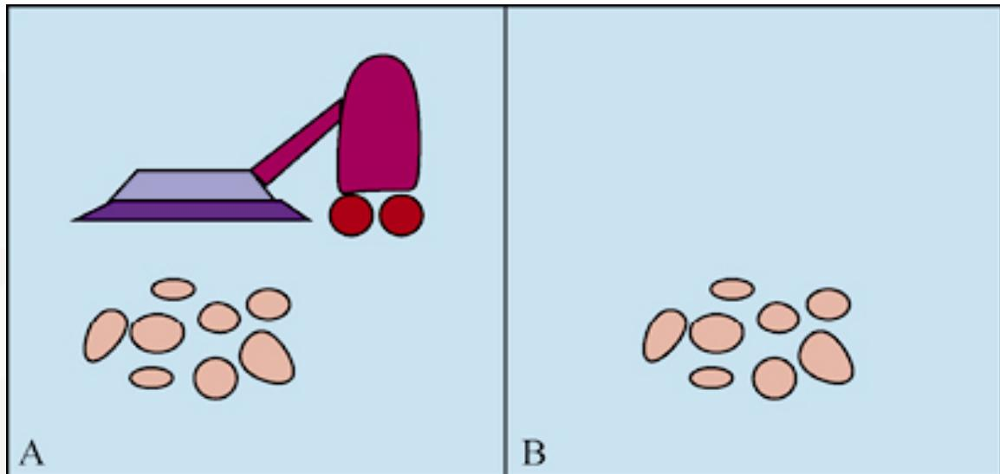

不同版本的真空吸尘器世界允许不同的规则，例如智能体可以感知什么，它的动作是否总是成功等

授课教师：李静瑶

## 智能体和环境

## 智能体函数：描述智能体的行为，将任意给定的感知序列映射为行动

<table><tr><td rowspan=1 colspan=1>感知序列                                                       动作</td></tr><tr><td rowspan=1 colspan=1>[A,干净]                                                       右移</td></tr><tr><td rowspan=1 colspan=1>[A,尘土]                                                       吸尘</td></tr><tr><td rowspan=1 colspan=1>[B,干净]                                                        左移</td></tr><tr><td rowspan=1 colspan=1>[B,尘土]                                                        吸尘</td></tr><tr><td rowspan=1 colspan=1>[A,干净],[A,干净]                                            右移</td></tr><tr><td rowspan=1 colspan=1>[A,干净],[A,尘土]                                            吸尘</td></tr><tr><td rowspan=1 colspan=1></td></tr><tr><td rowspan=1 colspan=1>[A,干净],[A,干净],[A,干净]        右移</td></tr><tr><td rowspan=1 colspan=1>[A,干净],[A,干净],[A,尘土]                                吸尘</td></tr><tr><td rowspan=1 colspan=1></td></tr></table>


真空吸尘器世界的简单智能体函数的部分表项。 除非限制可能感知序列的长度， 否则该表的大小是无限的

授课教师：李静瑶

## 理性的概念

## 理性的行为：

理性=正确=合理

结果主义：通过结果来评估智能体的行为

智能体的动作序列导致环境经历一系列状态，如果环境状态的变化是合理的，智能体表现良好，则动作序列是理想的

，环境状态而不是智能体的状态，如果从智能体的角度定义，智能体可以达到完美理性，它只需要自我欺骗说环境是完美的

服务机器人在虚拟世界和现实世界的表现

授课教师：李静瑶

## 理性的概念

判断智能体理性的标准：

定义成功标准的性能度量

智能体对环境的先验认知

智能体可以完成的行动

智能体截止到此时的感知序列

理性智能体的定义：对于每个可能的感知序列，给定感知序列提供的证据和智能体拥有的先验知识，理性智能体应选择一个期望最大化其性能度量的动作

授课教师：李静瑶

## 理性的概念

## 性能度量：

吸尘量多少：吸尘 倒回 吸尘...

清洁方格的数量：来回吸尘永远停不下来

最快把两个格子清理干净

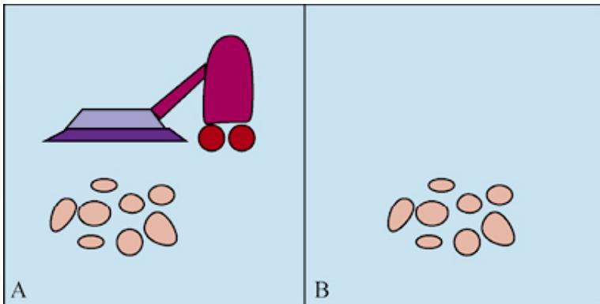

·如果两个Agent一个一直匀速工作，另一个短期高效工作、长期休息

授课教师：李静瑶

## 理性的概念

## 理性的判断案例:

<table><tr><td>性能度量</td><td>每个时间步对不干净的房间“吸尘”奖励1分，生命周期为 1000个时间步</td></tr><tr><td>环境的先验知识</td><td>环境的地形已知，房间干净与否（灰尘的分布）和Agent的 初始位置未知</td></tr><tr><td>可执行的动作</td><td>&quot;左移”和“右移”使Agent向左或向右移动，但不会移出 环境，否则Agent会保持原位；干净的房间保持干净，“吸 尘”会使当前房间干净</td></tr><tr><td>感知序列</td><td>Agent能正确感知房间位置和所在房间是否干净</td></tr></table>

授课教师：李静瑶

## 理性的概念

## 理性的判断案例:

<table><tr><td>性能度量</td><td>每个时间步对不干净的房间“吸尘”奖励1分，生命周期为 1000个时间步，移动Agent惩罚1分</td></tr><tr><td>环境的先验知识</td><td>环境的地形未知，房间干净与否（灰尘的分布）和Agent的 初始位置未知</td></tr><tr><td>可执行的动作</td><td>&quot;左移”和“右移”使Agent向左或向右移动，但不会移出环 “吸尘” 境，否则Agent会保持原位；干净的房间可能被弄脏， 会使当前房间干净</td></tr><tr><td>感知序列</td><td>Agent能正确感知房间位置和所在房间是否干净</td></tr></table>

授课教师：李静瑶

## 理性的概念

## 全知、 学习和自主:

理性：使期望的性能最大化

全知：使实际的性能最大化

自主性：一个理性的智能体应该是自主的，它应该学习如何弥补部分或不正确的先验知识 (信息收集)

授课教师：李静瑶

## 环境的性质

## 任务环境PEAS:

性能 -Performance

环境 -Environment

执行器 -Actuator

传感器 -Sensor

判断智能体理性的标准：

定义成功标准的性能度量

智能体对环境的先验认知

智能体可以完成的行动

. 智能体截止到此时的感知序列

授课教师：李静瑶

## 环境的性质

## 自动驾驶出租车司机任务环境的PEAS描述

<table><tr><td rowspan=1 colspan=1>智能体类型</td><td rowspan=1 colspan=1>性能度量</td><td rowspan=1 colspan=1>环境</td><td rowspan=1 colspan=1>执行器</td><td rowspan=1 colspan=1>传感器</td></tr><tr><td rowspan=1 colspan=1>自动驾驶出租车司机</td><td rowspan=1 colspan=1>安全、速度快、合法、舒适旅程、最大化利润、对其他道路用户</td><td rowspan=1 colspan=1>道路、其他交通工具、警察、行人、客户、天气</td><td rowspan=1 colspan=1>转向器、加速器、制动、信号、喇叭、显示、语音</td><td rowspan=1 colspan=1>摄像头、雷达、速度表、GPS、发动机传感器、加速度表、麦克风、触摸屏</td></tr></table>

授课教师：李静瑶

## 环境的性质

## 智能体类型及其PEAS描述的示例

<table><tr><td>智能体类型</td><td>性能度量</td><td>环境</td><td>执行器</td><td>传感器</td></tr><tr><td>医学诊断系统</td><td>治愈患者、 降低费用</td><td></td><td>断、治疗的显示器</td><td>患者、医院、工作人员用于问题、测试、诊用于症状和检验结果 的触摸屏/语音输入</td></tr><tr><td></td><td></td><td>卫星图像分析系统正确分类对象和地形轨道卫星、下行链路、场景分类显示器 天气</td><td></td><td>高分辨率数字照相机</td></tr><tr><td>零件选取机器人</td><td>零件在正确箱中的零件输送带、箱子 比例</td><td></td><td>有关节的手臂和手</td><td>摄像头、触觉和关节 角度传感器</td></tr><tr><td>提炼厂控制器</td><td></td><td>纯度、产量、安全提炼厂、原料、操作员阀门、泵、加热器、</td><td>搅拌器、显示器</td><td>温度传感器、气压传 感器、流量传感器、</td></tr><tr><td>交互英语教师</td><td>学生的考试分数</td><td>一组学生、考试机构</td><td>用于练习、反馈、发键盘输入、语音 言的显示器</td><td>化学传感器</td></tr></table>

授课教师：李静瑶

## 环境的性质

## 完全可观测与部分可观测：

·完全可观测：智能体传感器在每个时间点都能访问环境的完整状态

有效的完全可观测：传感器能检测到与动作选择相关的所有方面（相关取决于性能度量标准)

部分可观测：由于传感器噪声大、传感器精度或稳定性等因素导致不能获取所有和行动有关的信息

不可观测：智能体没有传感器 (搜索)

授课教师：李静瑶

## 环境的性质

## 单智能体与多智能体:

协作完成任务/单独完成任务，是否有相互影响

一个司机在路上开车，他和行人之间、和其他司机之间？

，一场足球比赛，球员之间，球员和观众之间？

竞争性多智能体：一方胜利是另一方的失败 (象棋)

部分合作的多智能体：开车时避免碰撞会使所有智能体的性能度量最大化

部分竞争的多智能体：一个车位只能停一辆车

授课教师：李静瑶

## 环境的性质

## 确定性与非确定性:

·环境的下一个状态完全由当前的状态和智能体执行的动作决定，则说环境是确定的，否则是非确定的打字 汽车驾驶

一般来说，智能体在完全可观测的环境中不需要担心不确定性，而部分可观测的环境可能是非确定的。大多数真实的环境都是非确定环境

“随机”说明后果是不确定但可以用概率量化的，而“非确定”的环境中行动的结果与概率无关

授课教师：李静瑶

## 环境的性质

## 回合式与序贯式:

·回合式（片段式）：智能体的经历被分成了一个个原子片段。在每个片段中智能体感知信息并完成单个行动，下一个片段不依赖以前片段中采取的行动

分类任务

装配线上检验次品零件的机器

序贯式（延续式）：当前的决策会影响到所有未来的决策

下棋

汽车驾驶

授课教师：李静瑶

## 环境的性质

## 静态与动态:

·如果环境在智能体计算的时候发生了变化，那么该环境是动态的，否则是静态的驾驶汽车 数独游戏

静态不需要考虑时间的流逝，动态需要持续地做出决策

半动态：环境本身不会随着时间的推移而改变，但智能体的性能分数会改变·时钟计时情况下的象棋

授课教师：李静瑶

## 环境的性质

## 离散与连续:

环境的状态、时间的处理方式以及智能体的感知信息和行动，都有离散和连续之分

象棋中的状态是有限的，感知信息和行动是离散的

摄像头中的信号是离散的，但处理时表示的是连续变化的亮度和位置

授课教师：李静瑶

## 环境的性质

## 已知与未知:

区分的不是环境本身，而是指智能体对环境“物理定律”的认知状态

已知环境中，所有行动的后果是给定的

·未知环境中，智能体需要学习环境是如何工作的，才能做出正确决策

已知环境可能是部分可观测的

纸牌游戏

未知环境可能是完全可观测的

全新的电子游戏

授课教师：李静瑶

## 环境的性质

## 智能出租车Agent:

性能

安全

目标

效益

合法

舒适

环境

·道路

交通

，行人

、天气

执行器

方向盘

•油门

刹车

喇叭

显示器

传感器

摄像头

加速度计

仪表

引擎传感器

•GPS

<table><tr><td rowspan=1 colspan=1>完全可观测或部分可观测</td><td rowspan=1 colspan=1>单Agent或多Agent</td><td rowspan=1 colspan=1>确定或非确定</td><td rowspan=1 colspan=1>片段或延续</td><td rowspan=1 colspan=1>静态或动态</td><td rowspan=1 colspan=1>离散或连续</td><td rowspan=1 colspan=1>已知或未知</td></tr><tr><td rowspan=1 colspan=1>部分可观测</td><td rowspan=1 colspan=1>多Agent</td><td rowspan=1 colspan=1>非确定</td><td rowspan=1 colspan=1>延续</td><td rowspan=1 colspan=1>动态</td><td rowspan=1 colspan=1>连续</td><td rowspan=1 colspan=1>未知</td></tr></table>

授课教师：李静瑶

## 环境的性质

## 智能购物Agent:

性能

·价格

质量

合适

效率

环境

•网站

•厂商

货主

执行器

·商品展示

·商品链接

购买填单

传感器

文字

图像

•js脚本

<table><tr><td rowspan=1 colspan=1>完全可观测或部分可观测</td><td rowspan=1 colspan=1>单Agent或多Agent</td><td rowspan=1 colspan=1>确定或非确定</td><td rowspan=1 colspan=1>片段或延续</td><td rowspan=1 colspan=1>静态或动态</td><td rowspan=1 colspan=1>离散或连续</td><td rowspan=1 colspan=1>已知或未知</td></tr><tr><td rowspan=1 colspan=1>部分可观测</td><td rowspan=1 colspan=1>单Agent</td><td rowspan=1 colspan=1>非确定</td><td rowspan=1 colspan=1>延续</td><td rowspan=1 colspan=1>动态</td><td rowspan=1 colspan=1>离散</td><td rowspan=1 colspan=1>未知</td></tr></table>

授课教师：李静瑶

## 环境的性质

<table><tr><td>任务环境</td><td>可观测 智能体</td><td>确定性</td><td>回合式 静态</td><td>离散</td></tr><tr><td>完全 填字游戏 完全 限时国际象棋</td><td>单 多</td><td>确定性 确定性</td><td>序贯 静态 序贯 半动态</td><td>离散 离散</td></tr><tr><td>扑克 部分</td><td>多</td><td>非确定性</td><td>序贯</td><td>静态 离散</td></tr><tr><td>西洋双陆棋 驾驶出租车</td><td>完全 多 部分 多</td><td>非确定性 非确定性</td><td>序贯 序贯</td><td>静态 离散 动态 连续</td></tr><tr><td>部分 医疗诊断</td><td>单</td><td>非确定性</td><td>序贯</td><td>动态 连续</td></tr><tr><td>图片分析 完全 零件选取机器人 部分</td><td>单 单</td><td>确定性 非确定性</td><td>回合式 半动态 回合式 动态</td><td>连续 连续</td></tr><tr><td>部分</td><td></td><td></td><td>动态</td><td>连续</td></tr><tr><td>提炼厂控制器 部分 交互英语教师</td><td>单 多</td><td>非确定性 非确定性</td><td>序贯 序贯 动态</td><td>离散</td></tr></table>

授课教师：李静瑶

## 智能体的结构

## 智能体=架构+程序

·智能体架构：程序运行的具有传感器和执行器的计算设备

智能体程序：智能体函数的实现

授课教师：李静瑶

## 智能体的结构

## 智能体程序类型:

简单反射型智能体

基于模型的反射型智能体

基于目标的智能体

基于效用的智能体

学习型智能体

授课教师：李静瑶

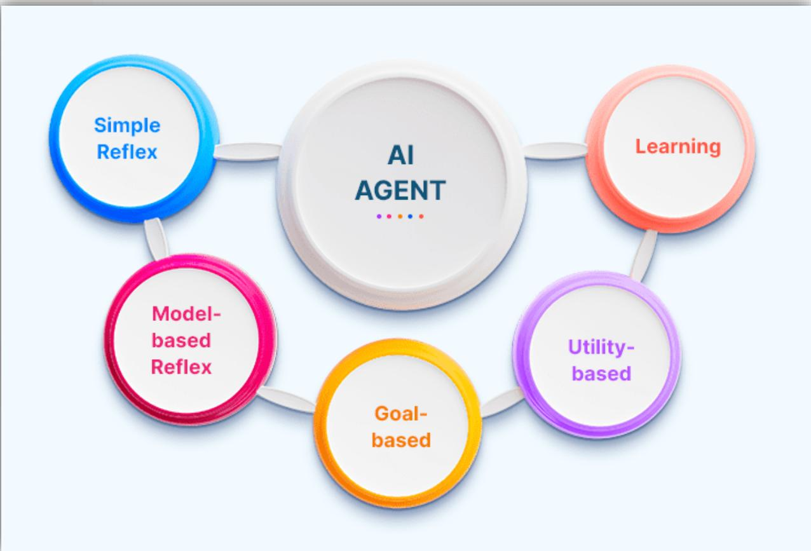

## 智能体的结构

## 简单反射型智能体：根据当前感知选择动作，忽略感知历史的其余部分

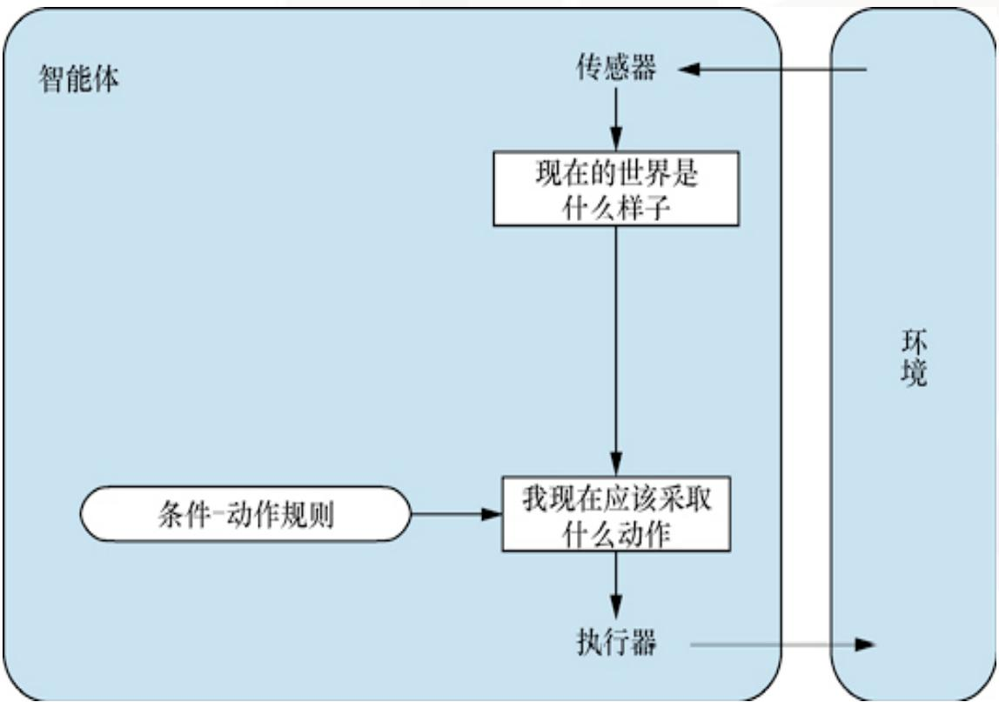

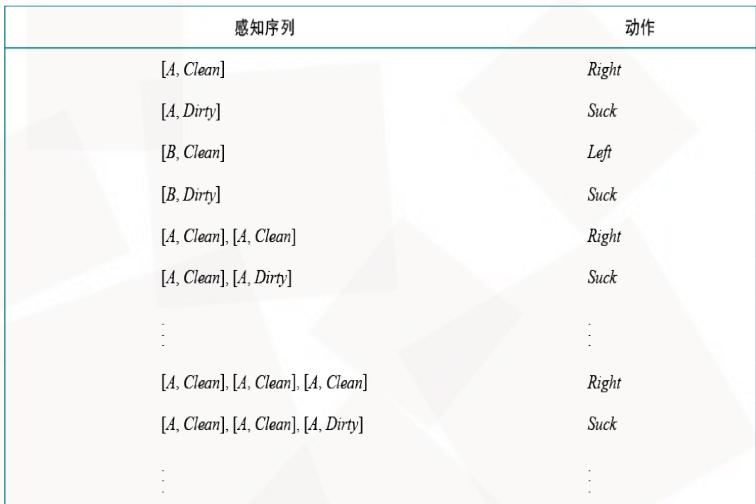  
function REFLEx-VACUUM-AGENET([location,status]) returns一个动作

if status =Dirty then return Suck else if location =A then return Right else if location = B then return Left

授课教师：李静瑶

## 智能体的结构

## 基于模型的反射型智能体:维护某种依赖于感知历史的内部状态

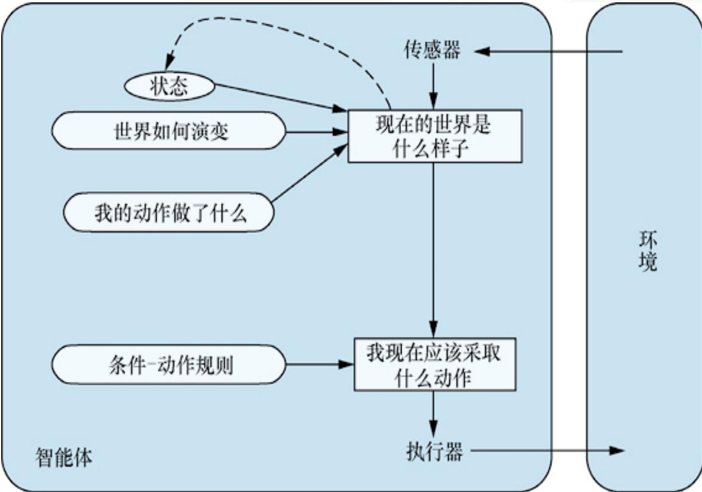

function MODEL-BASED-REFLEX-AGENT(percept) returns一个动作persistent: state,智能体对世界状态的当前理解

transitionmodel，关于下一个状态如何决定于当前状态和动作的描述  
sensormodel，关于当前世界状态如何反映到智能体感知的描述  
rules，一组条件-动作规则  
action，最近的动作，初始为空

```csv
state←UPE-SAE(state,action,percept,transition_model,sensor_model)
rule ← RULE-MATCH(state, rules)
action ←rule.ACTION
return action
```  
授课教师：李静瑶

## 智能体的结构

基于目标的智能体：添加目标信息，寻找实现目标的动作序列 (搜索、规划)

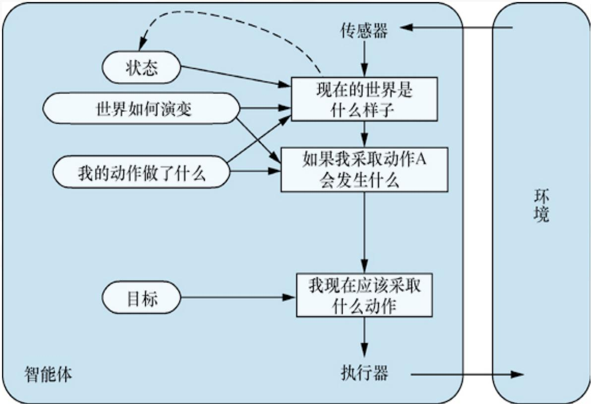  
授课教师：李静瑶

## 智能体的结构

基于效用的智能体：添加效用函数，选择能够最大化其动作结果的期望效用的动作

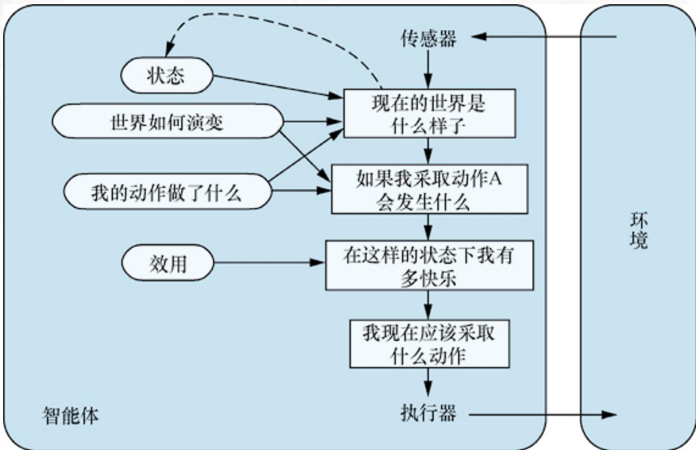  
授课教师：李静瑶

## 智能体的结构

## 学习型智能体

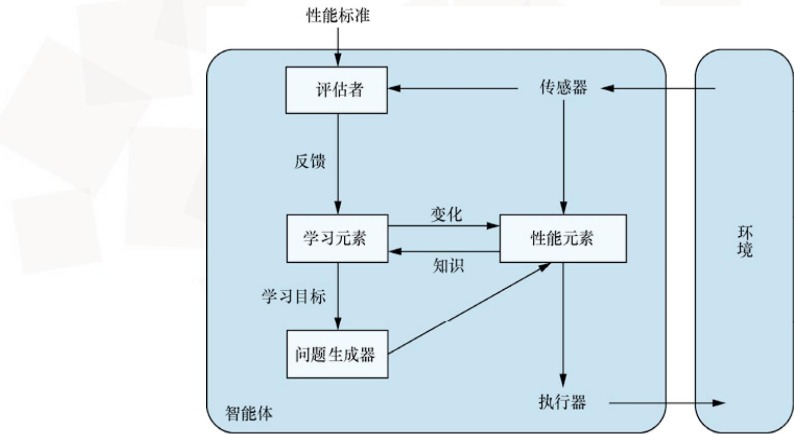  
授课教师：李静瑶

## Al Agent 商业化

## 2023-2024 涌现的AIAgent项目：

·谷歌 Deepmind推出的 robotic agent RoboCat，利用机械臂自动执行各种工作

亚马逊Amazon Bedrock Agents，自动分解企业AI应用开发任务

·AI独角兽Inflection开发的私人AI助理，可以帮助完成订酒店等私人任务

哥伦比亚大学发布了用于科研的AIAgent项目，GPTResearcher

“至少有100个项目正致力于将AIAgent商业化，近10万名开发人员正在构建自主Agent” （2024.03)

授课教师：李静瑶

## Al Agent商业化

大模型之战的下半场

ChatGPT之后的下一个热点

AI应用新时代的起点

·OpenAI 创始成员Andrej Karpathy在黑客马拉松演讲中表示，相比大模型训练，OpenAI 内部目前更关注Agent 领域

授课教师：李静瑶

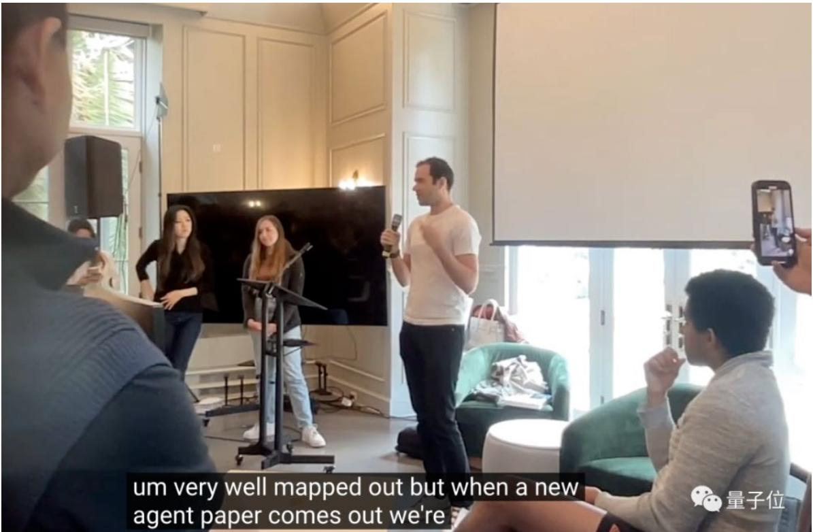

每当有新的Agent论文出来的时候，团队都会很兴奋并且认真地讨论。你们（开发者们）都正站在Agent开发的最前沿，这个领域OpenAI也没什么积累 (2023.06) 39

## Al Agent 商业化

AI聊天机器人主要靠“说”来回答你的问题，而AIAgent则会“动”起来完成具体的任务，就像人类助理一样，在你忙不过来的时候替你完成一些工作，区别就是用AI来驱动而不是人脑驱动

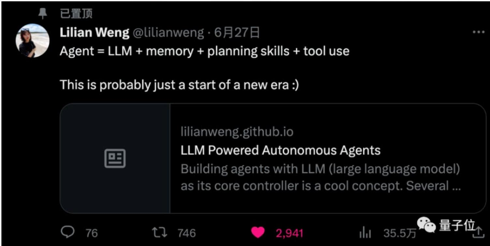  
授课教师：李静瑶

## Al Agent 商业化

Agent = LLM + memory + planning skills + tool use

·记忆：ChatGPT-4等大模型记不住多次对话，增加"记忆"组件，让它时刻记着任务的内容

·规划：复杂任务难以一步到位，需要"规划"组件来负责任务分解，将总任务拆分为各项子任务

·工具：当任务需求超出大模型自身的能力范围时，就需要使用"工具"组件调用其它软件工具来执行

授课教师：李静瑶

## Al Agent商业化

## 初创公司 Seednapse AI创始人提出构建AI应用的五层基石理论

Models:调用大模型API

·Prompt Templates：在提示词中引入变量以适应用户输入的提示模版

·Chains：对模型的链式调用，以上一个输出为下一个输入的一部分

·Agent：能自主执行链式调用，以及访问外部工具

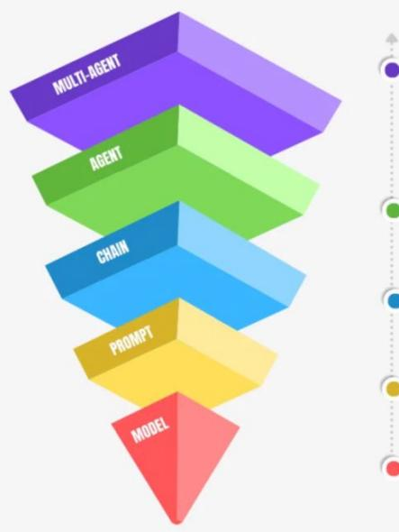

·Multi-Agent:多个Agent共享一部分记忆，自主分

授课教师：李工相互协作

## Al apps building blocks

@CRISTOBAL\_DEV

## 5.MULTI-AGENTS

We can combine different types of agents or chains,each of them setting up fora specific task,to work together.Here the use cases are much more complex.In these architectures,there could be agents dedicated to splitting the initial task from the userinto different subtasks,that are prioritized and then executed by otheragents. Usually,there is some sort of memory shared between agents,in order to have enough context for the tasks.

## 4.AGENTS

It'sanadvanced kind of chain,where the flowof the steps is decided by the modelitself.Also,we can provide different tools totheagenttohaveaccesstotheexternalworld.Typicaltools are web search,file system access,APls,etc.

## 3.CHAINS

With chains,you can create a sequence of calls to the model using prompt templates,where the output of one call could be theinputof thenextprompttemplate.Also,youcanadd some logic in between steps.

## 2.PROMPTTEMPLATES

A prompt is the input text we send toa model.If we add parameters to the prompt,we turn it intoa template that we can feed with userinputs,forexample.

## 1.MODELS

Amodelisa computational framework that represents the statisticalrelationshipsbetweensequencesofs. segmentoftextorachatmodelcanpredicta fitting continuation of the sequence.

## Al Agent 商业化

AutoGPT&BabyAGI：AI名称、描述和目标（执行速度慢、陷入死循环、开销过大等问题）(2023.04)

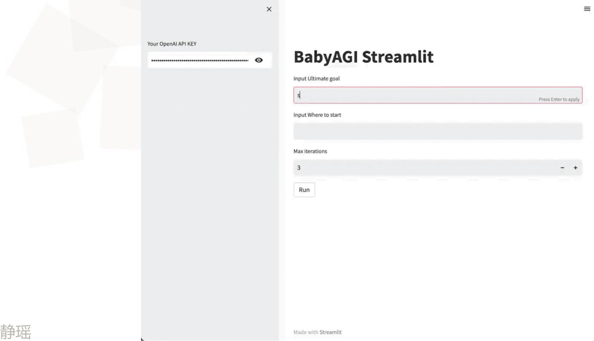  
授课教师：李静瑶

## Al Agent 商业化

Sweep：与Github 的 Issue 和 Pull request场景整合，自动"清扫"bug报告和功能请求，直接完成对应代码

Cursor：一句话生成整个项目框架

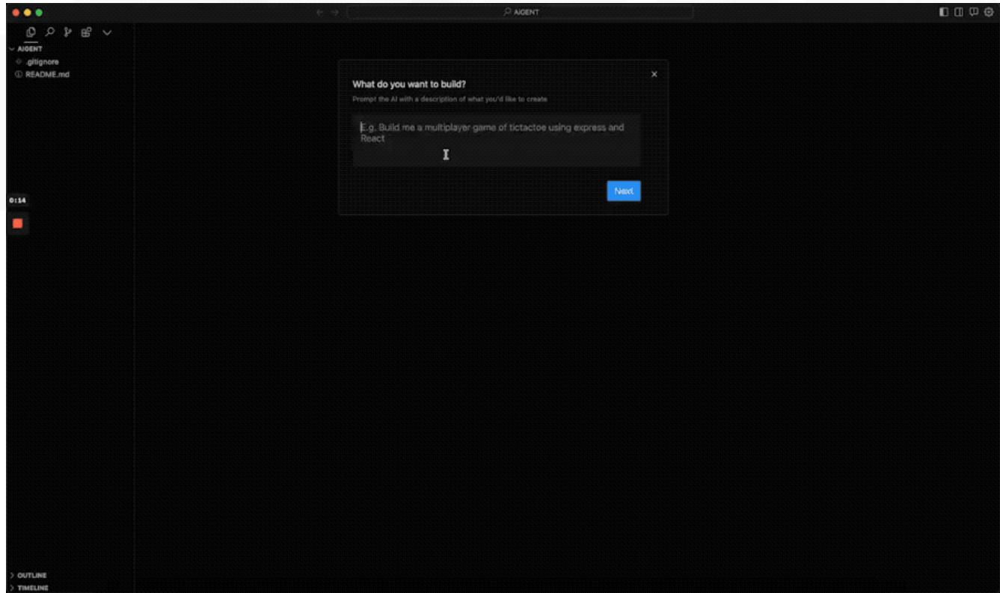  
授课教师：李静瑶

## Al Agent商业化

人工智能初创公司 HyperWriteAI推出的数字助理Personal Assistant (2023.08):

·“第一个可以与浏览器交互操作的AI智能体”

·“其他助手基于海量的知识来生成文本和答案，而我擅长的是搜索信息、导航到某个网站、填写表格以及与网页上的各种ARIA元素交互”

  
Aidan Gomez @aidangomezzz ·8月3日 We'restartingto getthe first glimpses of real personal agents.

Really impressed by what Matt and team have built.

我们开始第一次看到真正的个人代理。

Matt和团队所构建的东西给人留下了深刻的印象。

授课教师：李静瑶

## Al Agent商业化

Personal Assistant 预定行程:

·告知出发地与目的地以及具体时间，Personal Assistant 会进入浏览器页面主动搜索符合要求的出行方案


What can I help you with today?

授课教师：李静瑶

## Al Agent商业化

·Personal Assistant 会挑选出几个较为合适的方案供你选择。选择后，你的行程就将预订成功


These are the best options,based on your preferencesand information.

授课教师：李静瑶

## Al Agent商业化

## Personal Assistant搜索和总结信息:

## 发送命令


FindtheTechcruncharticleaboutthe HyperWriteAl Agent and summarize the information.


I'll get right on it!


Pleasewaitamoment,andI'll getstartedbyredirecting yourbrowsershortly...

授课教师：李静瑶

## Al Agent商业化

Personal Assistant搜索和总结信息:

·系统打开浏览器，在搜索框里自动输入相关要求，等待一段时间后，相关网页呈现出来

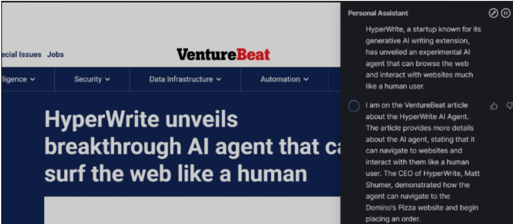  
授课教师：李静瑶

## Al Agent 商业化

Personal Assistant 写邮件:

·告知 Navigate to Gmail and send a creative one line email to xxx thanking her for pretty gift for my birthday

<table><tr><td>新邮件</td><td>islabeled发送</td></tr><tr><td>密送：Thank you</td><td>An error dialog box has appeared 山 中 indicating that the&#x27;Bcc&#x27;field</td></tr><tr><td>主题 Thank you for the wonderful birthday git!Itmade myday extra special.</td><td>contains an unrecognized address &#x27;Thank you’.It seems that the &#x27;Subject&#x27; field content was</td></tr><tr><td></td><td>mistakenly entered into the&#x27;Bcc&#x27; field.The &#x27;Bcc&#x27; field is labeled‘密 送 The &#x27;Subject&#x27; field is labeled 主题</td></tr></table>

授课教师：李静瑶

## Al Agent 商业化

  
授课教师：李静瑶

## Al Agent 商业化

Personal Assistant 自主操作ChatGPT，从单个提示开始构建网站

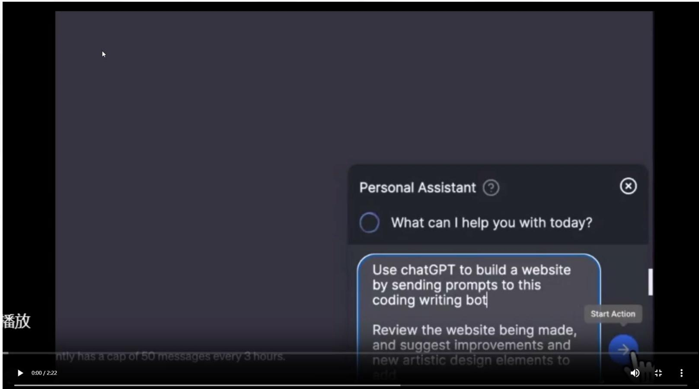  
授课教师：李静瑶

## Al Agent商业化

## Personal Assistant订披萨、在Linkedln选找合适的工程人选等

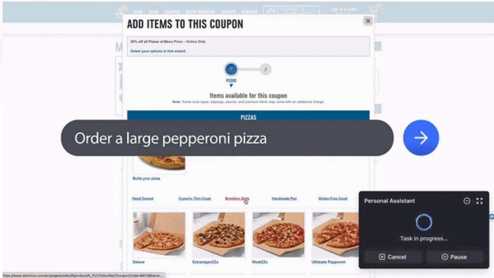  
授课教师：李静瑶

## Al Agent 商业化

AmazonBedrockAgents：在全托管基础模型服务的基础上，又把开发、部署和管理等多个Agent的能力打包集成

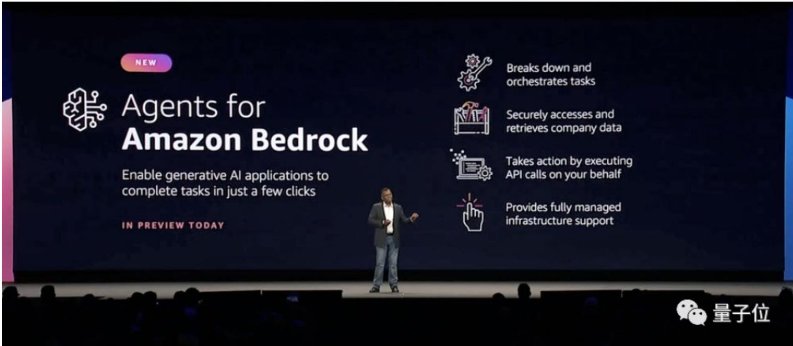  
只用几次点击，搞定能执行任务的生成式AI应用  
授课教师：李静瑶

## Al Agent 商业化

Amazon Bedrock Agents：除了自家的Amazon Titan大模型，还集结了擅长安全可控的Anthropic、擅长检索汇总信息的Cohere、以及专攻文生图的stability.ai等模型

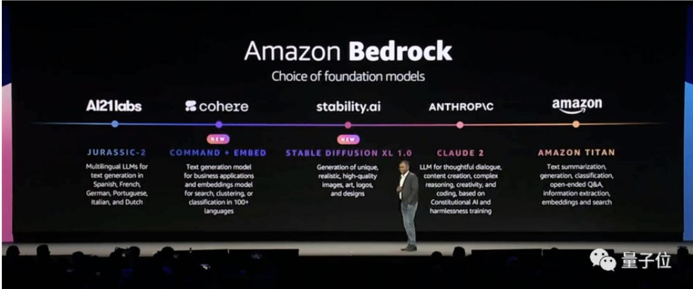  
授课教师：李静瑶

## Al Agent 商业化

## Amazon Bedrock > Agents > Create Agent

Step 1 Provide Agent details

Step2 Select model

Step 3- optional Add Action groups

Step 4 Review and create

## Select model

## Model details

Anthropic


Claude V1

Next-genAlasistatdlulstdstsCdlitmmrtiacheatie& coding, as well as take direction.   
Note:Thterms“Humanand"Asistant:"willautomaticalleadedtollpromptsusingAnthopicmodels timproveyoursultsView details

Instructions for the Agent

Provide clear and specific instructions for the task the Agent willperform.You can also provide certain style and tone.

You are an agent designed to help with processing insurance claims and managing pending paperwork.

This instruction can have 40 to 800 characters.

Cancel

授课教师：李静瑶

Send reminder to all policy holders with open claims and pending paperwork


Thereare currently two open insurance claimswith theclaim IDs"claim-123" and "claim-06".The policy holdersfortheseclaims have IDs"A134085"and "A645987" respectively.For both these open claims, reminders havebeensent regarding the pending documents-Accident Report,Driver'sLicenseand Vehicle Registration.The status of sending these remindersis"In Progress".