## 第3章状态空间与无信息搜索

授课教师：李静瑶

授课教师：李静瑶

## 录

1 问题求解智能体

2 问题实例

3 搜索算法

4 无信息搜索策略

## 问题求解智能体

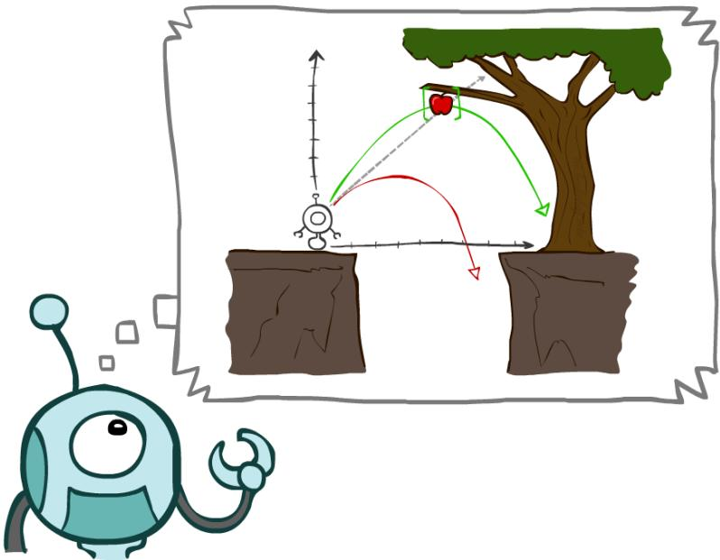

人工智能的目标：专注于研究和构建具有合理的行为的智能体

问题求解智能体：考虑一个形成通往目标状态路径的动作序列，它所进行的计算过程被称为搜索

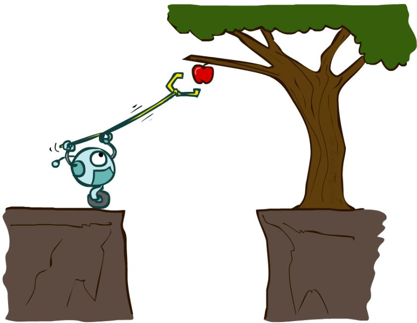  
授课教师：李静瑶

## 问题求解智能体

## 问题求解智能体

规划型智能体，一种基于目标的智能体

·问题形式化+目标形式化 (可以形式化表示目标并判断目标是否实现)

模型知道环境对动作会做出什么反应，考虑一系列动作的结果 (搜索)

执行 (解中的动作)

授课教师：李静瑶

## 问题求解智能体

## 食豆人游戏

  
授课教师：李静瑶

## 问题求解智能体

## 食豆人游戏：吃掉最近的豆子 (计算每一步最优路径)

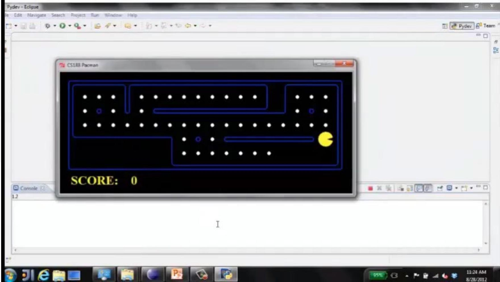  
授课教师：李静瑶

## 问题求解智能体

## 食豆人游戏：计算整体最优路径，然后执行

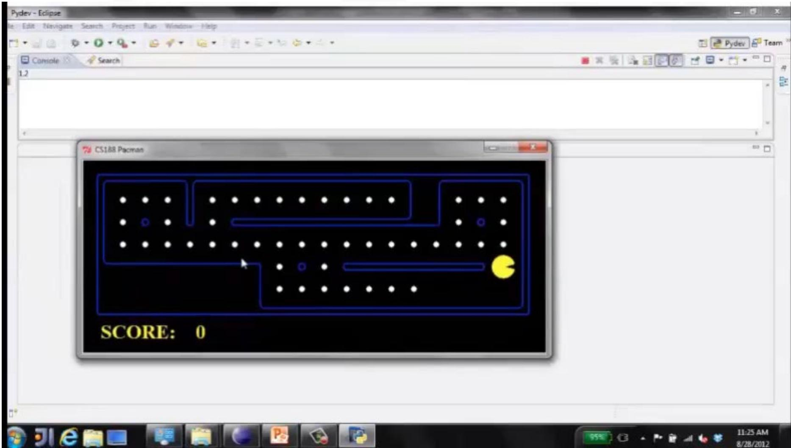  
授课教师：李静瑶

## 问题求解智能体

## 搜索问题定义

智能体的初始状态

目标测试函数

智能体的可执行动作

转移模型

路径代价函数

//初始状态

//目标状态

//候选动作集

//状态转移函数

//评价函数

问题的解：从初始状态到目标状态的动作序列

解的质量由路径代价函数度量

·具有最小路径代价值的解即为最优解

授课教师：李静瑶

## 2问题实例

例1.唐纳德·克努斯猜想 (Donald Knuth)

例2.真空吸尘器世界

例3.八数码问题

例4.八皇后问题

例5.路径规划问题

例6.机器人装配问题

授课教师：李静瑶

## 2 问题实例

例1．唐纳德·克努斯猜想，只用数字4，一个由阶乘、开方、取整构造的操作序列可以得到任意正整数。

状态：正整数

初始状态：4

目标状态：指定的正整数

动作：阶乘、开方、取整

路径代价函数：操作数最少...

$$
\left[ \sqrt { \sqrt { \sqrt { \sqrt { ( 4 ! ) ! } } } } \right] = 5
$$

正整数5可以通过如上操作序列得到

授课教师：李静瑶

## 2问题实例

## 例2.真空吸尘器世界

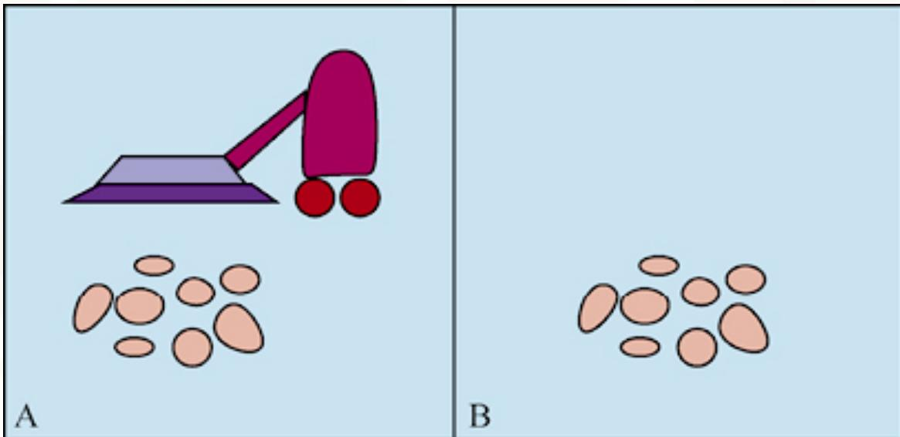  
授课教师：李静瑶

## 2 问题实例

## 例2.真空吸尘器世界

·状态空间：由Agent位置和房间干净与否确定

，若Agent的位置有2个，每个房间可能干净或不干净，则可能状态数为$2 \times 2 ^ { 2 } { = } 8$

对于具有n个房间的大型环境，可能状态数为 $n \times 2 ^ { n }$

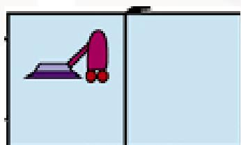

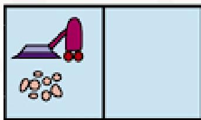

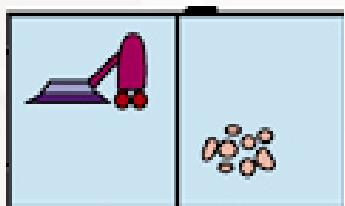

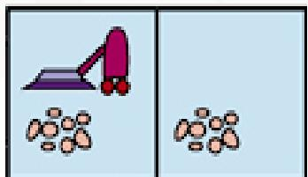

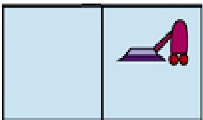

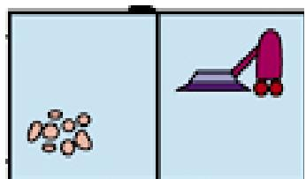

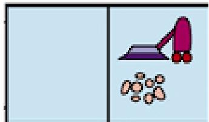

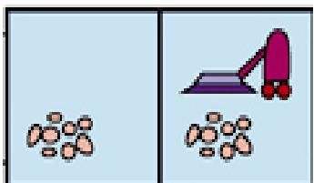  
授课教师：李静瑶

## 2问题实例

## 例2.真空吸尘器世界

初始状态：任何状态均可

目标状态：所有房间都干净

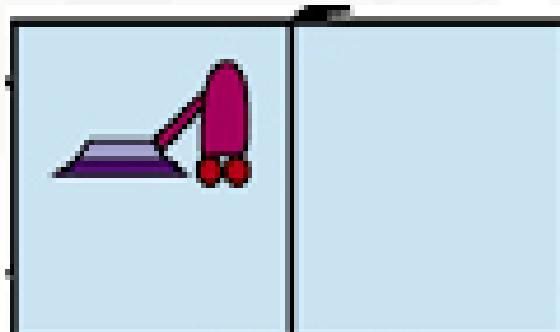

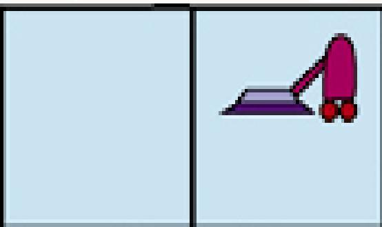  
授课教师：李静瑶

## 问题实例

## 例2.真空吸尘器世界

·可执行动作：吸尘器Agent的动作

•Left、Right、Suck

大型环境中Up、Down

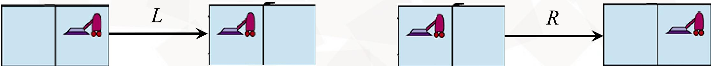

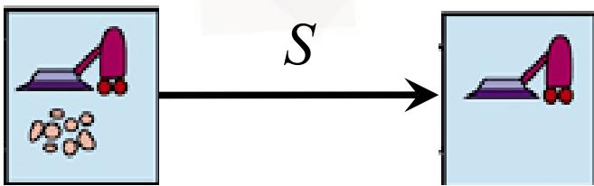  
授课教师：李静瑶

## 2问题实例

## 例2.真空吸尘器世界

状态转移函数

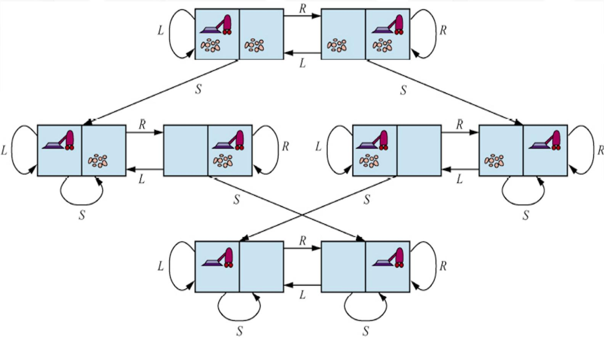  
授课教师：李静瑶

## 2问题实例

## 例2.真空吸尘器世界

路径代价函数

·若每个动作的代价值为1，则路径的代价值为路径中包含的动作数

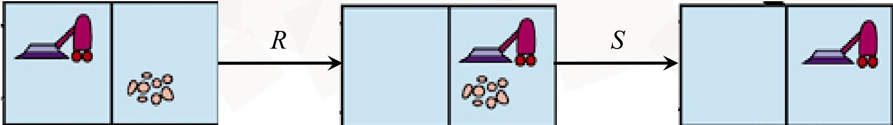  
授课教师：李静瑶

## 2问题实例

## 例3.八数码问题

：一个3×3的棋盘上有8个数字棋子和一个空格。与空格相邻的棋子可以滑动到空格中

游戏目标是要达到一个特定的状态

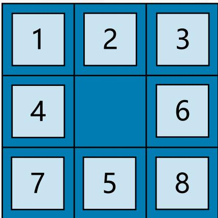  
开始状态

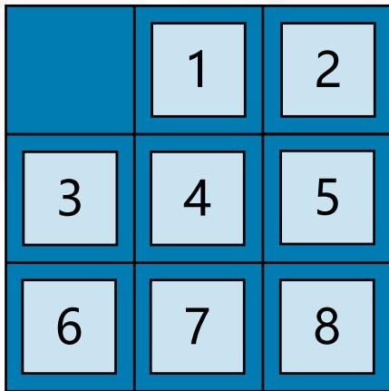  
目标状态

授课教师：李静瑶

## 问题实例

## 例3.八数码问题

·状态：描述8个棋子在棋盘上的分布

初始状态：任何状态均可

目标条件：检测是否为给定的目标状态

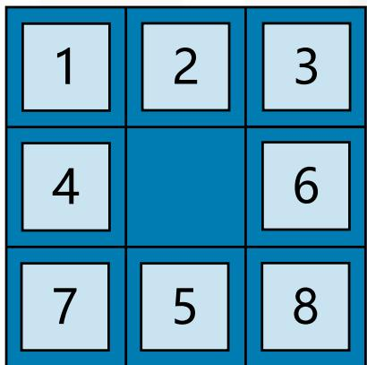  
开始状态

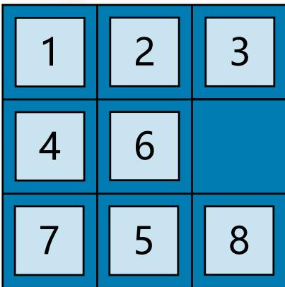

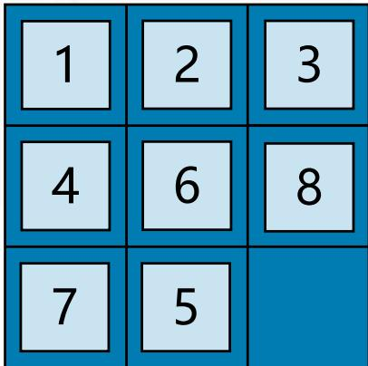  
目标状态

授课教师：李静瑶

## 2问题实例

## 例3.八数码问题

动作：每个棋子或空格的滑动

•Left、Right、Up、Down

授课教师：李静瑶

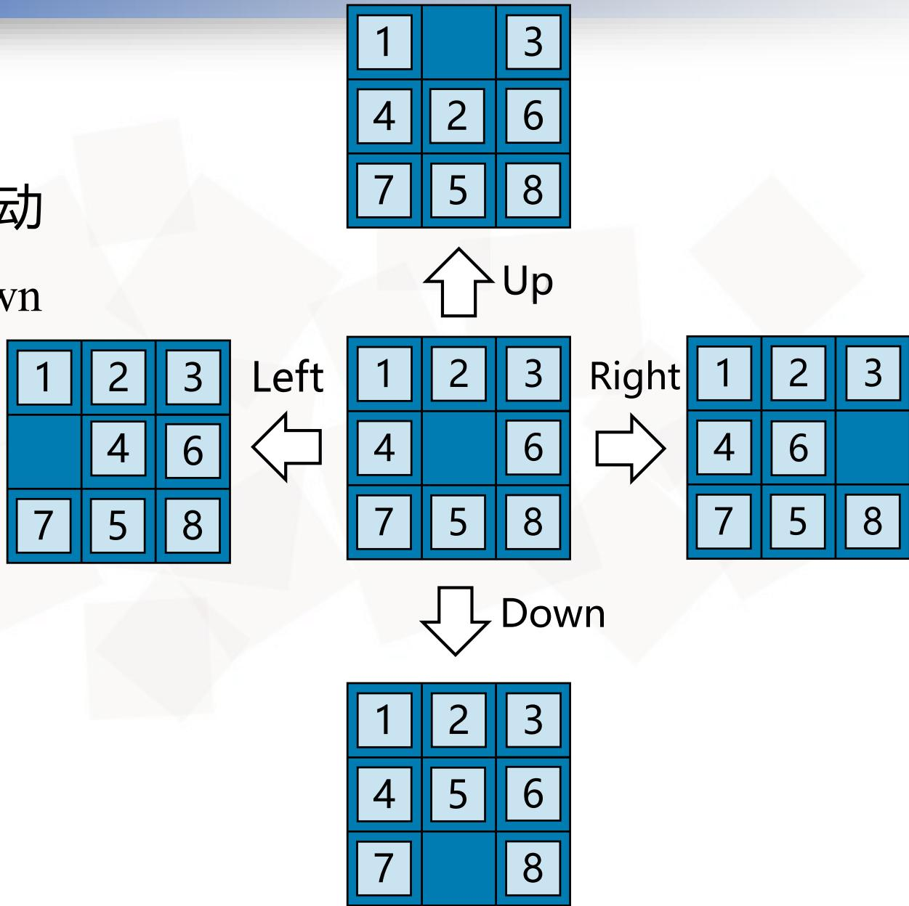

## 问题实例

例3.八数码问题

状态转移函数 (后继函数)

路径代价函数

路径代价值为路径中的动作数

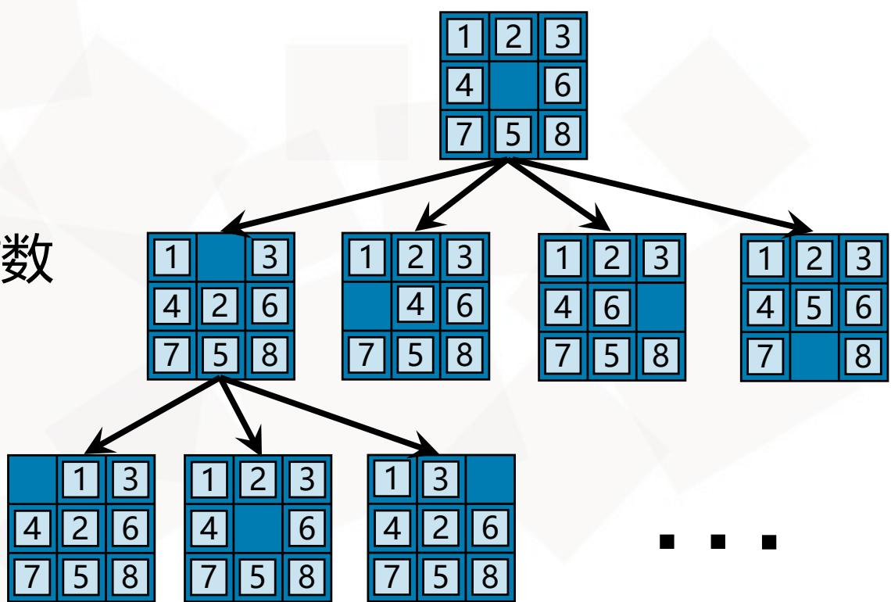  
授课教师：李静瑶

## 2问题实例

## 例3.八数码问题

·八数码问题有9!/2=181440个可达状态

·15数码问题有约1.3万亿个状态，利用最好的搜索算法求解一个随机实例的最优解需要几毫秒

·24数码问题有约1025个状态，利用最好的搜索算法求解一个随机实例的最优解需要几个小时

授课教师：李静瑶

## 2问题实例

## 例4.八皇后问题

目标是在国际象棋棋盘上放置8个皇后，使得任何一个皇后都不会攻击到其他任一皇后

注：皇后可以攻击和它在同一行、同一列或者同一对角线的任何棋子

  
授课教师：李静瑶

## 问题实例

## 例4.八皇后问题

·状态：描述0-8个皇后在棋盘上的分布

初始状态：棋盘上没有皇后

目标条件：棋盘上放置8个皇后，无法互相攻击

·动作：在任一空位放置一个皇后

状态转移函数

路径代价函数：无需考虑 (合法即可)

·上述描述需要考虑 $6 4 \times 6 3 \times \_ \_ { 5 } \times 5 7 \approx 1 . 8 \times 1 0 ^ { 1 4 }$ 个可能序列

  
授课教师：李静瑶

## 2问题实例

## 例4.八皇后问题的改进描述

·状态：描述0-8个皇后在棋盘上的分布，满足最左侧每列放置一个皇后，无法相互攻击

·动作：在最左侧空列中的任一空位放置一个皇后，无法相互攻击

·对于100皇后问题，状态空间从约10400个状态 减少到约1052个状态

  
授课教师：李静瑶

## 2问题实例

## 例5.路径规划问题 (罗马尼亚)

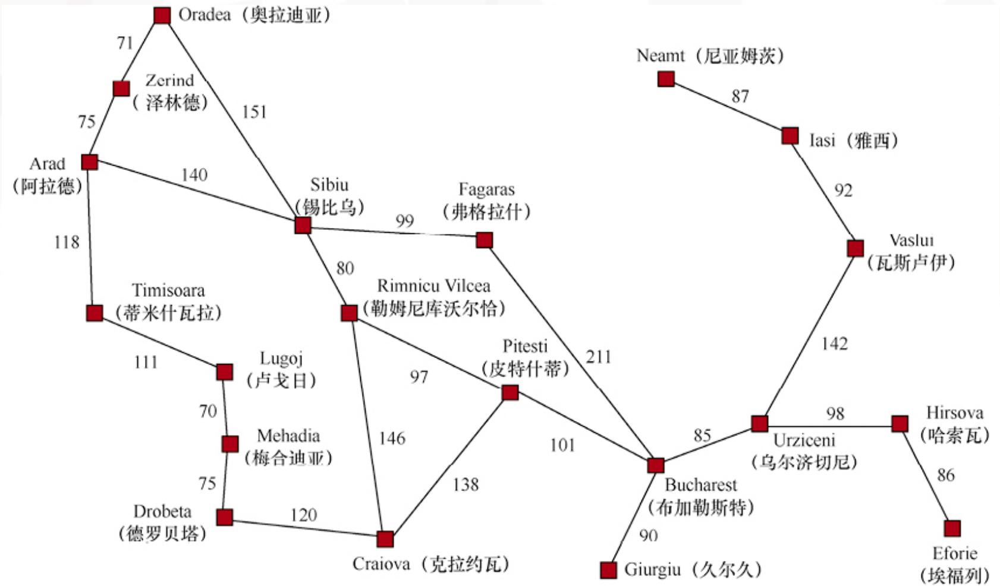  
授课教师：李静瑶

## 2问题实例

## 例5.路径规划问题 (罗马尼亚)

状态空间：城市节点

初始状态：某个节点

目标条件：某个或某些节点

动作：去相邻城市

状态转移函数：到达相邻城市

路径代价函数：城市之间的距离

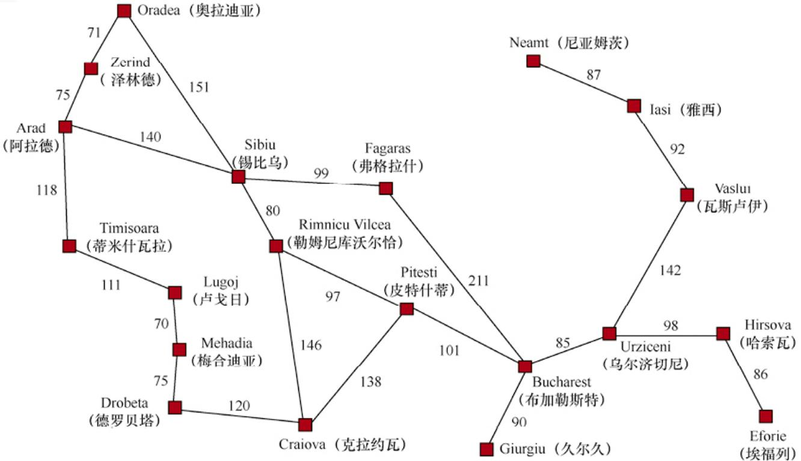  
授课教师：李静瑶

## 2问题实例

## 例6.机器人装配问题

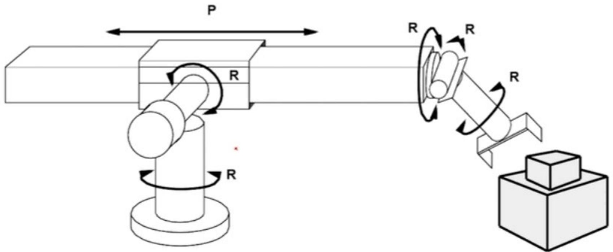  
授课教师：李静瑶

## 2问题实例

## 例6.机器人装配问题

初始状态：不限

·目标测试：检查是否将物体移动到正确位置

动作：各个关节的运动

转移模型：各个关节运动，机器人的姿态变化

路径代价函数：所有关节运动总和

授课教师：李静瑶

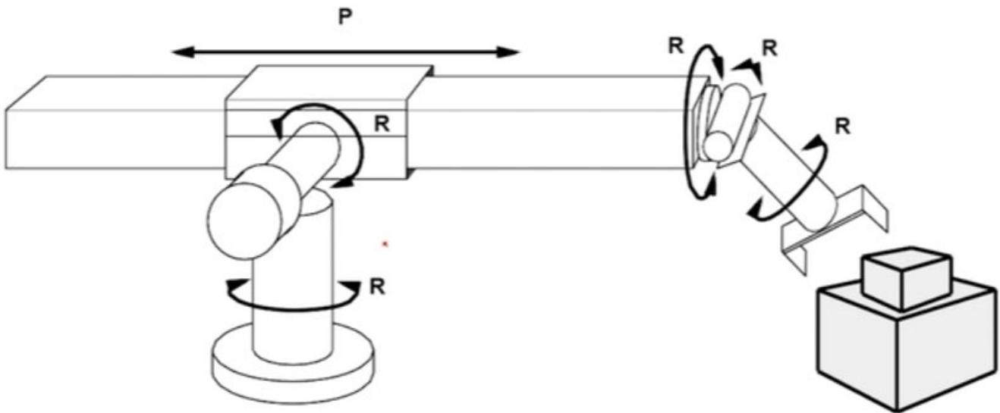

## 3 搜索

## 搜索问题 (Problem)

状态空间 环境状态的集合

初始状态 智能体启动时的初始状态

目标状态 智能体期望达到的终止状态

动作集合 智能体可执行的动作

转移模型 在状态s中执行动作a所产生的状态

·动作代价函数在状态s中执行动作a转移到状态s'的数值代价

授课教师：李静瑶

## 3 搜索

## 问题的解 (Solution)

路径

解

路径代价

最优解

动作序列

从初始状态到某个目标状态的路径

路径上各个动作代价的总和

所有解中路径代价最小的解

授课教师：李静瑶

## 3 搜索

## 搜索算法

·将搜索问题作为输入，并返回问题的解或报告failure（当解不存在时)

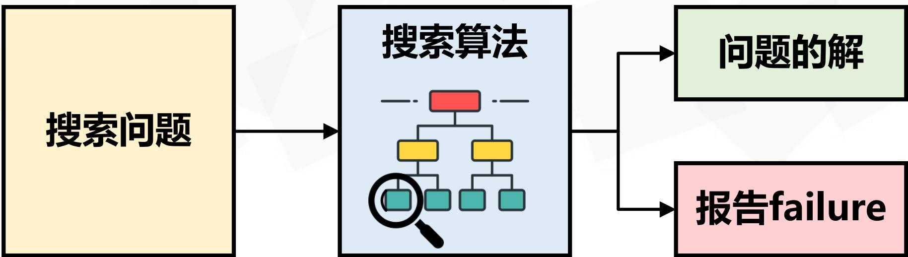  
授课教师：李静瑶

## 3 搜索

## 搜索算法

，状态空间图：用节点和边表示问题所有可能状态及状态间转换关系的图

在状态空间图上叠加一棵搜索树

从初始状态形成多条路径，并试图找到一条可以达到某个目标状态的路径

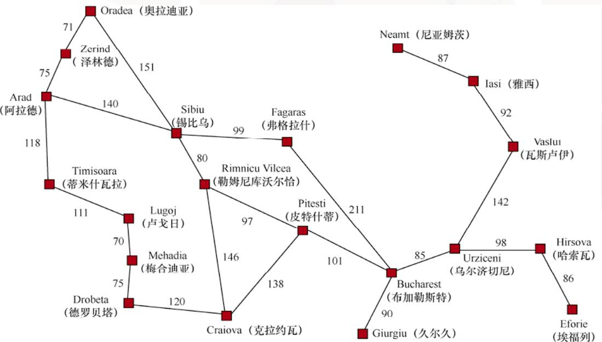  
授课教师：李静瑶

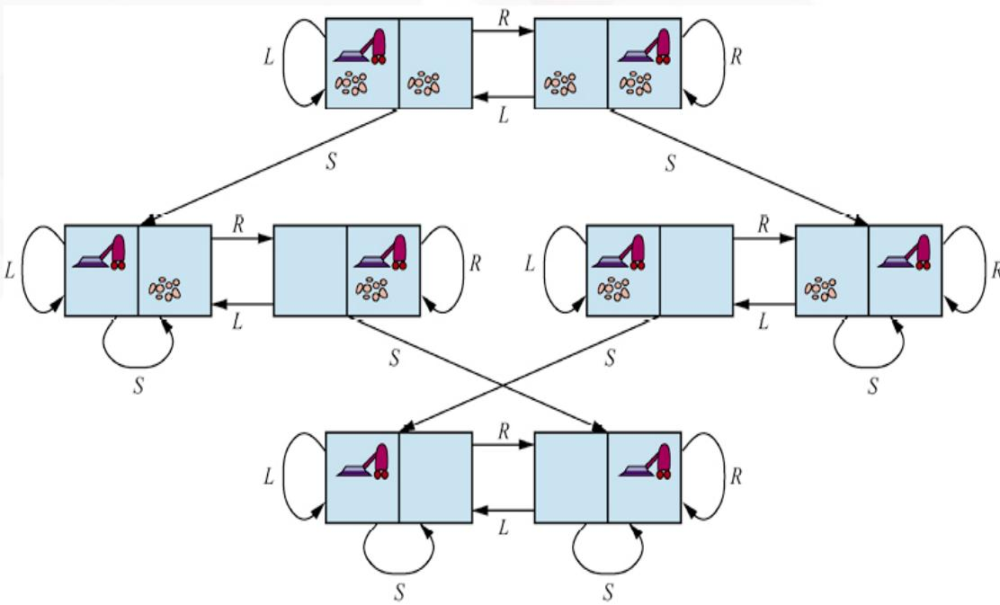

## 3 搜索

## 搜索树

## ·树

结点：状态

边：动作/可选动作

根结点：初始状态

满足目标条件的叶结点：目标状态

## 解

·从初始状态到达目标状态的动作序列

授课教师：李静瑶

## 3 搜索

## 状态空间图与搜索树的对应关系

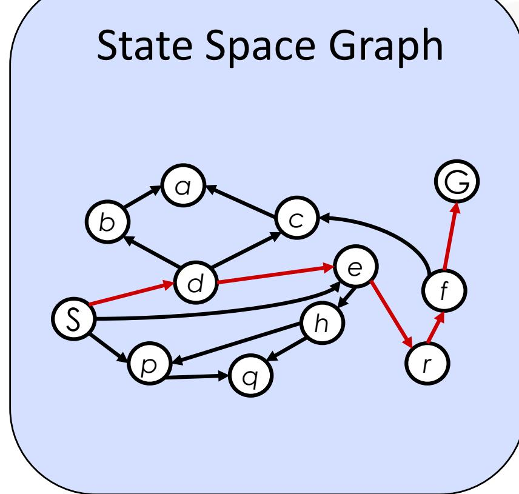

状态空间图描述了世界的状态集，以及允许从一个状态转移到另一个状态的动作  
搜索树描述了这些状态之间通向目标的路径

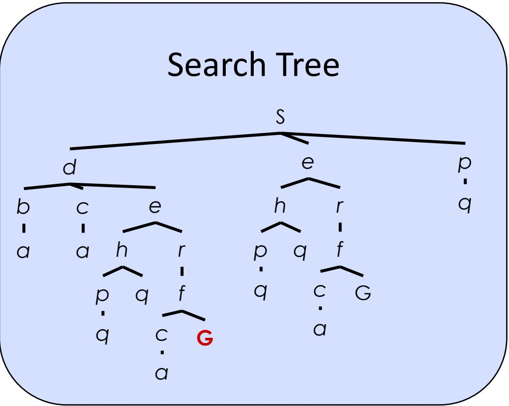  
授课教师：李静瑶

## 3 搜索

## 例.对应的搜索树有多大？

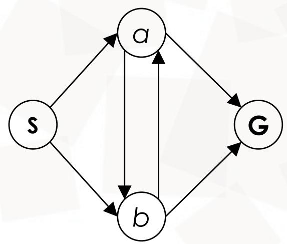  
授课教师：李静瑶

## 3 搜索

## 例.路径规划问题的部分搜索树

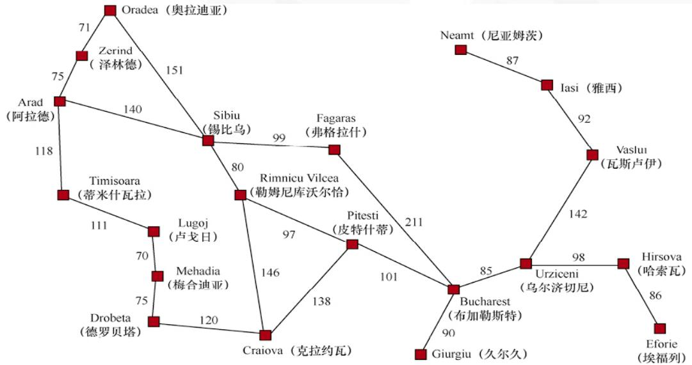  
授课教师：李静瑶

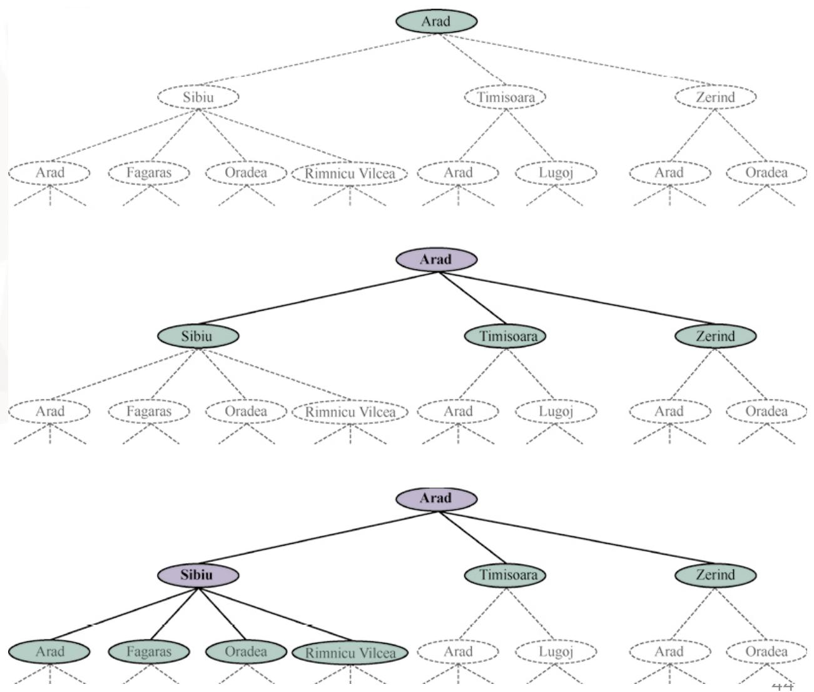

## 3 搜索

## 树搜索

利用搜索树的树搜索

初始状态

动作/可选动作

·扩展：任一状态利用可选动作生成后继状态的过程待扩展的 (叶）结点：搜索树的边界 (frontier)

搜索策略：从边界集选择哪个节点进行扩展

授课教师：李静瑶

## 3 搜索

## 树搜索算法

function TREE-SEARCH(problem) returnsa solution,or failure initialize the frontier using the init'al state of problem loopdo ifthe frontier is empty then return failure choose a leaf node and remove it from thefrontier if the node contains a goal state then return the corresponding solution expand the chosen node,adding the resului'ng nodes to the frontier

授课教师：李静瑶

## 3 搜索

## 例.路径规划问题的搜索树

## 路径中有重复状态/环路

Arad->Sibiu->Arad

$\mathrm { A r a d { - } S i b i u { \mathrm { - } } O r a d e a { \mathrm { - } } O e r i n d { \mathrm { - } } O A r a d }$

## . 冗余路径

Sibiu->Arad (140)

Sibiu->Oradea->Zerind->Arad (297)

## 搜索树是无穷深度的

需要避免冗余状态或限制深度

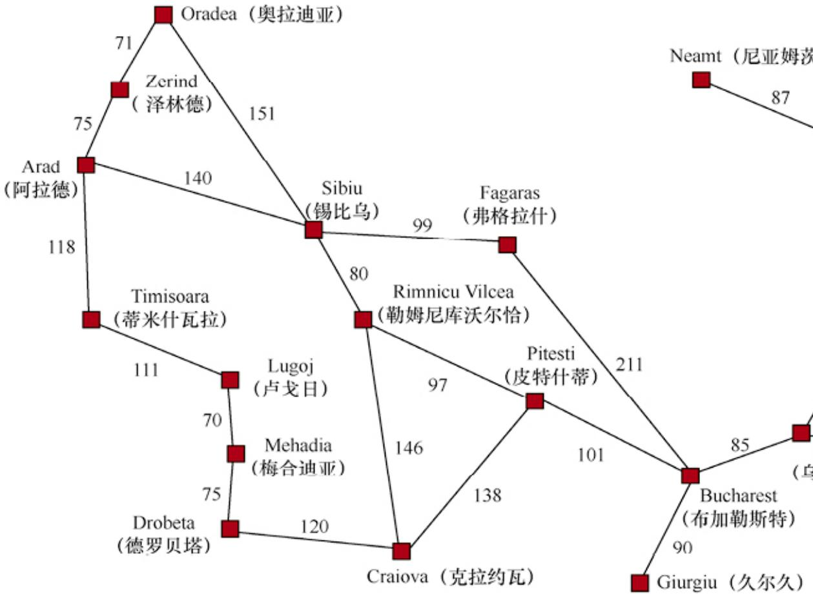  
授课教师：李静瑶

## 3 搜索

## 图搜索

·对于无向图搜索，冗余状态不可避免

保存探索历史信息，避免探索冗余路径

树搜索算法上增加探索集，记录已扩展的结点

新生成的结点若与已生成的（探索集或边界集中的）某个结点相同，则舍弃

授课教师：李静瑶

## 3 搜索

## 图搜索

利用搜索树的图搜索

初始状态

动作/可选动作

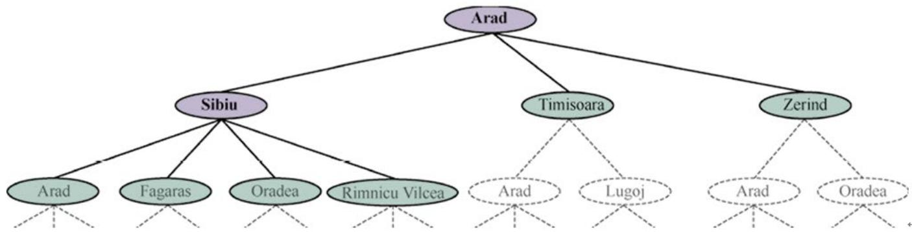

·扩展：任一状态利用可选动作生成后继状态的过程

待扩展的（叶）结点：边界（frontier/open)

•已扩展的（中间）结点：探索（explored /reached/closed）

搜索策略：从边界集选择哪个节点进行扩展，且该扩展的节点不在边界集 或探索集中

授课教师：李静瑶

## 3 搜索

## 图搜索算法

function GRAPH-SEARCH(problem) returnsa solution,or failure initialize the frontierusing the initial state of problem initialize theexploredseto beeinpty loopdo ifthefrontier is empty then return failure choosea leaf node and remove it from the frontier if the node contains a goal state then return the conesponding solution add thenode to the explored set expand the chosen node,adding the resulu’ng nodes to the frontier onlyif not inthefrontier orexploredset

授课教师：李静瑶

## 3 搜索 一

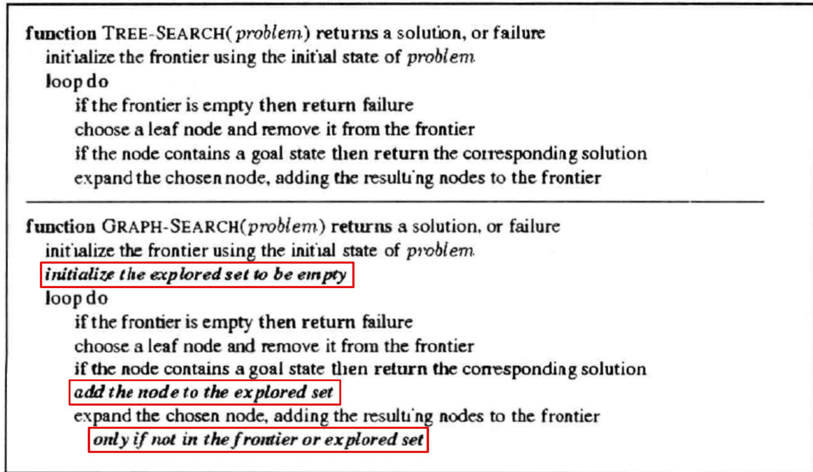  
授课教师：李静玲

图3.7一般的树搜索和图搜索算法的非形式化描述。用粗斜体标出的图搜索算法的部分内容是指需要额外处理重复状杰

## 3 搜索

## 搜索树中节点的数据结构

搜索树中的结点n

n.State：当前结点对应的状态

·n.Parent：当前结点的父结点

：n.Action：当前结点的父结点生成当前结点所采取的动作

·n.Path-Cost：从根结点到当前结点的路径代价值

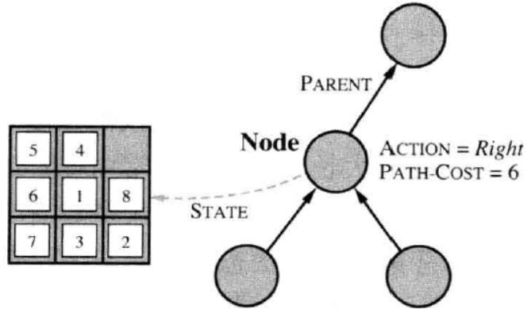  
授课教师：李静瑶  
图3.10结点是数据结构，由搜索树构造。每个结点都有一个父结点、一个状态和其他域。箭头由子结点指向父结点

## 3 搜索

## 搜索相关的数据结构

父结点通过执行动作扩展子节点

function CHILD-NoDE(problem,parent,action)returnsanode   
returnanodewith   
STATE=problem.RESULT(parent.STATE,action),   
PARENT=parent,ACTION=ction,   
PATH-COST=parent.PATH-COST+problem.STEP-COST(parent.STATE,action)

每个结点包含指向其父结点的指针Parent

利用该指针，可以从目标结点倒推出解路径

授课教师：李静瑶

## 3 搜索

## 节点vs 状态

节点：搜索树的数据结构

状态：问题世界的描述

·同一状态可以通过不同的路径生成，则不同的节点可以表示相同的状态

授课教师：李静瑶

## 3 搜索

## 存放结点的常见数据结构

队列 (广义上的队列，可能是栈、队列、有限队列)

Is-Empty(frontier):返回true当且仅当边界中没有节点

Pop(frontier)：返回边界中的第一个节点并将它从边界中删除

Top(frontier)：返回（但不删除）边界中的第一个节点

Add(node,frontier):将节点插入队列中的适当位置

授课教师：李静瑶

## 3 搜索

## 存放结点的常见数据结构

·优先队列：首先弹出根据评价函数f计算得到的代价最小的节点，用于最佳优先搜索

·FIFO队列：先进先出队列，首先弹出最先添加到队列中的节点，用于广度优先搜索

·LIFO队列：后进先出队列，即栈，首先弹出最近添加的节点，用于深度优先搜索

## 3 搜索

## 问题求解性能评估

完备性：问题有解，算法一定能找到

·有效性：算法找到的解，是问题的解

最优性：问题有解，算法一定能找到最优解

时间复杂度：时间开销

空间复杂度：空间开销

授课教师：李静瑶