## 第3章状态空间与无信息搜索

授课教师：李静瑶

授课教师：李静瑶

## 录

1 问题求解智能体

2 问题实例

3搜索算法

4 无信息搜索策略

## 4 无信息搜索

## 无信息搜索 盲目搜索

旻除了问题定义中提供的状态信息之外，没有任何附加信息

搜索算法只需生成后继、区分目标状态与非目标状态，按 照节点扩展顺序分类

有信息搜索 启发式搜索

搜索算法知道一个状态是否比其它状态“更有希望”接近目标

## 4无信息搜索

## 无信息搜索

广度优先搜索 (宽度优先搜索)

一致代价搜索

深度优先搜索

深度受限搜索

迭代加深搜索

双向搜索

授课教师：李静瑶

## 4 无信息搜索

## 广度优先搜索

扩展最浅层的没有被扩展的节点

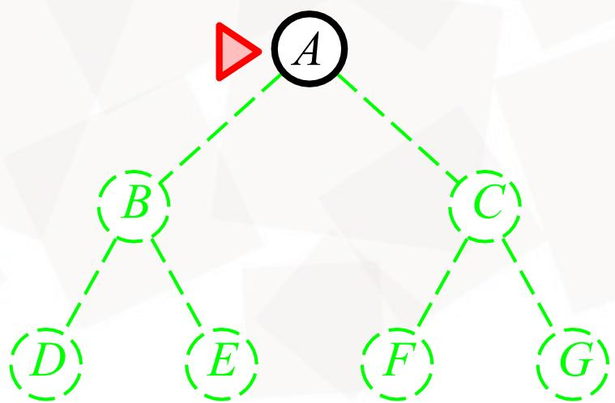  
授课教师：李静瑶

## 4 无信息搜索

## 广度优先搜索

扩展最浅层的没有被扩展的节点

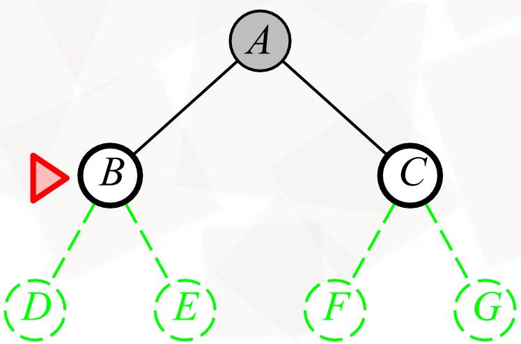  
授课教师：李静瑶

## 4 无信息搜索

## 广度优先搜索

扩展最浅层的没有被扩展的节点

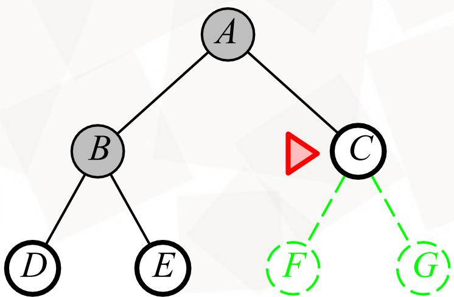  
授课教师：李静瑶

## 4 无信息搜索

## 广度优先搜索

扩展最浅层的没有被扩展的节点

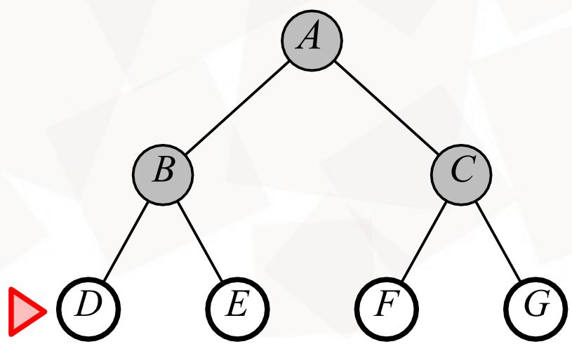  
授课教师：李静瑶

## 4 无信息搜索

## 广度优先搜索

function BREADTH-FIRST-SEARCH(problem)returns一个解节点或failure

node←NODE(problem.INTTIAL)

if problem.Is-GoAL(node.STATE) thenreturn node边界frontier←一个FIFO队列，其中一个元素为node

reached←{problem.INITIAL}

while not Is-EMPTY(frontier) do

node←PoP(frontier)

foreach child in ExPAND(problem,node) do

s ←child.STATE

if problem.Is-GoAL(s) thenreturn child

if s不在reached中then

将s添加到reached

将child添加到frontier

return failure

授课教师：李静瑶

已达：任何已经生成过节点的状态都称为已达（reached）状态（无论该节点是否被扩展)

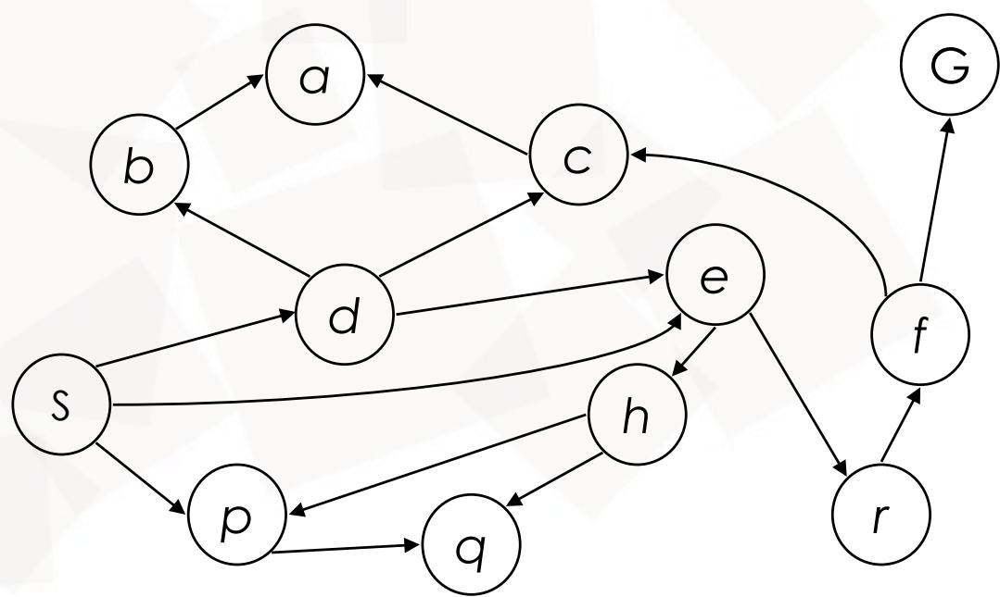

## 4无信息搜索

## 广度优先搜索

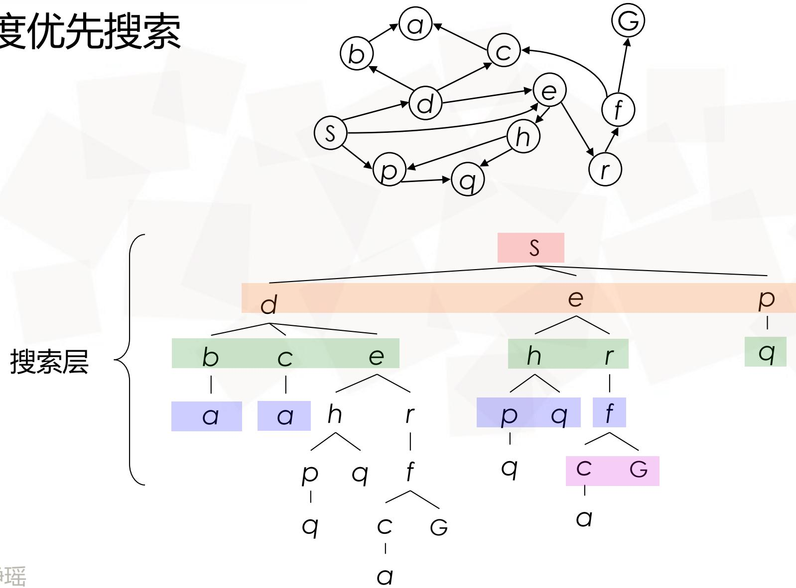  
授课教师：李静瑶

## 4 无信息搜索

## 广度优先搜索

完备性：算法完备

最优性：当动作代价相同时，算法最优

时间复杂度：

$$
1 + b + b ^ { 2 } + b ^ { 3 } + \cdots + b ^ { d } = 0 ( b ^ { d } )
$$

空间复杂度： $0 ( b ^ { d } )$ 个节点

(b-分支因子，d-搜索深度，目标节点深度)

授课教师：李静瑶

## 4无信息搜索

## 广度优先搜索的时空代价

<table><tr><td>Depth</td><td>Nodes</td><td>Time</td><td>Memory</td></tr><tr><td>2</td><td>110</td><td>.11 milliseconds</td><td>107 kilobytes</td></tr><tr><td>4</td><td>11,110</td><td>11 milliseconds</td><td>10.6 megabytes</td></tr><tr><td>6</td><td> $1 0 ^ { 6 }$ </td><td>1.1 seconds</td><td>gigabyte</td></tr><tr><td>8</td><td> $1 0 ^ { 8 }$ </td><td>2 minutes</td><td>103 gigabytes</td></tr><tr><td>10</td><td> $1 0 ^ { 1 0 }$ </td><td>3 hours</td><td>10 terabytes</td></tr><tr><td>12</td><td> $1 0 ^ { 1 2 }$ </td><td>13 days</td><td>1 petabyte</td></tr><tr><td>14</td><td> $1 0 ^ { 1 4 }$ </td><td>3.5 years</td><td>99 petabytes</td></tr><tr><td>16</td><td> $1 0 ^ { 1 6 }$ </td><td>350 years</td><td>10 exabytes</td></tr></table>

图3.13宽度优先搜索的时间和内存代价。假设：分支因子为b=10；1000000个结点/秒；1000字节/结点

## 一般来说，指数级复杂性的搜索问题无法通过无信息搜索求解

授课教师：李静瑶

## 4 无信息搜索

## 一致代价搜索

·扩展路径代价最小的节点

function UNIFORM-CosT-SEARCH(problem)returns一个解节点或failurereturn BEST-FIRST-SEARCH(problem,PATH-COST)

授课教师：李静瑶

## 4无信息搜索

## 一致代价搜索

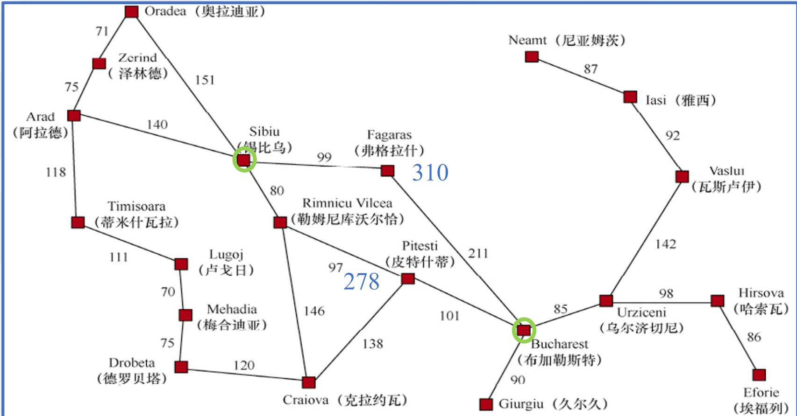  
授课教师：李静瑶

## 4 无信息搜索

## 一致代价搜索

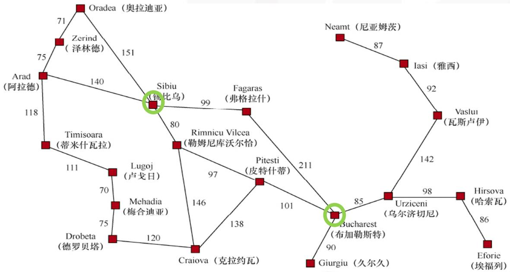  
授课教师：李静瑶

function BEsT-FIRsT-SEARCH(problem,f) returns一个解节点或 failure 杯K  
node ←NODE(STATE=prOblem.INITIAL)  
frontier←一个以f排序的优先队列，其中一个元素为node  
reached←一个查找表，其中一个条目的键为problem.INITIAL，值为node  
while not Is-EMPTY(frontier) do  
node ←PoP(frontier)  
if problem.Is-GoAL(node.STATE) then return node  
for each child in ExPAND(problem, node) do  
s ← child.STATE  
if s不在reached中 or child.PATH-CosT<reached[s].PATH-CosT then  
reached[s]←child  
将child添加到frontier中(添加或替换)  
return failure

function ExPAND(problem,node) yields节点   
s ← node.STATE   
for each action in problem.AcTioNs(s) do   
s'←problem.REsULT(s,action)   
cost ← node.PATH-CosT +problem.ACTION-CosT(s,action,s)   
yield NODE(STATE=s',PARENT=nOde,ACTION=aCtion,PATH-COSTFCOst)

## 4 无信息搜索

## 一致代价搜索

扩展S，生成R[80]、F[99]

扩展R，生成P[80+97=177]

·扩展F，生成B[99+211=310]

·扩展P，生成B[177+101=278]

更新路径，保留B[278]

扩展B，目标结点，算法结束

结点S到B的路径代价值为278

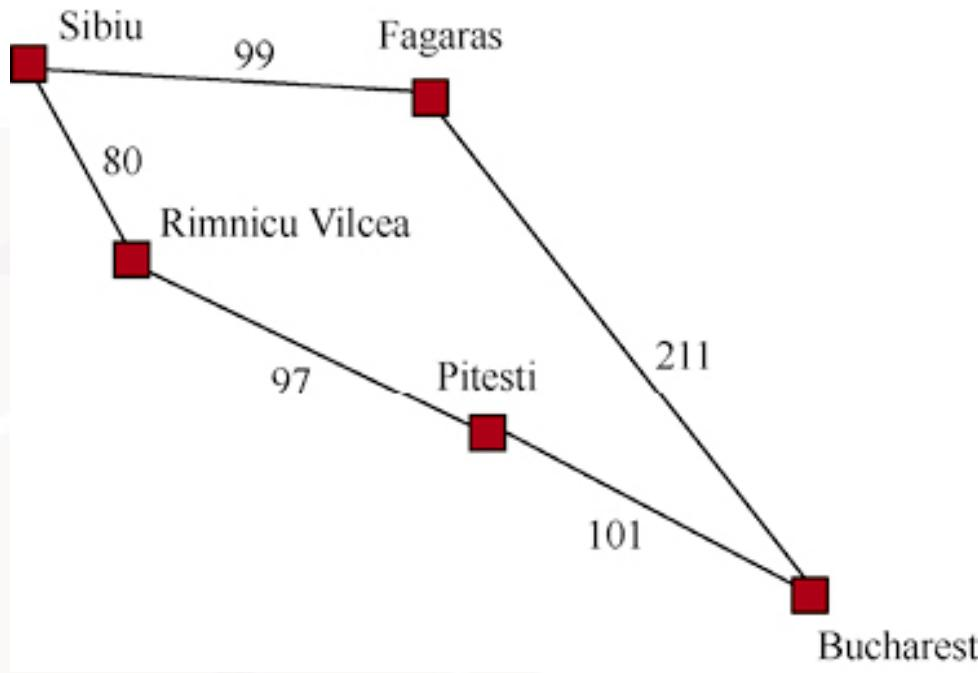  
授课教师：李静瑶

## 4 无信息搜索

## 一致代价搜索

function UNIFORM-COsT-SEARCH(problem)returns a solution,orfailure   
nodeanode with STATE=problem.INITIAL-STATE,PATH-COST=0   
frontier-aprioity queue ordered byPATH-CosT,with nodeas theonly element   
erplored←anempty set   
loopdo   
ifEMPrY?(frontier) thenreturn failure   
node-PoP(frontier) 1\*chooses the lowest-cost node in frontier \*/   
if problem.GOAL-TEST(node.STATE) then return SOLUTION(node)   
addnode.STATEto explored   
foreach action in problem.ACTIONs(node.STATE) do   
child-CHiLD-NoDE(problem,node,action)   
if child.STATE is not inexplored orfrontier then   
frontier-INSERT(child,frontier)   
else if child.STATE is in frontier with higher PATH-Cosr then   
replace that frontier node with child

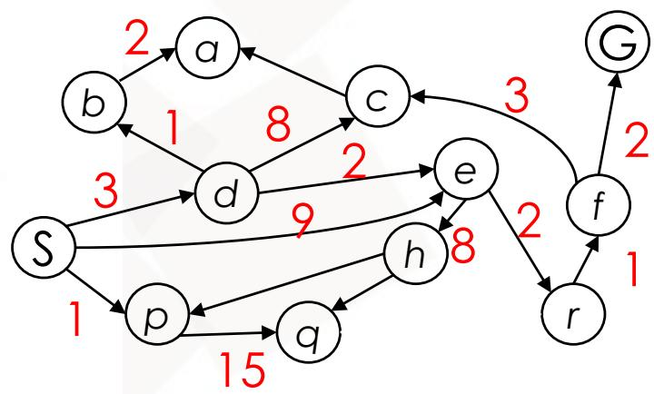

图3.14图的一致代价搜索。算法与图3.7给出的一般图搜索算法有不同，它使用了优先级队列并在边缘中的状态发现更小代价的路径时引入了额外的检查。边缘的数据结构需要支持有效的成员检测，这样它就结合了优先级队列和哈希表的能力

## 4无信息搜索-一致代价搜索

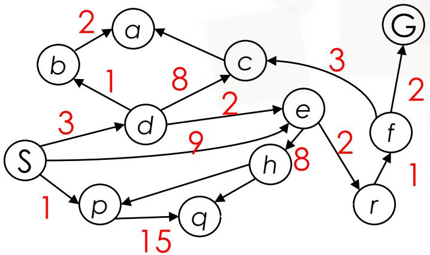  
授课教师：李静瑶

## 4无信息搜索

## 一致代价搜索

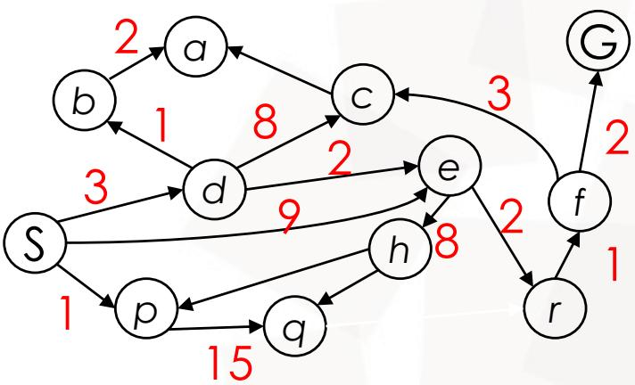  
授课教师：李静瑶

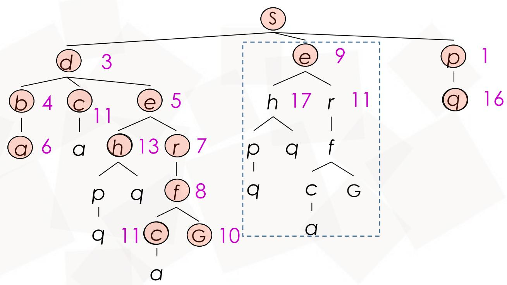

e的代价为9的节点会被更新成代价为5，从而代价为9的e节点不会被扩展

## 4 无信息搜索

## 一致代价搜索

完备性

·若存在代价值为0的动作NOOP，则可能陷入死循环，算法不完备

若b有限且动作的代价值均不为0，则算法完备

·最优性：最优，C\*表示最优解路径的代价值

时间复杂度

一致代价搜索>宽度优先搜索

·当动作代价值相同时，除了目标测试的时间点不同之外，一致代价搜索退化为宽度优先搜索

授课教师：李静瑶

## 4无信息搜索

## 深度优先搜索

扩展最深层的没有被扩展的节点

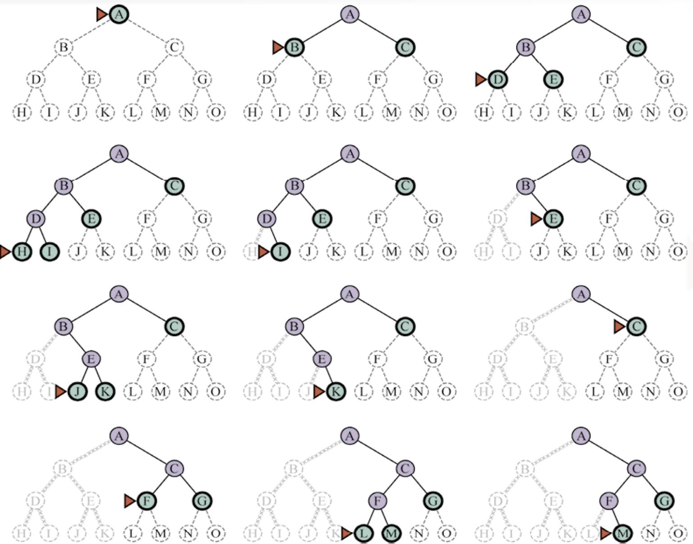  
授课教师：李静瑶

## 4 无信息搜索

## 深度优先搜索 (图搜索)

function DEPTH-FIRST-SEARCH(problem) returns a solution,or failure   
node-anode with STATE=problem.INITIAL-STATE,PATH-COST=0   
if pyobiem.GOAL-TEST(node.STATE) then return SOLUTION(node)   
frontier--a LiFO queue with node as the only element   
erplored-an empty set   
loopdo   
ifEMPTY?(frontier) thenreturn failure   
node--PoP(frontier)/\*chooses the shallowest node infrontier\*/   
add node.STATE to erplored   
foreach action in problem.AcTioNs(node.STATE) do   
child--CHILD-NoDE(problem,node,action)   
if child.STATEisnot in explored orfrontier then   
ifproblem.GOAL-TEST(child.STATE) then return SOLUTION(child)   
frontier--INsERT(child,frontier)  
授课教师：李静瑶

图3.11图的深度优先搜索

## 无信息搜索

## 深度优先搜索 (树搜索)

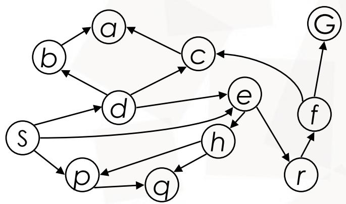

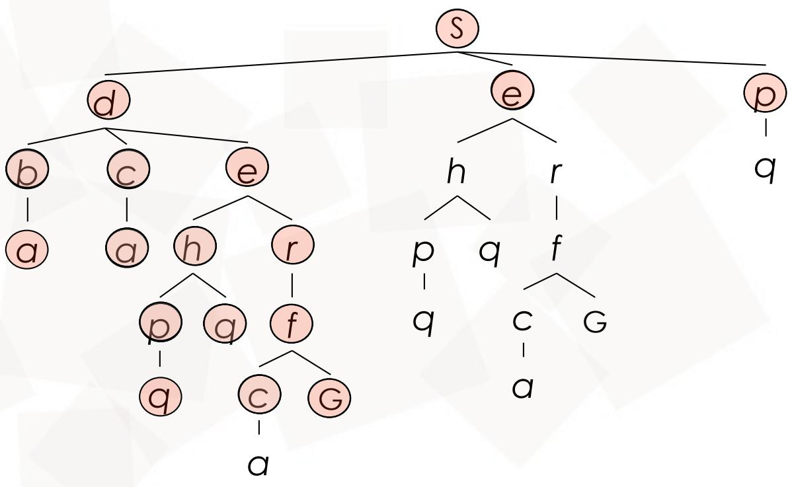  
授课教师：李静瑶

## 4无信息搜索

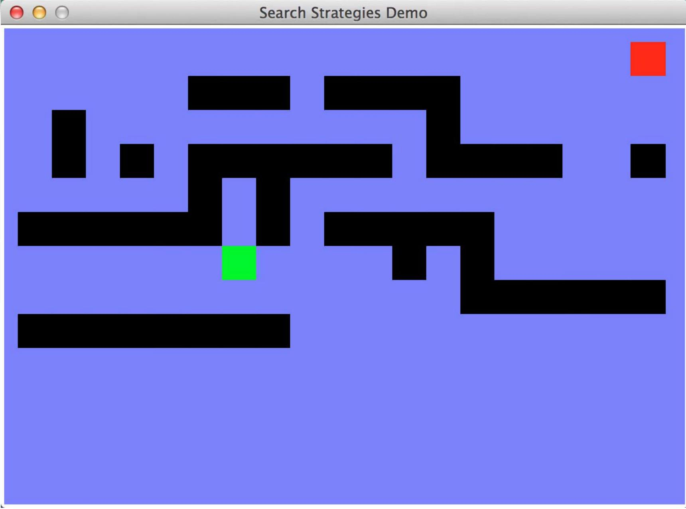  
授课教师：李静瑶

## 4 无信息搜索

  
授课教师：李静瑶

## 4 无信息搜索

## 深度优先搜索

完备性

有限状态空间上的图搜索，算法完备

无限状态空间上的图搜索，算法不完备，可能存在无限且无法到达目标结点的路径 (例：Donald Knuth猜想，一直执行阶乘动作)

? 树搜索，算法不完备，可能陷入死循环

最优性：非最优

## 4 无信息搜索

## 深度优先搜索

## 时间复杂度

，树搜索，最多生成0(bm)个结点，可能大于状态空间的规模，m可能是无限的 (m-节点的最大深度)

## 空间复杂度 (优势)

旻当一个结点的所有子结点均被探索，则该结点可以删除

仅需存储一条从根结点到叶结点的路径，以及该路径上每个结点的所有未被扩展的兄弟结点，0(bm)

授课教师：李静瑶

## 4 无信息搜索

## 回溯搜索

·每次扩展只生成一个子节点，而不是所有子节点

空间复杂度

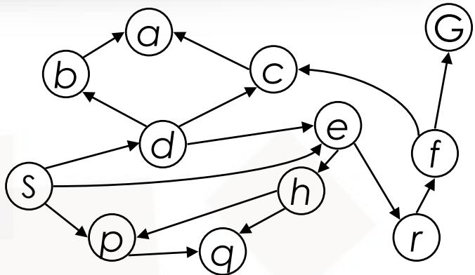

，每个被部分扩展的父节点要记住下一个要生成的子节点，保存0(m)个节点

·通过直接修改父节点生成子节点，保存1个初始状态描述和0(m)个动作

·为了回溯生成下一个子节点，必须能够撤销每次修改

授课教师：李静瑶

## 4 无信息搜索

## 深度受限搜索

·添加了深度界限t：深度为e的节点当做叶节点对待

完备性：当t<d时，算法不完备

时间复杂度： $0 ( b ^ { \ell } )$

空间复杂度： $0 ( b ^ { \ell } )$

·当ε=o时，深度受限搜索退化为深度优先搜索

授课教师：李静瑶

## 4无信息搜索

迭代加深搜索

function ITERATIVE-DEEPENING-SEARCH(problem) returns一个解节点或failure

for depth = O to ∞ do   
result ←DEPTH-LIMITED-SEARCH(problem,depth)   
if result ≠ cutoff then return result

function DEPTH-LIMITED-SEARCH(problem,l) returns一个解节点或failure或cutoff  
frontier ←一个LIFO队列（栈），其中一个元素为NoDE(problem.INITIAL)  
result ←failure  
While not Is-EMPTY(frontier) do  
node ←PoP(frontier)  
if problem.Is-GoAL(node.STATE) then return node  
if DEPTH(node)>l then  
result ← cutoff  
else if not Is-CYcLE(node) do  
for each child in ExPAND(problem, node) do  
将child添加到frontier  
return result  
授课教师：李静瑶

## 4 无信息搜索

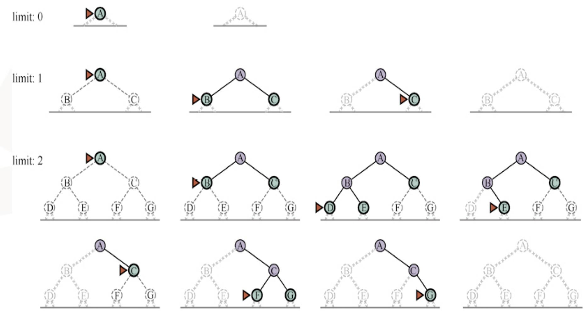  
授课教师：李静瑶

## 4无信息搜索

limit: 3

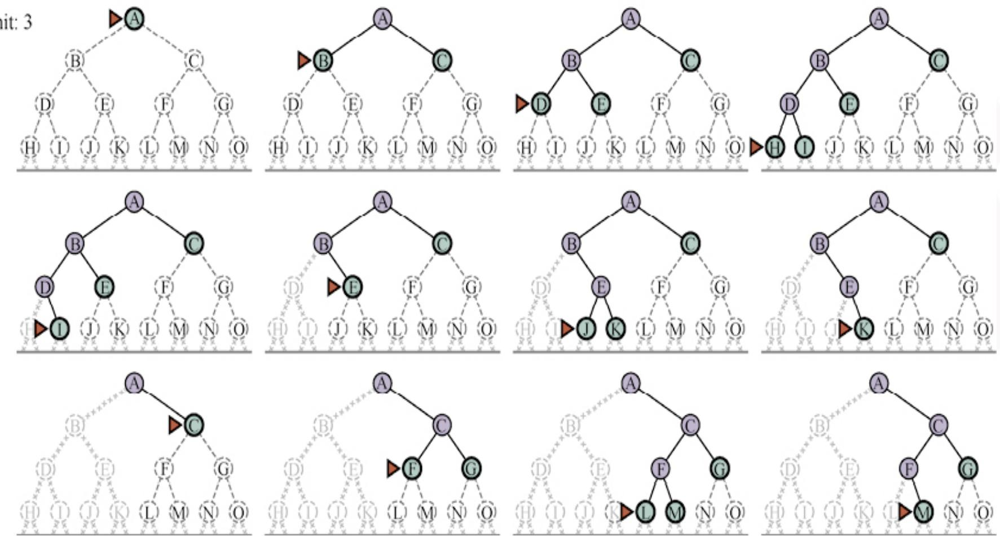  
授课教师：李静瑶

## 4无信息搜索

## 迭代加深搜索

完备性：若b有限，则算法完备

最优性：

若路径代价是节点深度的非递减函数，则算法最优

当动作代价值相同时，算法最优

·时间复杂度： $( d ) b ^ { 1 } + ( d - 1 ) b ^ { 2 } + ( d - 2 ) b ^ { 3 } + . . . + b ^ { d } = O ( b ^ { d } )$

空间复杂度： $O ( b d )$

授课教师：李静瑶

## 4 无信息搜索

## 双向搜索

·两个搜索同时运行：一个从初始状态向前搜索，另一个从目标状态向后搜索，直到状态相遇

目标测试：检查两个搜索的边界集是否相交

优点：搜索区域比深度优先搜索小

·限制：只能用在支持反向搜索的场合

最优性：非最优

·双向宽度优先搜索的时间复杂度： $O ( b ^ { d / 2 } )$

·双向宽度优先搜索的空间复杂度： $O ( b ^ { d / 2 } )$

授课教师：李静瑶

## 4无信息搜索

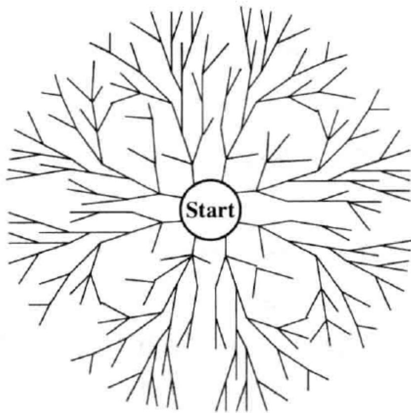

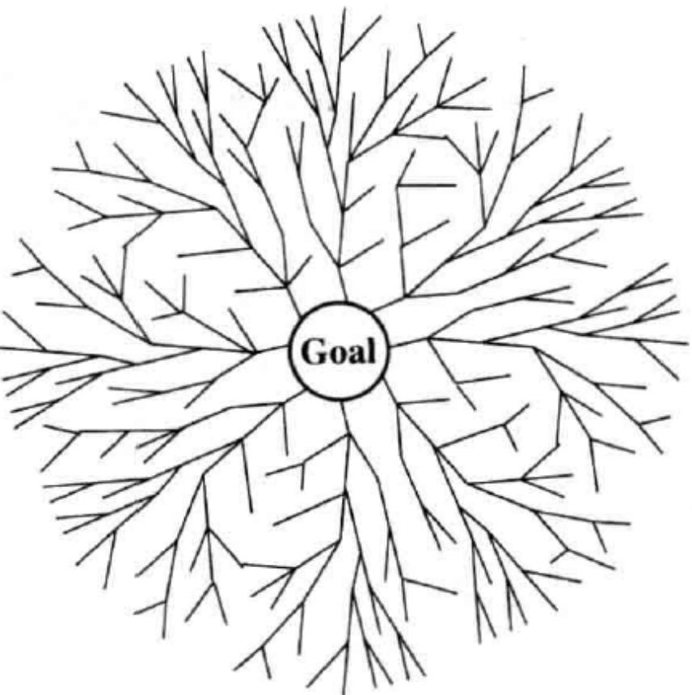  
图3.20即将成功的双向搜索的示意图，从起始结点发出的一个分支与从目标结点发出的一个分支即将相遇

授课教师：李静瑶

## 4 无信息搜索

双向最佳

## 优先搜索

function BIBF-SEARcH(problempfr problemg,fB) returns一个解节点或failure  
noder←NODE(problemINITIAL）//初始状态节点  
node←NoDE(problemp.INITIAL）//目标状态节点  
frontier←按f排序的优先队列，其中一个元素为noder  
frontier←按f排序的优先队列，其中一个元素为nodeB  
reachedp←一个查找表，其中一个条目的键是node.STArE且值是noder  
reached←一个查找表，其中一个条目的键是nodey.STATE且值是nodeB  
solution←failure  
while not TERMINATED(solution,frontierr, frontierB) do  
iff(ToP(frontier))<fs(ToP(frontierb)) then  
solution ←ProcEED(F,problem.,frontierF,reachedp,reachedg, solution)  
elsesolution ←PRocEED(B,problemg,frontier,reached,reached,solution)  
return solution  
function PRocEED(dir,problem,frontier,reached, reached,solution) returns一个角  
/在frontier上扩展节点，对照reached中的另一个边界  
//变量dir是方向：要么是F（代表正向），要么是B（代表反向）  
node ←PoP(frontier)  
for each child in ExPAND(problem, node) do  
s ← child.STATE  
if s不在 reached 中 or PATH-CosT(child)<PATH-CosT(reached[s]) then  
reached[s]←child  
将child添加到frontier  
if s不在reached中then  
solution←JoIN-NoDEs(dir,child,reached[s])  
if PATH-CosT(solution2)<PATH-CosT(solution) then  
solution ←solution  
return solution  
授课教师：李静瑶

## 4无信息搜索

## 无信息搜索策略对比

<table><tr><td>指标</td><td>广度优先</td><td>一致代价</td><td>深度优先</td><td>深度受限</td><td>迭代加深</td><td>双向（如适用）</td></tr><tr><td>完备性</td><td>是</td><td>是</td><td>否</td><td>否</td><td>是</td><td>是4</td></tr><tr><td>代价最优</td><td>是</td><td>是</td><td>否</td><td>否</td><td>是</td><td>是4</td></tr><tr><td>时间复杂性</td><td>0(6)</td><td>0(b1+10[(1）</td><td>0(b）</td><td>0(</td><td>0(69)</td><td>0(6</td></tr><tr><td>空间复杂性</td><td>0(69</td><td>0(b1+1c 1E1)</td><td>0(bm)</td><td>0（be）</td><td>0(bd)</td><td>0(b)</td></tr></table>

注：1如果b是有限的且状态空间要么有解要么有限，则算法是完备的。2如果所有动作的代价都≥ε>0，算法是完备的。3如果动作代价都相同，算法是代价最优的。4如果两个方向均使用广度优先搜索或一致代价搜索

授课教师：李静瑶