## 第3章有信息搜索

授课教师：李静瑶

授课教师：李静瑶

## 录

1 贪心最佳优先搜索

2 A\*搜索

3 内存受限搜索

4 启发式函数

## 0有信息搜索

## 最佳优先搜索

function BEsT-FIRsT-SEARCH(problem,f)returns一个解节点或failure  
node ←NODE(STATE=problem.INIIAL)评估函数f  
frontier←一个以f排序的优先队列，其中一个元素为node  
reached←一个查找表，其中一个条目的键为problem.INrrIAL，值为node  
whilenot Is-EMPTY(frontier) do  
node←PoP(frontier)  
if problem.Is-GoAL(node.STATE) thenreturn node  
foreachchildinExpAND(problem,node)do  
s←child.STATE  
if s不在reached中orchild.PATH-CosT<reached[s].PArH-CosT then  
reached[s]←child  
将child添加到frontier中  
return failure  
授课教师：李静瑶

## 0有信息搜索

评估函数

f(n) g(n)

当前实际代价

h(n)

后续估计代价

g(n)是从开始节点到当前节点n的实际代价

·h(n)是从当前节点n到目标节点的最优解的估计代价

f(n)是经过节点n的最优解的估计代价

授课教师：李静瑶

## 贪心最佳优先搜索

一致代价搜索：f(n) =g(n)

扩展路径代价g(n)最小的节点

·g(n)是从开始节点到当前节点n的实际路径代价

## 贪心最佳优先搜索：f(n) =h(n)

扩展启发式函数h(n)最小的节点

·h(n)是从当前节点n到目标节点的最小路径代价的估计值（启发式函数），若n为目标节点，则h(n)=0

授课教师：李静瑶

## 贪心最佳优先搜索

## 贪心最佳优先搜索

·扩展看起来最接近目标的节点,f(n)=h(n)

到Bucharest的直线距离
<table><tr><td>Arad</td><td>366</td><td>Mehadia</td><td>241</td></tr><tr><td>Bucharest</td><td>0</td><td>Neamt</td><td>234</td></tr><tr><td>Craiova</td><td>160</td><td>Oradea</td><td>380</td></tr><tr><td>Drobeta</td><td>242</td><td>Pitesti</td><td>100</td></tr><tr><td>Eforie</td><td>161</td><td>Rimnicu Vilcea</td><td>193</td></tr><tr><td>Fagaras</td><td>176</td><td>Sibiu</td><td>253</td></tr><tr><td>Giurgiu</td><td>77</td><td>Timisoara</td><td>329</td></tr><tr><td>Hirsova</td><td>151</td><td>Urziceni</td><td>80</td></tr><tr><td>Iasi</td><td>226</td><td>Vaslui</td><td>199</td></tr><tr><td>Lugoj</td><td>244</td><td>Zerind</td><td>374</td></tr></table>

授课教师：李静瑶

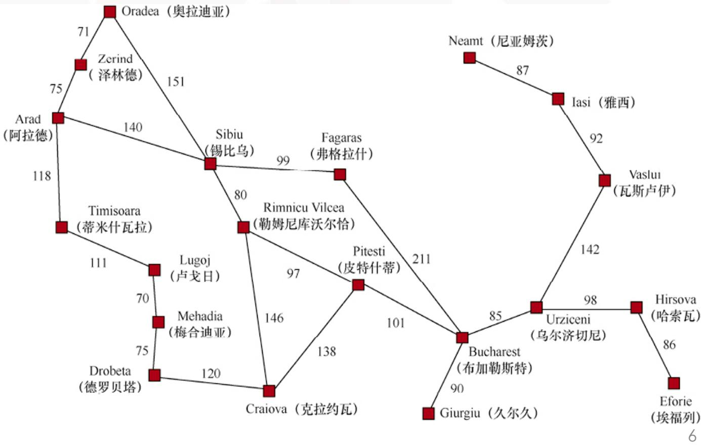

## 贪心最佳优先搜索

## 贪心最佳优先搜索

·扩展看起来最接近目标的节点,f(n)=h(n)

到Bucharest的直线距离
<table><tr><td>Arad</td><td>366</td><td>Mehadia</td><td>241</td></tr><tr><td>Bucharest</td><td>0</td><td>Neamt</td><td>234</td></tr><tr><td>Craiova</td><td>160</td><td>Oradea</td><td>380</td></tr><tr><td>Drobeta</td><td>242</td><td>Pitesti</td><td>100</td></tr><tr><td>Eforie</td><td>161</td><td>Rimnicu Vilcea</td><td>193</td></tr><tr><td>Fagaras</td><td>176</td><td>Sibiu</td><td>253</td></tr><tr><td>Giurgiu</td><td>77</td><td>Timisoara</td><td>329</td></tr><tr><td>Hirsova</td><td>151</td><td>Urziceni</td><td>80</td></tr><tr><td>Iasi</td><td>226</td><td>Vaslui</td><td>199</td></tr><tr><td>Lugoj</td><td>244</td><td>Zerind</td><td>374</td></tr></table>

授课教师：李静瑶

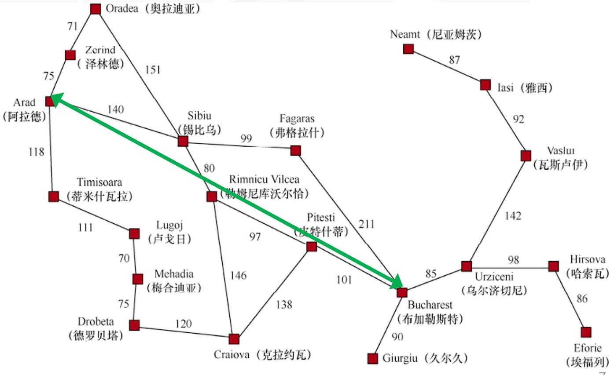

## 贪心最佳优先搜索

## 贪心最佳优先搜索

·扩展看起来最接近目标的节点,f(n)=h(n)

到Bucharest的直线距离
<table><tr><td>Arad</td><td>366</td><td>Mehadia</td><td>241</td></tr><tr><td>Bucharest</td><td>0</td><td>Neamt</td><td>234</td></tr><tr><td>Craiova</td><td>160</td><td>Oradea</td><td>380</td></tr><tr><td>Drobeta</td><td>242</td><td>Pitesti</td><td>100</td></tr><tr><td>Eforie</td><td>161</td><td>Rimnicu Vilcea</td><td>193</td></tr><tr><td>Fagaras</td><td>176</td><td>Sibiu</td><td>253</td></tr><tr><td>Giurgiu</td><td>77</td><td>Timisoara</td><td>329</td></tr><tr><td>Hirsova</td><td>151</td><td>Urziceni</td><td>80</td></tr><tr><td>Iasi</td><td>226</td><td>Vaslui</td><td>199</td></tr><tr><td>Lugoj</td><td>244</td><td>Zerind</td><td>374</td></tr></table>

授课教师：李静瑶

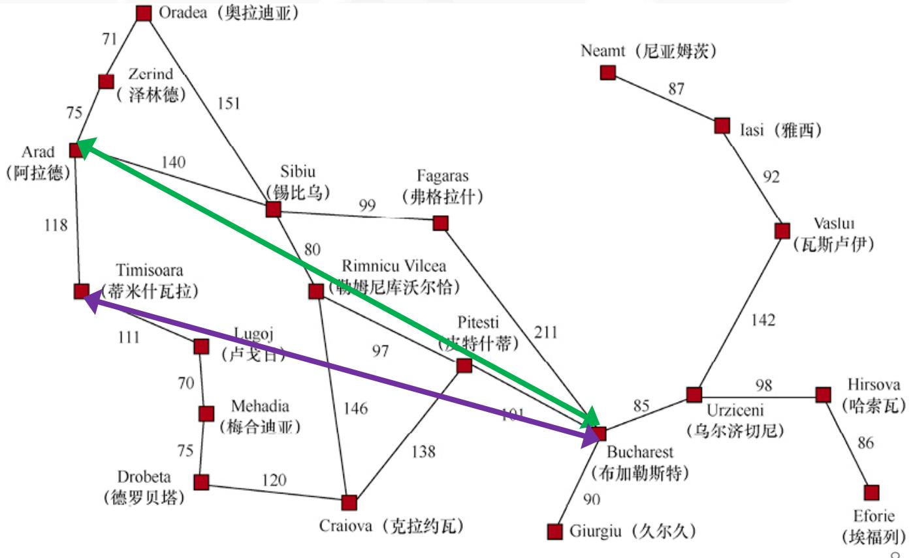

## 贪心最佳优先搜索

到Bucharest的直线距离

<table><tr><td>Arad</td><td>366</td><td>Mehadia</td><td>241</td></tr><tr><td>Bucharest</td><td>0</td><td>Neamt</td><td>234</td></tr><tr><td>Craiova</td><td>160</td><td>Oradea</td><td>380</td></tr><tr><td>Drobeta</td><td>242</td><td>Pitesti</td><td>100</td></tr><tr><td>Eforie</td><td>161</td><td>Rimnicu Vilcea</td><td>193</td></tr><tr><td>Fagaras</td><td>176</td><td>Sibiu</td><td>253</td></tr><tr><td>Giurgiu</td><td>77</td><td>Timisoara</td><td>329</td></tr><tr><td>Hirsova</td><td>151</td><td>Urziceni</td><td>80</td></tr><tr><td>Iasi</td><td>226</td><td>Vaslui</td><td>199</td></tr><tr><td>Lugoj</td><td>244</td><td>Zerind</td><td>374</td></tr></table>

授课教师：李静瑶

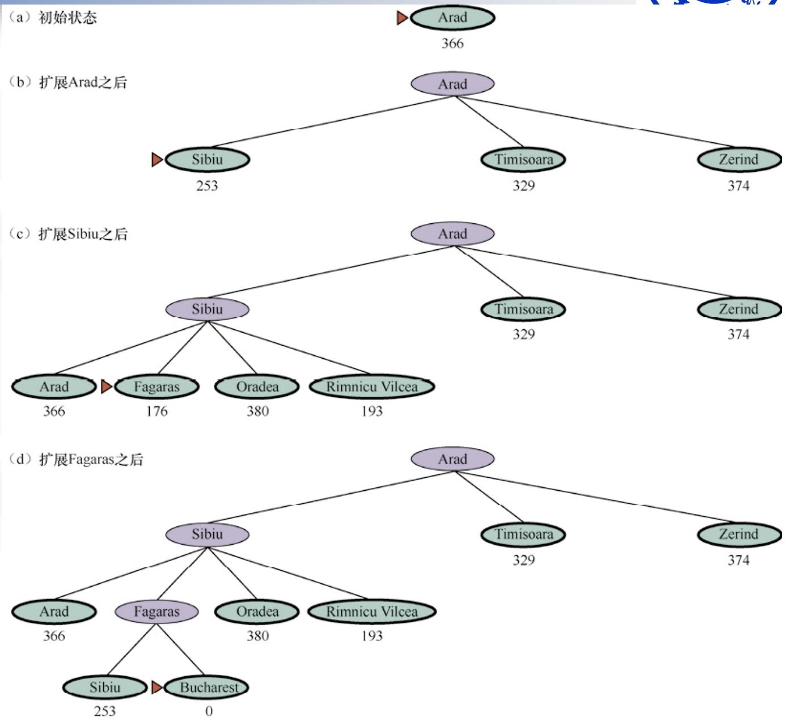

## 贪心最佳优先搜索

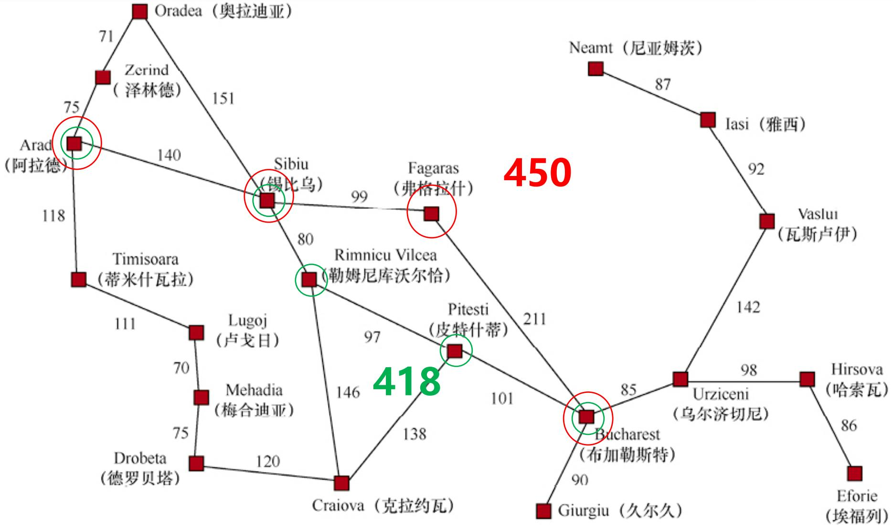  
授课教师：李静瑶

## 贪心最佳优先搜索

## 不足之处

贪心最佳优先搜索不是最优的

·启发函数代价最小化这一目标会对错误的起点比较敏感

·贪心最佳优先搜索有限状态空间完备，无限状态空间不完备

·可能沿着一条无限的路径走下去而不回来做其它的选择尝试，因此无法找

到最佳路径这一答案

授课教师：李静瑶

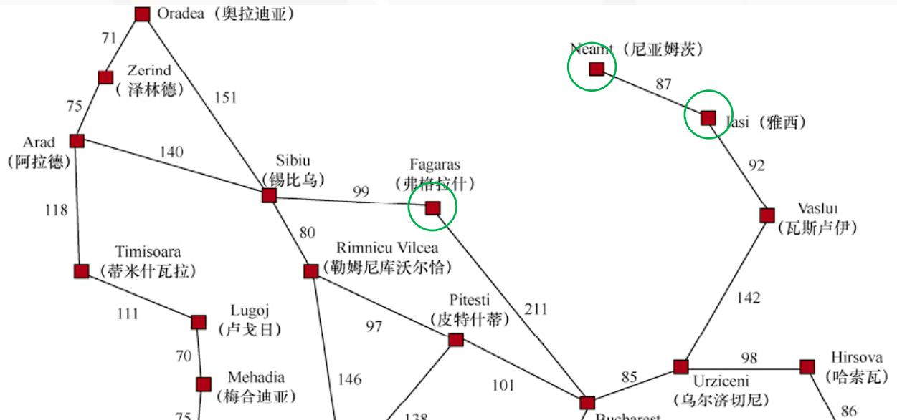

## A\*搜索

评估函数

f(n) g(n)

当前实际代价

h(n)

后续估计代价

g(n)是从开始节点到当前节点n的实际代价

·h(n)是从当前节点n到目标节点的最优解的估计代价

f(n)是经过节点n的最优解的估计代价

授课教师：李静瑶

## A\*搜索

评估函数

h(n)

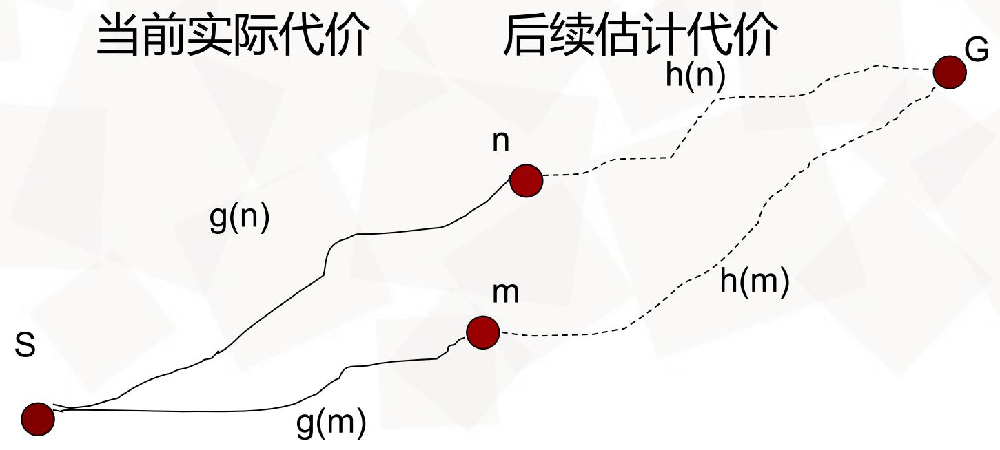

比较f(n)和f(m)大小，决定节点搜索顺序，即在Frontier表中的顺序

授课教师：李静瑶

## A\*搜索

## A\*搜索：一种最佳优先搜索

functionBEsT-FIRsT-SEARCH(problem,f)returns一个解节点或failure  
node+NODE(STATE=prOblem.INITIAL)  
frontier←一个以f排序的优先队列， 其中一个元素为node  
reached←一个查找表，其中一个条目的键为problem.INrrIAL，值为node  
while not Is-EMPTY(frontier) do  
node←PoP(frontier)  
if problem.Is-GoAL(node.STATE) thenreturn node  
foreach child in ExpAND(problem,node)do  
s←child.STATE  
if s不在reached中 or child.PATH-CosT<reached[s].PATH-CosT then  
reached[s]←child  
将child添加到frontier中  
returnfailure  
授课教师：李静瑶

## A\*搜索

## A\*搜索

function BEsT-FIRsT-SEARCH(problem,f) returns一个解节点或failurenode ←NODE(STATE=problem.INITIAL)frontier←一个以f排序的优先队列，其中一个元素为nodereached←一个查找表，其中一个条目的键为problem.INITIAL，值为nodewhile not Is-EMPTY(frontier) donode ←PoP(frontier)if problem.Is-GoAL(node.STATE) then return nodefor each child in ExPAND(problem,node) dos ←child.STATEif s不在reached中 or child.PATH-CosT<reached[s].PArH-CosT thenreached[s]←child将child添加到frontier中return failure

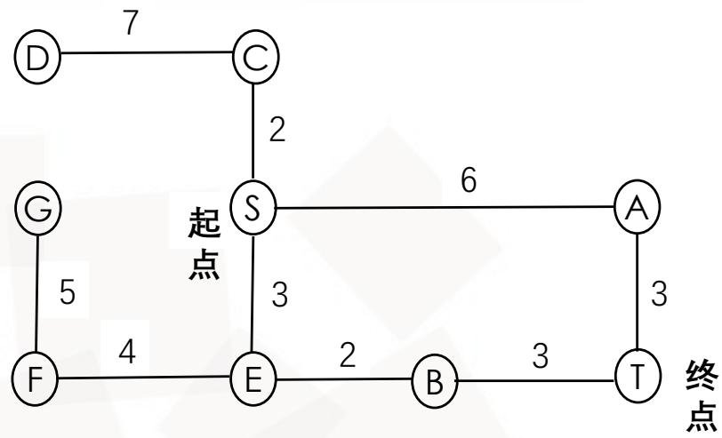

h(S)=6   
h(A)=3   
h(B)=1   
h(C)=8   
h(D)=13   
h(E)=4   
h(F)=7   
h(G)=12   
h(T)-0

授课教师：李静瑶

## A\*搜索

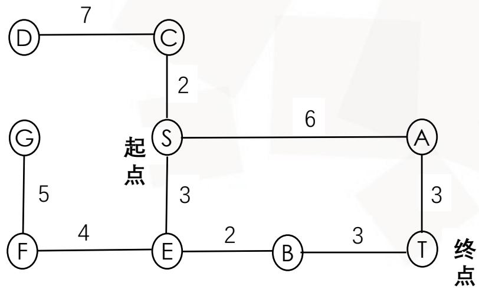

h(S)=6

h(A)=3

h(C)=8

h(F)=7

h(D)=13

h(G)=12

h(B)=1

h(E)=4

h(T)-0

授课教师：李静瑶

## A\*搜索

## A\*搜索

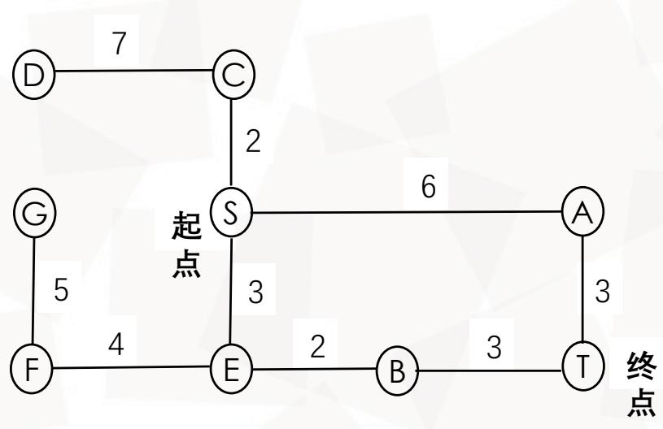

h(S)=6   
h(A)=3   
h(B)=1   
h(C)=8   
h(D)=13   
h(E)=4   
h(F)=7   
h(G)=12   
h(T)=0

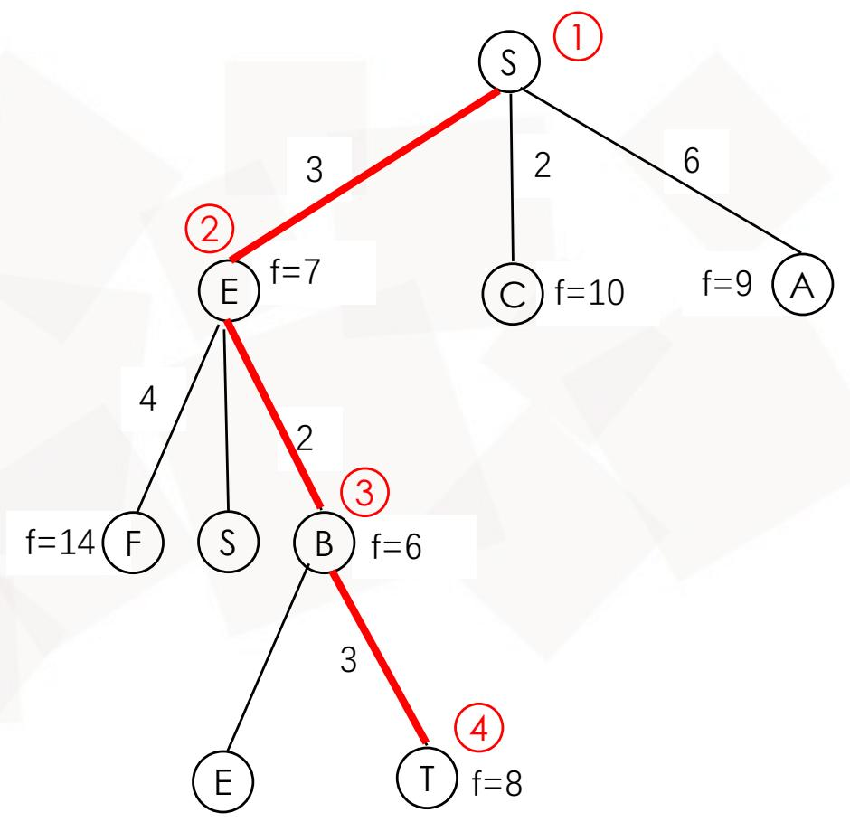  
授课教师：李静瑶

## A\*搜索

A\*: f(n)=g(n)+h(n)

<table><tr><td>Arad</td><td>366</td><td>Mehadia</td><td>241</td></tr><tr><td>Bucharest</td><td>0</td><td>Neamt</td><td>234</td></tr><tr><td>Craiova</td><td>160</td><td>Oradea</td><td>380</td></tr><tr><td>Drobeta</td><td>242</td><td>Pitesti</td><td>100</td></tr><tr><td>Eforie</td><td>161</td><td>Rimnicu Vilcea</td><td>193</td></tr><tr><td>Fagaras</td><td>176</td><td>Sibiu</td><td>253</td></tr><tr><td>Giurgiu</td><td>77</td><td>Timisoara</td><td>329</td></tr><tr><td>Hirsova</td><td>151</td><td>Urziceni</td><td>80</td></tr><tr><td>Iasi</td><td>226</td><td>Vaslui</td><td>199</td></tr><tr><td>Lugoj</td><td>244</td><td>Zerind</td><td>374</td></tr></table>

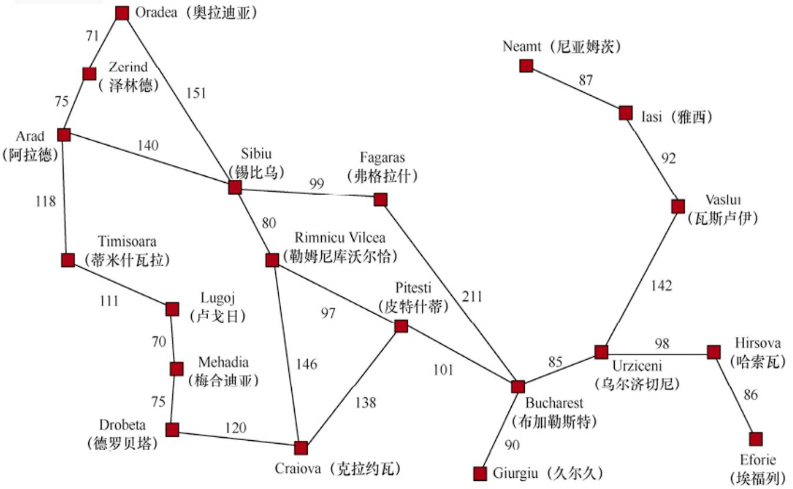  
授课教师：李静瑶

## A\*搜索

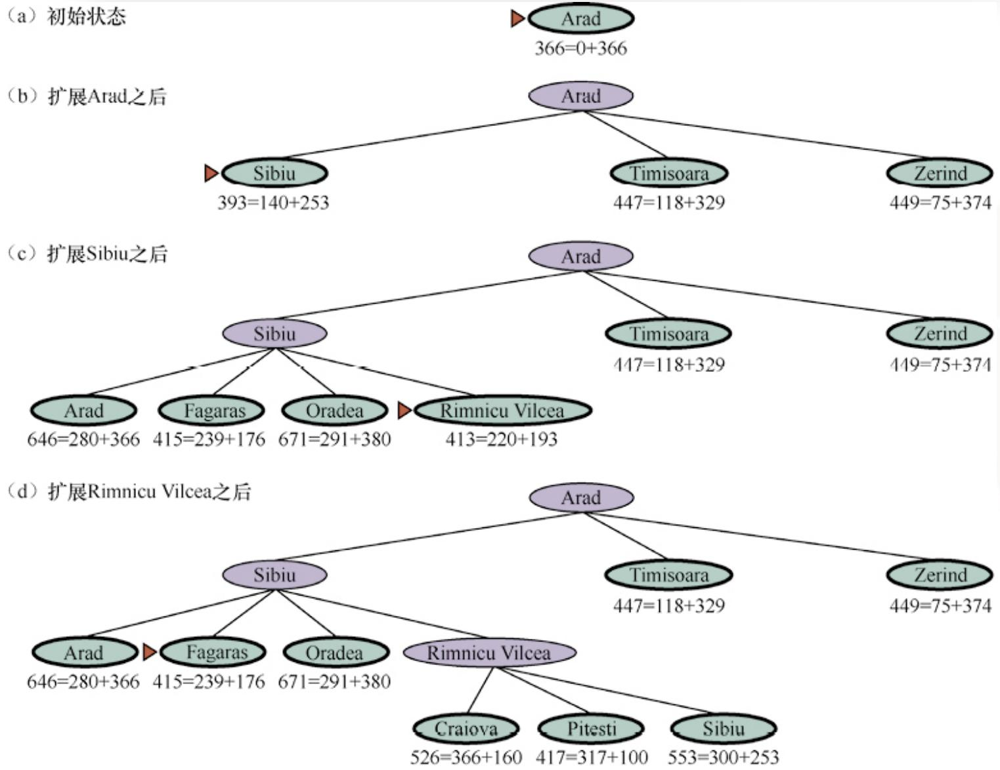  
授诛教帅：字睁瑶

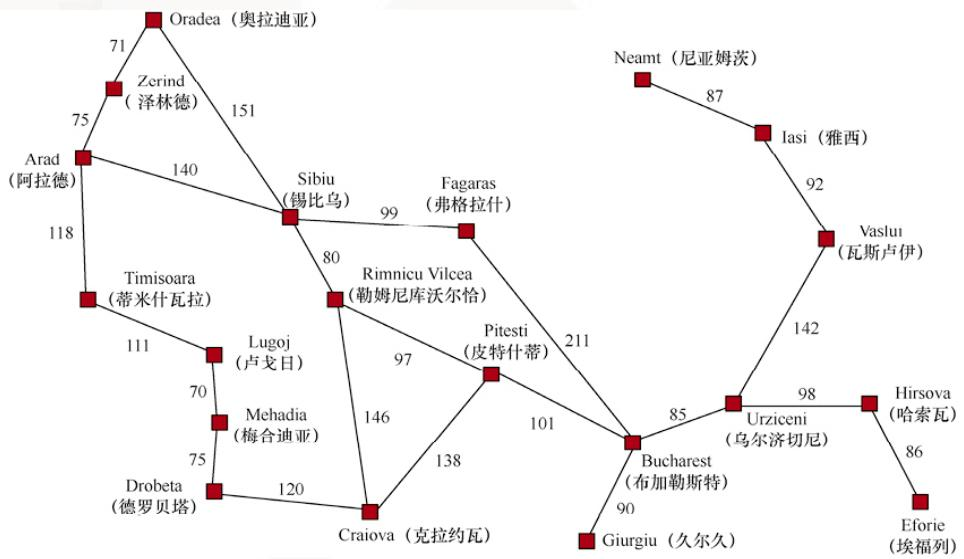

## A\*搜索

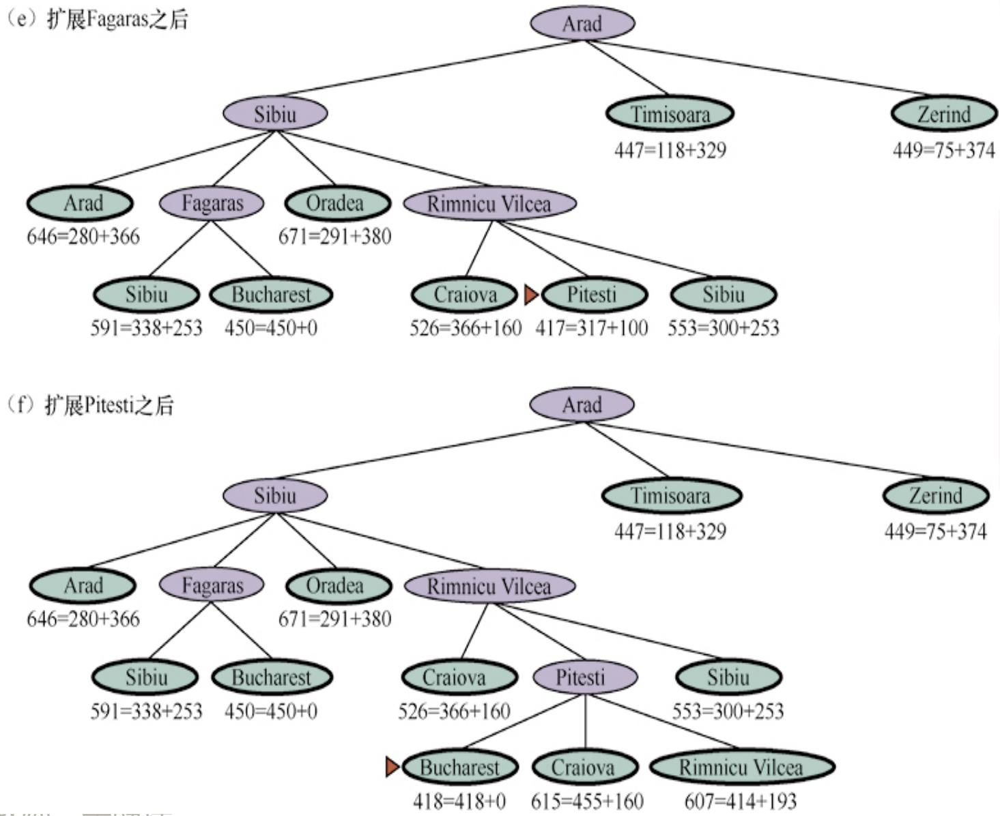

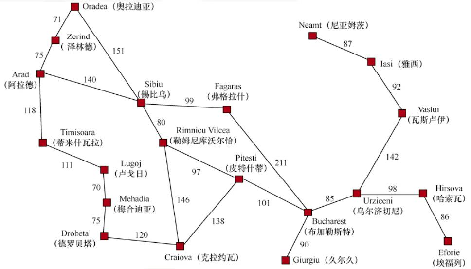  
授课丁盱咄

## A\*搜索

## 可容许性：

函数永远不会高估到达某个目标的代价 $\mathbf { h } ( \mathbf { n } ) \leq \mathbf { h } ^ { * } ( \mathbf { n } )$

·f(n)不会超过经过节点n的最优解的实际代价

·若h(n)是可容许的，则A搜索被称为A\*搜索，具有最优性

授课教师：李静瑶

## A\*搜索

## 可容许性：

反证法证明最优性。假设最优路径的代价为 $\mathbf { \nabla } \mathbf { C } ^ { * }$ ，但返回 $\ b { \mathrm { C } } > \ b { \mathrm { C } } ^ { * }$ ，那么最优路径上一定存在节点n未扩展。 $g ^ { * } ( n )$ 表示从起点到n的最优路径代价， $h ^ { * } ( n )$ 表示从n到最近目标的最优路径的代价。

<table><tr><td rowspan=1 colspan=1> $f ( n ) > C ^ { * }$ </td><td rowspan=1 colspan=1>否则n将是已扩展节点</td></tr><tr><td rowspan=1 colspan=1> $f ( n ) = g ( n ) + h ( n )$ </td><td rowspan=1 colspan=1>根据定义</td></tr><tr><td rowspan=1 colspan=1> $f ( n ) { = } g ^ { * } ( n ) + h ( n )$ </td><td rowspan=1 colspan=1>因为n在一条最优路径上</td></tr><tr><td rowspan=1 colspan=1> $f ( n ) \leq g ^ { * } ( n ) + h ^ { * } \left( n \right)$ </td><td rowspan=1 colspan=1>根据可容许行， $h ( n ) \leq h ^ { * } ( n )$ </td></tr><tr><td rowspan=1 colspan=1> $f ( n ) \leq C ^ { * }$ </td><td rowspan=1 colspan=1>根据定义，  $C ^ { * } { = } g ^ { * } \left( n \right) { + } h ^ { * } \left( n \right)$ </td></tr></table>

第一行与最后一行矛盾，“算法返回次优路径"的假设是错误的。

授课教师：李静瑶

## A\*搜索

## 一致性:

·对于任意节点n和通过动作a生成的后继结点n'，从n到达目标的估计代价不大于从n到n'的单步代价与从n到达目标的估计代价之和： $\mathrm { h ( n ) } \leq$ $\operatorname { c } ( \mathrm { n , a , n ^ { \prime } } ) + \mathrm { h } ( \mathrm { n ^ { \prime } } )$

·从n到达目标的估计代价是所有从n到达目标的代价的下界

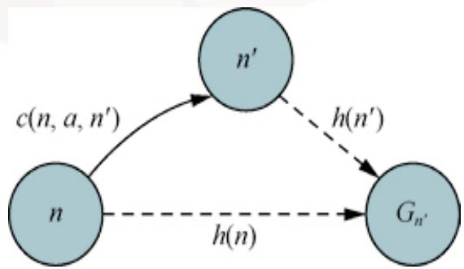  
授课教师：李静瑶

## A\*搜索

## 启发式函数- -直线距离：具有可容许性和一致性

·将直线距离作为启发函数h(n)，则启发函数一定是可容的，因为其不会高估开销代价

·g(n)是从起点到节点n的实际代价开销，且f(n)=g(n)+h(n)，因此f(n)不会高估经过节点n路径的实际开销

$\mathrm { h ( n ) } \le \mathrm { c ( n , a , n ^ { \prime } ) } + \mathrm { h ( n ^ { \prime } ) }$ 构成三角不等式，满足一致性

## 3 内存受限搜索

## 递归最佳优先搜索

模拟最佳优先搜索，但仅使用线性空间

f\_limit：从历史扩展节点得到的最优备选路径的f值

若当前节点的f值超过了f\_limit，递归将回到备选路径上

递归回溯时，用当前节点的子节点的最佳f值替换更新当前节点的f值，能记住遗忘的最佳子节点，用于决定以后是否需要重新扩展该子树

授课教师：李静瑶

## 3 内存受限搜索

## 递归最佳优先搜索

function RECURsIVE-BEsT-FIRST-SEARCH(problem) returns一个解或者failure   
solution,fvalue+RBFS(problem,NoDE(problem.INITIAL),)   
return solution   
functionRBFS(problem,node,f\_limit)returns一个解或failure，以及一个新的f代价限制   
if problem.Is-GoAL(node.STATE) thenreturn node   
succesSOrs+LIST(ExPAND(node))   
if successors为空then return failure,   
foreach sin successors do //用前一次搜索中的值更新f   
s.f←max(s.PArH-Cosr+ h(s), node.f)   
while true do   
best←successors中f值最低的节点   
if best.f>f\_limit thenreturnfailure,best.f   
alternative←successors中第二低的f值   
result,best.f←RBFS(problem,best,min(f\_limit,alternative))   
ifresult≠failure thenreturnresult,best.f  
授课教师：李静瑶

## 3 内存受限搜索

<table><tr><td>Arad</td><td>366</td><td>Mehadia Neamt</td><td>241 234</td></tr><tr><td>Bucharest</td><td>0</td><td> Oradea</td><td>380</td></tr><tr><td>Craiova</td><td>160</td><td>Pitesti</td><td>100</td></tr><tr><td>Drobeta Eforie</td><td>242</td><td> Rimnicu Vilcea</td><td></td></tr><tr><td>Fagaras</td><td>161 176</td><td>Sibiu</td><td>193 253</td></tr><tr><td>Giurgiu</td><td></td><td>Timisoara</td><td>329</td></tr><tr><td>Hirsova</td><td>77</td><td>Urziceni</td><td></td></tr><tr><td>Iasi</td><td>151</td><td>Vaslui</td><td>80</td></tr><tr><td></td><td>226</td><td></td><td>199</td></tr><tr><td>Lugoj</td><td>244</td><td>Zerind</td><td>374</td></tr></table>

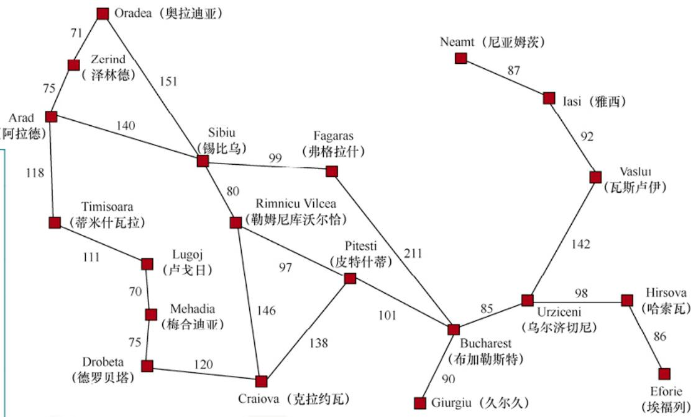  
授课教师：李静瑶

## 3内存受限搜索

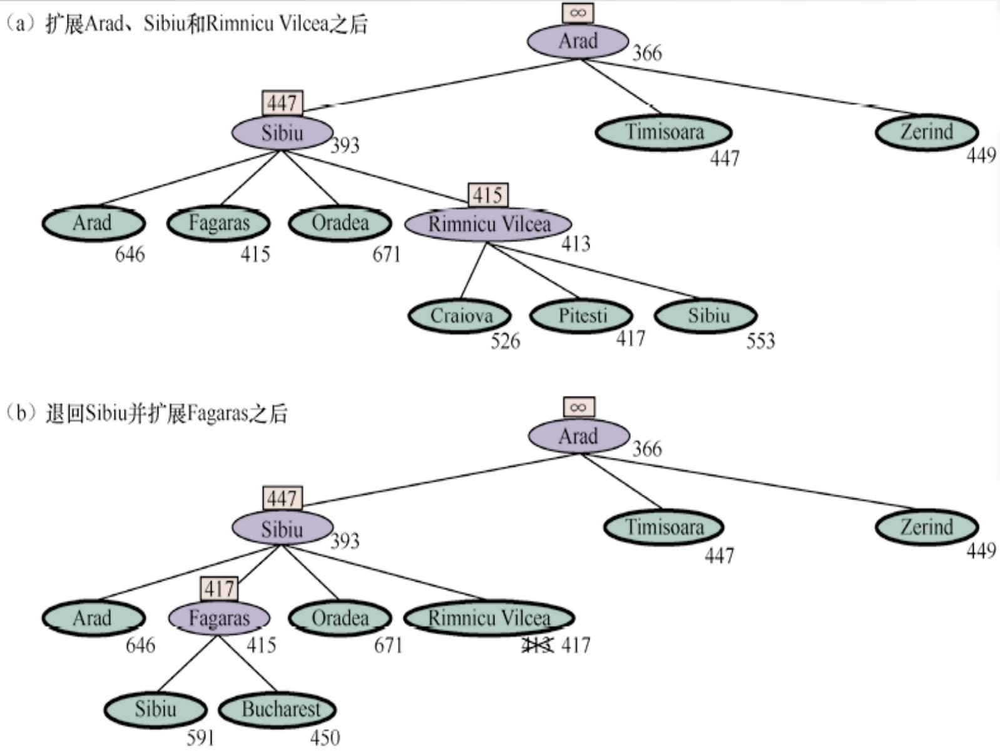  
授课教师：李静瑶

## 3内存受限搜索

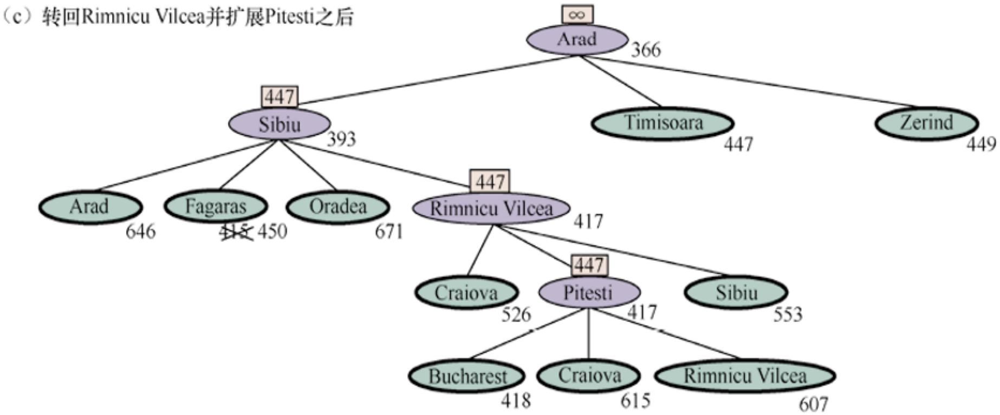  
授课教师：李静瑶

## 4 启发式函数

启发式函数的准确性

利用松弛问题设计启发式函数

利用子问题设计启发式函数

本节以八数码问题为例，探讨启发式函数的一般性质

授课教师：李静瑶

## 4 启发式函数

## 启发式函数的准确性

·描述启发式函数质量的方法：有效分支因子b\*

·若A\*算法的解路径长度为d，生成结点数为N，则b\*是深度为d的均衡搜索 树生成N+1个节点的有效分支因子，满足 $1 + \mathrm { b } ^ { * } + \mathrm { b } ^ { * 2 } + \ldots + \mathrm { b } ^ { * \mathrm { d } } = \mathrm { N } + 1$

·b\*越小越好（N越小越好），最好情况为1

目标：设计启发式函数，使得b\*尽可能的小

授课教师：李静瑶

## 4启发式函数

## 例：八数码问题

·一个3×3的棋盘上有8个数字滑块和一个空格。与空格相邻的滑块可以滑动到空格中 (状态数181400，15数码的状态10万亿)

游戏目标是要达到一个特定的状态

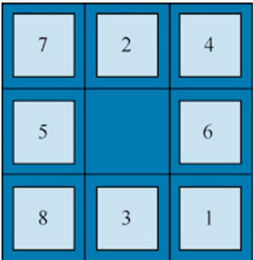  
开始状态

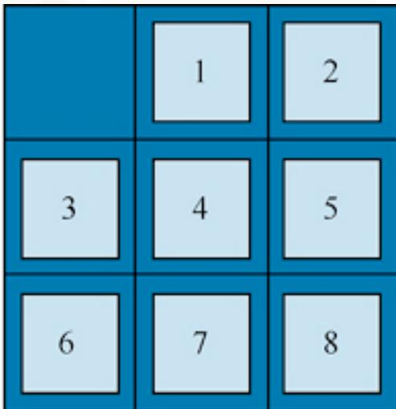  
目标状态

授课教师：李静瑶

## 4 启发式函数

## 两个常用的启发式函数

h1=不在位的滑块数（8)

·h2=所有滑块到其目标位置的Manhattan距离和（18)

·h1和h2均为可容许的，但求解性能不同 (最优解26)

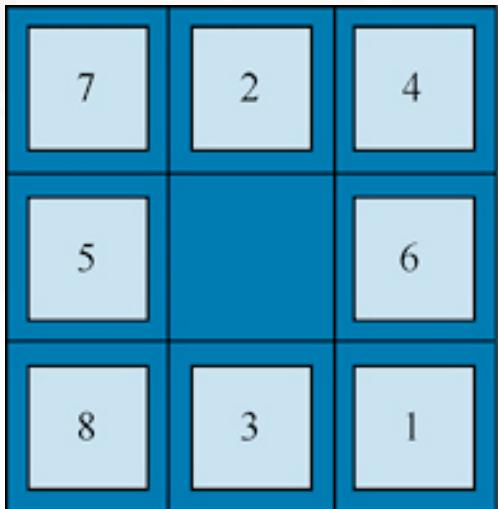  
开始状态

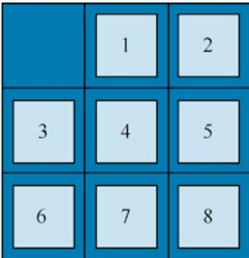  
目标状态  
授课教师：李静瑶

## 4启发式函数

<table><tr><td colspan="3">搜索代价：生成的节点数</td><td colspan="3">有效分支因子</td></tr><tr><td>d</td><td>BFS</td><td>A(h1) A(h2）</td><td>BFS</td><td> $\dot { \mathrm { \bf A ^ { \prime } } } ( h _ { 1 } )$ </td><td> $\dot { \mathrm { A ^ { ' } } } ( h _ { 2 } )$ </td></tr><tr><td>6</td><td>128</td><td>24</td><td>19</td><td>2.01</td><td>1.42 1.34</td></tr><tr><td>8</td><td>368</td><td>48 31</td><td>1.91</td><td>1.40</td><td>1.30</td></tr><tr><td>10</td><td>1033</td><td>116 48</td><td>1.85</td><td>1.43</td><td>1.27</td></tr><tr><td>12</td><td>2672</td><td>279</td><td>84 1.80</td><td>1.45</td><td>1.28</td></tr><tr><td>14</td><td>6783</td><td>678</td><td>174 1.77</td><td>1.47</td><td>1.31</td></tr><tr><td>16</td><td>17 270</td><td>1683</td><td>364</td><td>1.74</td><td>1.48 1.32</td></tr><tr><td>18</td><td>41 558</td><td>4102</td><td>751</td><td>1.72 1.49</td><td>1.34</td></tr><tr><td>20</td><td>91493</td><td>9905</td><td>1318</td><td>1.69</td><td>1.50 1.34</td></tr><tr><td>22</td><td>175 921</td><td>22 955</td><td>2548</td><td>1.66 1.50</td><td>1.34</td></tr><tr><td>24</td><td>290082</td><td>53039</td><td>5733</td><td>1.62 1.50</td><td>1.36</td></tr><tr><td>26</td><td>395355</td><td>110 372</td><td>10080</td><td>1.58</td><td>1.50 1.35</td></tr><tr><td>28</td><td>463234</td><td>202 565</td><td>22055</td><td>1.53</td><td>1.49 1.36</td></tr></table>

授课教师：李静瑶

## 4 启发式函数

## 占优

·对于任意结点n, $\mathtt { h } _ { 2 } ( \mathtt { n } ) \ge \mathtt { h } _ { 1 } ( \mathtt { n } )$ ，称 $\hphantom { 0 } \mathrm { I h } _ { 2 }$ 比 $\mathrm { \Delta } \mathrm { h } _ { 1 }$ 占优

·使用 $\mathbf { h } _ { 2 }$ 的 $\mathrm { A } ^ { \mathrm { i } }$ \*永远不会比使用 $\mathrm { h } _ { 1 }$ 的 $\mathbf { A } ^ { * }$ 扩展更多的节点

·每个满足 $\mathbf { f } ( \mathbf { n } ) { < } \mathbf { C } ^ { * }$ 的节点n必将被扩展，且f(n)=g(n)+h(n)，即每个满足h ${ \mathrm { ( n ) { < } C ^ { * } { \mathrm { - } } g ( n ) } }$ 的节点n必将被扩展

·采用 $\mathbf { h } _ { 2 }$ 的 $\mathrm { A }$ \*搜索扩展的结点必将被采用 $\mathrm { h } _ { 1 }$ 的 $\mathrm { A } ^ { \mathrm { i } }$ \*搜索扩展

授课教师：李静瑶

## 4启发式函数

## 从松弛问题出发设计启发式函数

松弛问题：减少动作限制的问题

八数码问题中，若允许滑块任意移动位置，而不只是移动到相邻位置，则h1是最短解的准确长度

八数码问题中，若允许滑块向任意方向移动，甚至移动到被其它滑块

占据的位置，则h2是最短解的准确长度

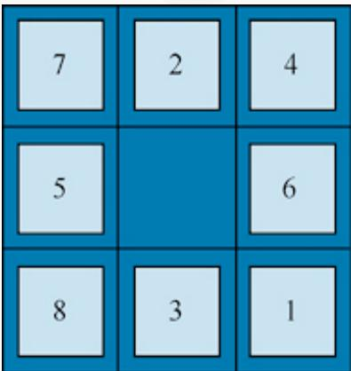  
开始状态  
授课教师：李静瑶

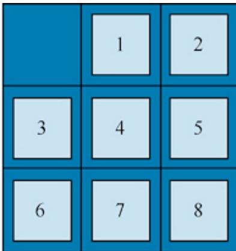  
目标状态

## 4 启发式函数

## 原问题与松弛问题的关联

减少动作限制导致状态空间图中边可能增加，故减少动作限制的松弛问题的状态空间图是原问题的状态空间图的超图

原问题的最优解是松弛问题的候选解，未必是松弛问题的最优解

松弛问题由于增加的边可能导致捷径，可能存在更好的解

松弛问题的最优解代价可以用作设计原问题的一个可容许的启发式函数

授课教师：李静瑶

## 4启发式函数

## 例：八数码问题的松弛问题

原问题：如果方格X与方格Y相邻，且Y是空格，那么滑块可以从方格X移动到方格Y

三个松弛问题：

如果方格X与方格Y相邻，那么滑块可以从方格X移动到方格Y

如果方格Y是空格，那么滑块可以从方格X移动到方格Y

滑块可以从方格X移动到方格Y

授课教师：李静瑶

## 4启发式函数

新的启发式函数的构造：

可容许的启发式集合 $\begin{array} { r } { \mathtt { h } _ { 1 } , \mathtt { h } _ { 2 } , \mathtt { h } _ { 3 } . } \end{array}$ 可以求解同一个问题，但差别不明显

$$
h ( n ) = \operatorname* { m a x } \{ h _ { 1 } ( n ) , \cdots , h _ { n } ( n ) \}
$$

$\mathtt { h } _ { 1 } , \mathtt { h } _ { 2 } , \mathtt { h } _ { 3 }$ ...均可容许，则h可容许

h $\mathtt { L h } _ { 1 } \mathtt { h } _ { 2 } , \mathtt { h } _ { 3 }$ ...均占优

授课教师：李静瑶

## 4 启发式函数

## 利用子问题的最优解代价设计启发式函数

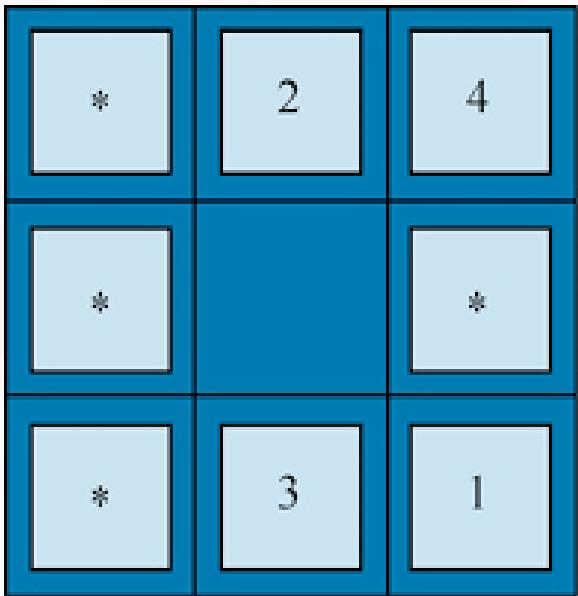  
开始状态

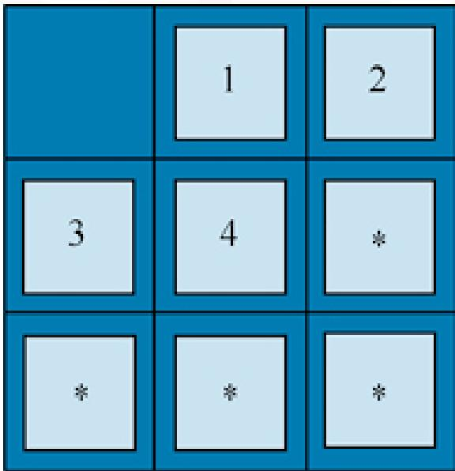  
目标状态  
授课教师：李静瑶

## 4启发式函数

## 基于模式数据库设计启发式函数

对所有可能的子问题实例存储解代价，建立模式数据库

对于原问题的每个完备状态，通过在模式数据库中查找相应的子问题，返回子问题的最优解代价作为启发式函数值

每个数据库对应一个可容许的启发式函数hpB

可以通过max设计新的可容许的启发式函数

不同子问题如果定义了不相交模式数据库，则启发式函数相加仍是可容许的

授课教师：李静瑶

## A\*搜索实例

## 例：八数码问题

一个3×3的棋盘上有8个数字棋子和一个空格。与空格相邻的棋子可以滑 动到空格中。

游戏目标是要达到一个特定的状态

<table><tr><td>4</td><td>3</td><td>1</td></tr><tr><td></td><td>5</td><td>2</td></tr><tr><td>6</td><td>7</td><td>8</td></tr></table>

初始状态

<table><tr><td></td><td>1</td><td>2</td></tr><tr><td>3</td><td>4</td><td>5</td></tr><tr><td>6</td><td>7</td><td>8</td></tr></table>

目标状态  
授课教师：李静瑶

## A\*搜索实例

## 例：八数码问题

评估函数f(n)=g(n)+h(n)

·g(n)表示结点n目前经过的移动次数，即其在搜索树中的深度h(n)表示每个数字棋子与目标位置的距离之和，满足可容许性和一致性

<table><tr><td>4</td><td>3</td><td>1</td></tr><tr><td></td><td>5</td><td>2</td></tr><tr><td>6</td><td>7</td><td>8</td></tr></table>

初始状态

<table><tr><td></td><td>1</td><td>2</td></tr><tr><td>3</td><td>4</td><td>5</td></tr><tr><td>6</td><td>7</td><td>8</td></tr></table>

目标状态  
授课教师：李静瑶