## 第4章复杂环境中的搜索

授课教师：李静瑶

授课教师：李静瑶

## 录

局部搜索

2 使用非确定动作的搜索

部分可观测的搜索

4 在线搜索

## 局部搜索

## 系统化搜索的全局搜索

经典搜索按照某种策略系统化地搜索状态空间

在搜索过程中，保留了当前路径中的每个节点的选择和相关信息

搜索完毕，当前路径就是问题的一个解

但在很多问题中，解仅仅是一个状态而不是到达该状态的路径例：八皇后问题，重要的是8个皇后在棋盘上的格局，而不是皇后的放置顺序

授课教师：李静瑶

## 局部搜索

## 非系统化搜索的局部搜索

非系统化搜索，可能永远不会探索问题的解实际所在的那部分搜索空间

局部搜索从当前状态出发，只能转移到它的邻近状态，不记录搜索路径，也不记录已达状态集 (reached)

优点:

·在系统化搜索不适用的大规模或无限状态空间中找到合理的解

空间复杂度较低

授课教师：李静瑶

## 局部搜索

## 局部搜索

也称最优化问题，根据目标函数找到最优状态

·爬山：目标函数越大越好，找到全局极大值

梯度下降：代价函数越小越好，找到全局极小值

授课教师：李静瑶

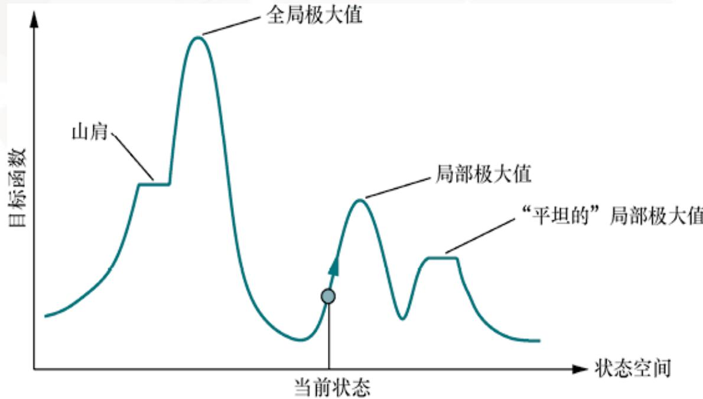

一维状态空间地形图

## 局部搜索

## 爬山搜索 (贪心局部搜索)

找到全局极大值

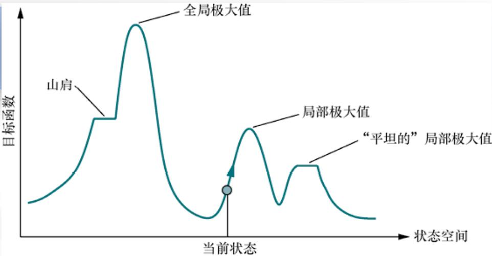

·只选择当前状态的最佳邻近状态，而不考虑全局情况

·不需要维护搜索树，当前节点只需记录当前状态和目标函数值

function HILL-CLIMBING(problem)returns一个位于局部极大值的状态currentproblem.INITIALwhile true doneighbor←current的值最大的后继状态ifVALUE(neighbor)≤VALUE(current) thenreturncurrentcurrent←neighbor

授课教师：李静瑶

## 局部搜索

## 例.八皇后问题

状态：棋盘上的一个棋局，表示棋盘上放置了8个皇后，且每列仅1个皇后

动作：某个皇后移动到该列的其它7个位置之-

每个状态有 $8 ^ { * } 7 { = } 5 6$ 个后继状态

启发式函数h：互相攻击的皇后对数

·求全局极小值，0表示没有互相攻击的皇后，找到解

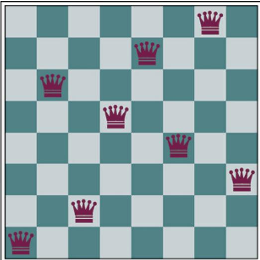  
授课教师：李静瑶

## 局部搜索

## 例.八皇后问题

图(a)的状态h=1，对应了一个局部极小值

当前状态非常接近于一个解，第4列和第7列的两个皇后会沿对角线互相攻击

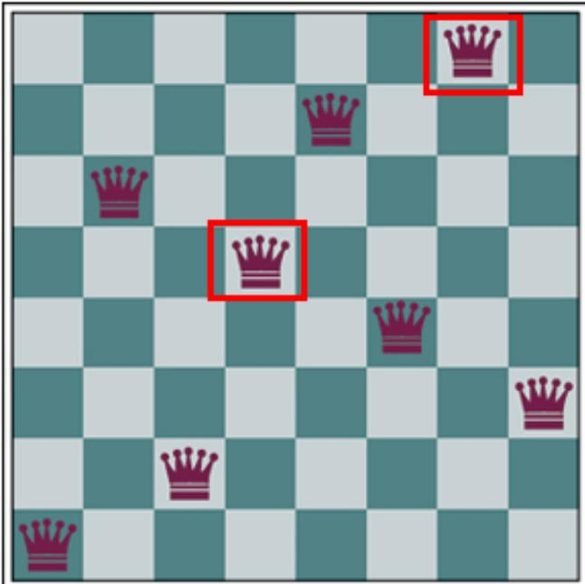  
（a）  
授课教师：李静瑶

## 局部搜索

## 例.八皇后问题

·一个8皇后状态，其启发式代价估计值h＝17

棋盘显示了通过在同一列移动皇后而获得的每一个可能后继的h

有8个移动并列最优，其h＝12。爬山法将选择它们中的一个

<table><tr><td rowspan=1 colspan=1>18</td><td rowspan=1 colspan=1>12</td><td rowspan=1 colspan=1>14</td><td rowspan=1 colspan=1>13</td><td rowspan=1 colspan=1>13</td><td rowspan=1 colspan=1>12</td><td rowspan=1 colspan=1>14</td><td rowspan=1 colspan=1>14</td></tr><tr><td rowspan=1 colspan=1>14</td><td rowspan=1 colspan=1>16</td><td rowspan=1 colspan=1>13</td><td rowspan=1 colspan=1>15</td><td rowspan=1 colspan=1>12</td><td rowspan=1 colspan=1>14</td><td rowspan=1 colspan=1>12</td><td rowspan=1 colspan=1>16</td></tr><tr><td rowspan=1 colspan=1>14</td><td rowspan=1 colspan=1>12</td><td rowspan=1 colspan=1>18</td><td rowspan=1 colspan=1>13</td><td rowspan=1 colspan=1>15</td><td rowspan=1 colspan=1>12</td><td rowspan=1 colspan=1>14</td><td rowspan=1 colspan=1>14</td></tr><tr><td rowspan=1 colspan=1>15</td><td rowspan=1 colspan=1>14</td><td rowspan=1 colspan=1>14</td><td rowspan=1 colspan=1>W</td><td rowspan=1 colspan=1>13</td><td rowspan=1 colspan=1>16</td><td rowspan=1 colspan=1>13</td><td rowspan=1 colspan=1>16</td></tr><tr><td rowspan=1 colspan=1>当</td><td rowspan=1 colspan=1>14</td><td rowspan=1 colspan=1>17</td><td rowspan=1 colspan=1>15</td><td rowspan=1 colspan=1>W</td><td rowspan=1 colspan=1>14</td><td rowspan=1 colspan=1>16</td><td rowspan=1 colspan=1>16</td></tr><tr><td rowspan=1 colspan=1>17</td><td rowspan=1 colspan=1>当</td><td rowspan=1 colspan=1>16</td><td rowspan=1 colspan=1>18</td><td rowspan=1 colspan=1>15</td><td rowspan=1 colspan=1>当</td><td rowspan=1 colspan=1>15</td><td rowspan=1 colspan=1>当</td></tr><tr><td rowspan=1 colspan=1>18</td><td rowspan=1 colspan=1>14</td><td rowspan=1 colspan=1></td><td rowspan=1 colspan=1>15</td><td rowspan=1 colspan=1>15</td><td rowspan=1 colspan=1>14</td><td rowspan=1 colspan=1>当</td><td rowspan=1 colspan=1>16</td></tr><tr><td rowspan=1 colspan=1>14</td><td rowspan=1 colspan=1>14</td><td rowspan=1 colspan=1>13</td><td rowspan=1 colspan=1>17</td><td rowspan=1 colspan=1>12</td><td rowspan=1 colspan=1>14</td><td rowspan=1 colspan=1>12</td><td rowspan=1 colspan=1>18</td></tr></table>

（b）

授课教师：李静瑶

## 局部搜索

## 例.八皇后问题

如果多个邻近状态h值均为最小值，随机选择一个邻近状态进行扩展

爬山法也称贪婪局部搜索，只选择当前状态的最佳邻近状态，而不考虑全局情况

<table><tr><td rowspan=1 colspan=1>18</td><td rowspan=1 colspan=1>0</td><td rowspan=1 colspan=1>14</td><td rowspan=1 colspan=1>13</td><td rowspan=1 colspan=1>13</td><td rowspan=1 colspan=1>Q</td><td rowspan=1 colspan=1>14</td><td rowspan=1 colspan=1>14</td></tr><tr><td rowspan=1 colspan=1>14</td><td rowspan=1 colspan=1>16</td><td rowspan=1 colspan=1>13</td><td rowspan=1 colspan=1>15</td><td rowspan=1 colspan=1>@</td><td rowspan=1 colspan=1>14</td><td rowspan=1 colspan=1>@</td><td rowspan=1 colspan=1>16</td></tr><tr><td rowspan=1 colspan=1>14</td><td rowspan=1 colspan=1>®</td><td rowspan=1 colspan=1>18</td><td rowspan=1 colspan=1>13</td><td rowspan=1 colspan=1>15</td><td rowspan=1 colspan=1>O</td><td rowspan=1 colspan=1>14</td><td rowspan=1 colspan=1>14</td></tr><tr><td rowspan=1 colspan=1>15</td><td rowspan=1 colspan=1>14</td><td rowspan=1 colspan=1>14</td><td rowspan=1 colspan=1>自</td><td rowspan=1 colspan=1>13</td><td rowspan=1 colspan=1>16</td><td rowspan=1 colspan=1>13</td><td rowspan=1 colspan=1>16</td></tr><tr><td rowspan=1 colspan=1>当</td><td rowspan=1 colspan=1>14</td><td rowspan=1 colspan=1>17</td><td rowspan=1 colspan=1>15</td><td rowspan=1 colspan=1>W</td><td rowspan=1 colspan=1>14</td><td rowspan=1 colspan=1>16</td><td rowspan=1 colspan=1>16</td></tr><tr><td rowspan=1 colspan=1>17</td><td rowspan=1 colspan=1>W</td><td rowspan=1 colspan=1>16</td><td rowspan=1 colspan=1>18</td><td rowspan=1 colspan=1>15</td><td rowspan=1 colspan=1>当</td><td rowspan=1 colspan=1>15</td><td rowspan=1 colspan=1>当</td></tr><tr><td rowspan=1 colspan=1>18</td><td rowspan=1 colspan=1>14</td><td rowspan=1 colspan=1>业</td><td rowspan=1 colspan=1>15</td><td rowspan=1 colspan=1>15</td><td rowspan=1 colspan=1>14</td><td rowspan=1 colspan=1>当</td><td rowspan=1 colspan=1>16</td></tr><tr><td rowspan=1 colspan=1>14</td><td rowspan=1 colspan=1>14</td><td rowspan=1 colspan=1>13</td><td rowspan=1 colspan=1>17</td><td rowspan=1 colspan=1>®</td><td rowspan=1 colspan=1>14</td><td rowspan=1 colspan=1>®</td><td rowspan=1 colspan=1>18</td></tr></table>

（b）  
授课教师：李静瑶

## 局部搜索

<table><tr><td rowspan=1 colspan=1>18</td><td rowspan=1 colspan=1>12</td><td rowspan=1 colspan=1>14</td><td rowspan=1 colspan=1>13</td><td rowspan=1 colspan=1>13</td><td rowspan=1 colspan=1>12</td><td rowspan=1 colspan=1>14</td><td rowspan=1 colspan=1>14</td></tr><tr><td rowspan=1 colspan=1>14</td><td rowspan=1 colspan=1>16</td><td rowspan=1 colspan=1>13</td><td rowspan=1 colspan=1>15</td><td rowspan=1 colspan=1>12</td><td rowspan=1 colspan=1>14</td><td rowspan=1 colspan=1>12</td><td rowspan=1 colspan=1>16</td></tr><tr><td rowspan=1 colspan=1>14</td><td rowspan=1 colspan=1>12</td><td rowspan=1 colspan=1>18</td><td rowspan=1 colspan=1>13</td><td rowspan=1 colspan=1>15</td><td rowspan=1 colspan=1>12</td><td rowspan=1 colspan=1>14</td><td rowspan=1 colspan=1>14</td></tr><tr><td rowspan=1 colspan=1>15</td><td rowspan=1 colspan=1>14</td><td rowspan=1 colspan=1>14</td><td rowspan=1 colspan=1>W</td><td rowspan=1 colspan=1>13</td><td rowspan=1 colspan=1>16</td><td rowspan=1 colspan=1>13</td><td rowspan=1 colspan=1>16</td></tr><tr><td rowspan=1 colspan=1>当</td><td rowspan=1 colspan=1>14</td><td rowspan=1 colspan=1>17</td><td rowspan=1 colspan=1>15</td><td rowspan=1 colspan=1>W</td><td rowspan=1 colspan=1>14</td><td rowspan=1 colspan=1>16</td><td rowspan=1 colspan=1>16</td></tr><tr><td rowspan=1 colspan=1>17</td><td rowspan=1 colspan=1>自</td><td rowspan=1 colspan=1>16</td><td rowspan=1 colspan=1>18</td><td rowspan=1 colspan=1>15</td><td rowspan=1 colspan=1>自</td><td rowspan=1 colspan=1>15</td><td rowspan=1 colspan=1>普</td></tr><tr><td rowspan=1 colspan=1>18</td><td rowspan=1 colspan=1>14</td><td rowspan=1 colspan=1>W</td><td rowspan=1 colspan=1>15</td><td rowspan=1 colspan=1>15</td><td rowspan=1 colspan=1>14</td><td rowspan=1 colspan=1>当</td><td rowspan=1 colspan=1>16</td></tr><tr><td rowspan=1 colspan=1>14</td><td rowspan=1 colspan=1>14</td><td rowspan=1 colspan=1>13</td><td rowspan=1 colspan=1>17</td><td rowspan=1 colspan=1>12</td><td rowspan=1 colspan=1>14</td><td rowspan=1 colspan=1>12</td><td rowspan=1 colspan=1>18</td></tr></table>

（b）

h=17  
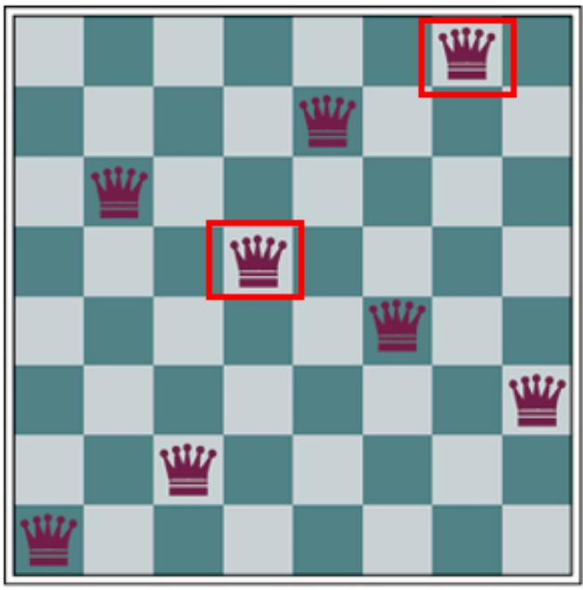  
（a）

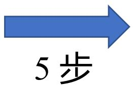  
h=1 (局部极小)

授课教师：李静瑶

## 局部搜索

## 爬山搜索陷入困境

平台区:

平坦的局部极大值：不存在上坡的出口

山肩：存在上坡的出口

局部极大值：比每个相邻状态高但比全局 极大值低的峰顶

允许横向移动：最佳邻近节点与当前节点的目标函数值相同（限制连续横向移动的次数)

  
授课教师：李静瑶

## 局部搜索

## 爬山搜索的变体

随机爬山法：随机选择邻近状态，被选中概率与上坡陡峭程度有关

首选爬山法：不断随机地生成后继状态，直到生成一个比当前状态更好的后继状态为止

随机重启爬山法：随机生成初始状态，执行一系列爬山搜索，反复进行，直到目标被找到或搜索次数达到一定限制

授课教师：李静瑶

## 局部搜索

## 例：旅行商问题

·一个旅行商需要遍历所有城市，找到所有遍历的最短路径 (回路)

旅行商经过每个城市恰好一次，相当于所有城市的一个序列 (路径)

求解方案：基本爬山法

随机爬山法

  
授课教师：李静瑶

## 局部搜索

## 状态x：当前路径

初始状态 $\mathrm { \dot { \mathbf { x } } } _ { 0 }$ ：随机选择的任意路径

邻近状态 $\mathrm { \Delta } \cdot \mathbf { X } _ { \mathrm { n } }$ ：当前路径选择任意两个城市交换访问次序得到的新路径

邻域P：当前路径的邻近状态集评估函数h(x)：当前路径的距离

若两城市无路径，设其距离为 $+ \infty$ 状态之间的比较方式

·比较当前路径和任一新路径的距离

  
授课教师：李静瑶

## 局部搜索

## 基本爬山法

假设从城市a出发，用城市的序列表示该问题的一个可能解

初始状态：随机选择初始可能解  
Xo=abcdea  
f(xo)=+∞0

  
授课教师：李静瑶

## 局部搜索

## 第1次搜索 (基本爬山法)

$\scriptstyle \mathbf { X } _ { 0 } = \mathbf { a b c d e a }$ 的邻域

P={acbdea, adcbea, aecdba, abdcea, abedca, abceda}

·从P中选择f值最小的元素$\scriptstyle \begin{array} { c c } { \scriptstyle < \mathbf { f } ( \mathbf { x } _ { 0 } ) = + \infty } \end{array}$

更新 $\scriptstyle \mathbf { \bar { x } } _ { 0 } = \operatorname { a c b d e a }$

  
授课教师：李静瑶

## 局部搜索

## 第2次搜索 (基本爬山法)

$\scriptstyle \mathbf { X } _ { 0 } = \operatorname { a c b d e a }$ 的邻域

P={abcdea, adbcea, aebdca, acdbea, acedba, acbeda}

·从P中选择f值最小的元素 $\cdot$ $< \mathrm { f } ( \mathrm { x } _ { 0 } ) { = } 3 2$

更新 $\scriptstyle { \dot { \mathtt { \Gamma } } } \mathbf { X } _ { 0 } = \mathbf { a d b c e a }$

授课教师：李静瑶

## 局部搜索

## 第3次搜索 (基本爬山法)

$\scriptstyle \mathbf { X } _ { 0 } = \operatorname { a d b c e a }$ 的邻域

P={abddea, acbdea, aebcda, adcbea,

adecba, adbeca}

对P中所有元素 $\cdot$

$\mathrm { f } ( \mathrm { x } _ { \mathrm { n } } ) { > } \mathrm { f } ( \mathrm { x } _ { 0 } ) { = } 2 9$ 算法结束

搜索结果

$$
\mathrm { \Delta x _ { 0 } = a d b c e a , \quad f ( x _ { 0 } ) = } 2 9
$$

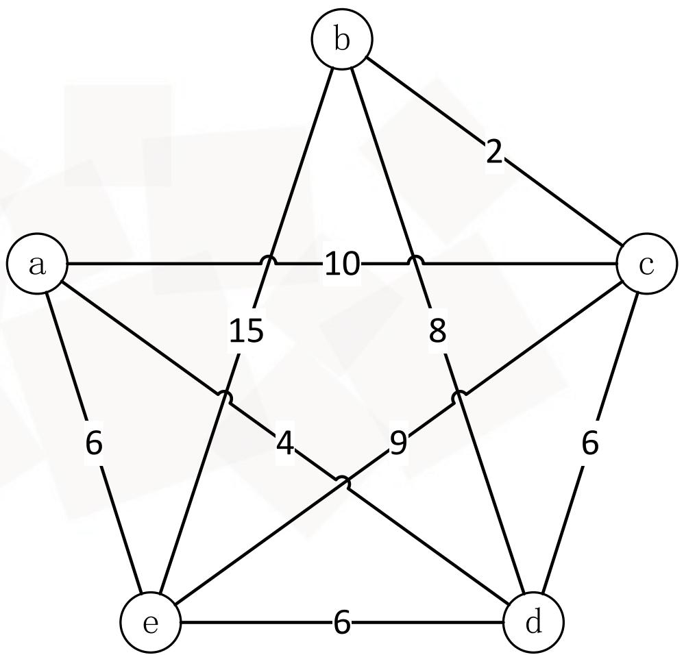  
授课教师：李静瑶

## 局部搜索

## 随机爬山法

假设从城市a出发，用城市的序列表示该问题的一个可能解

初始状态：随机选择初始可能解  
Xo=abcdea  
f(xo)=+∞0

  
授课教师：李静瑶

## 局部搜索

## 第1次搜索 (随机爬山法)

$\scriptstyle \mathbf { X } _ { 0 } = \mathbf { a b c d e a }$ 的邻域

P={acbdea, adcbea, aecdba, abdcea, abedca, abceda}

·从P中随机选择一个元素 $\cdot$ $\mathrm { f ( x _ { n } ) } { = } 3 2 { < } \mathrm { f ( x _ { 0 } ) } { = } { + } \infty$

更新 $\scriptstyle \mathbf { \bar { x } } _ { 0 } = \operatorname { a c b d e a }$

  
授课教师：李静瑶

## 局部搜索

第2次搜索 (随机爬山法)

$\mathrm { x _ { 0 } } \mathrm { = a c b d e a }$ 的邻域

P={abcdea, adbcea, aebdca, acdbea, acedba, acbeda}

从P中随机选择一个元素$\mathrm { x _ { n } } \mathrm { = a b c d e a } , \mathrm { f ( x _ { n } ) = + \infty > f ( x _ { 0 } ) = 3 2 }$

·更 新 P={adbcea， aebdca， acdbea,acedba, acbeda}

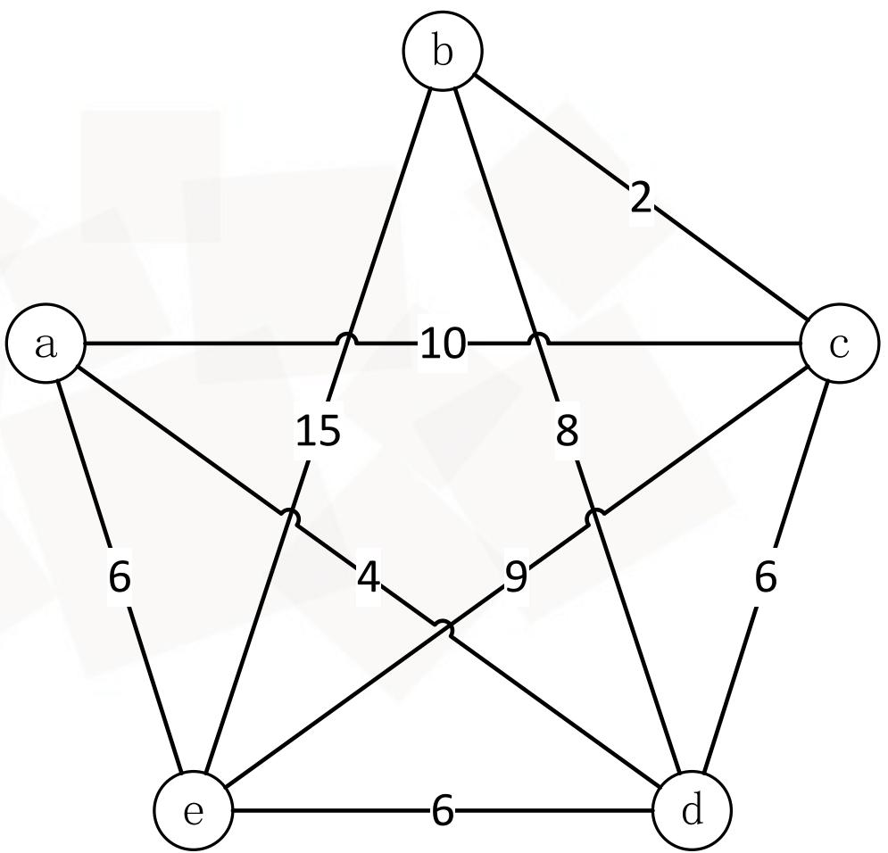  
授课教师：李静瑶

## 局部搜索

## 第3次搜索 (随机爬山法)

$\mathrm { x _ { 0 } } \mathrm { = a c b d e a }$ 的邻域

P={adbcea, aebdca, acdbea, acedba, acbeda}

·从P中随机选择一个元素 $\mathtt { X } _ { \mathrm { n } } = \mathtt { a d b c e a }$ $\scriptstyle \mathrm { f } ( \mathbf { x } _ { \mathrm { n } } ) = 2 9 < \mathbf { f } ( \mathbf { x } _ { 0 } ) = 3 2$

更新 $\mathrm { x } _ { 0 } { = } \mathrm { a d b c e a }$

  
授课教师：李静瑶

## 局部搜索

## 第4次搜索 (随机爬山法)

$\mathrm { x } _ { 0 } \mathrm { = a d b c e a }$ 的邻域

P={abdcea, acbdea, aebcda, adcbea, adecba, adbeca}

·从P中随机选择一个元素 $\mathtt { X } _ { \mathrm { n } } \mathrm { = a b d c e a }$ ${ \bf \nabla } > { \bf f } ( { \bf x } _ { 0 } ) { = } 2 9$

·更新 $\mathrm { P } { = } \{ \mathrm { a c b d e a }$ ，aebcda，adcbea, adecba, adbeca}

  
授课教师：李静瑶

## 局部搜索

## 第5次搜索 (随机爬山法)

$\mathrm { x } _ { 0 } \mathrm { = a d b c e a }$ 的邻域

P={acbdea, aebcda, adcbea, adecba, adbeca}

·从P中随机选择一个元素 $\mathrm { \mathbf { X } _ { n } } \mathrm { = a c b d e a }$ $\scriptstyle \mathrm { f } ( \mathbf { x } _ { \mathrm { n } } ) = 3 2 > \mathrm { f } ( \mathbf { x } _ { 0 } ) = 2 9$

·更新 $\mathrm { P } { = } \{ \mathrm { a e b c d a }$ ，adcbea，adecba, adbeca}

  
授课教师：李静瑶

## 局部搜索

## 第6次搜索 (随机爬山法)

$\mathrm { x } _ { 0 } { = } \mathrm { a d b c e a }$ 的邻域

P={aebcda, adcbea, adecba, adbeca}

·从P中随机选择一个元素 $\mathrm { x _ { n } } \mathrm { = a e b c d a }$ $\mathrm { f ( x _ { n } ) } { = } 3 3 { > } \mathrm { f ( x _ { 0 } ) } { = } 2 9$

更新 $\mathrm { P = \{ a d c b e a } $ , adecba, adbeca}

  
授课教师：李静瑶

## 局部搜索

## 第7次搜索 (随机爬山法)

$\mathrm { x } _ { 0 } { = } \mathrm { a d b c e a }$ 的邻域

P={adcbea, adecba, adbeca}

·从P中选择随机选择一个元素$\cdot \mathrm {  ~ \gamma ~ } > \mathrm { f } ( \mathrm { x } _ { 0 } ) = 2 9$

更新 P={adecba, adbeca}

  
授课教师：李静瑶

## 局部搜索

第8次搜索 (随机爬山法)

$\mathrm { x } _ { 0 } { = } \mathrm { a d b c e a }$ 的邻域

P={adecba, adbeca}

·从P中随机选择一个元素 $^ -$ $\mathrm { f ( x _ { n } ) } { = } { + } \infty { > } \mathrm { f ( x _ { 0 } ) } { = } 2 9$

更新 $\mathrm { P = \{ a d b e c a \} }$

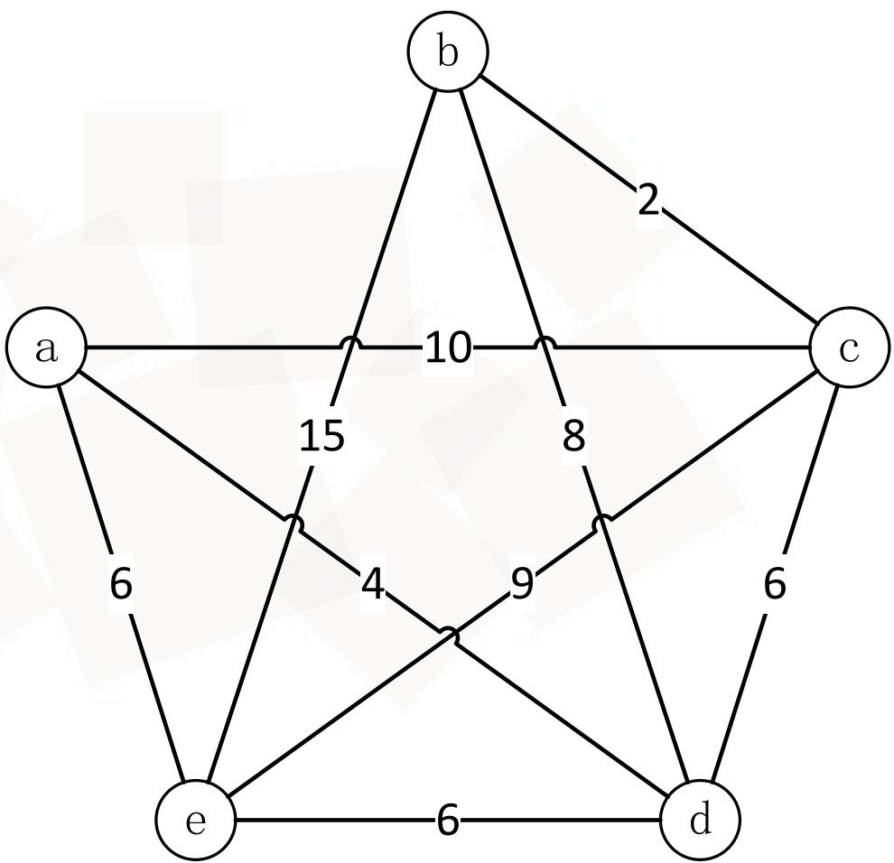  
授课教师：李静瑶

## 局部搜索

第9次搜索 (随机爬山法)

$\mathrm { x } _ { 0 } { = } \mathrm { a d b c e a }$ 的邻域

$$
\scriptstyle \mathrm { P = \{ a d b e c a \} }
$$

·从P中随机选择一个元素 $\mathtt { X } _ { \mathrm { n } } = \mathtt { a d b e c a }$ $\scriptstyle \mathrm { f } ( \mathbf { x } _ { \mathrm { n } } ) = 4 6 > \mathbf { f } ( \mathbf { x } _ { 0 } ) = 2 9$

更新 $P { = } \{ \}$ ，算法结束

搜索结果

$$
\mathrm { \mathbf { x } } _ { 0 } { = } \mathrm { a d b c e a } , \quad \mathrm { f } ( \mathrm { \mathbf { x } } _ { 0 } ) { = } 2 9
$$

授课教师：李静瑶

## 局部搜索

## 模拟退火搜索

·退火：冶金学中，通过将金属和玻璃加热到高温然后逐渐冷却的方法，使材料达到低能量结晶态以进行回火或硬化的过程

类似将乒乓球放入一个崎岖表面的最深裂缝中

如果只是让球滚动，它会停在一个局部极小值

如果晃动平面，乒乓球会从局部极小值中弹出来，也许会落入更深的局部极小值

·需要控制晃动幅度：晃动足够小以使球从局部极小值中弹出，但又不能太大使其无法从全局最小值弹出

授课教师：李静瑶

## 局部搜索

## 模拟退火搜索

高温加热：猛烈晃动

逐渐降温：逐渐降低晃动幅度

·允许“暂时接受劣解”：与传统爬山法不同，模拟退火在迭代过程中可以以一定概率接受比当前解更差的解，从而避免陷入局部最优

温度参数（T）控制随机性：

·高温阶段：算法倾向于接受更多劣解，广泛探索解空间

·低温阶段：算法逐渐收敛，类似传统爬山法，仅在局部改进

授课教师：李静瑶

## 局部搜索

## 模拟退火搜索

·后继状态的目标函数值更优，则接受，否则以小于1的概率接受

function SIMULATED-ANNEALING(problem,schedule) returns一个解状态   
current+problem.INITIAL   
for t=1 to ∞ do   
T←schedule(t)   
if T=0 then return current   
next←current的一个随机选择的后继状态   
△E←VALUE(current)-VALUE(next)   
if△E>0 then current next   
else current next仅以e的概率  
授课教师：李静瑶

## 局部搜索

## 局部束搜索

记录k个状态

·从k个随机生成的状态开始，每步生成k个状态的所有后继状态。如果其中任意一个是目标状态，算法停止；否则只选取k个最佳后继状态，重复上述过程

与k个随机重启不同：

随机重启，每个搜索进程独立运行

·局部束搜索，有用信息将在并行的搜索线程之间传递，算法将很快放弃那些没有效果的搜索并把资源转移到取得最大进展的路径上

授课教师：李静瑶

## 局部搜索

## 随机束搜索

局部束搜索的变体

随机选取k个后继状态，状态的选择概率与状态的目标函数值成正比，增加多样性

授课教师：李静瑶

## 局部搜索

## 随机束搜索的变体 遗传算法

·生物学中，一个由个体 (状态）组成的种群，其中最适应环境 (值最高)的个体可以生成后代（后继状态）来繁衍下一代，这个过程被称为重组

通过两个状态的结合生成后继状态

·种群：目前的所有状态，从k个随机状态开始

·个体：每个状态，有限字母表上的一个字符串

八皇后问题：八位数字符串

·适应度函数：目标函数，求全局极大值

·八皇后问题：互不攻击的皇后对数，最优解适应度为28

授课教师：李静瑶

## 局部搜索

## 遗传算法

## 选择---杂交--突变

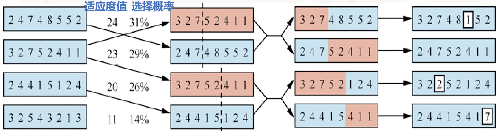  
（a）初始种群  
（b）适应度函数  
（c）选择  
（d）杂交  
（e）突变  
授课教师：李静瑶

## 局部搜索

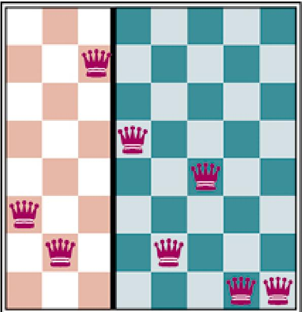

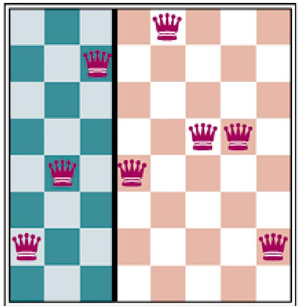

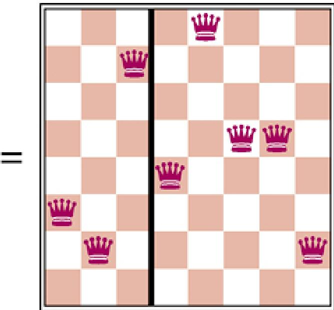

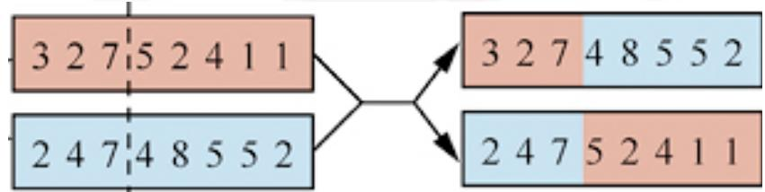  
(1是最下面一行，8是最上面一行)  
授课教师：李静瑶

## 局部搜索

function GENETIC-ALGORITHM(population,fitness) returns一个个体

repeat

weights ←WEIGHTED-BY(population,fitness)

population2←空列表

for i= 1 to SizE( population) do

parent1,parent2 ←WEIGHTED-RANDOM-CHOICEs(population,weights,2)

child ←REPRODUCE(parent1,parent2)

if (小的随机概率) thenchild ←MuTATE(child)

将child添加到population2中

population ←population2

until某个个体足够适应，或者已经经过了足够长的时间

return 依据fitness选出的population中的最优个体

function REPRODUCE(parent1,parent2) returns一个个体

n ←LENGTH(parent1)

c←从1到n的随机数

return APPEND(SUBSTRING(parent1,1,c),SUBSTRING(parent2,c+ 1,n))

授课教师：李静瑶

## 局部搜索

·精英主义：下一代的构成，可能只包括新形成的后代，也可能包括上一代中得分最高的个体

·淘汰：丢弃所有分数低于给定阈值的个体，使得进化加速

模式：某些位未确定的子串

模式246\*\*\*\*\*表示前三个皇后分别位于位置2、4、6的所有八皇后状态

实例：与模式相匹配的字符串 如24613578

·如果某一模式实例的平均适应度高于平均值，那么该模式的实例数量将随着时间推移而不断增加

授课教师：李静瑶

## 使用非确定动作的搜索

·之前假定环境是完全可观测的、确定性的、已知的

“我现在位于 $\mathbf { \dot { s } } _ { 1 }$ 状态，如果我执行动作a，我将会进入 $\mathbf { \nabla } \cdot \mathbf { s } _ { 2 } \mathbf { \cdot }$ 状态”

·使用非确定动作的搜索：当动作是不确定的，感知信息可以确定智能体执行动作的效果

“我现在位于 $\mathbf { \dot { s } } _ { 1 }$ 或 ${ \bf S } _ { 3 } .$ 状态，如果我执行动作a，我将会进入 $. \mathbf { s } _ { 2 }$ 、 ${ \bf S } _ { 4 }$ 或 $\mathbf { \sigma } _ { S _ { 5 } }$ 状态”

信念状态：智能体认为其

可能位于的物理状态集合

授课教师：李静瑶

## 使用非确定动作的搜索

## 例.不稳定的真空吸尘器世界

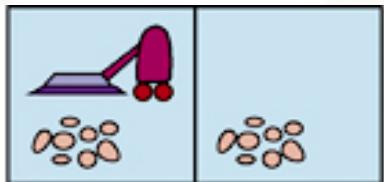

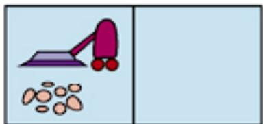

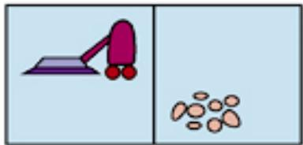

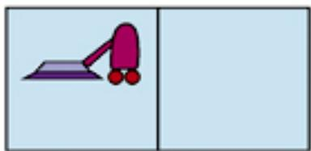  
授课教师：李静瑶

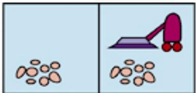

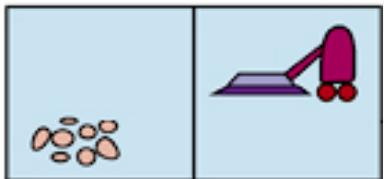

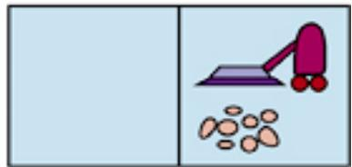

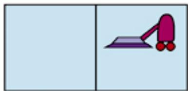

## 使用非确定动作的搜索

## 例.不稳定的真空吸尘器世界的不确定动作

·在一个不干净的方格执行Suck动作，会清理这一方格，有时也清理它的相邻方格

·在一个干净的房间执行Suck动作，有时反而会把灰尘弄到地面上

转移模型:Result(s,a)

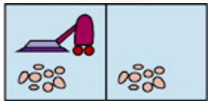

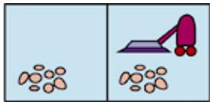

返回多个可能状态，而不再是单个状态

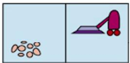

Result(1, Suck)= {5,7}

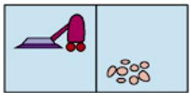

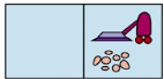  
授课教师：李静瑶

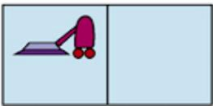

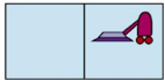

## 使用非确定动作的搜索

·问题的解：条件规划（应变规划或策略），根据智能体在执行规划时接收到的感知来指定动作

嵌套的if-then-else语句

是树，而不再是序列

[Suck, if State=5 then [Right, Suck] else []]

测试当前状态：智能体运行时

能够观测到，但规划时不知道

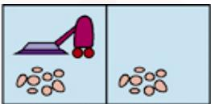

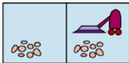

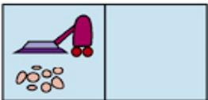

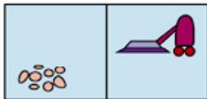

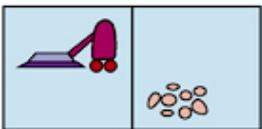

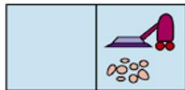

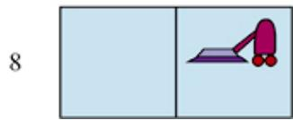  
授课教师：李静瑶

## 使用非确定动作的搜索

## 与或搜索树

? 或节点：每个状态执行不同的可选动作

与节点：每个动作生成不同的可能状态

与或搜索问题的解：一棵子树

每个叶节点为目标节点

或节点选择一个可选动作

与节点选择所有可能状态

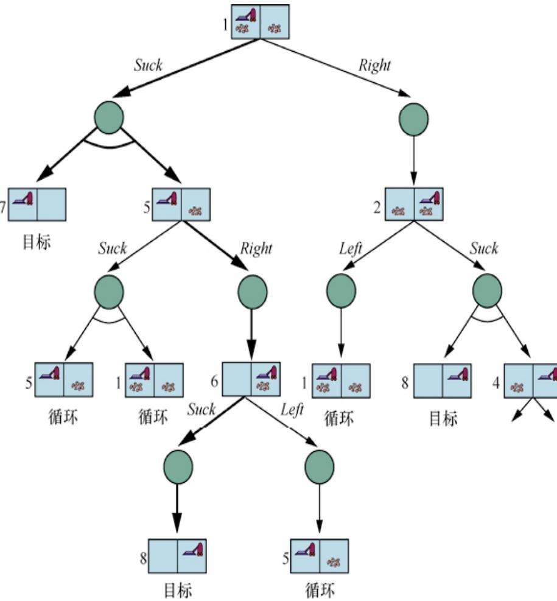  
授课教师：李静瑶

## 使用非确定动作的搜索

## 例.光滑的真空吸尘器世界的不确定动作

·执行Left或Right动作有时会失败，智能体在原地不动

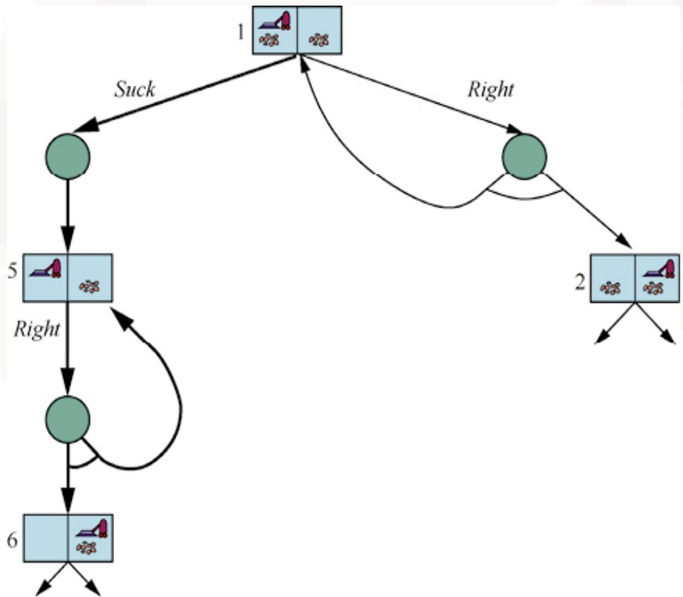  
授课教师：李静瑶

## 使用非确定动作的搜索

循环解：

[Suck, L1: Right, if State=5 then L1 else Suck]

• [Suck, while State=5 do Right, Suck]

循环解作为规划的解

每个叶节点都是一个目标状态

如果动作重复多次，最终总会生效

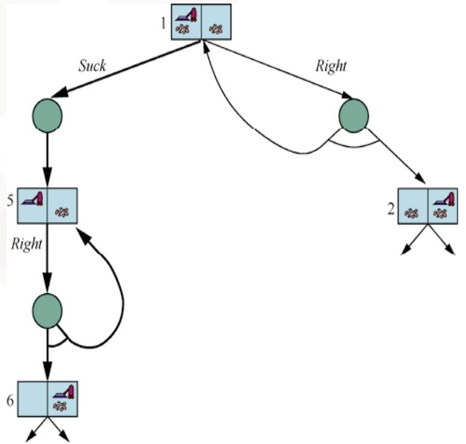  
授课教师：李静瑶

## 使用非确定动作的搜索

## 与或图

结点间通过K-连接符连接

K=1代表确定动作；K>1代表不确定动作

目标：找到从初始结点到达目标结点的最短路径

初始状态：no

目标状态：n9和n10

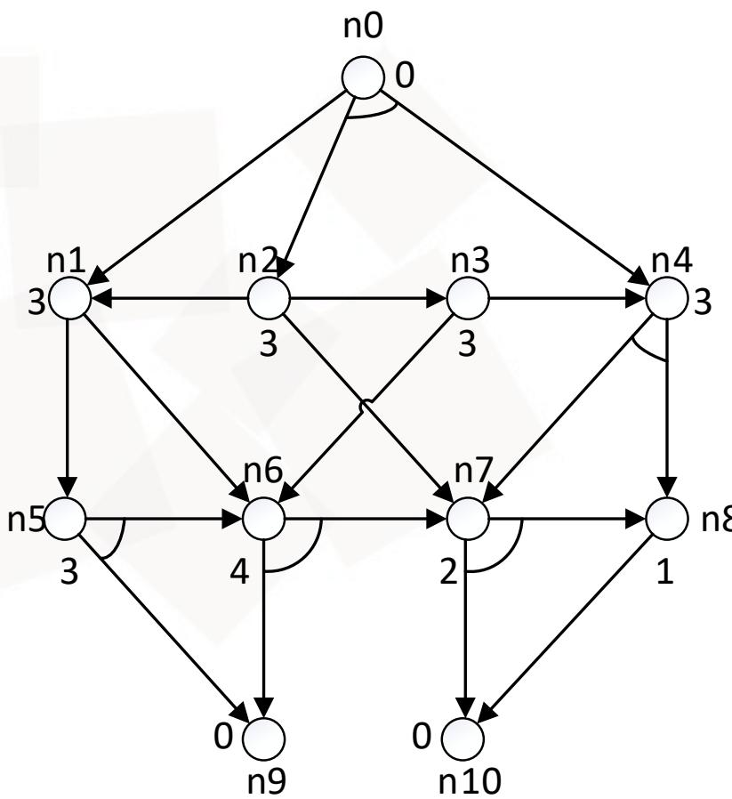  
授课教师：李静瑶

## 使用非确定动作的搜索

## 与或图搜索 深度优先递归算法

function AND-OR-SEARCH(problem) returns一个条件规划或failurereturn OR-SEARCH(problem, problem.INITIAL, [])

function OR-SEARcH(problem,state,path) returns一个条件规划或 failure

if problem.Is-GoAL(state) then return 空规划

if Is-CycLE(state, path) then return failure

for each action在 problem.AcTioNs(state)中 do

plan ← AND-SEARCH(problem, REsULTs(state, action), [state] + [path])

if plan ≠failure then return [action] + [plan]

return failure

function AND-SEARCH(problem,states,path) returns一个条件规划或failure

for each $s _ { i }$ in states do

$$
p l a n _ { i } \gets \mathrm { O R - S E A R C H } ( p r o b l e m , s _ { i } , p a t h )
$$

if plan,=failure thenreturn failure

授课教师：李静瑶

return [if s, then plan,else if $s _ { 2 }$ then plan2 else $\cdots \mathrm { i f } s _ { n - 1 }$ then $p l a n _ { n - 1 }$ else plann]

## 使用非确定动作的搜索

## 与或图的启发式搜索算法 $\mathbf { A } \mathbf { O } ^ { * }$

评估函数h(n)：从当前结点n到目标结点的最优解的估计代价

结点n执行k-连接符对应动作的估计代价为 $\mathrm { { h ( n ) = C _ { k } + h ( n _ { 1 } ) + \ldots + h ( n _ { k } ) } }$

$\mathrm { C } _ { \mathrm { k } }$ 为k-连接符的实际代价

可能存在多个目标结点

“自上向下"扩展节点，“自下向上"更新代价

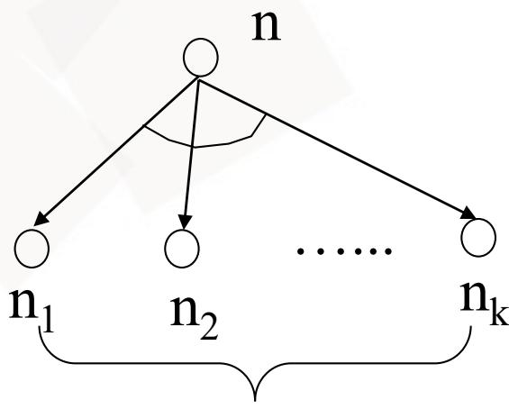  
k个

授课教师：李静瑶

## 2 使用非确定动作的搜索

## 第一次扩展

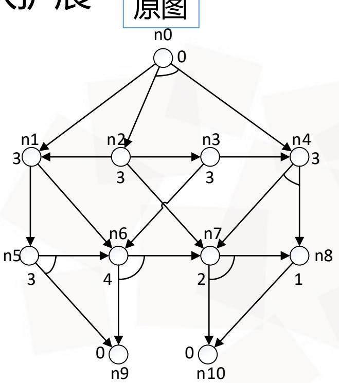  
本次扩展结果

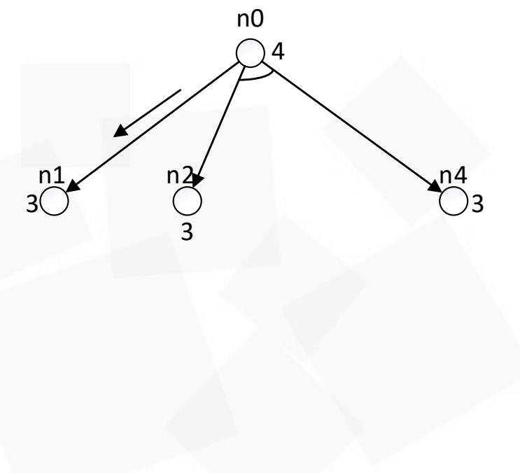

·扩展初始结点 $\mathsf { n } _ { 0 }$ ，左侧的1-连接符为最优动作

$\mathsf { n } _ { 0 }$ 的代价更新为4，当前解路径的 $\mathsf { n } _ { 1 }$ 的代价最小为待扩展结点

授课教师：李静瑶

## 2使用非确定动作的搜索

## 第二次扩展

  
上次扩展结果

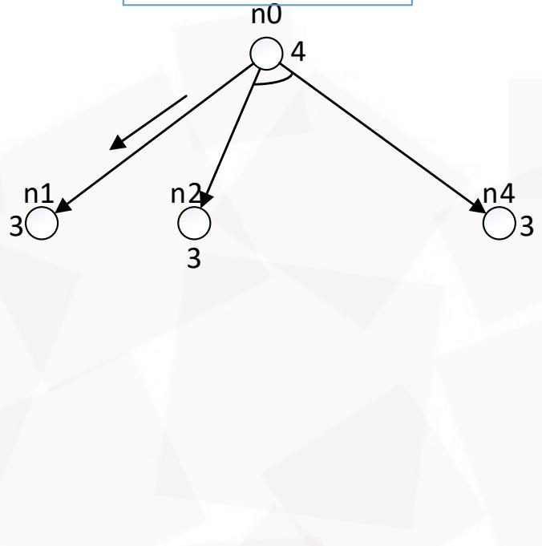  
本次扩展结果

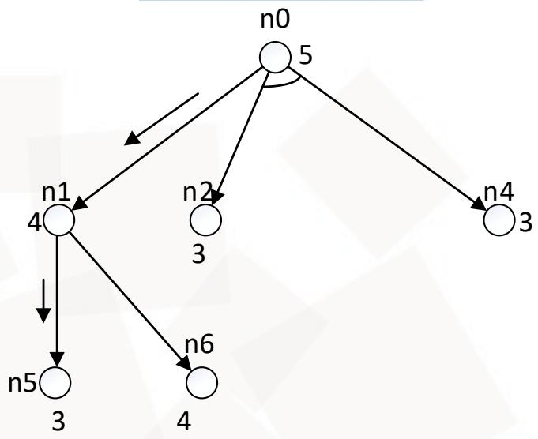

·扩展结点n1，左侧的1-连接符为最优动作

·n1的代价更新为4，nO的代价更新为5，当前解路径的n5的代价最小为待扩展结点

授课教师：李静瑶

## 2使用非确定动作的搜索

## 第三次扩展

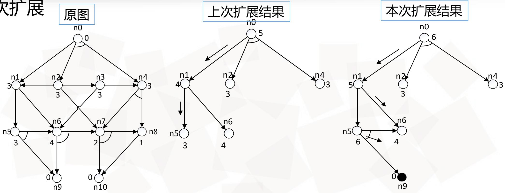

·扩展结点n5，唯一的2-连接符为最优动作

·n5的代价更新为6，n1更新了最优动作、代价更新为5，nO的代价更新为6，当前解路径的n6的代价最小为待扩展结点

授课教师：李静瑶

## 2 使用非确定动作的搜索

## 第四次扩展

上次扩展结果

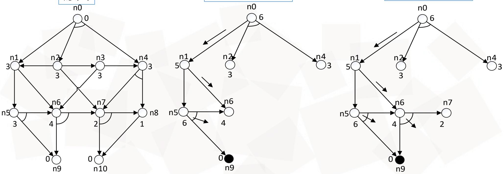

·扩展结点n6，唯一的2-连接符为最优动作

·n6的代价更新为4（值不变），当前解路径的n7的代价最小为待扩展结点 (n9为目标结点)

授课教师：李静瑶

## 2 使用非确定动作的搜索

## 第五次扩展

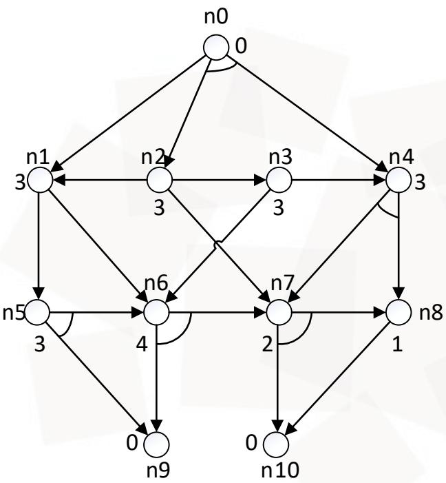

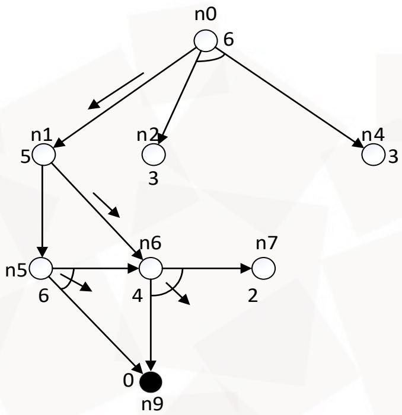

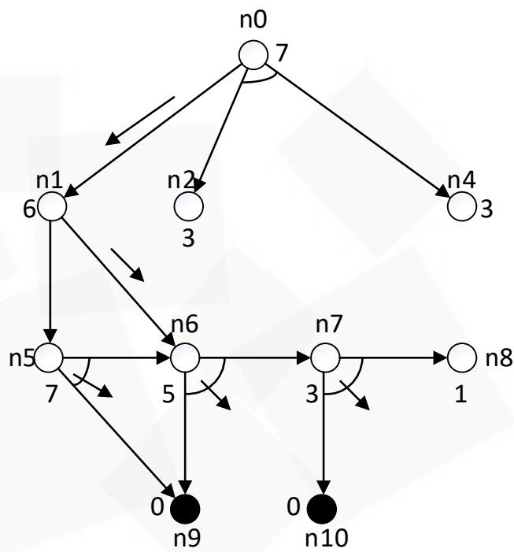

·扩展结点n7，唯一的2-连接符为最优动作

·n7的代价更新为3，n6的代价更新为5，n1、n5和n0的代价分别更新为

6、7、7，当前解路径的n8的代价最小为待扩展结点(n10为目标结点)

授课教师：李静瑶

## 2 使用非确定动作的搜索

## 第六次扩展

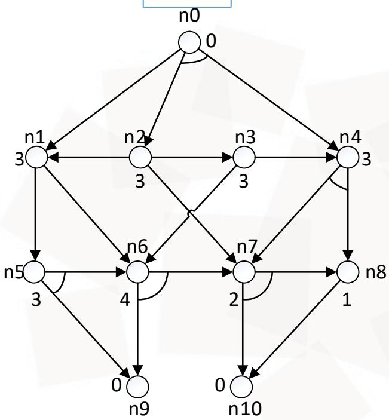  
上次扩展结果

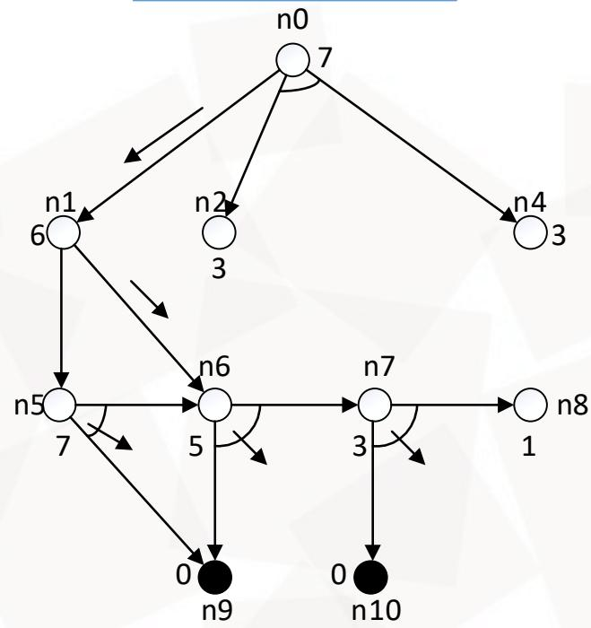  
本次扩展结果

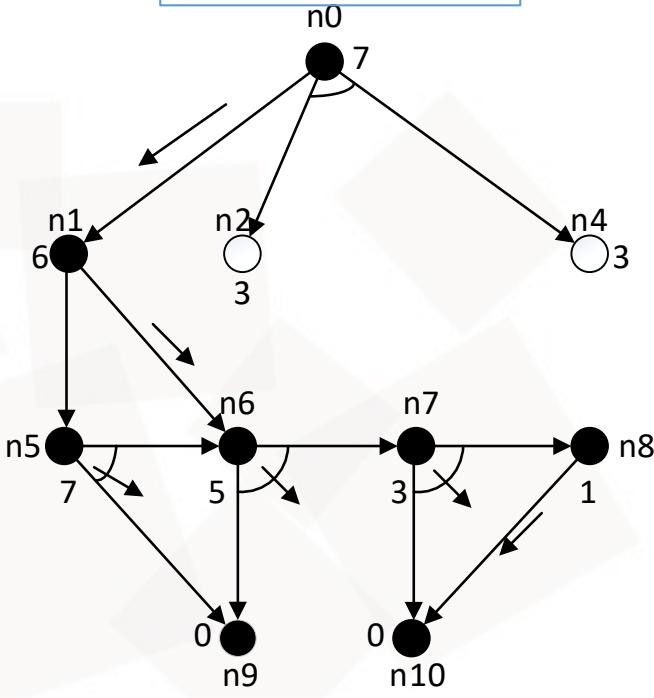

·扩展结点n8，唯一的1-连接符为最优动作

·n8的代价更新为1（值不变），当前解路径上的所有节点均已扩展

授课教师：李静瑶

## 2 使用非确定动作的搜索

## 问题的解

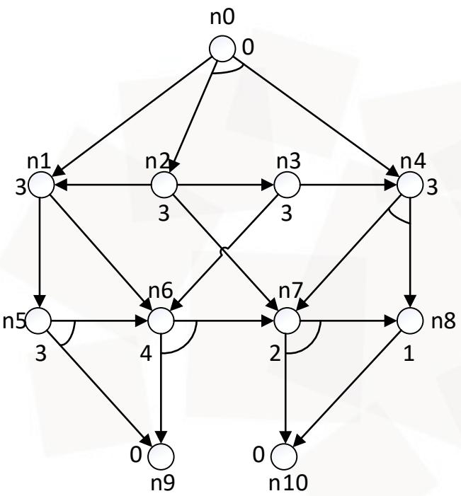

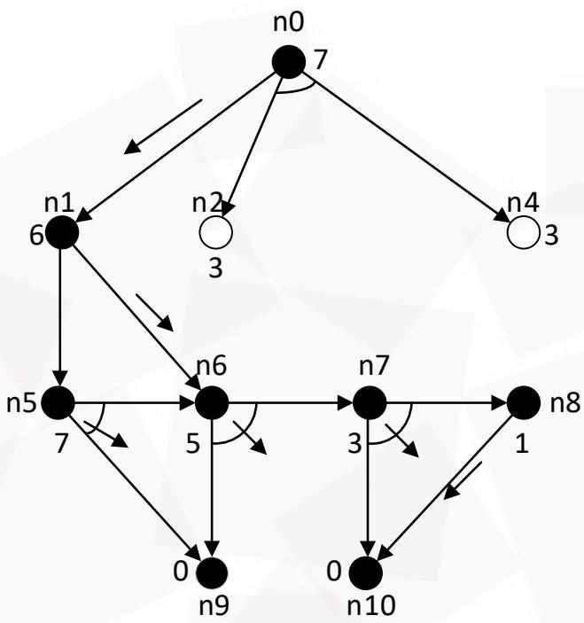

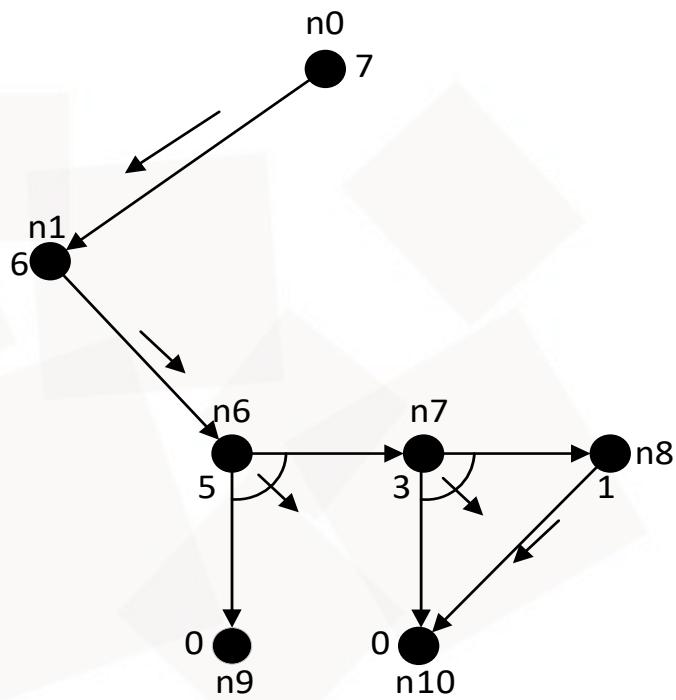

·左图：问题原图

·中图：与或图搜索算法的扩展生成图

授课教师：李静瑶

·右图：与或图搜索算法的解图

## 部分可观测的搜索

部分可观测环境中的搜索：当环境部分可观测时，智能体并不确定它处于什么状态，需要感知信息来确定环境的状态信息

## 无观测信息的搜索

·无传感器问题：智能体的感知根本不提供任何信息

不依赖于传感器是否正常工作

医疗，抗生素避免病情恶化

·智能体的感知不足以确定准确的状态，智能体的一些动作将致力于减少当前状态的不确定性

授课教师：李静瑶

## 3 部分可观测的搜索

## 例.无观测信息的吸尘器世界

·智能体知道它所在世界的地理环境，但不知道它自己的位置和灰尘分布

·初始状态：智能体可能在{1,2,3,4,5,6,7,8}中任意位置

执行Right，智能体可能在{2,4,6,8}中某个位置

·执行[Right,Suck]，智能体可能在{4,8}中某个位置

·执行[Right,Suck,Left,Suck]，智能体到达目标状态7 解是动作序列，而非条件规划

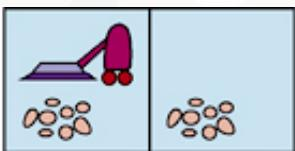

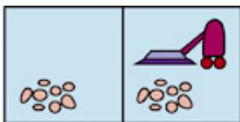

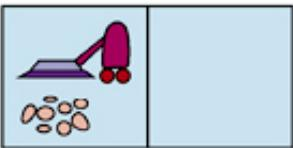

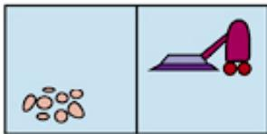  
授课教师：李静瑶

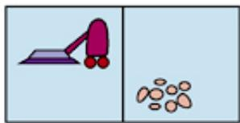

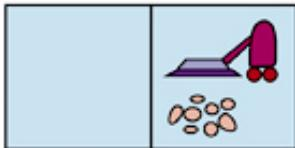

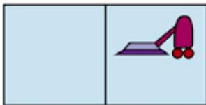

## 部分可观测的搜索

## 物理问题P对应的无观测问题

·信念状态：状态空间包含物理状态的每一个可能子集，P的N个状态对应2N个信念状态

初始状态：P的所有状态的集合

动作：在不同状态上的同一动作是否合理 (并集/交集)

·转移模型：不同状态上分别进行状态转移 (确定/非确定动作)

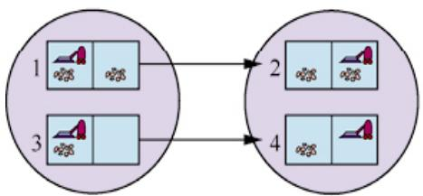  
授课教师：李静瑶  
(a)

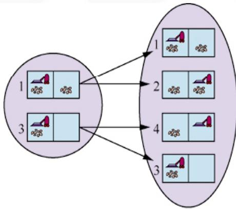  
(b）

## 部分可观测的搜索

## 物理问题P对应的无观测问题

·目标测试：若信念状态中的任一状态满足底层问题的目标测试，则智能体有可能到达了目标；如果所有状态都满足目标测试，则智能体必定到达了目标；目标是后者

路径代价：同一动作在不同状态下的代价 (不同/相同)

授课教师：李静瑶

## Q 部分可观测的搜索

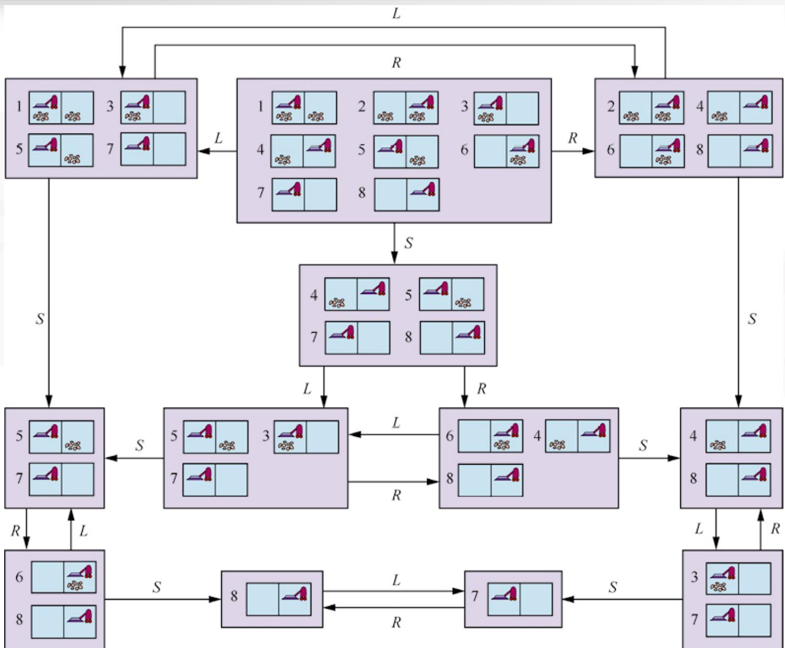  
授课教师：李静瑶

## 3 部分可观测的搜索

## 增量信念状态搜索

每次只为一个物理状态建立解

首先求解适合状态1的解

·然后判断其是否适合状态2，若适合，则继续判断其是否适合状态3，依次下去；若不适合，则回溯求解适合状态1的其它解

·增量信念状态搜索需要找到一个对所有状态都有效的解

·增量式能快速检测出失败，当一个信念状态无解，通常情况下它的子集也无解，导致与信念状态规模成正比的加速

授课教师：李静瑶

## 部分可观测的搜索

## 部分可观测环境中的搜索

·没有感知就无法求解 (八数码问题)

一点点感知可能有很大帮助

，Percept(s)函数：返回智能体在给定状态下接收的感知

非确定: ${ \mathrm { P e r c e p t } } ( { \mathrm { s } } )$ 返回可能的感知集合

完全可观测： $\mathrm { P e r c e p t ( s ) { = } s }$

无传感器： $\mathrm { P e r c e p t ( s ) { \overline { { \ s } } } { \overline { { \ n } } } { \overline { { \mathrm { u l l } } } } }$

•例：局部感知 Percept(State 1)=[L,Dirty]

授课教师：李静瑶

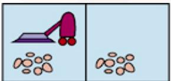

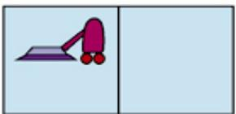

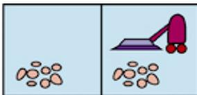

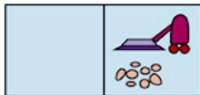

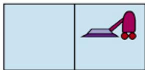

## Q 部分可观测的搜索

部分可观测问题信念状态之间的转移模型

·预测：给定信念状态b和动作a，预测信念状态

$$
\hat { b } = \operatorname { P r e d i c t } ( \mathrm { b } , a )
$$

可能感知：在预测的信念状态b下可以观测到的感知集合

$$
\mathrm { P o s s i b l e \_ P e r c e p t } \displaystyle \bigl ( \widehat b \bigr ) = \{ o \colon o = \mathrm { P e r c e p t } ( s ) a n d s \in \widehat b \}
$$

更新：为每个可能感知计算其可能得到的信念状态

$$
b _ { 0 } = { \mathrm { U p d a t e } } { \big ( } { \hat { b } } , o { \big ) } = \{ s { \mathrm { : } } o = { \mathrm { P e r c e p t } } ( s ) a n d s \in { \hat { b } } \}
$$

授课教师：李静瑶

## 部分可观测的搜索

（a）

授课教师：李静瑶

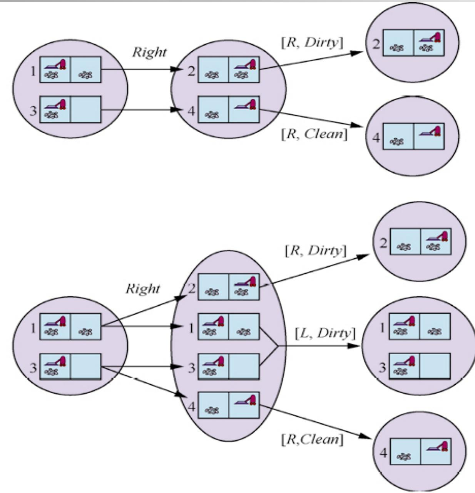

## 部分可观测的搜索

## 例.部分可观测环境中的吸尘器世界问题的搜索树

假设初始的感知[L,Dirty]

解: [Suck, Right, if State={6} then Suck else []]

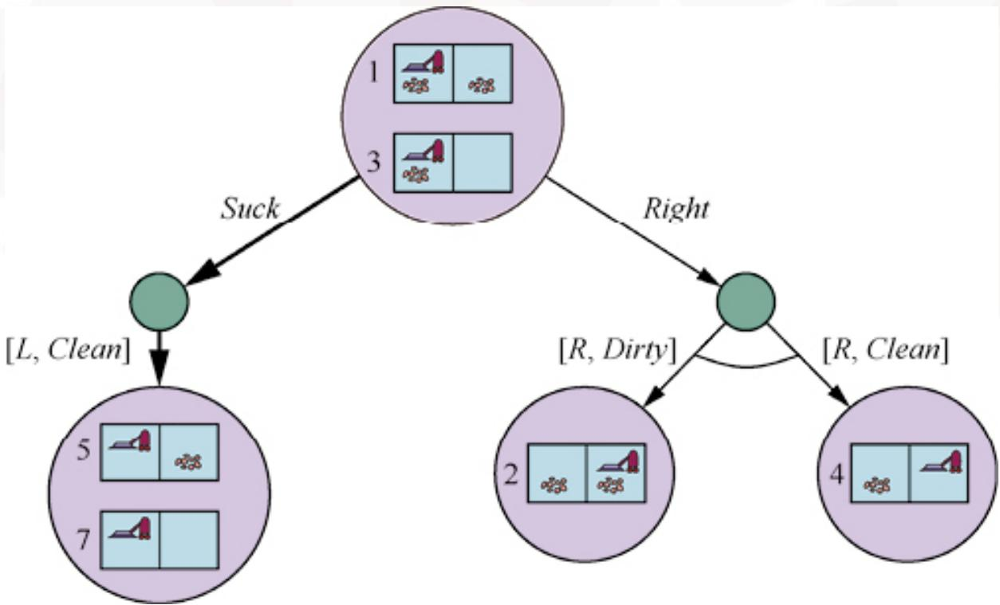

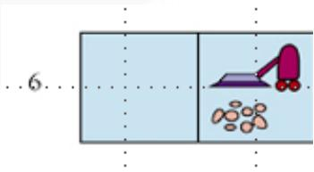  
授课教师：李静瑶

## 3 部分可观测的搜索

## 例.部分可观测环境中的幼儿园吸尘器世界

·任一方格在任一时刻都有可能变脏，除非智能体恰好在那一时刻主动清理该方格

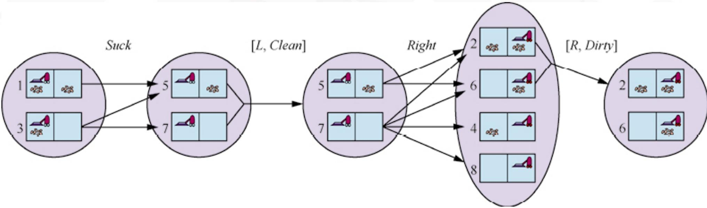  
授课教师：李静瑶

## 3 部分可观测的搜索

## 例.机器人定位问题

·在给定世界地图和一系列感知及行动的情况下，找到自己的位置

机器人处在迷宫环境中，可以向四个方向行走

·机器人配备四个声呐传感器，可以判断在四个方向是否存在障碍物（边界和阻挡)

·机器人拥有正确的环境地图，但导航失灵（非确定性动作），希望确定自身当前位置

·感知表示为位向量：1011表示北、南、西有障碍物

授课教师：李静瑶

## 3 部分可观测的搜索

<table><tr><td rowspan=1 colspan=1>0</td><td rowspan=1 colspan=1>。</td><td rowspan=1 colspan=1>。</td><td rowspan=1 colspan=1>。</td><td rowspan=1 colspan=1></td><td rowspan=1 colspan=1>。</td><td rowspan=1 colspan=1>0</td><td rowspan=1 colspan=1>。</td><td rowspan=1 colspan=1>。</td><td rowspan=1 colspan=1>。</td><td rowspan=1 colspan=1></td><td rowspan=1 colspan=1>0</td><td rowspan=1 colspan=1>。</td><td rowspan=1 colspan=1>。</td><td rowspan=1 colspan=1></td><td rowspan=1 colspan=1>。</td></tr><tr><td rowspan=1 colspan=1></td><td rowspan=1 colspan=1></td><td rowspan=1 colspan=1>。</td><td rowspan=1 colspan=1>0</td><td rowspan=1 colspan=1></td><td rowspan=1 colspan=1>。</td><td rowspan=1 colspan=1></td><td rowspan=1 colspan=1></td><td rowspan=1 colspan=1>0</td><td rowspan=1 colspan=1></td><td rowspan=1 colspan=1>0</td><td rowspan=1 colspan=1></td><td rowspan=1 colspan=1>0</td><td rowspan=1 colspan=1></td><td rowspan=1 colspan=1></td><td rowspan=1 colspan=1></td></tr><tr><td rowspan=1 colspan=1></td><td rowspan=1 colspan=1>。</td><td rowspan=1 colspan=1>。</td><td rowspan=1 colspan=1>。</td><td rowspan=1 colspan=1></td><td rowspan=1 colspan=1>。</td><td rowspan=1 colspan=1></td><td rowspan=1 colspan=1></td><td rowspan=1 colspan=1>o</td><td rowspan=1 colspan=1>。</td><td rowspan=1 colspan=1>。</td><td rowspan=1 colspan=1>。</td><td rowspan=1 colspan=1>。</td><td rowspan=1 colspan=1></td><td rowspan=1 colspan=1></td><td rowspan=1 colspan=1>。</td></tr><tr><td rowspan=1 colspan=1>0</td><td rowspan=1 colspan=1>0</td><td rowspan=1 colspan=1></td><td rowspan=1 colspan=1>0</td><td rowspan=1 colspan=1>。</td><td rowspan=1 colspan=1>。</td><td rowspan=1 colspan=1></td><td rowspan=1 colspan=1>0</td><td rowspan=1 colspan=1>。</td><td rowspan=1 colspan=1>。</td><td rowspan=1 colspan=1>。</td><td rowspan=1 colspan=1></td><td rowspan=1 colspan=1>。</td><td rowspan=1 colspan=1>。</td><td rowspan=1 colspan=1>。</td><td rowspan=1 colspan=1>。</td></tr></table>

（a）观测到Ei=1011后，机器人的可能位置

<table><tr><td rowspan=1 colspan=1></td><td rowspan=1 colspan=2>0</td><td rowspan=1 colspan=1>。</td><td rowspan=1 colspan=1>。</td><td rowspan=1 colspan=1></td><td rowspan=1 colspan=1>。</td><td rowspan=1 colspan=1>。</td><td rowspan=1 colspan=1>。</td><td rowspan=1 colspan=1>。</td><td rowspan=1 colspan=1>。</td><td rowspan=1 colspan=1></td><td rowspan=1 colspan=1>。</td><td rowspan=1 colspan=1>。</td><td rowspan=1 colspan=1>。</td><td rowspan=1 colspan=1></td><td rowspan=1 colspan=1></td></tr><tr><td rowspan=1 colspan=1></td><td rowspan=1 colspan=2></td><td rowspan=1 colspan=1>。</td><td rowspan=1 colspan=1>。</td><td rowspan=1 colspan=1></td><td rowspan=1 colspan=1>o</td><td rowspan=1 colspan=1></td><td rowspan=1 colspan=1></td><td rowspan=1 colspan=1>。</td><td rowspan=1 colspan=1></td><td rowspan=1 colspan=1>。</td><td rowspan=1 colspan=1></td><td rowspan=1 colspan=1>。</td><td rowspan=1 colspan=1></td><td rowspan=1 colspan=1></td><td rowspan=1 colspan=1></td></tr><tr><td rowspan=1 colspan=1></td><td rowspan=1 colspan=2>。</td><td rowspan=1 colspan=1>。</td><td rowspan=1 colspan=1>。</td><td rowspan=1 colspan=1></td><td rowspan=1 colspan=1>。</td><td rowspan=1 colspan=1></td><td rowspan=1 colspan=1></td><td rowspan=1 colspan=1>。</td><td rowspan=1 colspan=1>。</td><td rowspan=1 colspan=1>。</td><td rowspan=1 colspan=1>。</td><td rowspan=1 colspan=1>0</td><td rowspan=1 colspan=1></td><td rowspan=1 colspan=1></td><td rowspan=1 colspan=1>。</td></tr><tr><td rowspan=1 colspan=1>。</td><td rowspan=1 colspan=2>。</td><td rowspan=1 colspan=1></td><td rowspan=1 colspan=1>。</td><td rowspan=1 colspan=1>。</td><td rowspan=1 colspan=1>。</td><td rowspan=1 colspan=1></td><td rowspan=1 colspan=1>O</td><td rowspan=1 colspan=1>。</td><td rowspan=1 colspan=1>。</td><td rowspan=1 colspan=1>。</td><td rowspan=1 colspan=1></td><td rowspan=1 colspan=1>。</td><td rowspan=1 colspan=1>。</td><td rowspan=1 colspan=1>。</td><td rowspan=1 colspan=1>。</td></tr></table>

授课教师：李静瑶  
（b）观测到Ei=1011和E=1010后，机器人的可能位置

## 3 部分可观测的搜索

## 例.机器人定位问题的搜索过程

初始信念状态b包含所有位置

·机器人接收到感知信息1011，意味着北、南、西方向有障碍物，利用$\scriptstyle \mathbf { b } _ { 0 } = \mathbf { U p d a t e } ($ b,1011)更新信念状态，找出4个位置如图(a)

·机器人继续执行Move动作，新的信念状态 $\mathrm { b _ { a } = P r e d i c t ( b _ { 0 } , \ M o v e ) }$ ，当接受到感知信息1010后，利用 $\mathrm { U p d a t e } ( \mathrm { b } _ { \mathrm { a } } .$ 1010)更新信念状态，找到唯一位置如图 (b)

## 在线搜索

## 离线搜索

计算+行动

行动前已经计算出一个完整的解

计算和行动交替执行

·先执行一个动作，然后观测环境并计算下一个动作

·适用于动态、半动态、非确定性环境

授课教师：李静瑶

## 在线搜索

## 在线搜索问题

假设：环境是确定性的、完全可观测的

智能体知道以下内容：

•Action(s):状态s下的合法动作

c(s,a,s'):动作代价

Is-Goal(s):目标测试

·智能体不能确定Result(s,a)的值，除非确实在s中执行了动作a

·智能体可能可以访问一个可容许的启发式函数h(s)，估计当前状态到目标状态的距离

授课教师：李静瑶

## 在线搜索

## 例.迷宫问题

·智能体不知道从状态(1,1)执行Up动作可以到达状态(1,2)，或者再执行动作Down可以回到状态(1,1)

·智能体可能知道目标状态(3,3)，启发式函数可以使用Manhattan距离

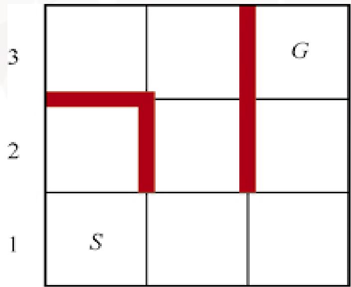  
授课教师：李静瑶

## 在线搜索

## 竞争比

智能体的目标是用最小代价到达目标状态

竞争比=实际代价／最小代价，越小越好

·在线搜索很容易陷入死胡同（无法到达任何目标的状态），没有一种算法能在所有状态空间中都避免死胡同，任何给定智能体都会在至少一个状态空间中失败

某些情况下最好的竞争比是∞

授课教师：李静瑶

## 在线搜索

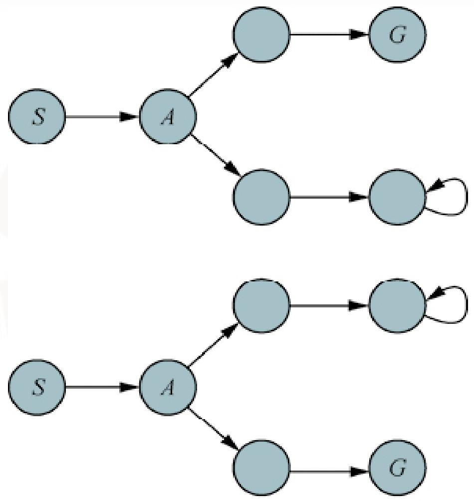  
（a）

授课教师：李静瑶

G  
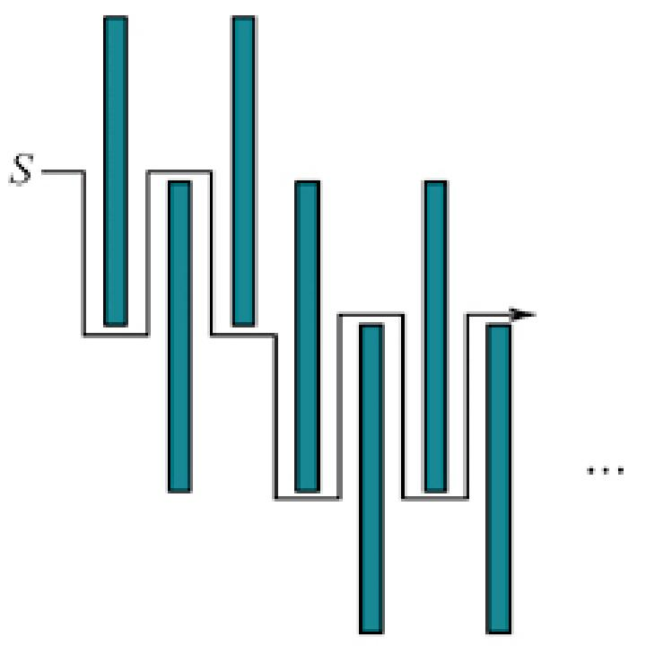  
(b）

## 4 在线搜索

## 在线搜索智能体

·智能体在每个动作后会收到一个感知，告诉它目前到达了哪一状态，可更新其环境地图

更新后的地图用于规划下一步

·离线算法探索状态空间模型（如A\*），在线算法探索真实世界（实际后继)

授课教师：李静瑶

## 在线搜索

unction ONLINE-DFS-AGENT(problem,s') returns一个动作  
persistent:s，a，之前的状态和动作，初始为空  
result，将(s,a)映射到s'的表，初始为空  
untried，将s映射到未探索动作列表的表  
unbacktracked，将s映射到未回溯状态队列的表  
if problem.Is-GoAL(s') thenreturn stop  
if s'是一个（不在untried中的）新状态thenuntried[s]←problem.AcTIoNs(s)  
if s不空then  
result[s,a]←s'  
将s添加到unbacktracked[s]的队尾  
if untried[s]为空then  
if unbacktracked[s]为空thenreturn stop  
s',a←null,使得result[s',b]=PoP(unbacktracked[sT的动作b  
else aPoP(untried[sT)  
s←s'  
return a  
授课教师：李静瑶

## 在线搜索

## 在线局部搜索

爬山搜索：陷入局部极大

随机重启：智能体无法瞬移到新的初始状态

随机游走：过程缓慢

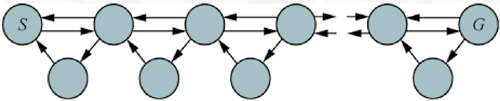  
授课教师：李静瑶

## 在线搜索

## 增加存储的爬山法

·存储每个扩展状态s到达目标状态的代价的当前最佳估计H(s)

H(s)的初始值为h(s)

根据智能体在状态空间中获得的经验不断更新H(s)

授课教师：李静瑶

## 在线搜索

function LRTA\*-AGENr(problem,s', h) returns一个动作  
persistent:s,a，之前的状态和动作，初始为空  
result，将(s,a)映射到s的表，初始为空  
H，将s映射到一个代价估计值的表，初始为空

if Is-GOAL(s') then return stop  
if s'是一个（不在H中的）新状态then H[s]h(s)  
if s不空then  
result[s,a]←s'  
H[s]← min LRTA\*-Cos(problem,s,b,result[s,b],H)  
b∈ACTIONS(s)  
a←argmin LRTA\*-Cosr(problem,s',b,result[s',b],H)  
b ∈ ACTIONS(s)  
s←s'  
return a  
授课教师：李静瑶

function LRTA\*-CosT(problem,s,a,s',H) returns一个代价估计值   
if s未定义 then return h(s)   
else return problem.ACTIoN-CosT(s,a,s) +H[s]

## 在线搜索

LRTA \* (Learning Real-Time A\*)

·用result表构建了一个环境地图

更新刚刚离开的状态的估计代价，然后根据当前的估计代价选择当前最佳动作

·在状态s下尚未尝试的动作总是被假定为以最少的可能代价，即h(s)直接到达目标，这种“不确定性下的乐观主义”鼓励智能体探索新的、可能更有希望的路径

授课教师：李静瑶

## 4 在线搜索

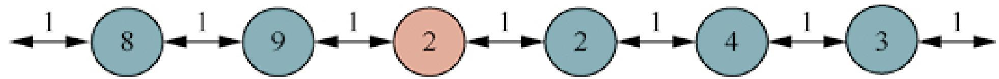

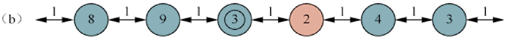

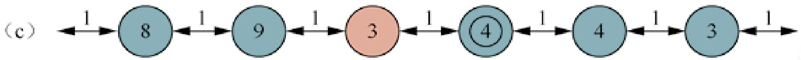

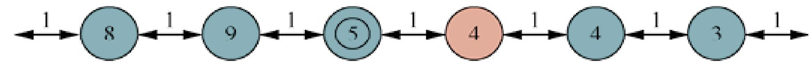

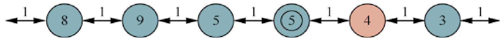  
授课教师：李静瑶