## 第6章神经网络

授课教师：李静瑶

授课教师：李静瑶

## 录

什么是神经网络

2 神经网络的训练

3 卷积神经网络

4 梯度消失问题

过拟合问题

## 什么是神经网络

## 神经网络是如何实现的

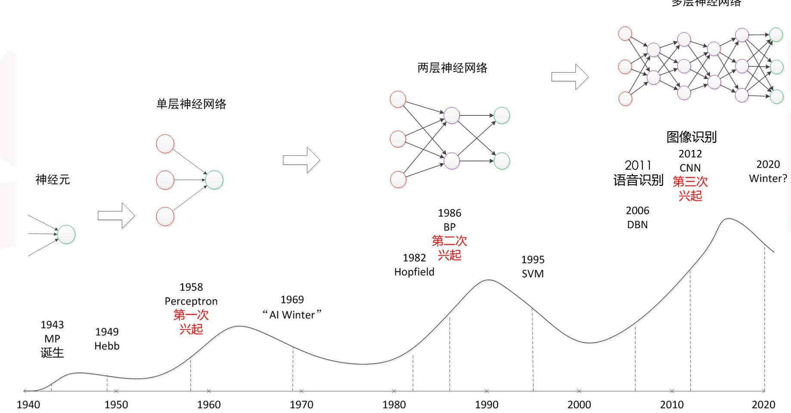  
授课教师：李静瑶

## 什么是神经网络

## 人工神经元网络 （ANN—Artificial Neural Network或者NN)

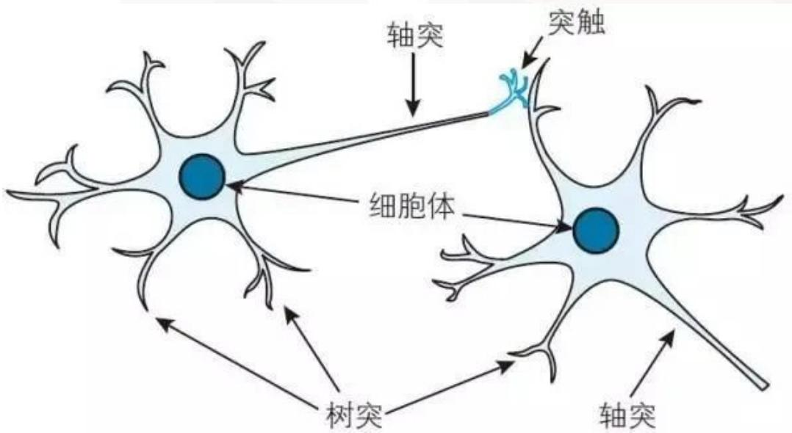

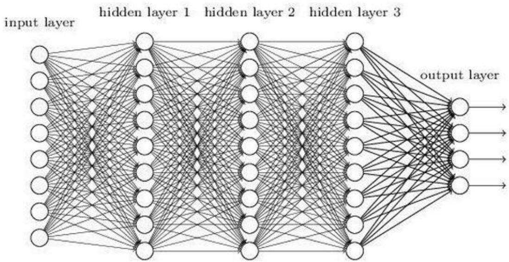  
授课教师：李静瑶

## 什么是神经网络

## 数字识别问题

<table><tr><td></td><td></td><td></td><td>111111111111100</td><td></td><td></td><td></td><td></td><td></td><td></td><td></td><td></td><td></td><td></td></tr><tr><td></td><td></td><td></td><td></td><td></td><td></td><td></td><td>000000000000000</td><td></td><td></td><td></td><td></td><td></td><td></td></tr><tr><td></td><td></td><td></td><td></td><td></td><td></td><td>100000000000000</td><td></td><td></td><td></td><td></td><td></td><td></td><td></td></tr><tr><td></td><td></td><td></td><td></td><td></td><td></td><td>000000000000111</td><td></td><td></td><td></td><td></td><td></td><td></td><td></td></tr><tr><td></td><td></td><td></td><td></td><td></td><td></td><td>。。00。。。000。。11</td><td></td><td></td><td></td><td></td><td></td><td></td><td></td></tr><tr><td></td><td></td><td></td><td></td><td></td><td></td><td>000。。。。。00。。111</td><td></td><td></td><td></td><td></td><td></td><td></td><td></td></tr><tr><td></td><td></td><td></td><td></td><td></td><td>100000</td><td></td><td>0000000□0</td><td></td><td></td><td></td><td></td><td></td><td></td></tr><tr><td></td><td></td><td></td><td></td><td></td><td></td><td></td><td>100000000000□0。</td><td></td><td></td><td></td><td></td><td></td><td></td></tr><tr><td></td><td></td><td></td><td></td><td></td><td></td><td></td><td>00000000000000。</td><td></td><td></td><td></td><td></td><td></td><td></td></tr><tr><td></td><td></td><td>。。。。</td><td></td><td></td><td></td><td>00000000n0</td><td></td><td></td><td></td><td></td><td></td><td></td><td></td></tr><tr><td></td><td></td><td></td><td></td><td></td><td></td><td></td><td>000000000000111</td><td></td><td></td><td></td><td></td><td></td><td></td></tr><tr><td></td><td></td><td></td><td></td><td></td><td></td><td>00000。000。。。00</td><td></td><td></td><td></td><td></td><td></td><td></td><td></td></tr><tr><td></td><td></td><td></td><td></td><td></td><td></td><td>100000000000000</td><td></td><td></td><td></td><td></td><td></td><td></td><td></td></tr><tr><td></td><td></td><td></td><td></td><td></td><td></td><td>□□□□□□□□□□□□□□。</td><td></td><td></td><td></td><td></td><td></td><td></td><td></td></tr><tr><td></td><td></td><td></td><td></td><td></td><td></td><td>111111111111100</td><td></td><td></td><td></td><td></td><td></td><td></td><td></td></tr></table>

数字3的图像

<table><tr><td></td><td></td><td></td><td></td><td>1111111111111-1-1</td><td></td><td></td><td></td><td></td><td></td><td></td><td></td><td></td><td></td></tr><tr><td></td><td></td><td></td><td></td><td></td><td></td><td></td><td>00000000000000</td><td></td><td></td><td></td><td></td><td></td><td></td></tr><tr><td></td><td></td><td></td><td></td><td></td><td></td><td></td><td>100000000000000</td><td></td><td></td><td></td><td></td><td></td><td></td></tr><tr><td></td><td></td><td></td><td></td><td>-1-1-1-1-1-1-1-1-1-1-1-1111</td><td></td><td></td><td></td><td></td><td></td><td></td><td></td><td></td><td></td></tr><tr><td></td><td></td><td></td><td></td><td>-1-1-1-1-1-1-1-1-1-1-1-1111</td><td></td><td></td><td></td><td></td><td></td><td></td><td></td><td></td><td></td></tr><tr><td></td><td></td><td></td><td></td><td>-1-1-1-1-1-1-1-1-1-1-1-1111</td><td></td><td></td><td></td><td></td><td></td><td></td><td></td><td></td><td></td></tr><tr><td></td><td></td><td></td><td></td><td></td><td>00000000000000</td><td></td><td></td><td></td><td></td><td></td><td></td><td></td><td></td></tr><tr><td></td><td></td><td></td><td></td><td></td><td>000000000000</td><td></td><td></td><td></td><td></td><td></td><td></td><td></td><td></td></tr><tr><td></td><td></td><td></td><td></td><td></td><td>10011101111010-</td><td></td><td></td><td></td><td></td><td></td><td></td><td></td><td></td></tr><tr><td></td><td></td><td></td><td></td><td></td><td>-1-1-1-1-1-1-1-1-1-1-1-1111</td><td></td><td></td><td></td><td></td><td></td><td></td><td></td><td></td></tr><tr><td></td><td></td><td></td><td></td><td>-1-1-1-1-1-1-1-1-1-1-1-1111</td><td></td><td></td><td></td><td></td><td></td><td></td><td></td><td></td><td></td></tr><tr><td></td><td></td><td></td><td></td><td>-1-1-1-1-1-1-1-1-1-1-1-1111</td><td></td><td></td><td></td><td></td><td></td><td></td><td></td><td></td><td></td></tr><tr><td></td><td></td><td></td><td></td><td>000000000000000</td><td></td><td></td><td></td><td></td><td></td><td></td><td></td><td></td><td></td></tr><tr><td></td><td></td><td></td><td></td><td>00000000000000</td><td></td><td></td><td></td><td></td><td></td><td></td><td></td><td></td><td></td></tr><tr><td></td><td></td><td></td><td></td><td>1111111111111-1-1</td><td></td><td></td><td></td><td></td><td></td><td></td><td></td><td></td><td></td></tr></table>

数字3的模式

授课教师：李静瑶

## 什么是神经网络

## 数字识别问题

<table><tr><td></td><td></td><td></td><td></td><td>001111111111100</td><td></td><td></td><td></td><td></td><td></td><td></td><td></td><td></td><td></td></tr><tr><td></td><td></td><td></td><td></td><td></td><td></td><td></td><td></td><td></td><td></td><td></td><td>00000□0□0□□□□。</td><td></td><td></td></tr><tr><td></td><td></td><td></td><td></td><td></td><td></td><td></td><td></td><td></td><td></td><td></td><td>100000000000000</td><td></td><td></td></tr><tr><td></td><td></td><td></td><td></td><td></td><td></td><td></td><td></td><td></td><td></td><td></td><td>1000000000000</td><td></td><td></td></tr><tr><td></td><td></td><td>111</td><td></td><td></td><td></td><td></td><td></td><td>0000000000n</td><td></td><td></td><td></td><td></td><td></td></tr><tr><td></td><td>101</td><td></td><td></td><td></td><td>。。。。</td><td></td><td></td><td>。。。</td><td></td><td></td><td>00111</td><td></td><td></td></tr><tr><td></td><td></td><td></td><td></td><td></td><td></td><td></td><td></td><td>0□□□□□□□□□□□□□。</td><td></td><td></td><td></td><td></td><td></td></tr><tr><td></td><td></td><td></td><td></td><td></td><td></td><td></td><td></td><td></td><td></td><td></td><td>00□□□□□0□□0□00</td><td></td><td></td></tr><tr><td></td><td></td><td></td><td></td><td></td><td></td><td></td><td></td><td></td><td></td><td></td><td>000000000000。</td><td></td><td></td></tr><tr><td>111</td><td></td><td></td><td></td><td></td><td>oodd</td><td></td><td></td><td></td><td>。</td><td>。。</td><td></td><td>111</td><td></td></tr><tr><td>111</td><td></td><td></td><td></td><td></td><td></td><td></td><td></td><td>000000000111</td><td></td><td></td><td></td><td></td><td></td></tr><tr><td>1</td><td></td><td></td><td></td><td></td><td>。。。。</td><td></td><td>。。</td><td></td><td>。</td><td>00001</td><td></td><td></td><td></td></tr><tr><td></td><td></td><td></td><td></td><td></td><td></td><td></td><td></td><td>000000000000000</td><td></td><td></td><td></td><td></td><td></td></tr><tr><td></td><td></td><td></td><td></td><td></td><td></td><td></td><td>。□0□000□00□0□0</td><td></td><td></td><td></td><td></td><td></td><td></td></tr><tr><td></td><td></td><td></td><td></td><td></td><td></td><td></td><td></td><td>001111111111100</td><td></td><td></td><td></td><td></td><td></td></tr></table>

数字8的图像

<table><tr><td></td><td></td><td></td><td>1111111111111-1-1</td><td></td><td></td><td></td><td></td><td></td><td></td><td></td><td></td><td></td><td></td></tr><tr><td></td><td></td><td></td><td></td><td></td><td></td><td></td><td>100000000000000</td><td></td><td></td><td></td><td></td><td></td><td></td></tr><tr><td></td><td></td><td></td><td></td><td></td><td></td><td></td><td>000000000000000</td><td></td><td></td><td></td><td></td><td></td><td></td></tr><tr><td></td><td></td><td></td><td></td><td></td><td></td><td></td><td>-1-1-1-1-1-1-1-1-1-1-1-1111</td><td></td><td></td><td></td><td></td><td></td><td></td></tr><tr><td></td><td></td><td></td><td></td><td></td><td></td><td></td><td>-1-1-1-1-1-1-1-1-1-1-1-1111</td><td></td><td></td><td></td><td></td><td></td><td></td></tr><tr><td></td><td></td><td></td><td></td><td></td><td></td><td></td><td>-1-1-1-1-1-1-1-1-1-1-1-1111</td><td></td><td></td><td></td><td></td><td></td><td></td></tr><tr><td></td><td></td><td></td><td></td><td></td><td></td><td>00000000000000A</td><td></td><td></td><td></td><td></td><td></td><td></td><td></td></tr><tr><td></td><td></td><td></td><td></td><td></td><td></td><td>0000000000000</td><td></td><td></td><td></td><td></td><td></td><td></td><td></td></tr><tr><td></td><td></td><td></td><td></td><td></td><td></td><td></td><td>11111111111111-1</td><td></td><td></td><td></td><td></td><td></td><td></td></tr><tr><td></td><td></td><td></td><td></td><td></td><td></td><td>-1-1-1-1-1-1-1-1-1-1-1-1111</td><td></td><td></td><td></td><td></td><td></td><td></td><td></td></tr><tr><td></td><td></td><td></td><td></td><td></td><td>-1-1-1-1-1-1-1-1-1-1-1-1111</td><td></td><td></td><td></td><td></td><td></td><td></td><td></td><td></td></tr><tr><td></td><td></td><td></td><td></td><td></td><td>-1 -1-1-1-1-1-1-1-1-1-1-1111</td><td></td><td></td><td></td><td></td><td></td><td></td><td></td><td></td></tr><tr><td></td><td></td><td></td><td></td><td></td><td>1100[00010111</td><td></td><td></td><td></td><td></td><td></td><td></td><td></td><td></td></tr><tr><td></td><td></td><td></td><td></td><td></td><td>10000000000000-</td><td></td><td></td><td></td><td></td><td></td><td></td><td></td><td></td></tr><tr><td></td><td></td><td></td><td></td><td>1111111111111-1-1</td><td></td><td></td><td></td><td></td><td></td><td></td><td></td><td></td><td></td></tr></table>

数字3的模式

授课教师：李静瑶

## 什么是神经网络

## 模式匹配 (按位乘/点积)

<table><tr><td rowspan=1 colspan=1>0</td><td rowspan=1 colspan=1>1</td><td rowspan=1 colspan=1>1</td><td rowspan=1 colspan=1>1</td><td rowspan=1 colspan=1>0</td></tr><tr><td rowspan=1 colspan=1>1</td><td rowspan=1 colspan=1>0</td><td rowspan=1 colspan=1>0</td><td rowspan=1 colspan=1>0</td><td rowspan=1 colspan=1>1</td></tr><tr><td rowspan=1 colspan=1>0</td><td rowspan=1 colspan=1>1</td><td rowspan=1 colspan=1>1</td><td rowspan=1 colspan=1>1</td><td rowspan=1 colspan=1>0</td></tr><tr><td rowspan=1 colspan=1>1</td><td rowspan=1 colspan=1>0</td><td rowspan=1 colspan=1>0</td><td rowspan=1 colspan=1>0</td><td rowspan=1 colspan=1>1</td></tr><tr><td rowspan=1 colspan=1>0</td><td rowspan=1 colspan=1></td><td rowspan=1 colspan=1></td><td rowspan=1 colspan=1></td><td rowspan=1 colspan=1>0</td></tr></table>

$$
\begin{array} { r } { \frac { \left[ \begin{array} { l } { 1 } \\ { \left[ \begin{array} { l } { 1 } \end{array} \right] } \end{array} \right] ~ 1 ~ \left[ \begin{array} { l } { 1 } \\ { 1 } \end{array} \right] ~ 1 } { \left[ \begin{array} { l } { - 1 } \\ { - 1 } \end{array} \right] ~ 1 ~ - 1 ~ \left[ \begin{array} { l } { 1 } \\ { - 1 } \end{array} \right] ~ 1 } } \\ { \frac { \left[ \begin{array} { l } { 1 } \\ { 1 } \end{array} \right] ~ 1 ~ 1 ~ 1 ~ 1 ~ 1 ~ - 1 } { \left[ \begin{array} { l } { 1 } \\ { - 1 } \end{array} \right] ~ - 1 ~ 1 ~ 1 ~ 1 } } \\ { \frac { \left[ \begin{array} { l } { 1 } \\ { 1 } \end{array} \right] ~ 1 ~ 1 ~ 1 ~ 1 ~ 1 ~ - 1 } { \left[ \begin{array} { l } { 1 } \end{array} \right] ~ 1 } } \end{array}
$$

$$
\begin{array} { r l } & { ~ 0 \times 1 + 1 \times 1 + 1 \times 1 + 1 \times 1 + 0 \times \left( - 1 \right) + } \\ & { ~ 1 \times \left( - 1 \right) + 0 \times \left( - 1 \right) + 0 \times \left( - 1 \right) + 0 \times \left( - 1 \right) + 1 \times 1 + } \\ { = ~ } & { ~ 0 \times 1 + 1 \times 1 + 1 \times 1 + 1 \times 1 + 0 \times \left( - 1 \right) + } \\ & { ~ 1 \times \left( - 1 \right) + 0 \times \left( - 1 \right) + 0 \times \left( - 1 \right) + 0 \times \left( - 1 \right) + 1 \times 1 + } \\ & { ~ 0 \times 1 + 1 \times 1 + 1 \times 1 + 1 \times 1 + 0 \times \left( - 1 \right) } \\ & { ~ = 9 } \end{array}
$$

$$
n e t = w _ { 1 } \cdot x _ { 1 } + w _ { 2 } \cdot x _ { 2 } + \cdots + w _ { n } \cdot x _ { n }
$$

其中: $w _ { i } ( i = 1 , 2 , \dots , n )$ ：表示数字模式

$x _ { i } ( i = 1 , 2 , \dots , n )$ ：表示数字图像

授课教师：李静瑶

## 什么是神经网络

## 数字3、数字8与模式3的匹配

<table><tr><td rowspan=1 colspan=1>1</td><td rowspan=1 colspan=1>1</td><td rowspan=1 colspan=1>1</td><td rowspan=1 colspan=1>1</td><td rowspan=1 colspan=1>1</td><td rowspan=1 colspan=1>1</td><td rowspan=1 colspan=1>1</td><td rowspan=1 colspan=1>1</td><td rowspan=1 colspan=1>1</td><td rowspan=1 colspan=1>1</td><td rowspan=1 colspan=1>1</td><td rowspan=1 colspan=1>1</td><td rowspan=1 colspan=1>1</td><td rowspan=1 colspan=1>0</td><td rowspan=1 colspan=1>0</td></tr><tr><td rowspan=1 colspan=1>1</td><td rowspan=1 colspan=1>1</td><td rowspan=1 colspan=1>1</td><td rowspan=1 colspan=1>1</td><td rowspan=1 colspan=1>1</td><td rowspan=1 colspan=1>1</td><td rowspan=1 colspan=1>1</td><td rowspan=1 colspan=1>1</td><td rowspan=1 colspan=1>1</td><td rowspan=1 colspan=1>1</td><td rowspan=1 colspan=1>1</td><td rowspan=1 colspan=1>1</td><td rowspan=1 colspan=1>1</td><td rowspan=1 colspan=1>□</td><td rowspan=1 colspan=1>0</td></tr><tr><td rowspan=1 colspan=1>1</td><td rowspan=1 colspan=1>1</td><td rowspan=1 colspan=1>1</td><td rowspan=1 colspan=1>1</td><td rowspan=1 colspan=1>1</td><td rowspan=1 colspan=1>1</td><td rowspan=1 colspan=1>1</td><td rowspan=1 colspan=1>1</td><td rowspan=1 colspan=1>1</td><td rowspan=1 colspan=1>1</td><td rowspan=1 colspan=1>1</td><td rowspan=1 colspan=1></td><td rowspan=1 colspan=1></td><td rowspan=1 colspan=1></td><td rowspan=1 colspan=1></td></tr><tr><td rowspan=1 colspan=1>0</td><td rowspan=1 colspan=1>。</td><td rowspan=1 colspan=1>0</td><td rowspan=1 colspan=1>0</td><td rowspan=1 colspan=1>0</td><td rowspan=1 colspan=1>0</td><td rowspan=1 colspan=1>0</td><td rowspan=1 colspan=1>0</td><td rowspan=1 colspan=1>0</td><td rowspan=1 colspan=1>0</td><td rowspan=1 colspan=1>0</td><td rowspan=1 colspan=1>0</td><td rowspan=1 colspan=1></td><td rowspan=1 colspan=1></td><td rowspan=1 colspan=1></td></tr><tr><td rowspan=1 colspan=1>0</td><td rowspan=1 colspan=1>0</td><td rowspan=1 colspan=1>0</td><td rowspan=1 colspan=1>0</td><td rowspan=1 colspan=1>0</td><td rowspan=1 colspan=1>0</td><td rowspan=1 colspan=1>0</td><td rowspan=1 colspan=1>0</td><td rowspan=1 colspan=1>0</td><td rowspan=1 colspan=1>0</td><td rowspan=1 colspan=1>0</td><td rowspan=1 colspan=1>0</td><td rowspan=1 colspan=1></td><td rowspan=1 colspan=1></td><td rowspan=1 colspan=1></td></tr><tr><td rowspan=1 colspan=1>0</td><td rowspan=1 colspan=1>0</td><td rowspan=1 colspan=1>0</td><td rowspan=1 colspan=1>0</td><td rowspan=1 colspan=1>0</td><td rowspan=1 colspan=1>0</td><td rowspan=1 colspan=1>0</td><td rowspan=1 colspan=1>0</td><td rowspan=1 colspan=1>0</td><td rowspan=1 colspan=1>0</td><td rowspan=1 colspan=1>0</td><td rowspan=1 colspan=1>0</td><td rowspan=1 colspan=1></td><td rowspan=1 colspan=1></td><td rowspan=1 colspan=1></td></tr><tr><td rowspan=1 colspan=1>1</td><td rowspan=1 colspan=1>1</td><td rowspan=1 colspan=1>1</td><td rowspan=1 colspan=1>1</td><td rowspan=1 colspan=1>1</td><td rowspan=1 colspan=1>1</td><td rowspan=1 colspan=1></td><td rowspan=1 colspan=1></td><td rowspan=1 colspan=1></td><td rowspan=1 colspan=1></td><td rowspan=1 colspan=1></td><td rowspan=1 colspan=1></td><td rowspan=1 colspan=1></td><td rowspan=1 colspan=1></td><td rowspan=1 colspan=1>0</td></tr><tr><td rowspan=1 colspan=1>1</td><td rowspan=1 colspan=1></td><td rowspan=1 colspan=1>1</td><td rowspan=1 colspan=1>1</td><td rowspan=1 colspan=1>1</td><td rowspan=1 colspan=1>1</td><td rowspan=1 colspan=1>1</td><td rowspan=1 colspan=1></td><td rowspan=1 colspan=1></td><td rowspan=1 colspan=1></td><td rowspan=1 colspan=1></td><td rowspan=1 colspan=1></td><td rowspan=1 colspan=1></td><td rowspan=1 colspan=1>0</td><td rowspan=1 colspan=1>0</td></tr><tr><td rowspan=1 colspan=1>1</td><td rowspan=1 colspan=1>1</td><td rowspan=1 colspan=1>1</td><td rowspan=1 colspan=1>1</td><td rowspan=1 colspan=1>1</td><td rowspan=1 colspan=1>1</td><td rowspan=1 colspan=1>1</td><td rowspan=1 colspan=1></td><td rowspan=1 colspan=1></td><td rowspan=1 colspan=1></td><td rowspan=1 colspan=1></td><td rowspan=1 colspan=1></td><td rowspan=1 colspan=1></td><td rowspan=1 colspan=1></td><td rowspan=1 colspan=1>0</td></tr><tr><td rowspan=1 colspan=1>0</td><td rowspan=1 colspan=1>。</td><td rowspan=1 colspan=1>0</td><td rowspan=1 colspan=1>0</td><td rowspan=1 colspan=1>0</td><td rowspan=1 colspan=1>0</td><td rowspan=1 colspan=1>0</td><td rowspan=1 colspan=1>0</td><td rowspan=1 colspan=1>0</td><td rowspan=1 colspan=1>0</td><td rowspan=1 colspan=1>0</td><td rowspan=1 colspan=1>0</td><td rowspan=1 colspan=1></td><td rowspan=1 colspan=1></td><td rowspan=1 colspan=1></td></tr><tr><td rowspan=1 colspan=1>0</td><td rowspan=1 colspan=1>0</td><td rowspan=1 colspan=1>0</td><td rowspan=1 colspan=1>0</td><td rowspan=1 colspan=1>0</td><td rowspan=1 colspan=1>0</td><td rowspan=1 colspan=1>0</td><td rowspan=1 colspan=1>0</td><td rowspan=1 colspan=1>0</td><td rowspan=1 colspan=1>0</td><td rowspan=1 colspan=1>0</td><td rowspan=1 colspan=1>0</td><td rowspan=1 colspan=1></td><td rowspan=1 colspan=1></td><td rowspan=1 colspan=1></td></tr><tr><td rowspan=1 colspan=1>0</td><td rowspan=1 colspan=1>。</td><td rowspan=1 colspan=1>0</td><td rowspan=1 colspan=1>0</td><td rowspan=1 colspan=1>0</td><td rowspan=1 colspan=1>0</td><td rowspan=1 colspan=1>0</td><td rowspan=1 colspan=1>0</td><td rowspan=1 colspan=1>0</td><td rowspan=1 colspan=1>0</td><td rowspan=1 colspan=1>0</td><td rowspan=1 colspan=1>0</td><td rowspan=1 colspan=1></td><td rowspan=1 colspan=1></td><td rowspan=1 colspan=1></td></tr><tr><td rowspan=1 colspan=1>1</td><td rowspan=1 colspan=1>1</td><td rowspan=1 colspan=1>1</td><td rowspan=1 colspan=1>1</td><td rowspan=1 colspan=1>1</td><td rowspan=1 colspan=1>1</td><td rowspan=1 colspan=1>1</td><td rowspan=1 colspan=1>1</td><td rowspan=1 colspan=1>1</td><td rowspan=1 colspan=1>1</td><td rowspan=1 colspan=1>1</td><td rowspan=1 colspan=1></td><td rowspan=1 colspan=1></td><td rowspan=1 colspan=1></td><td rowspan=1 colspan=1></td></tr><tr><td rowspan=1 colspan=1>1</td><td rowspan=1 colspan=1>1</td><td rowspan=1 colspan=1>1</td><td rowspan=1 colspan=1>1</td><td rowspan=1 colspan=1>1</td><td rowspan=1 colspan=1>1</td><td rowspan=1 colspan=1>1</td><td rowspan=1 colspan=1>1</td><td rowspan=1 colspan=1>1</td><td rowspan=1 colspan=1>1</td><td rowspan=1 colspan=1></td><td rowspan=1 colspan=1></td><td rowspan=1 colspan=1></td><td rowspan=1 colspan=1></td><td rowspan=1 colspan=1>0</td></tr><tr><td rowspan=1 colspan=1>1</td><td rowspan=1 colspan=1>1</td><td rowspan=1 colspan=1>1</td><td rowspan=1 colspan=1>1</td><td rowspan=1 colspan=1>1</td><td rowspan=1 colspan=1>1</td><td rowspan=1 colspan=1>1</td><td rowspan=1 colspan=1>1</td><td rowspan=1 colspan=1>1</td><td rowspan=1 colspan=1>1</td><td rowspan=1 colspan=1>1</td><td rowspan=1 colspan=1></td><td rowspan=1 colspan=1>1</td><td rowspan=1 colspan=1>。</td><td rowspan=1 colspan=1>0</td></tr></table>

<table><tr><td rowspan=1 colspan=1>0</td><td rowspan=1 colspan=1>0</td><td rowspan=1 colspan=1>1</td><td rowspan=1 colspan=1>1</td><td rowspan=1 colspan=1>1</td><td rowspan=1 colspan=1>1</td><td rowspan=1 colspan=1>1</td><td rowspan=1 colspan=1>1</td><td rowspan=1 colspan=1>1</td><td rowspan=1 colspan=1>1</td><td rowspan=1 colspan=1>1</td><td rowspan=1 colspan=1>1</td><td rowspan=1 colspan=1>1</td><td rowspan=1 colspan=1>0</td><td rowspan=1 colspan=1>0</td></tr><tr><td rowspan=1 colspan=1>0</td><td rowspan=1 colspan=1>1</td><td rowspan=1 colspan=1>1</td><td rowspan=1 colspan=1>1</td><td rowspan=1 colspan=1>1</td><td rowspan=1 colspan=1>1</td><td rowspan=1 colspan=1>1</td><td rowspan=1 colspan=1>1</td><td rowspan=1 colspan=1>1</td><td rowspan=1 colspan=1>1</td><td rowspan=1 colspan=1>1</td><td rowspan=1 colspan=1>1</td><td rowspan=1 colspan=1>1</td><td rowspan=1 colspan=1>1</td><td rowspan=1 colspan=1>0</td></tr><tr><td rowspan=1 colspan=1>1</td><td rowspan=1 colspan=1>1</td><td rowspan=1 colspan=1>1</td><td rowspan=1 colspan=1>1</td><td rowspan=1 colspan=1>1</td><td rowspan=1 colspan=1>1</td><td rowspan=1 colspan=1>1</td><td rowspan=1 colspan=1>1</td><td rowspan=1 colspan=1>1</td><td rowspan=1 colspan=1>1</td><td rowspan=1 colspan=1>1</td><td rowspan=1 colspan=1>1</td><td rowspan=1 colspan=1>1</td><td rowspan=1 colspan=1>11</td><td rowspan=1 colspan=1>11</td></tr><tr><td rowspan=1 colspan=1>1</td><td rowspan=1 colspan=1></td><td rowspan=1 colspan=1></td><td rowspan=1 colspan=1>0</td><td rowspan=1 colspan=1>0</td><td rowspan=1 colspan=1>0</td><td rowspan=1 colspan=1>0</td><td rowspan=1 colspan=1>0</td><td rowspan=1 colspan=1>0</td><td rowspan=1 colspan=1>0</td><td rowspan=1 colspan=1>0</td><td rowspan=1 colspan=1>0</td><td rowspan=1 colspan=1></td><td rowspan=1 colspan=1></td><td rowspan=1 colspan=1></td></tr><tr><td rowspan=1 colspan=1></td><td rowspan=1 colspan=1></td><td rowspan=1 colspan=1></td><td rowspan=1 colspan=1>0</td><td rowspan=1 colspan=1>0</td><td rowspan=1 colspan=1>0</td><td rowspan=1 colspan=1>0</td><td rowspan=1 colspan=1>0</td><td rowspan=1 colspan=1>0</td><td rowspan=1 colspan=1>0</td><td rowspan=1 colspan=1>0</td><td rowspan=1 colspan=1>0</td><td rowspan=1 colspan=1></td><td rowspan=1 colspan=1></td><td rowspan=1 colspan=1></td></tr><tr><td rowspan=1 colspan=1></td><td rowspan=1 colspan=1></td><td rowspan=1 colspan=1></td><td rowspan=1 colspan=1>0</td><td rowspan=1 colspan=1>0</td><td rowspan=1 colspan=1>0</td><td rowspan=1 colspan=1>0</td><td rowspan=1 colspan=1>0</td><td rowspan=1 colspan=1>0</td><td rowspan=1 colspan=1>0</td><td rowspan=1 colspan=1>0</td><td rowspan=1 colspan=1>0</td><td rowspan=1 colspan=1></td><td rowspan=1 colspan=1></td><td rowspan=1 colspan=1></td></tr><tr><td rowspan=1 colspan=1>0</td><td rowspan=1 colspan=1></td><td rowspan=1 colspan=1></td><td rowspan=1 colspan=1></td><td rowspan=1 colspan=1></td><td rowspan=1 colspan=1>1</td><td rowspan=1 colspan=1></td><td rowspan=1 colspan=1></td><td rowspan=1 colspan=1></td><td rowspan=1 colspan=1></td><td rowspan=1 colspan=1></td><td rowspan=1 colspan=1></td><td rowspan=1 colspan=1></td><td rowspan=1 colspan=1></td><td rowspan=1 colspan=1>0</td></tr><tr><td rowspan=1 colspan=1>0</td><td rowspan=1 colspan=1>0</td><td rowspan=1 colspan=1></td><td rowspan=1 colspan=1></td><td rowspan=1 colspan=1>1</td><td rowspan=1 colspan=1>1</td><td rowspan=1 colspan=1>1</td><td rowspan=1 colspan=1>1</td><td rowspan=1 colspan=1></td><td rowspan=1 colspan=1></td><td rowspan=1 colspan=1></td><td rowspan=1 colspan=1></td><td rowspan=1 colspan=1></td><td rowspan=1 colspan=1>0</td><td rowspan=1 colspan=1>0</td></tr><tr><td rowspan=1 colspan=1>0</td><td rowspan=1 colspan=1></td><td rowspan=1 colspan=1></td><td rowspan=1 colspan=1></td><td rowspan=1 colspan=1>1</td><td rowspan=1 colspan=1>1</td><td rowspan=1 colspan=1>1</td><td rowspan=1 colspan=1>1</td><td rowspan=1 colspan=1></td><td rowspan=1 colspan=1></td><td rowspan=1 colspan=1></td><td rowspan=1 colspan=1></td><td rowspan=1 colspan=1></td><td rowspan=1 colspan=1></td><td rowspan=1 colspan=1>0</td></tr><tr><td rowspan=1 colspan=1>1</td><td rowspan=1 colspan=1></td><td rowspan=1 colspan=1></td><td rowspan=1 colspan=1>0</td><td rowspan=1 colspan=1>0</td><td rowspan=1 colspan=1>0</td><td rowspan=1 colspan=1>0</td><td rowspan=1 colspan=1>0</td><td rowspan=1 colspan=1>0</td><td rowspan=1 colspan=1>0</td><td rowspan=1 colspan=1>0</td><td rowspan=1 colspan=1>0</td><td rowspan=1 colspan=1></td><td rowspan=1 colspan=1></td><td rowspan=1 colspan=1></td></tr><tr><td rowspan=1 colspan=1>1</td><td rowspan=1 colspan=1>1</td><td rowspan=1 colspan=1>1</td><td rowspan=1 colspan=1>0</td><td rowspan=1 colspan=1>0</td><td rowspan=1 colspan=1>0</td><td rowspan=1 colspan=1>0</td><td rowspan=1 colspan=1>0</td><td rowspan=1 colspan=1>0</td><td rowspan=1 colspan=1>0</td><td rowspan=1 colspan=1>0</td><td rowspan=1 colspan=1>0</td><td rowspan=1 colspan=1>1</td><td rowspan=1 colspan=1></td><td rowspan=1 colspan=1></td></tr><tr><td rowspan=1 colspan=1>1</td><td rowspan=1 colspan=1></td><td rowspan=1 colspan=1></td><td rowspan=1 colspan=1>0</td><td rowspan=1 colspan=1>0</td><td rowspan=1 colspan=1>0</td><td rowspan=1 colspan=1>0</td><td rowspan=1 colspan=1>0</td><td rowspan=1 colspan=1>0</td><td rowspan=1 colspan=1>0</td><td rowspan=1 colspan=1>0</td><td rowspan=1 colspan=1>0</td><td rowspan=1 colspan=1></td><td rowspan=1 colspan=1></td><td rowspan=1 colspan=1></td></tr><tr><td rowspan=1 colspan=1>1</td><td rowspan=1 colspan=1>1</td><td rowspan=1 colspan=1>1</td><td rowspan=1 colspan=1>1</td><td rowspan=1 colspan=1>1</td><td rowspan=1 colspan=1>1</td><td rowspan=1 colspan=1>1</td><td rowspan=1 colspan=1>1</td><td rowspan=1 colspan=1>1</td><td rowspan=1 colspan=1>1</td><td rowspan=1 colspan=1>1</td><td rowspan=1 colspan=1>1</td><td rowspan=1 colspan=1>1</td><td rowspan=1 colspan=1></td><td rowspan=1 colspan=1></td></tr><tr><td rowspan=1 colspan=1>0</td><td rowspan=1 colspan=1>1</td><td rowspan=1 colspan=1>1</td><td rowspan=1 colspan=1>1</td><td rowspan=1 colspan=1>1</td><td rowspan=1 colspan=1>1</td><td rowspan=1 colspan=1>1</td><td rowspan=1 colspan=1>1</td><td rowspan=1 colspan=1>1</td><td rowspan=1 colspan=1>1</td><td rowspan=1 colspan=1>1</td><td rowspan=1 colspan=1>□</td><td rowspan=1 colspan=1>1</td><td rowspan=1 colspan=1>1</td><td rowspan=1 colspan=1>0</td></tr><tr><td rowspan=1 colspan=1>0</td><td rowspan=1 colspan=1>0</td><td rowspan=1 colspan=1>1</td><td rowspan=1 colspan=1>1</td><td rowspan=1 colspan=1>1</td><td rowspan=1 colspan=1>1</td><td rowspan=1 colspan=1>1</td><td rowspan=1 colspan=1>1</td><td rowspan=1 colspan=1>1</td><td rowspan=1 colspan=1>1</td><td rowspan=1 colspan=1>1</td><td rowspan=1 colspan=1>1</td><td rowspan=1 colspan=1>1</td><td rowspan=1 colspan=1>0</td><td rowspan=1 colspan=1>0</td></tr></table>

<table><tr><td rowspan=1 colspan=1>1</td><td rowspan=1 colspan=1>1</td><td rowspan=1 colspan=1>1</td><td rowspan=1 colspan=1>1</td><td rowspan=1 colspan=1>1</td><td rowspan=1 colspan=1>1</td><td rowspan=1 colspan=1>1</td><td rowspan=1 colspan=1>1</td><td rowspan=1 colspan=1>1</td><td rowspan=1 colspan=1>1</td><td rowspan=1 colspan=1></td><td rowspan=1 colspan=1>1</td><td rowspan=1 colspan=1></td><td rowspan=1 colspan=1>-1</td><td rowspan=1 colspan=1>-1</td></tr><tr><td rowspan=1 colspan=1>1</td><td rowspan=1 colspan=1>1</td><td rowspan=1 colspan=1>1</td><td rowspan=1 colspan=1>1</td><td rowspan=1 colspan=1>1</td><td rowspan=1 colspan=1>1</td><td rowspan=1 colspan=1>1</td><td rowspan=1 colspan=1>1</td><td rowspan=1 colspan=1>1</td><td rowspan=1 colspan=1>1</td><td rowspan=1 colspan=1>1</td><td rowspan=1 colspan=1></td><td rowspan=1 colspan=1></td><td rowspan=1 colspan=1></td><td rowspan=1 colspan=1>-1</td></tr><tr><td rowspan=1 colspan=1>1</td><td rowspan=1 colspan=1>1</td><td rowspan=1 colspan=1>1</td><td rowspan=1 colspan=1>1</td><td rowspan=1 colspan=1>1</td><td rowspan=1 colspan=1>1</td><td rowspan=1 colspan=1>1</td><td rowspan=1 colspan=1>1</td><td rowspan=1 colspan=1>1</td><td rowspan=1 colspan=1>1</td><td rowspan=1 colspan=1></td><td rowspan=1 colspan=1></td><td rowspan=1 colspan=1></td><td rowspan=1 colspan=1></td><td rowspan=1 colspan=1></td></tr><tr><td rowspan=1 colspan=1>-1</td><td rowspan=1 colspan=1>-1</td><td rowspan=1 colspan=1>-1</td><td rowspan=1 colspan=1>-1</td><td rowspan=1 colspan=1>-1</td><td rowspan=1 colspan=1>-1</td><td rowspan=1 colspan=1>-1</td><td rowspan=1 colspan=1>-1</td><td rowspan=1 colspan=1>-1</td><td rowspan=1 colspan=1>-1</td><td rowspan=1 colspan=1>-1</td><td rowspan=1 colspan=1>-1</td><td rowspan=1 colspan=1></td><td rowspan=1 colspan=1></td><td rowspan=1 colspan=1></td></tr><tr><td rowspan=1 colspan=1>-1</td><td rowspan=1 colspan=1>-1</td><td rowspan=1 colspan=1>-1</td><td rowspan=1 colspan=1>-1</td><td rowspan=1 colspan=1>-1</td><td rowspan=1 colspan=1>-1</td><td rowspan=1 colspan=1>-1</td><td rowspan=1 colspan=1>-1</td><td rowspan=1 colspan=1>-1</td><td rowspan=1 colspan=1>-1</td><td rowspan=1 colspan=1>-1</td><td rowspan=1 colspan=1>-1</td><td rowspan=1 colspan=1></td><td rowspan=1 colspan=1></td><td rowspan=1 colspan=1></td></tr><tr><td rowspan=1 colspan=1>-1</td><td rowspan=1 colspan=1>-1</td><td rowspan=1 colspan=1>-1</td><td rowspan=1 colspan=1>-1</td><td rowspan=1 colspan=1>-1</td><td rowspan=1 colspan=1>-1</td><td rowspan=1 colspan=1>-1</td><td rowspan=1 colspan=1>-1</td><td rowspan=1 colspan=1>-1</td><td rowspan=1 colspan=1>-1</td><td rowspan=1 colspan=1>-1</td><td rowspan=1 colspan=1>-1</td><td rowspan=1 colspan=1></td><td rowspan=1 colspan=1></td><td rowspan=1 colspan=1></td></tr><tr><td rowspan=1 colspan=1></td><td rowspan=1 colspan=1></td><td rowspan=1 colspan=1></td><td rowspan=1 colspan=1></td><td rowspan=1 colspan=1></td><td rowspan=1 colspan=1></td><td rowspan=1 colspan=1></td><td rowspan=1 colspan=1></td><td rowspan=1 colspan=1></td><td rowspan=1 colspan=1></td><td rowspan=1 colspan=1></td><td rowspan=1 colspan=1></td><td rowspan=1 colspan=1></td><td rowspan=1 colspan=1></td><td rowspan=1 colspan=1>-1</td></tr><tr><td rowspan=1 colspan=1></td><td rowspan=1 colspan=1></td><td rowspan=1 colspan=1></td><td rowspan=1 colspan=1>1</td><td rowspan=1 colspan=1></td><td rowspan=1 colspan=1></td><td rowspan=1 colspan=1>1</td><td rowspan=1 colspan=1>1</td><td rowspan=1 colspan=1></td><td rowspan=1 colspan=1></td><td rowspan=1 colspan=1></td><td rowspan=1 colspan=1></td><td rowspan=1 colspan=1></td><td rowspan=1 colspan=1>-1</td><td rowspan=1 colspan=1>-1</td></tr><tr><td rowspan=1 colspan=1></td><td rowspan=1 colspan=1></td><td rowspan=1 colspan=1></td><td rowspan=1 colspan=1></td><td rowspan=1 colspan=1></td><td rowspan=1 colspan=1></td><td rowspan=1 colspan=1></td><td rowspan=1 colspan=1>1</td><td rowspan=1 colspan=1></td><td rowspan=1 colspan=1></td><td rowspan=1 colspan=1></td><td rowspan=1 colspan=1></td><td rowspan=1 colspan=1></td><td rowspan=1 colspan=1></td><td rowspan=1 colspan=1>-1</td></tr><tr><td rowspan=1 colspan=1>-1</td><td rowspan=1 colspan=1>-1</td><td rowspan=1 colspan=1>-1</td><td rowspan=1 colspan=1>-1</td><td rowspan=1 colspan=1>-1</td><td rowspan=1 colspan=1>-1</td><td rowspan=1 colspan=1>-1</td><td rowspan=1 colspan=1>-1</td><td rowspan=1 colspan=1>-1</td><td rowspan=1 colspan=1>-1</td><td rowspan=1 colspan=1>-1</td><td rowspan=1 colspan=1>-1</td><td rowspan=1 colspan=1></td><td rowspan=1 colspan=1></td><td rowspan=1 colspan=1></td></tr><tr><td rowspan=1 colspan=1>-1</td><td rowspan=1 colspan=1>-1</td><td rowspan=1 colspan=1>-1</td><td rowspan=1 colspan=1>-1</td><td rowspan=1 colspan=1>-1</td><td rowspan=1 colspan=1>-1</td><td rowspan=1 colspan=1>-1</td><td rowspan=1 colspan=1>-1</td><td rowspan=1 colspan=1>-1</td><td rowspan=1 colspan=1>-1</td><td rowspan=1 colspan=1>-1</td><td rowspan=1 colspan=1>-1</td><td rowspan=1 colspan=1></td><td rowspan=1 colspan=1></td><td rowspan=1 colspan=1></td></tr><tr><td rowspan=1 colspan=1>-1</td><td rowspan=1 colspan=1>-1</td><td rowspan=1 colspan=1>-1</td><td rowspan=1 colspan=1>-1</td><td rowspan=1 colspan=1>-1</td><td rowspan=1 colspan=1>-1</td><td rowspan=1 colspan=1>-1</td><td rowspan=1 colspan=1>-1</td><td rowspan=1 colspan=1>-1</td><td rowspan=1 colspan=1>-1</td><td rowspan=1 colspan=1>-1</td><td rowspan=1 colspan=1>-1</td><td rowspan=1 colspan=1></td><td rowspan=1 colspan=1></td><td rowspan=1 colspan=1></td></tr><tr><td rowspan=1 colspan=1>1</td><td rowspan=1 colspan=1></td><td rowspan=1 colspan=1></td><td rowspan=1 colspan=1>1</td><td rowspan=1 colspan=1>1</td><td rowspan=1 colspan=1>1</td><td rowspan=1 colspan=1>1</td><td rowspan=1 colspan=1>1</td><td rowspan=1 colspan=1>1</td><td rowspan=1 colspan=1>1</td><td rowspan=1 colspan=1></td><td rowspan=1 colspan=1></td><td rowspan=1 colspan=1></td><td rowspan=1 colspan=1></td><td rowspan=1 colspan=1></td></tr><tr><td rowspan=1 colspan=1>1</td><td rowspan=1 colspan=1></td><td rowspan=1 colspan=1></td><td rowspan=1 colspan=1>1</td><td rowspan=1 colspan=1>1</td><td rowspan=1 colspan=1>1</td><td rowspan=1 colspan=1>1</td><td rowspan=1 colspan=1>1</td><td rowspan=1 colspan=1>1</td><td rowspan=1 colspan=1></td><td rowspan=1 colspan=1></td><td rowspan=1 colspan=1></td><td rowspan=1 colspan=1></td><td rowspan=1 colspan=1></td><td rowspan=1 colspan=1>-1</td></tr><tr><td rowspan=1 colspan=1></td><td rowspan=1 colspan=1></td><td rowspan=1 colspan=1></td><td rowspan=1 colspan=1>1</td><td rowspan=1 colspan=1>1</td><td rowspan=1 colspan=1>1</td><td rowspan=1 colspan=1>1</td><td rowspan=1 colspan=1>1</td><td rowspan=1 colspan=1>1</td><td rowspan=1 colspan=1></td><td rowspan=1 colspan=1></td><td rowspan=1 colspan=1></td><td rowspan=1 colspan=1></td><td rowspan=1 colspan=1>-1</td><td rowspan=1 colspan=1>-1</td></tr></table>

<table><tr><td rowspan=1 colspan=1>1</td><td rowspan=1 colspan=1>1</td><td rowspan=1 colspan=1>1</td><td rowspan=1 colspan=1>1</td><td rowspan=1 colspan=1>1</td><td rowspan=1 colspan=1>1</td><td rowspan=1 colspan=1>1</td><td rowspan=1 colspan=1>1</td><td rowspan=1 colspan=1>1</td><td rowspan=1 colspan=1>1</td><td rowspan=1 colspan=1>1</td><td rowspan=1 colspan=1></td><td rowspan=1 colspan=1></td><td rowspan=1 colspan=1>-1</td><td rowspan=1 colspan=1>-1</td></tr><tr><td rowspan=1 colspan=1>1</td><td rowspan=1 colspan=1>1</td><td rowspan=1 colspan=1>1</td><td rowspan=1 colspan=1>1</td><td rowspan=1 colspan=1>1</td><td rowspan=1 colspan=1>1</td><td rowspan=1 colspan=1>1</td><td rowspan=1 colspan=1>1</td><td rowspan=1 colspan=1>1</td><td rowspan=1 colspan=1></td><td rowspan=1 colspan=1>1</td><td rowspan=1 colspan=1>1</td><td rowspan=1 colspan=1></td><td rowspan=1 colspan=1></td><td rowspan=1 colspan=1>-1</td></tr><tr><td rowspan=1 colspan=1>1</td><td rowspan=1 colspan=1></td><td rowspan=1 colspan=1>1</td><td rowspan=1 colspan=1>1</td><td rowspan=1 colspan=1>1</td><td rowspan=1 colspan=1>1</td><td rowspan=1 colspan=1>1</td><td rowspan=1 colspan=1>1</td><td rowspan=1 colspan=1></td><td rowspan=1 colspan=1>1</td><td rowspan=1 colspan=1>1</td><td rowspan=1 colspan=1></td><td rowspan=1 colspan=1></td><td rowspan=1 colspan=1></td><td rowspan=1 colspan=1></td></tr><tr><td rowspan=1 colspan=1>-1</td><td rowspan=1 colspan=1>-1</td><td rowspan=1 colspan=1>-1</td><td rowspan=1 colspan=1>-1</td><td rowspan=1 colspan=1>-1</td><td rowspan=1 colspan=1>-1</td><td rowspan=1 colspan=1>-1</td><td rowspan=1 colspan=1>-1</td><td rowspan=1 colspan=1>-1</td><td rowspan=1 colspan=1>-1</td><td rowspan=1 colspan=1>-1</td><td rowspan=1 colspan=1>-1</td><td rowspan=1 colspan=1></td><td rowspan=1 colspan=1></td><td rowspan=1 colspan=1></td></tr><tr><td rowspan=1 colspan=1>-1</td><td rowspan=1 colspan=1>-1</td><td rowspan=1 colspan=1>-1</td><td rowspan=1 colspan=1>-1</td><td rowspan=1 colspan=1>-1</td><td rowspan=1 colspan=1>-1</td><td rowspan=1 colspan=1>-1</td><td rowspan=1 colspan=1>-1</td><td rowspan=1 colspan=1>-1</td><td rowspan=1 colspan=1>-1</td><td rowspan=1 colspan=1>-1</td><td rowspan=1 colspan=1>-1</td><td rowspan=1 colspan=1></td><td rowspan=1 colspan=1></td><td rowspan=1 colspan=1></td></tr><tr><td rowspan=1 colspan=1>-1</td><td rowspan=1 colspan=1>-1</td><td rowspan=1 colspan=1>-1</td><td rowspan=1 colspan=1>-1</td><td rowspan=1 colspan=1>-1</td><td rowspan=1 colspan=1>-1</td><td rowspan=1 colspan=1>-1</td><td rowspan=1 colspan=1>-1</td><td rowspan=1 colspan=1>-1</td><td rowspan=1 colspan=1>-1</td><td rowspan=1 colspan=1>-1</td><td rowspan=1 colspan=1>-1</td><td rowspan=1 colspan=1></td><td rowspan=1 colspan=1></td><td rowspan=1 colspan=1></td></tr><tr><td rowspan=1 colspan=1></td><td rowspan=1 colspan=1></td><td rowspan=1 colspan=1></td><td rowspan=1 colspan=1>1</td><td rowspan=1 colspan=1>1</td><td rowspan=1 colspan=1></td><td rowspan=1 colspan=1></td><td rowspan=1 colspan=1></td><td rowspan=1 colspan=1></td><td rowspan=1 colspan=1></td><td rowspan=1 colspan=1></td><td rowspan=1 colspan=1></td><td rowspan=1 colspan=1></td><td rowspan=1 colspan=1></td><td rowspan=1 colspan=1>-1</td></tr><tr><td rowspan=1 colspan=1></td><td rowspan=1 colspan=1></td><td rowspan=1 colspan=1></td><td rowspan=1 colspan=1>1</td><td rowspan=1 colspan=1>1</td><td rowspan=1 colspan=1>1</td><td rowspan=1 colspan=1>1</td><td rowspan=1 colspan=1>1</td><td rowspan=1 colspan=1></td><td rowspan=1 colspan=1></td><td rowspan=1 colspan=1></td><td rowspan=1 colspan=1></td><td rowspan=1 colspan=1></td><td rowspan=1 colspan=1>-1</td><td rowspan=1 colspan=1>-1</td></tr><tr><td rowspan=1 colspan=1></td><td rowspan=1 colspan=1></td><td rowspan=1 colspan=1></td><td rowspan=1 colspan=1></td><td rowspan=1 colspan=1>1</td><td rowspan=1 colspan=1></td><td rowspan=1 colspan=1></td><td rowspan=1 colspan=1></td><td rowspan=1 colspan=1></td><td rowspan=1 colspan=1></td><td rowspan=1 colspan=1></td><td rowspan=1 colspan=1></td><td rowspan=1 colspan=1></td><td rowspan=1 colspan=1></td><td rowspan=1 colspan=1>-1</td></tr><tr><td rowspan=1 colspan=1>-1</td><td rowspan=1 colspan=1>-1</td><td rowspan=1 colspan=1>-1</td><td rowspan=1 colspan=1>-1</td><td rowspan=1 colspan=1>-1</td><td rowspan=1 colspan=1>-1</td><td rowspan=1 colspan=1>-1</td><td rowspan=1 colspan=1>-1</td><td rowspan=1 colspan=1>-1</td><td rowspan=1 colspan=1>-1</td><td rowspan=1 colspan=1>-1</td><td rowspan=1 colspan=1>-1</td><td rowspan=1 colspan=1></td><td rowspan=1 colspan=1></td><td rowspan=1 colspan=1></td></tr><tr><td rowspan=1 colspan=1>-1</td><td rowspan=1 colspan=1>-1</td><td rowspan=1 colspan=1>-1</td><td rowspan=1 colspan=1>-1</td><td rowspan=1 colspan=1>-1</td><td rowspan=1 colspan=1>-1</td><td rowspan=1 colspan=1>-1</td><td rowspan=1 colspan=1>-1</td><td rowspan=1 colspan=1>-1</td><td rowspan=1 colspan=1>-1</td><td rowspan=1 colspan=1>-1</td><td rowspan=1 colspan=1>-1</td><td rowspan=1 colspan=1></td><td rowspan=1 colspan=1></td><td rowspan=1 colspan=1></td></tr><tr><td rowspan=1 colspan=1>-1</td><td rowspan=1 colspan=1>-1</td><td rowspan=1 colspan=1>-1</td><td rowspan=1 colspan=1>-1</td><td rowspan=1 colspan=1>-1</td><td rowspan=1 colspan=1>-1</td><td rowspan=1 colspan=1>-1</td><td rowspan=1 colspan=1>-1</td><td rowspan=1 colspan=1>-1</td><td rowspan=1 colspan=1>-1</td><td rowspan=1 colspan=1>-1</td><td rowspan=1 colspan=1>-1</td><td rowspan=1 colspan=1></td><td rowspan=1 colspan=1></td><td rowspan=1 colspan=1></td></tr><tr><td rowspan=1 colspan=1></td><td rowspan=1 colspan=1></td><td rowspan=1 colspan=1>1</td><td rowspan=1 colspan=1>1</td><td rowspan=1 colspan=1>1</td><td rowspan=1 colspan=1>1</td><td rowspan=1 colspan=1>1</td><td rowspan=1 colspan=1>1</td><td rowspan=1 colspan=1>1</td><td rowspan=1 colspan=1>1</td><td rowspan=1 colspan=1>1</td><td rowspan=1 colspan=1>1</td><td rowspan=1 colspan=1></td><td rowspan=1 colspan=1></td><td rowspan=1 colspan=1></td></tr><tr><td rowspan=1 colspan=1>1</td><td rowspan=1 colspan=1></td><td rowspan=1 colspan=1>1</td><td rowspan=1 colspan=1>1</td><td rowspan=1 colspan=1>1</td><td rowspan=1 colspan=1>1</td><td rowspan=1 colspan=1>1</td><td rowspan=1 colspan=1>1</td><td rowspan=1 colspan=1></td><td rowspan=1 colspan=1></td><td rowspan=1 colspan=1>1</td><td rowspan=1 colspan=1>1</td><td rowspan=1 colspan=1></td><td rowspan=1 colspan=1></td><td rowspan=1 colspan=1>-1</td></tr><tr><td rowspan=1 colspan=1>1</td><td rowspan=1 colspan=1></td><td rowspan=1 colspan=1>1</td><td rowspan=1 colspan=1>1</td><td rowspan=1 colspan=1>1</td><td rowspan=1 colspan=1>1</td><td rowspan=1 colspan=1>1</td><td rowspan=1 colspan=1>1</td><td rowspan=1 colspan=1></td><td rowspan=1 colspan=1></td><td rowspan=1 colspan=1></td><td rowspan=1 colspan=1></td><td rowspan=1 colspan=1></td><td rowspan=1 colspan=1>-1</td><td rowspan=1 colspan=1>-1</td></tr></table>

## 什么是神经网络

## 存在的问题

笔画多少带来的问题

1的笔画少

8的笔画多

如何评判匹配的程度？

## 什么是神经网络

## 使用Sigmoid函数

·使用Sigmoid函数将匹配结果变换到0-1之间

$$
\begin{array} { r } { \sigma ( n e t ) = \frac { 1 } { 1 + e ^ { - n e t } } } \end{array}
$$

授课教师：李静瑶

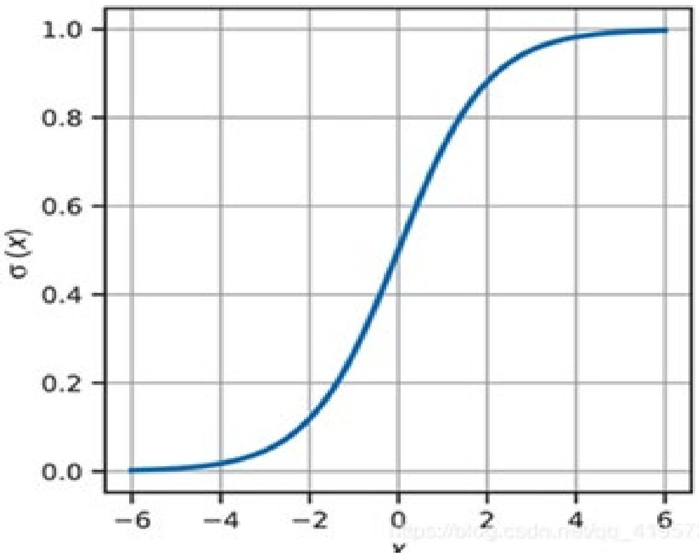

## 什么是神经网络

## 增加偏置项

·通过增加偏置项让Sigmoid函数平移

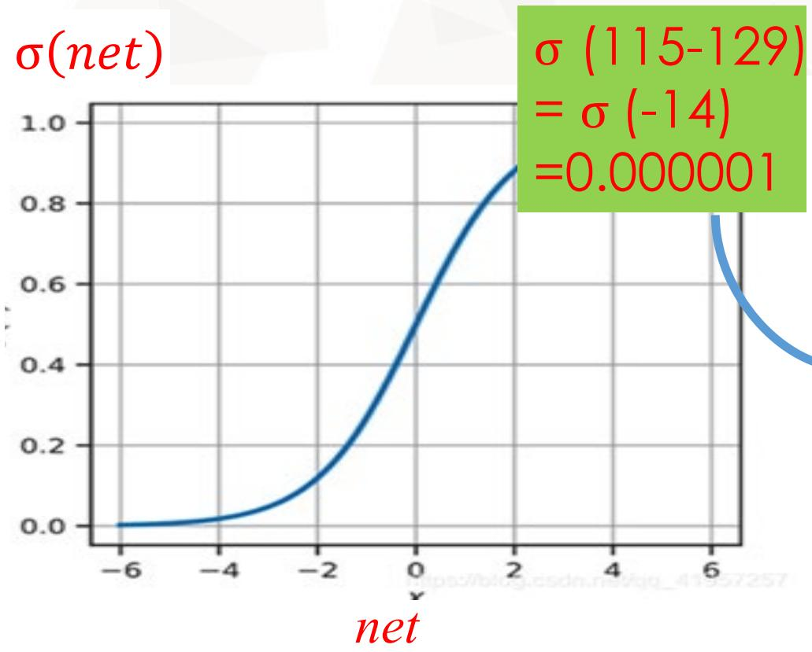  
σ (143-129) = σ (14) =0.999999

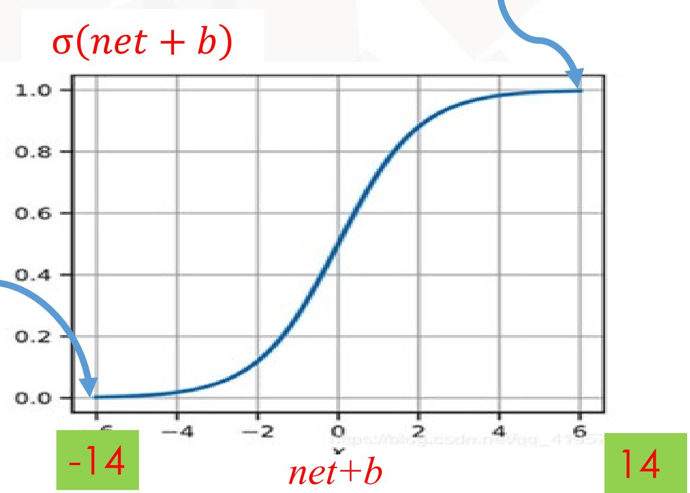

## 什么是神经网络

## 增加偏置项

·模式匹配：

$$
n e t = w _ { 1 } \cdot x _ { 1 } + w _ { 2 } \cdot x _ { 2 } + \cdots + w _ { n } \cdot x _ { n } + b
$$

y = sigmoid(net)

授课教师：李静瑶

## 什么是神经网络

## 图示表示

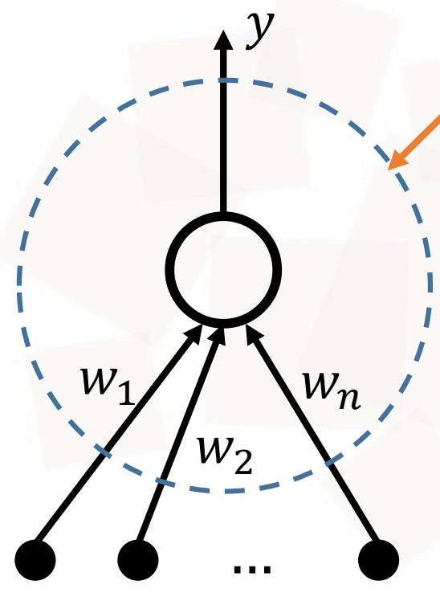  
X1 X2 Xn

神经元

模式

$$
n e t = w _ { 1 } \cdot x _ { 1 } + w _ { 2 } \cdot x _ { 2 } + \cdots + w _ { n } \cdot x _ { n } + b
$$

y = sigmoid(net)

授课教师：李静瑶

## 什么是神经网络

## 神经网络

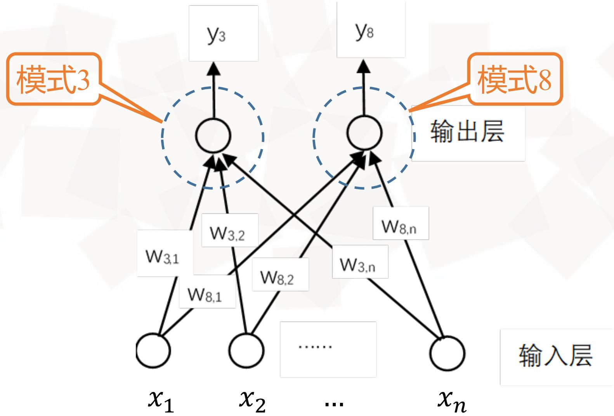  
授课教师：李静瑶

## 什么是神经网络

## 神经网络

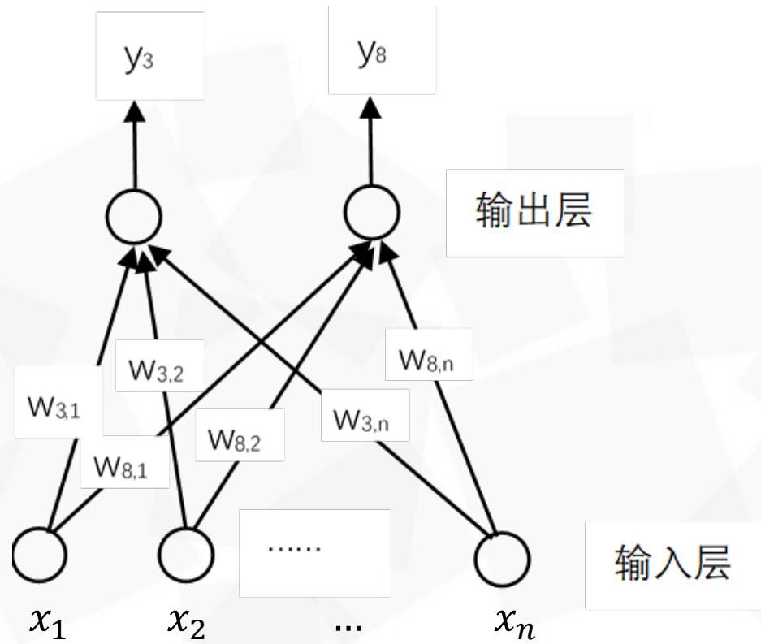

$$
y _ { 3 } = s i g m o i d \big ( w _ { 3 , 1 } \cdot x _ { 1 } + w _ { 3 , 2 } \cdot x _ { 2 } + \cdots + w _ { 3 , n } \cdot x _ { n } + b _ { 3 } \big )
$$

$$
y _ { 8 } = s i g m o i d \big ( w _ { 8 , 1 } \cdot x _ { 1 } + w _ { 8 , 2 } \cdot x _ { 2 } + \cdots + w _ { 8 , n } \cdot x _ { n } + b _ { 8 } \big )
$$

授课教师：李静瑶

## 什么是神经网络

## 数字识别神经网络

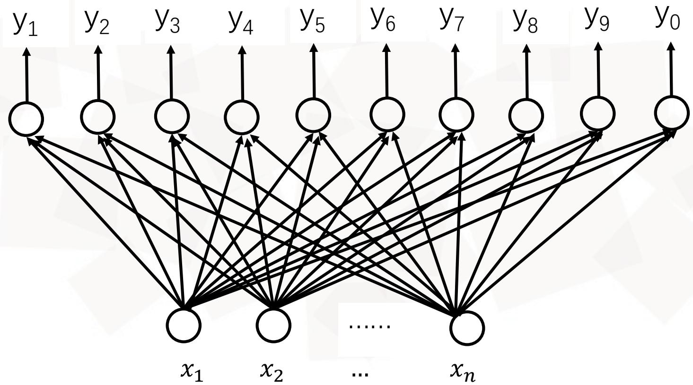

$$
y _ { i } = s i g m o i d \big ( w _ { i , 1 } \cdot x _ { 1 } + w _ { i , 2 } \cdot x _ { 2 } + \cdots + w _ { i , n } \cdot x _ { n } + b _ { i } \big )
$$

授课教师：李静瑶

## 什么是神经网络

## 神经网络的横向扩展 增加模式

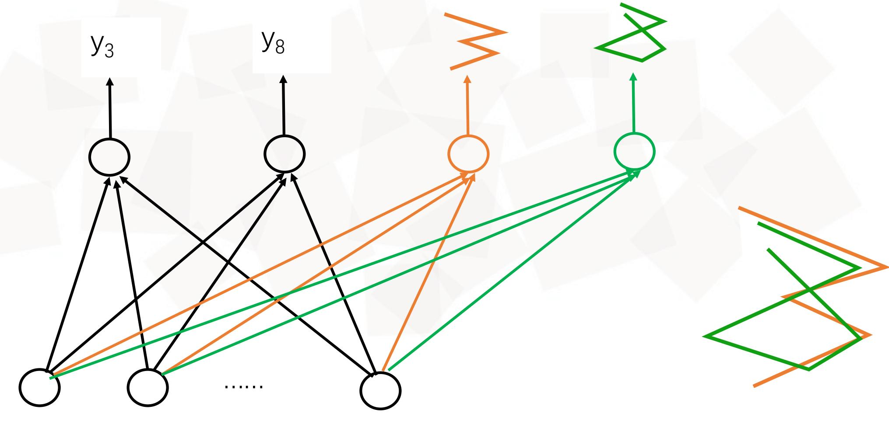  
X2  
授课教师：李静瑶  
Xn

## 什么是神经网络

## 神经网络的纵向扩展 局部模式

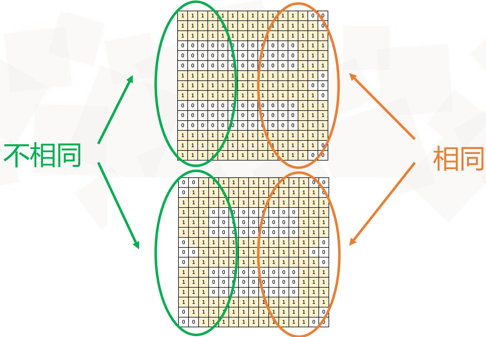  
授课教师：李静瑶

## 什么是神经网络

## 让神经网络更深 模式组合

3的右部
<table><tr><td rowspan=1 colspan=1>1</td><td rowspan=1 colspan=1>1</td><td rowspan=1 colspan=1>1</td><td rowspan=1 colspan=1>1</td><td rowspan=1 colspan=1>1</td><td rowspan=1 colspan=1>0</td><td rowspan=1 colspan=1>0</td></tr><tr><td rowspan=1 colspan=1>1</td><td rowspan=1 colspan=1>1</td><td rowspan=1 colspan=1>1</td><td rowspan=1 colspan=1>1</td><td rowspan=1 colspan=1>1</td><td rowspan=1 colspan=1>1</td><td rowspan=1 colspan=1>0</td></tr><tr><td rowspan=1 colspan=1>1</td><td rowspan=1 colspan=1>1</td><td rowspan=1 colspan=1>1</td><td rowspan=1 colspan=1>1</td><td rowspan=1 colspan=1>1</td><td rowspan=1 colspan=1>1</td><td rowspan=1 colspan=1>1</td></tr><tr><td rowspan=1 colspan=1>0</td><td rowspan=1 colspan=1>0</td><td rowspan=1 colspan=1>0</td><td rowspan=1 colspan=1>0</td><td rowspan=1 colspan=1>1</td><td rowspan=1 colspan=1>1</td><td rowspan=1 colspan=1>1</td></tr><tr><td rowspan=1 colspan=1>0</td><td rowspan=1 colspan=1>0</td><td rowspan=1 colspan=1>0</td><td rowspan=1 colspan=1>0</td><td rowspan=1 colspan=1>1</td><td rowspan=1 colspan=1>1</td><td rowspan=1 colspan=1>1</td></tr><tr><td rowspan=1 colspan=1>0</td><td rowspan=1 colspan=1>0</td><td rowspan=1 colspan=1>0</td><td rowspan=1 colspan=1>0</td><td rowspan=1 colspan=1>1</td><td rowspan=1 colspan=1>1</td><td rowspan=1 colspan=1>1</td></tr><tr><td rowspan=1 colspan=1>1</td><td rowspan=1 colspan=1>1</td><td rowspan=1 colspan=1>1</td><td rowspan=1 colspan=1>1</td><td rowspan=1 colspan=1>1</td><td rowspan=1 colspan=1>1</td><td rowspan=1 colspan=1>0</td></tr><tr><td rowspan=1 colspan=1>1</td><td rowspan=1 colspan=1>1</td><td rowspan=1 colspan=1>1</td><td rowspan=1 colspan=1>1</td><td rowspan=1 colspan=1>1</td><td rowspan=1 colspan=1>0</td><td rowspan=1 colspan=1>0</td></tr><tr><td rowspan=1 colspan=1>1</td><td rowspan=1 colspan=1>1</td><td rowspan=1 colspan=1>1</td><td rowspan=1 colspan=1>1</td><td rowspan=1 colspan=1>1</td><td rowspan=1 colspan=1></td><td rowspan=1 colspan=1>0</td></tr><tr><td rowspan=1 colspan=1>0</td><td rowspan=1 colspan=1>0</td><td rowspan=1 colspan=1>0</td><td rowspan=1 colspan=1>0</td><td rowspan=1 colspan=1>1</td><td rowspan=1 colspan=1>1</td><td rowspan=1 colspan=1>1</td></tr><tr><td rowspan=1 colspan=1>0</td><td rowspan=1 colspan=1>0</td><td rowspan=1 colspan=1>0</td><td rowspan=1 colspan=1>0</td><td rowspan=1 colspan=1>1</td><td rowspan=1 colspan=1>1</td><td rowspan=1 colspan=1>1</td></tr><tr><td rowspan=1 colspan=1>0</td><td rowspan=1 colspan=1>0</td><td rowspan=1 colspan=1>0</td><td rowspan=1 colspan=1>0</td><td rowspan=1 colspan=1>1</td><td rowspan=1 colspan=1>1</td><td rowspan=1 colspan=1>1</td></tr><tr><td rowspan=1 colspan=1>1</td><td rowspan=1 colspan=1>1</td><td rowspan=1 colspan=1>1</td><td rowspan=1 colspan=1>1</td><td rowspan=1 colspan=1>1</td><td rowspan=1 colspan=1>1</td><td rowspan=1 colspan=1>1</td></tr><tr><td rowspan=1 colspan=1>1</td><td rowspan=1 colspan=1>1</td><td rowspan=1 colspan=1>1</td><td rowspan=1 colspan=1>1</td><td rowspan=1 colspan=1>1</td><td rowspan=1 colspan=1>1</td><td rowspan=1 colspan=1>0</td></tr><tr><td rowspan=1 colspan=1></td><td rowspan=1 colspan=1></td><td rowspan=1 colspan=1>1</td><td rowspan=1 colspan=1></td><td rowspan=1 colspan=1></td><td rowspan=1 colspan=1>0</td><td rowspan=1 colspan=1>0</td></tr></table>

8的右部
<table><tr><td rowspan=1 colspan=1>1</td><td rowspan=1 colspan=1>1</td><td rowspan=1 colspan=1>1</td><td rowspan=1 colspan=1>1</td><td rowspan=1 colspan=1>1</td><td rowspan=1 colspan=1>1</td><td rowspan=1 colspan=1>0</td><td rowspan=1 colspan=1>0</td></tr><tr><td rowspan=1 colspan=1>1</td><td rowspan=1 colspan=1>1</td><td rowspan=1 colspan=1>1</td><td rowspan=1 colspan=1>1</td><td rowspan=1 colspan=1>1</td><td rowspan=1 colspan=1>1</td><td rowspan=1 colspan=1>1</td><td rowspan=1 colspan=1>0</td></tr><tr><td rowspan=1 colspan=1>1</td><td rowspan=1 colspan=1>1</td><td rowspan=1 colspan=1>1</td><td rowspan=1 colspan=1>1</td><td rowspan=1 colspan=1>1</td><td rowspan=1 colspan=1></td><td rowspan=1 colspan=1>1</td><td rowspan=1 colspan=1>1</td></tr><tr><td rowspan=1 colspan=1>0</td><td rowspan=1 colspan=1>0</td><td rowspan=1 colspan=1>0</td><td rowspan=1 colspan=1>0</td><td rowspan=1 colspan=1>0</td><td rowspan=1 colspan=1>1</td><td rowspan=1 colspan=1>1</td><td rowspan=1 colspan=1>1</td></tr><tr><td rowspan=1 colspan=1>0</td><td rowspan=1 colspan=1>0</td><td rowspan=1 colspan=1>0</td><td rowspan=1 colspan=1>0</td><td rowspan=1 colspan=1>0</td><td rowspan=1 colspan=1>1</td><td rowspan=1 colspan=1>1</td><td rowspan=1 colspan=1>1</td></tr><tr><td rowspan=1 colspan=1>0</td><td rowspan=1 colspan=1>0</td><td rowspan=1 colspan=1>0</td><td rowspan=1 colspan=1>0</td><td rowspan=1 colspan=1>0</td><td rowspan=1 colspan=1>1</td><td rowspan=1 colspan=1>1</td><td rowspan=1 colspan=1>1</td></tr><tr><td rowspan=1 colspan=1>1</td><td rowspan=1 colspan=1>1</td><td rowspan=1 colspan=1>1</td><td rowspan=1 colspan=1>1</td><td rowspan=1 colspan=1>1</td><td rowspan=1 colspan=1>1</td><td rowspan=1 colspan=1>1</td><td rowspan=1 colspan=1>0</td></tr><tr><td rowspan=1 colspan=1>1</td><td rowspan=1 colspan=1>1</td><td rowspan=1 colspan=1>1</td><td rowspan=1 colspan=1>1</td><td rowspan=1 colspan=1>1</td><td rowspan=1 colspan=1>1</td><td rowspan=1 colspan=1>0</td><td rowspan=1 colspan=1>0</td></tr><tr><td rowspan=1 colspan=1>1</td><td rowspan=1 colspan=1>1</td><td rowspan=1 colspan=1>1</td><td rowspan=1 colspan=1>1</td><td rowspan=1 colspan=1>1</td><td rowspan=1 colspan=1>1</td><td rowspan=1 colspan=1>1</td><td rowspan=1 colspan=1>0</td></tr><tr><td rowspan=1 colspan=1>0</td><td rowspan=1 colspan=1>0</td><td rowspan=1 colspan=1>0</td><td rowspan=1 colspan=1>0</td><td rowspan=1 colspan=1>0</td><td rowspan=1 colspan=1>1</td><td rowspan=1 colspan=1>1</td><td rowspan=1 colspan=1>1</td></tr><tr><td rowspan=1 colspan=1>0</td><td rowspan=1 colspan=1>0</td><td rowspan=1 colspan=1>0</td><td rowspan=1 colspan=1>0</td><td rowspan=1 colspan=1>0</td><td rowspan=1 colspan=1>1</td><td rowspan=1 colspan=1>1</td><td rowspan=1 colspan=1>1</td></tr><tr><td rowspan=1 colspan=1>0</td><td rowspan=1 colspan=1>0</td><td rowspan=1 colspan=1>0</td><td rowspan=1 colspan=1>0</td><td rowspan=1 colspan=1>0</td><td rowspan=1 colspan=1>1</td><td rowspan=1 colspan=1>1</td><td rowspan=1 colspan=1>1</td></tr><tr><td rowspan=1 colspan=1>1</td><td rowspan=1 colspan=1>1</td><td rowspan=1 colspan=1>1</td><td rowspan=1 colspan=1>1</td><td rowspan=1 colspan=1>1</td><td rowspan=1 colspan=1>1</td><td rowspan=1 colspan=1>1</td><td rowspan=1 colspan=1>1</td></tr><tr><td rowspan=1 colspan=1>1</td><td rowspan=1 colspan=1>1</td><td rowspan=1 colspan=1>1</td><td rowspan=1 colspan=1>1</td><td rowspan=1 colspan=1>1</td><td rowspan=1 colspan=1>1</td><td rowspan=1 colspan=1>1</td><td rowspan=1 colspan=1>0</td></tr><tr><td rowspan=1 colspan=1>1</td><td rowspan=1 colspan=1>1</td><td rowspan=1 colspan=1>1</td><td rowspan=1 colspan=1>1</td><td rowspan=1 colspan=1>1</td><td rowspan=1 colspan=1>1</td><td rowspan=1 colspan=1>0</td><td rowspan=1 colspan=1>0</td></tr></table>

3的左部  
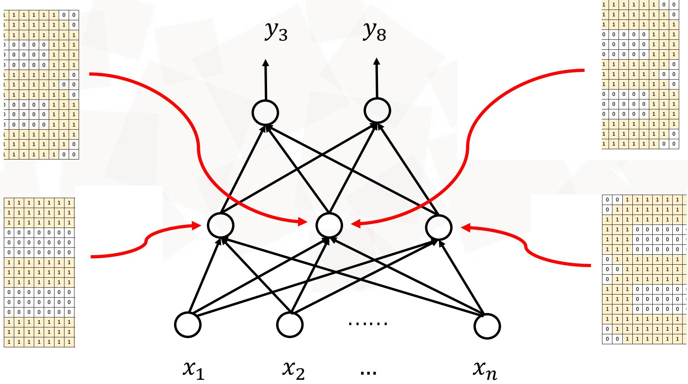

<table><tr><td rowspan=1 colspan=1>1</td><td rowspan=1 colspan=1>1</td><td rowspan=1 colspan=1>1</td><td rowspan=1 colspan=1>1</td><td rowspan=1 colspan=1>1</td><td rowspan=1 colspan=1>1</td><td rowspan=1 colspan=1>1</td></tr><tr><td rowspan=1 colspan=1>1</td><td rowspan=1 colspan=1>1</td><td rowspan=1 colspan=1>1</td><td rowspan=1 colspan=1>1</td><td rowspan=1 colspan=1>1</td><td rowspan=1 colspan=1>1</td><td rowspan=1 colspan=1>1</td></tr><tr><td rowspan=1 colspan=1>1</td><td rowspan=1 colspan=1>1</td><td rowspan=1 colspan=1>1</td><td rowspan=1 colspan=1>1</td><td rowspan=1 colspan=1>1</td><td rowspan=1 colspan=1>1</td><td rowspan=1 colspan=1>1</td></tr><tr><td rowspan=1 colspan=1>0</td><td rowspan=1 colspan=1>0</td><td rowspan=1 colspan=1>0</td><td rowspan=1 colspan=1>0</td><td rowspan=1 colspan=1>0</td><td rowspan=1 colspan=1>0</td><td rowspan=1 colspan=1>0</td></tr><tr><td rowspan=1 colspan=1>0</td><td rowspan=1 colspan=1>0</td><td rowspan=1 colspan=1>0</td><td rowspan=1 colspan=1>0</td><td rowspan=1 colspan=1>0</td><td rowspan=1 colspan=1>0</td><td rowspan=1 colspan=1>0</td></tr><tr><td rowspan=1 colspan=1>0</td><td rowspan=1 colspan=1>0</td><td rowspan=1 colspan=1>0</td><td rowspan=1 colspan=1>0</td><td rowspan=1 colspan=1>0</td><td rowspan=1 colspan=1>0</td><td rowspan=1 colspan=1>0</td></tr><tr><td rowspan=1 colspan=1>1</td><td rowspan=1 colspan=1>1</td><td rowspan=1 colspan=1>1</td><td rowspan=1 colspan=1>1</td><td rowspan=1 colspan=1>1</td><td rowspan=1 colspan=1>1</td><td rowspan=1 colspan=1>1</td></tr><tr><td rowspan=1 colspan=1>1</td><td rowspan=1 colspan=1>1</td><td rowspan=1 colspan=1>1</td><td rowspan=1 colspan=1>1</td><td rowspan=1 colspan=1>1</td><td rowspan=1 colspan=1>1</td><td rowspan=1 colspan=1>1</td></tr><tr><td rowspan=1 colspan=1>1</td><td rowspan=1 colspan=1>1</td><td rowspan=1 colspan=1>1</td><td rowspan=1 colspan=1>1</td><td rowspan=1 colspan=1>1</td><td rowspan=1 colspan=1>1</td><td rowspan=1 colspan=1>1</td></tr><tr><td rowspan=1 colspan=1>0</td><td rowspan=1 colspan=1>0</td><td rowspan=1 colspan=1>0</td><td rowspan=1 colspan=1>0</td><td rowspan=1 colspan=1>0</td><td rowspan=1 colspan=1>0</td><td rowspan=1 colspan=1>0</td></tr><tr><td rowspan=1 colspan=1>0</td><td rowspan=1 colspan=1>0</td><td rowspan=1 colspan=1>0</td><td rowspan=1 colspan=1>0</td><td rowspan=1 colspan=1>0</td><td rowspan=1 colspan=1>0</td><td rowspan=1 colspan=1>0</td></tr><tr><td rowspan=1 colspan=1>0</td><td rowspan=1 colspan=1>0</td><td rowspan=1 colspan=1>0</td><td rowspan=1 colspan=1>0</td><td rowspan=1 colspan=1>0</td><td rowspan=1 colspan=1>0</td><td rowspan=1 colspan=1>0</td></tr><tr><td rowspan=1 colspan=1>1</td><td rowspan=1 colspan=1>1</td><td rowspan=1 colspan=1>1</td><td rowspan=1 colspan=1>1</td><td rowspan=1 colspan=1>1</td><td rowspan=1 colspan=1>1</td><td rowspan=1 colspan=1>1</td></tr><tr><td rowspan=1 colspan=1>1</td><td rowspan=1 colspan=1>1</td><td rowspan=1 colspan=1>1</td><td rowspan=1 colspan=1>1</td><td rowspan=1 colspan=1>1</td><td rowspan=1 colspan=1>1</td><td rowspan=1 colspan=1>1</td></tr><tr><td rowspan=1 colspan=1>1</td><td rowspan=1 colspan=1>1</td><td rowspan=1 colspan=1>1</td><td rowspan=1 colspan=1>1</td><td rowspan=1 colspan=1>1</td><td rowspan=1 colspan=1>1</td><td rowspan=1 colspan=1>1</td></tr></table>

8的左部
<table><tr><td rowspan=1 colspan=1>0</td><td rowspan=1 colspan=1>0</td><td rowspan=1 colspan=1>1</td><td rowspan=1 colspan=1>1</td><td rowspan=1 colspan=1>1</td><td rowspan=1 colspan=1>1</td><td rowspan=1 colspan=1>1</td><td rowspan=1 colspan=1>1</td></tr><tr><td rowspan=1 colspan=1>0</td><td rowspan=1 colspan=1>1</td><td rowspan=1 colspan=1>1</td><td rowspan=1 colspan=1>1</td><td rowspan=1 colspan=1>1</td><td rowspan=1 colspan=1>1</td><td rowspan=1 colspan=1>1</td><td rowspan=1 colspan=1>1</td></tr><tr><td rowspan=1 colspan=1>1</td><td rowspan=1 colspan=1>1</td><td rowspan=1 colspan=1>1</td><td rowspan=1 colspan=1>1</td><td rowspan=1 colspan=1>1</td><td rowspan=1 colspan=1>1</td><td rowspan=1 colspan=1>1</td><td rowspan=1 colspan=1>1</td></tr><tr><td rowspan=1 colspan=1>1</td><td rowspan=1 colspan=1>1</td><td rowspan=1 colspan=1>1</td><td rowspan=1 colspan=1>0</td><td rowspan=1 colspan=1>0</td><td rowspan=1 colspan=1>0</td><td rowspan=1 colspan=1>0</td><td rowspan=1 colspan=1>0</td></tr><tr><td rowspan=1 colspan=1>1</td><td rowspan=1 colspan=1>1</td><td rowspan=1 colspan=1>1</td><td rowspan=1 colspan=1>0</td><td rowspan=1 colspan=1>0</td><td rowspan=1 colspan=1>0</td><td rowspan=1 colspan=1>0</td><td rowspan=1 colspan=1>0</td></tr><tr><td rowspan=1 colspan=1>1</td><td rowspan=1 colspan=1>1</td><td rowspan=1 colspan=1>1</td><td rowspan=1 colspan=1>0</td><td rowspan=1 colspan=1>0</td><td rowspan=1 colspan=1>0</td><td rowspan=1 colspan=1>0</td><td rowspan=1 colspan=1>0</td></tr><tr><td rowspan=1 colspan=1>0</td><td rowspan=1 colspan=1>1</td><td rowspan=1 colspan=1>1</td><td rowspan=1 colspan=1>1</td><td rowspan=1 colspan=1>1</td><td rowspan=1 colspan=1>1</td><td rowspan=1 colspan=1>1</td><td rowspan=1 colspan=1>1</td></tr><tr><td rowspan=1 colspan=1>0</td><td rowspan=1 colspan=1>0</td><td rowspan=1 colspan=1>1</td><td rowspan=1 colspan=1>1</td><td rowspan=1 colspan=1>1</td><td rowspan=1 colspan=1>1</td><td rowspan=1 colspan=1>1</td><td rowspan=1 colspan=1>1</td></tr><tr><td rowspan=1 colspan=1>0</td><td rowspan=1 colspan=1>1</td><td rowspan=1 colspan=1>1</td><td rowspan=1 colspan=1>1</td><td rowspan=1 colspan=1>1</td><td rowspan=1 colspan=1>1</td><td rowspan=1 colspan=1>1</td><td rowspan=1 colspan=1>1</td></tr><tr><td rowspan=1 colspan=1>1</td><td rowspan=1 colspan=1>1</td><td rowspan=1 colspan=1>1</td><td rowspan=1 colspan=1>0</td><td rowspan=1 colspan=1>0</td><td rowspan=1 colspan=1>0</td><td rowspan=1 colspan=1>0</td><td rowspan=1 colspan=1>0</td></tr><tr><td rowspan=1 colspan=1>1</td><td rowspan=1 colspan=1>1</td><td rowspan=1 colspan=1>1</td><td rowspan=1 colspan=1>0</td><td rowspan=1 colspan=1>0</td><td rowspan=1 colspan=1>0</td><td rowspan=1 colspan=1>0</td><td rowspan=1 colspan=1>0</td></tr><tr><td rowspan=1 colspan=1>1</td><td rowspan=1 colspan=1>1</td><td rowspan=1 colspan=1>1</td><td rowspan=1 colspan=1>0</td><td rowspan=1 colspan=1>0</td><td rowspan=1 colspan=1>0</td><td rowspan=1 colspan=1>0</td><td rowspan=1 colspan=1>0</td></tr><tr><td rowspan=1 colspan=1>1</td><td rowspan=1 colspan=1>1</td><td rowspan=1 colspan=1>1</td><td rowspan=1 colspan=1>1</td><td rowspan=1 colspan=1>1</td><td rowspan=1 colspan=1>1</td><td rowspan=1 colspan=1>1</td><td rowspan=1 colspan=1>1</td></tr><tr><td rowspan=1 colspan=1>0</td><td rowspan=1 colspan=1>1</td><td rowspan=1 colspan=1>1</td><td rowspan=1 colspan=1>1</td><td rowspan=1 colspan=1>1</td><td rowspan=1 colspan=1>1</td><td rowspan=1 colspan=1>1</td><td rowspan=1 colspan=1>1</td></tr><tr><td rowspan=1 colspan=1>0</td><td rowspan=1 colspan=1>0</td><td rowspan=1 colspan=1>1</td><td rowspan=1 colspan=1>1</td><td rowspan=1 colspan=1>1</td><td rowspan=1 colspan=1>1</td><td rowspan=1 colspan=1>1</td><td rowspan=1 colspan=1>1</td></tr></table>

授课教师：李静瑶

## 什么是神经网络

## 多层神经网络

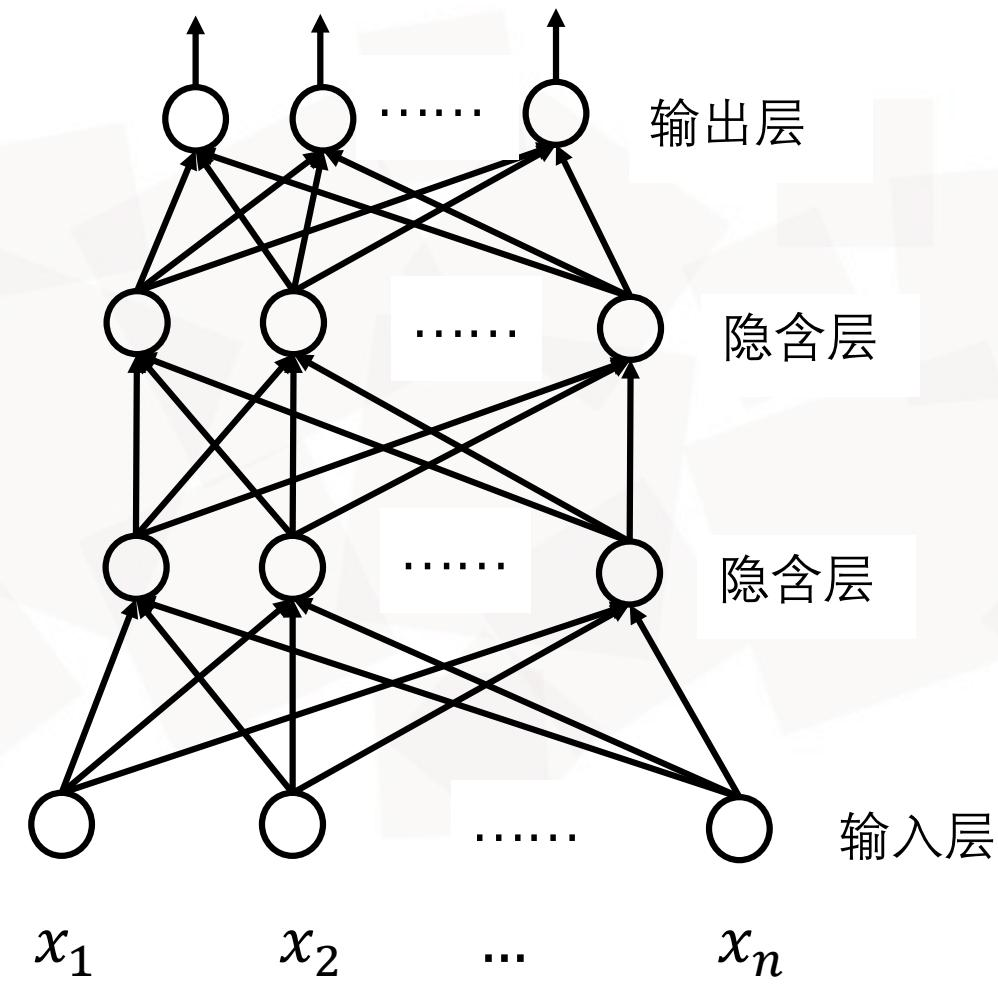  
授课教师：李静瑶

## 什么是神经网络

## 如何获得模式？

模式通过神经元的连接权重表示

通过训练样本，自动学习权重，也就是模式

不是人工设计！

学习到的模式是一种隐含表达，并不像我们举例的这样清晰

授课教师：李静瑶

## 什么是神经网络

## 神经元与神经网络

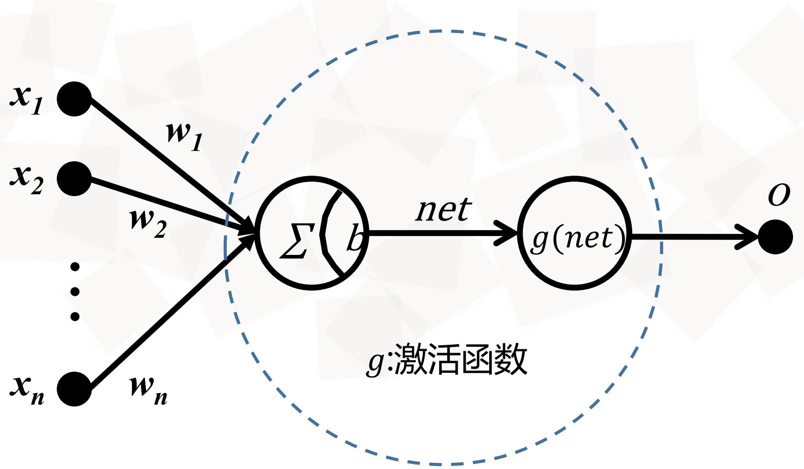  
授课教师：李静瑶

## 什么是神经网络

## 神经元

$$
{ \begin{array} { r l } { n e t = w _ { 1 } \cdot x _ { 1 } + w _ { 2 } \cdot x _ { 2 } + \cdots + w _ { n } \cdot x _ { n } + b } \\ { \displaystyle } & { = \sum _ { i = 1 } ^ { n } w _ { i } \cdot x _ { i } + b } \end{array} }
$$

$$
\mathbf { 0 } = g ( n e t )
$$

令: $x _ { 0 } = 1 , \quad w _ { 0 } = b$

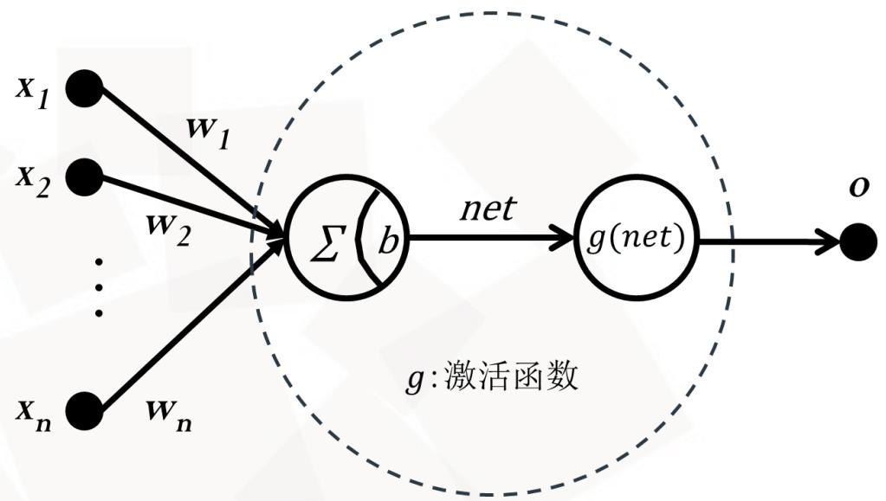

则：

$$
{ \begin{array} { r l } { n e t = w _ { 0 } \cdot x _ { 0 } + w _ { 1 } \cdot x _ { 1 } + w _ { 2 } \cdot x _ { 2 } + \cdots + w _ { n } \cdot x _ { n } } \\ { \displaystyle } & { = \sum _ { i = 0 } ^ { n } w _ { i } \cdot x _ { i } } \end{array} }
$$

授课教师：李静瑶

## 什么是神经网络

## 神经元的向量表示

输入： $x = \left[ x _ { 0 } , x _ { 1 } , \ldots , x _ { n } \right]$

权重： $w = \left[ w _ { 0 } , w _ { 1 } , \dots , w _ { n } \right]$

$$
n e t = w \cdot x
$$

$$
o = g ( n e t )
$$

## 什么是神经网络

## 激活函数

·符号函数

$$
g ( n e t ) = \operatorname { s g n } ( n e t ) = { \left\{ \begin{array} { l l } { 1 , } & { { \ddot { \equiv } } { \bmod { } } n e t \geq 0 } \\ { - 1 , } & { { \ddot { \equiv } } { \bmod { } } < 0 } \end{array} \right. }
$$

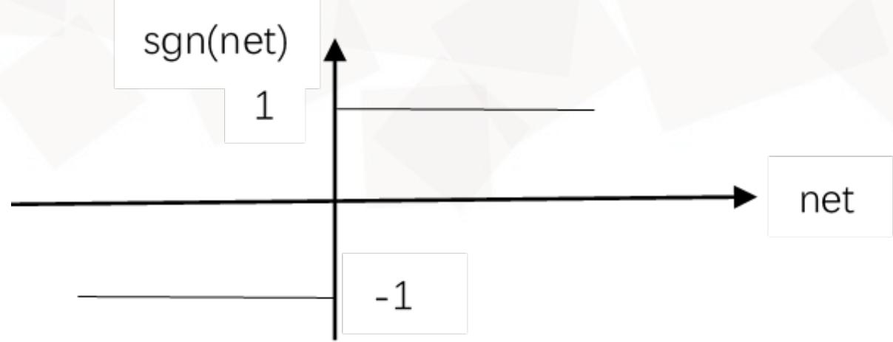  
授课教师：李静瑶

## 什么是神经网络

## 激活函数

·Sigmoid函数

$$
g ( n e t ) = \sigma ( n e t ) = \frac { 1 } { 1 + e ^ { - n e t } }
$$

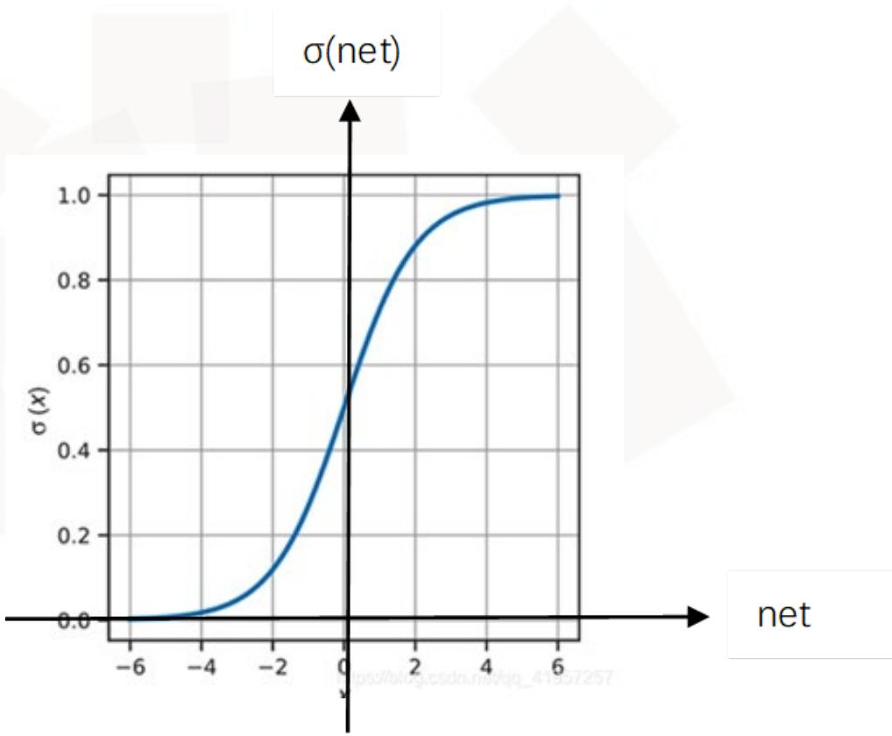  
授课教师：李静瑶

## 什么是神经网络

## 激活函数

·双曲正切函数

$$
g ( n e t ) = \operatorname { t a n h } ( n e t ) = { \frac { e ^ { n e t } - e ^ { - n e t } } { e ^ { n e t } + e ^ { - n e t } } }
$$

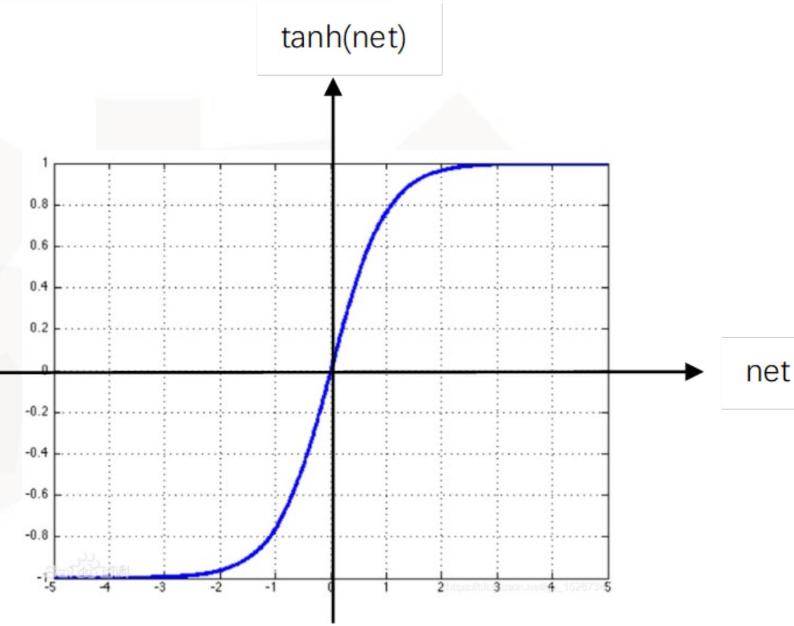  
授课教师：李静瑶

## 什么是神经网络

## 激活函数

·线性整流函数

$$
g ( n e t ) = \mathrm { R e L U } ( n e t ) = \operatorname* { m a x } ( 0 , n e t )
$$

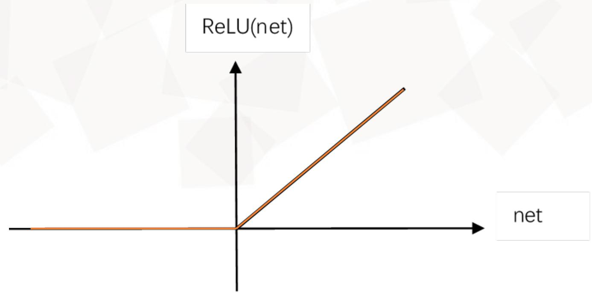  
授课教师：李静瑶

## 什么是神经网络

## 激活函数

·Softmax函数

$$
o _ { k } = \frac { e ^ { n e t _ { k } } } { \sum _ { i = 1 } ^ { m } e ^ { n e t _ { i } } }
$$

$$
0 \leq o _ { k } \leq 1
$$

$$
\begin{array} { r } { \sum _ { k = 1 } ^ { m } o _ { k } = 1 } \end{array}
$$

授课教师：李静瑶

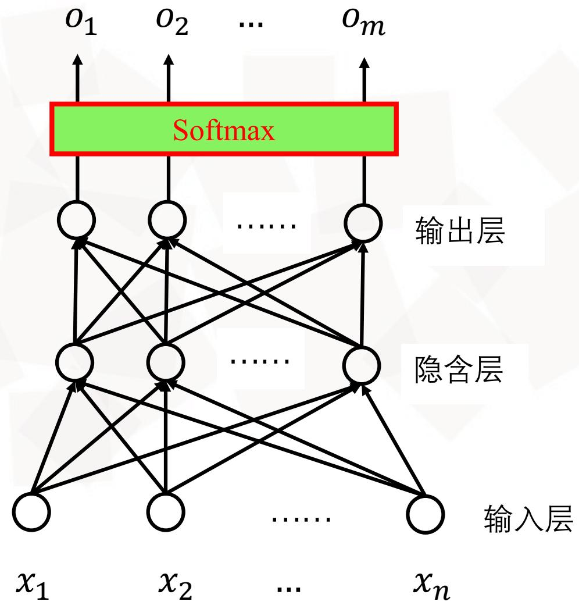

## 什么是神经网络

## 全连接网络

·术语：全连接网络，前馈网络，多层感知机，全连接层，稠密层

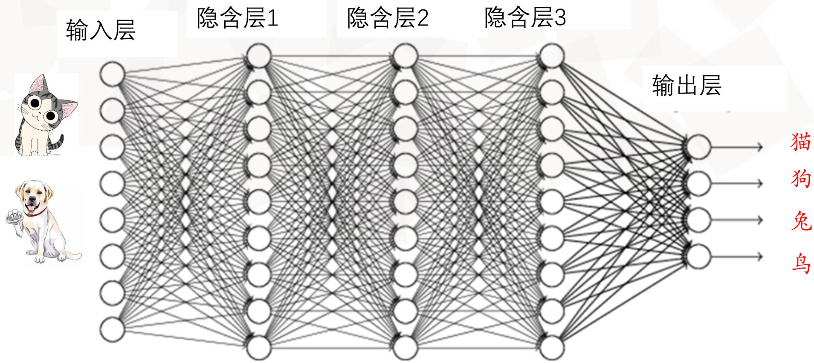  
授课教师：李静瑶

## 神经网络的训练

## 如何认识小动物

  
授课教师：李静瑶

## 神经网络的训练

## 建立数据集

收集各种动物的照片

不同姿势

不同角度

不同大小

数据标注

每张照片标注上动物的名称

训练集与测试集

样本

授课教师：李静瑶

这个是猫

这个是狗！

## 神经网络的训练

## 如何训练

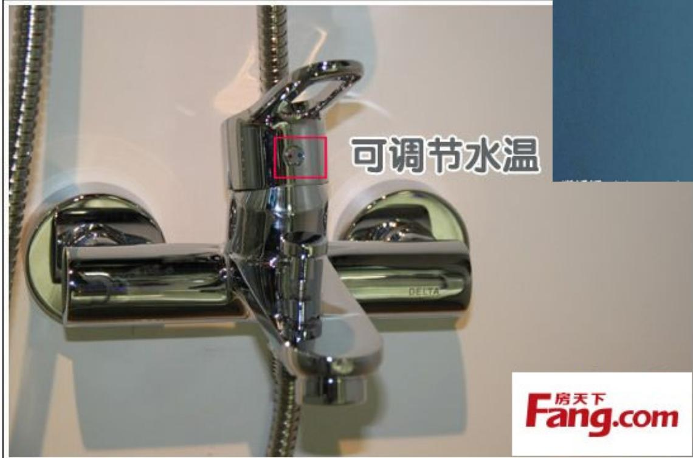

  
授课教师：李静瑶

## 神经网络的训练

## 淋浴器示意图

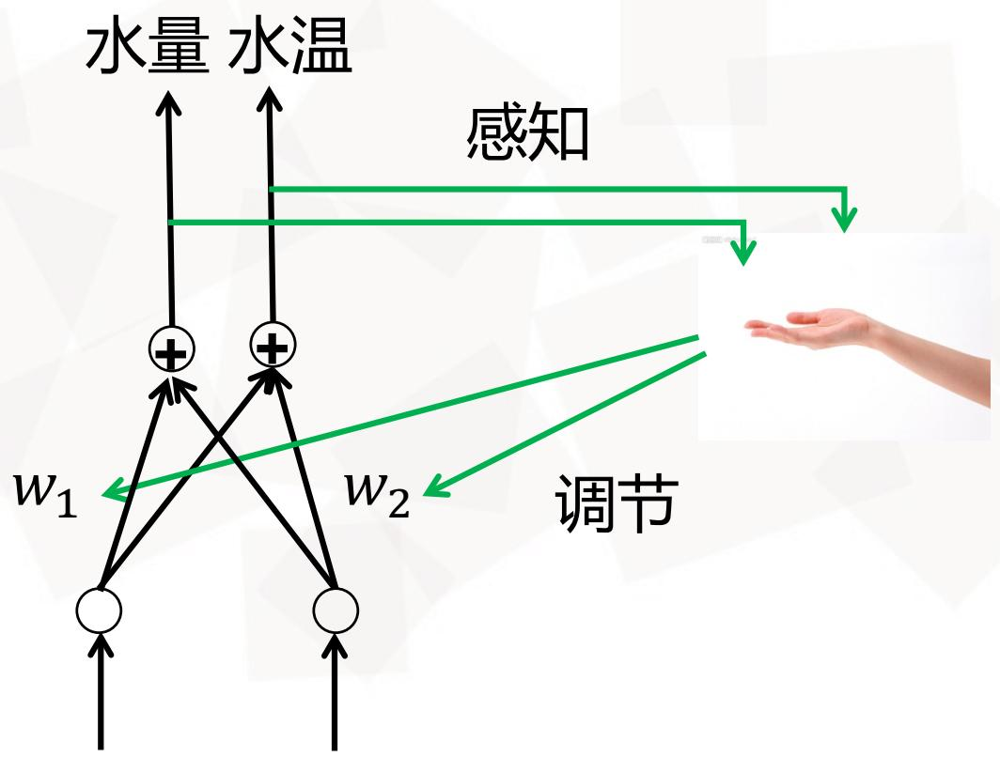  
热水 冷水

授课教师：李静瑶

## 神经网络的训练

如何评价调节效果 -损失函数

E(阀门) $= ( t _ { 7 | \mathsf { X } _ { I , \varSigma } ^ { \ast } } - o _ { 7 | \mathsf { X } _ { I , \varSigma } ^ { \ast } } ) ^ { 2 } + \left( t _ { 7 | \mathsf { X } _ { I , \varXi } ^ { \ast } } - o _ { 7 | \mathsf { X } _ { \varXi } ^ { \varXi } } \right) ^ { 2 }$

$t _ { \tt 7 K i E }$ ：希望水温

$t _ { \mathrm { 7 k } }$ 量：希望水量

水温：实际水温

$o _ { 7 \mathrm { k } }$ 量：实际水量

授课教师：李静瑶

水量水温

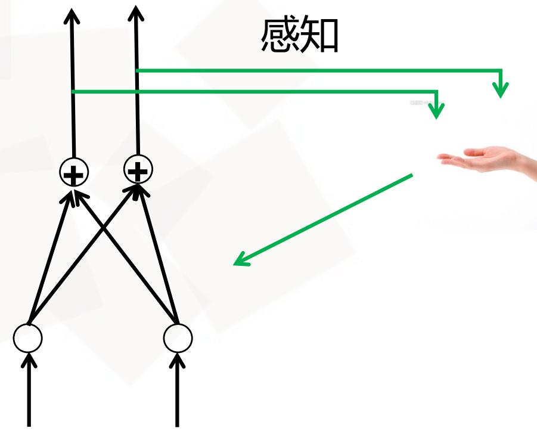  
热水 冷水

## 神经网络的训练

## 损失函数—误差平方和

对样本d的误差

$$
E _ { d } ( w ) = \frac { 1 } { 2 } \sum _ { k = 1 } ^ { m } ( t _ { k d } - o _ { k d } ) ^ { 2 }
$$

对所有样本的误差

$$
\begin{array} { l } { \displaystyle { E ( w ) = \frac { 1 } { 2 } \sum _ { d = 1 } ^ { n } E _ { d } ( \mathbf { w } ) } } \\ { \displaystyle { = \frac { 1 } { 2 } \sum _ { d = 1 } ^ { n } \sum _ { k = 1 } ^ { m } ( t _ { k d } - o _ { k d } ) ^ { 2 } } } \end{array}
$$

$t _ { k d }$ ：对应样本d的第k个希望输出

$o _ { k d }$ ：对应样本d的第k个实际输出

## 神经网络的训练

## 如何训练

损失函数最小化问题

$$
E _ { d } ( w ) = \frac { 1 } { 2 } \sum _ { k = 1 } ^ { m } ( t _ { k d } - o _ { k d } ) ^ { 2 }
$$

$$
\begin{array} { l } { \displaystyle { E ( w ) = \frac { 1 } { 2 } \sum _ { d = 1 } ^ { n } E _ { d } ( \mathbf { w } ) } } \\ { \displaystyle { = \frac { 1 } { 2 } \sum _ { d = 1 } ^ { n } \sum _ { k = 1 } ^ { m } ( t _ { k d } - o _ { k d } ) ^ { 2 } } } \end{array}
$$

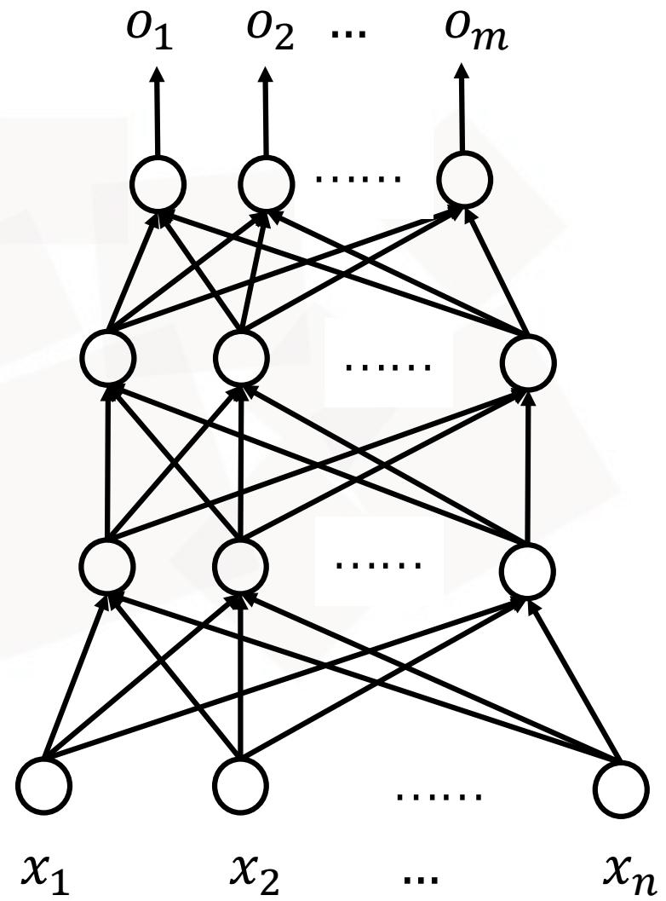  
授课教师：李静瑶

## 神经网络的训练

## 梯度下降法

求f(θ)的最小值

迭代逼近

$$
\theta _ { i + 1 } = \theta _ { i } + \triangle \theta _ { i }
$$

两个问题：

修改量的大小

修改的方向

$$
\triangle \ : \Theta _ { i } = - \frac { d f } { d \theta }
$$

授课教师：李静瑶

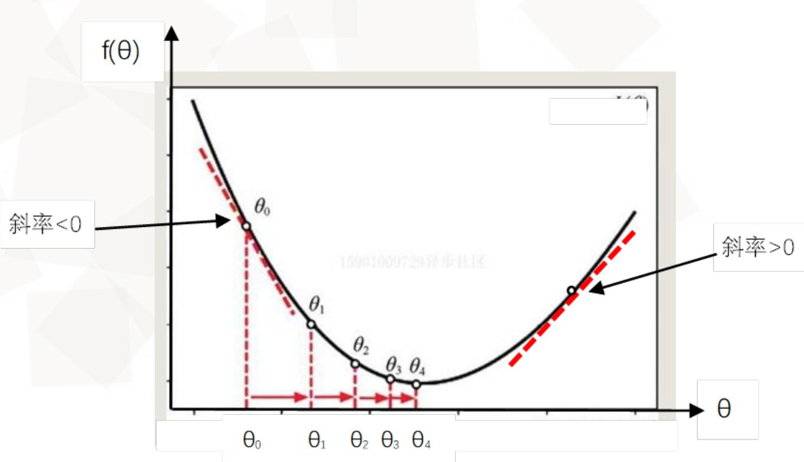

## 神经网络的训练

## 梯度下降法

震荡问题

步长n

$$
\triangle \ : \Theta _ { i } = - \eta \frac { d f } { d \theta }
$$

授课教师：李静瑶

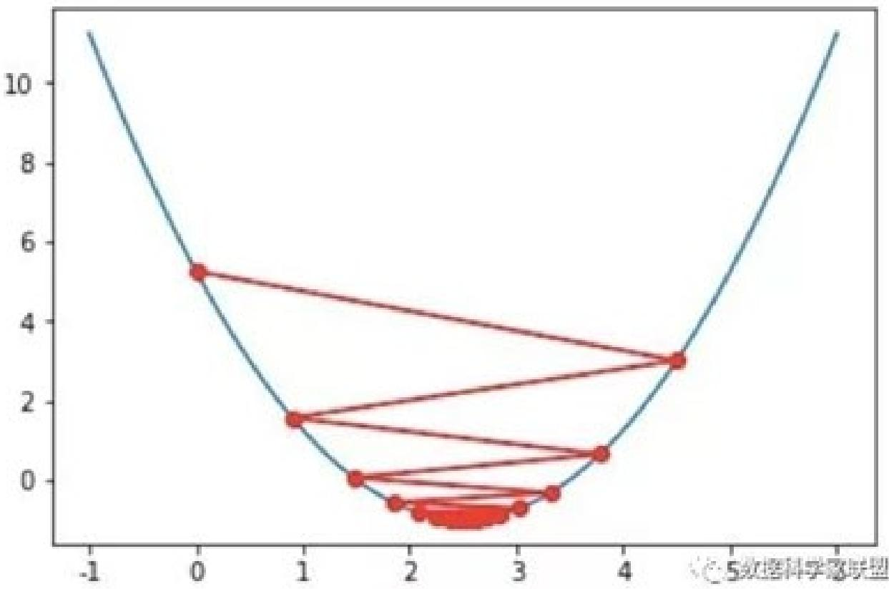

## 神经网络的训练

## 梯度下降法

迭代公式：

$$
\begin{array} { c } { { \displaystyle { \bf w } _ { i } ^ { n e w } = w _ { i } ^ { o l d } + \triangle w _ { i } } } \\ { { \triangle { \bf w } _ { i } = - \eta \frac { \partial E ( w ) } { \partial w _ { i } } } } \end{array}
$$

梯度:

$$
V _ { w } E ( w ) = \left[ \frac { \partial E ( w ) } { \partial w _ { 1 } } , \frac { \partial E ( w ) } { \partial w _ { 2 } } , \dots , \frac { \partial E ( w ) } { \partial w _ { n } } \right]
$$

$$
\boldsymbol { \mathrm { w } } ^ { n e w } = \boldsymbol { w } ^ { o l d } + \boldsymbol { \triangle } \boldsymbol { w }
$$

授课教师：李静瑶

$$
\triangle \mathrm { w } = - \eta \nabla _ { w } E ( w )
$$

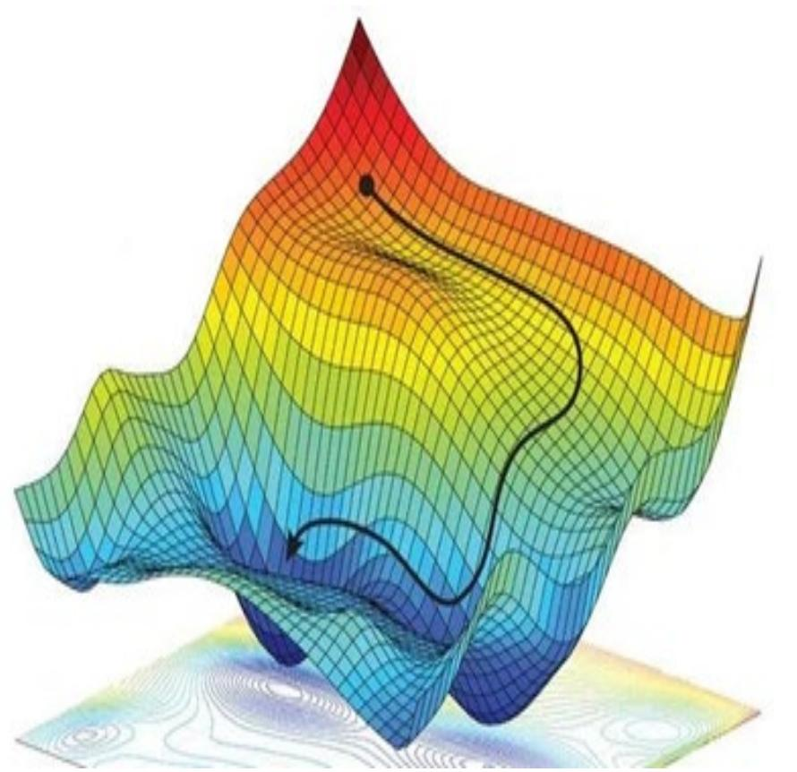

## 神经网络的训练

## 梯度下降算法

批量梯度下降算法

每次处理全部样本

随机梯度下降算法

每次处理一个样本

小批量梯度下降算法

每次处理小批量的样本

$$
E ( w ) = \frac { 1 } { 2 } \sum _ { d = 1 } ^ { n } \sum _ { k = 1 } ^ { m } ( t _ { k d } - o _ { k d } ) ^ { 2 }
$$

$$
E _ { d } ( w ) = \frac { 1 } { 2 } \sum _ { k = 1 } ^ { m } ( t _ { k d } - o _ { k d } ) ^ { 2 }
$$

$$
E ( w ) = \frac { 1 } { 2 } \sum _ { d = k } ^ { k + B } \sum _ { k = 1 } ^ { m } ( t _ { k d } - o _ { k d } ) ^ { 2 }
$$

授课教师：李静瑶

## 神经网络的训练

## 符号说明

$\cdot$ k的希望输出$\cdot$ k的实际输出

$\cdot$ h的第i个输入$\cdot$ h的第i个权重

授课教师：李静瑶

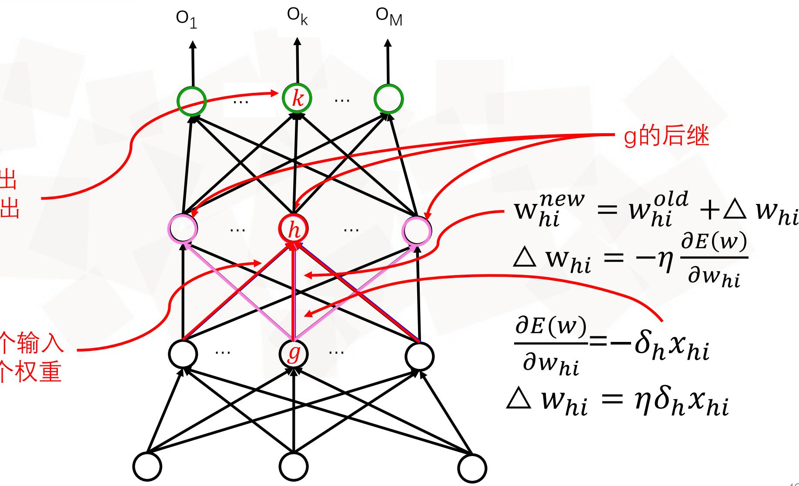

## 神经网络的训练

反向传播算法 (BP: Back Propagation)

又称作误差反向传播算法

给出了一种计算偏导数的方法

授课教师：李静瑶

## 神经网络的训练

3.计算输出层神经元的 $\cdot$

$$
-
$$

5.用 $\cdot$ 计算隐含层2的 $\delta$

$$
\delta _ { h } = o _ { h } ( 1 - o _ { h } )
$$

$k \in \mathcal Ḋ$ 后继(h)

7.用 $\cdot$ 计算隐含层1的 $\cdot$ g

$$
\delta _ { g } = o _ { g } ( 1 - o _ { g } )
$$

ke后继(g)

1.输入一个样本计算所有神经元的输出

## 反向传播算法（BP)

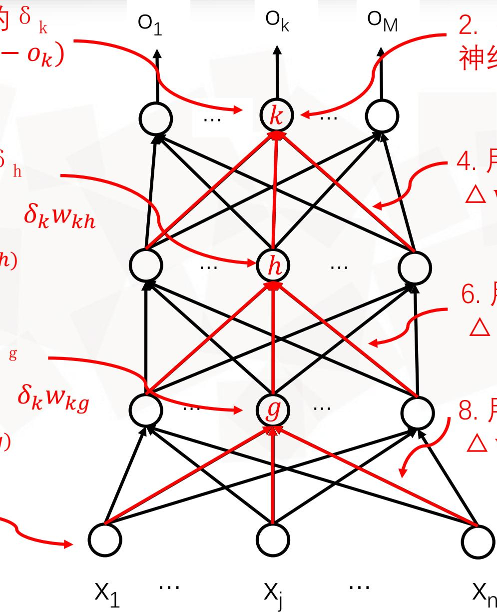

2.得到输出层神经元k的输出

4.用 $\cdot$ 值更新权重

$$
\triangle \mathrm { w } _ { k i } = \eta \delta _ { k } x _ { k i } , \mathrm { w } _ { k i } = w _ { k i } + \triangle w _ { k i }
$$

6.用 $\delta _ { \mathrm { ~ h ~ } }$ 值更新权重

$$
^ -
$$

8.用 $\cdot$ 值更新权重

$$
-
$$

## 神经网络的训练

$$
\begin{array} { r } { \circ _ { k } = S i g m o i d \bigl ( \sum _ { i } ( w _ { k i } \cdot x _ { k i } ) + b _ { k } \bigr ) } \end{array}
$$

$$
L o s s = \frac { 1 } { 2 } ( t _ { k } - \mathbf { o } _ { k } ) ^ { 2 }
$$

$$
\begin{array} { r l } & { \displaystyle \frac { \partial L o s s } { \partial w _ { k i } } = - ( t _ { k } - \boldsymbol { \mathrm { o } } _ { k } ) \cdot \frac { \partial \boldsymbol { \mathrm { o } } _ { k } } { \partial w _ { k i } } } \\ & { = - ( t _ { k } - \boldsymbol { \mathrm { o } } _ { k } ) \cdot \boldsymbol { \mathrm { o } } _ { k } \cdot ( 1 - \boldsymbol { \mathrm { o } } _ { k } ) \cdot \frac { \partial \left( \sum _ { i } ( w _ { k i } \cdot x _ { k i } ) + b _ { k } \right) } { \partial w _ { k i } } } \\ & { = - ( t _ { k } - \boldsymbol { \mathrm { o } } _ { k } ) \cdot \boldsymbol { \mathrm { o } } _ { k } \cdot ( 1 - \boldsymbol { \mathrm { o } } _ { k } ) \cdot x _ { k i } = - \delta _ { k } x _ { k i } } \end{array}
$$

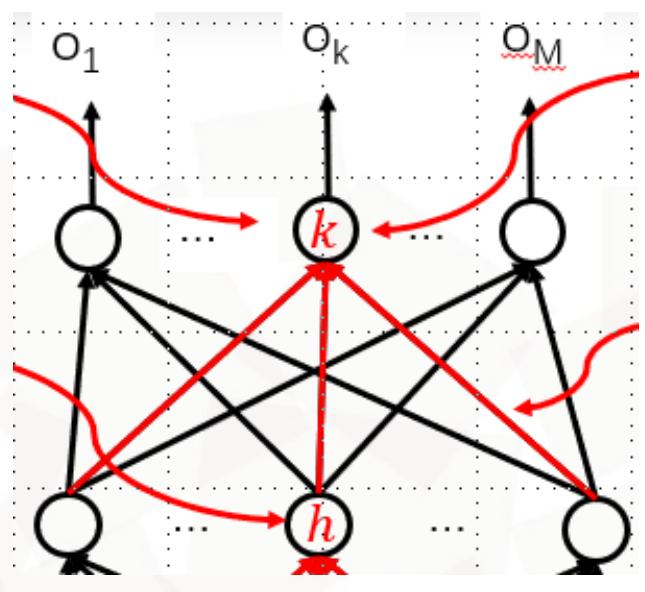  
授课教师：李静瑶

## 2 神经网络的训练

$$
\mathrm { \Sigma } _ { 0 _ { k } } = S i g m o i d \left( \left( w _ { k h } \cdot \mathrm { o } _ { h } \right) + \sum _ { h ^ { \prime } \neq h } \left( w _ { k h ^ { \prime } } \cdot \mathrm { o } _ { h ^ { \prime } } \right) + b _ { k } \right)
$$

$$
\rho _ { h } = S i g m o i d \left( \sum _ { i } { \left( w _ { h i } \cdot x _ { h i } \right) } + b _ { h } \right)
$$

$$
L o s s = \frac { 1 } { 2 } { \sum } _ { k = 1 } ^ { M } ( t _ { k } - \mathbf { o } _ { k } ) ^ { 2 }
$$

$$
\begin{array} { l } { \displaystyle \frac { \partial L o s s } { \partial w _ { h i } } = - \sum _ { k = 1 } ^ { M } ( t _ { k } - \boldsymbol { \mathrm { o } } _ { k } ) \cdot \frac { \partial \boldsymbol { \mathrm { o } } _ { k } } { \partial w _ { h i } } } \\ { = - \sum _ { k = 1 } ^ { M } ( t _ { k } - \boldsymbol { \mathrm { o } } _ { k } ) \cdot \boldsymbol { \mathrm { o } } _ { k } \cdot ( 1 - \boldsymbol { \mathrm { o } } _ { k } ) \cdot \frac { \partial ( w _ { k h } \cdot \boldsymbol { \mathrm { o } } _ { h } ) } { \partial w _ { h i } } } \\ { = - \sum _ { k = 1 } ^ { M } ( t _ { k } - \boldsymbol { \mathrm { o } } _ { k } ) \cdot \boldsymbol { \mathrm { o } } _ { k } \cdot ( 1 - \boldsymbol { \mathrm { o } } _ { k } ) \cdot w _ { k h } \cdot \frac { \partial ( \boldsymbol { \mathrm { o } } _ { h } ) } { \partial w _ { h i } } } \end{array}
$$

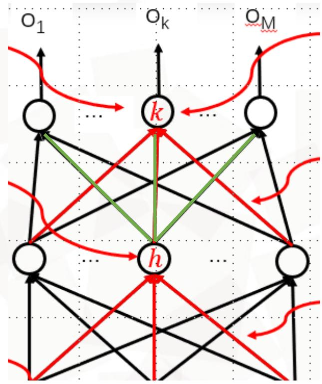  
授课教师：李静瑶

## 神经网络的训练

$$
\begin{array} { r l } & { \qquad \mathbf { n } _ { 1 } - S i g m a n d \left( \displaystyle \sum _ { i } \left( w _ { k h } \cdot x _ { n i } \right) + b _ { h } \right) } \\ & { \frac { \partial \boldsymbol { H } \cdot \boldsymbol { \mathbf { s } } } { \partial \boldsymbol { W } _ { k h } } = - \displaystyle \sum _ { i = 1 } ^ { \infty } \left( t _ { k } - v _ { k } \right) \cdot \frac { \partial \mathbf { t } _ { k } } { \partial \boldsymbol { W } _ { k h } } } \\ & { = - \displaystyle \sum _ { k = 1 } ^ { H } \left( t _ { k } - \boldsymbol { \mathbf { \Phi } } _ { 0 i } \right) \cdot \boldsymbol { \mathbf { \Phi } } _ { 0 k } \cdot ( 1 - \boldsymbol { \mathbf { \Phi } } _ { 0 k } ) \cdot \frac { \partial \left( \boldsymbol { W } _ { k h } \cdot \boldsymbol { \mathbf { \Phi } } _ { 0 h } \right) } { \partial \boldsymbol { W } _ { k h } } } \\ & { = - \displaystyle \sum _ { k = 1 } ^ { H } \left( t _ { k } - \boldsymbol { \mathbf { \Phi } } _ { 0 k } \right) \cdot \boldsymbol { \mathbf { \Phi } } _ { 0 k } \cdot ( 1 - \boldsymbol { \mathbf { \Phi } } _ { 0 k } ) \cdot \boldsymbol { W } _ { k h } \cdot \frac { \partial ( \boldsymbol { W } _ { k h } ) } { \partial \boldsymbol { W } _ { k h } } } \\ & { = - \displaystyle \sum _ { k = 1 } ^ { H } \left( t _ { k } - v _ { k } \right) \cdot \boldsymbol { \mathbf { \Phi } } _ { 0 k } \cdot ( 1 - \boldsymbol { \mathbf { \Phi } } _ { 0 k } ) \cdot \boldsymbol { W } _ { k h } \cdot \boldsymbol { \mathbf { \Phi } } _ { 0 k } \cdot ( 1 - \boldsymbol { \mathbf { \Phi } } _ { 0 k } ) \cdot \boldsymbol { x } _ { h i } } \\ &  = - \displaystyle \sum _ { k = 1 } ^ { H } \frac { \left( t _ { k } - v _ { k } \right) } { k } \cdot \boldsymbol { W } _ { k h } \cdot \boldsymbol { \mathbf { \Phi } } _ { 0 k } \cdot ( 1 - \boldsymbol { \mathbf { \Phi } } _ { 0 k } ) \cdot \boldsymbol { W } _ { k h } \cdot \boldsymbol   \end{array}
$$

授课教师：李静瑶

## 神经网络的训练

## 该BP算法的条件

·具体条件不同，算法会有差异，总体思路一样

全连接网络

其它形式的网络

随机梯度下降算法

批量、小批量梯度下降算法

激活函数：Sigmoid函数

其它的激活函数

损失函数：误差平方和

其它的损失函数

## 神经网络的训练

## 交叉熵损失函数

$$
\begin{array} { r } { H _ { d } ( w ) = - \sum _ { k = 1 } ^ { M } t _ { k d } \mathrm { l o g } ( o _ { k d } ) } \end{array}
$$

$$
\begin{array} { r } { H ( w ) = \sum _ { d = 1 } ^ { N } H _ { d } ( \mathbf { w } ) = - \sum _ { d = 1 } ^ { N } \sum _ { k = 1 } ^ { M } t _ { k d } \mathrm { l o g } ( o _ { k d } ) } \end{array}
$$

$t _ { k d }$ ：样本d对应的希望输出值

$o _ { k d }$ ：样本d对应的实际输出值，要求 $\mathbf { \xi } ^ { O } k d$ 是个概率值

授课教师：李静瑶

## 神经网络的训练

## 交叉熵损失函数

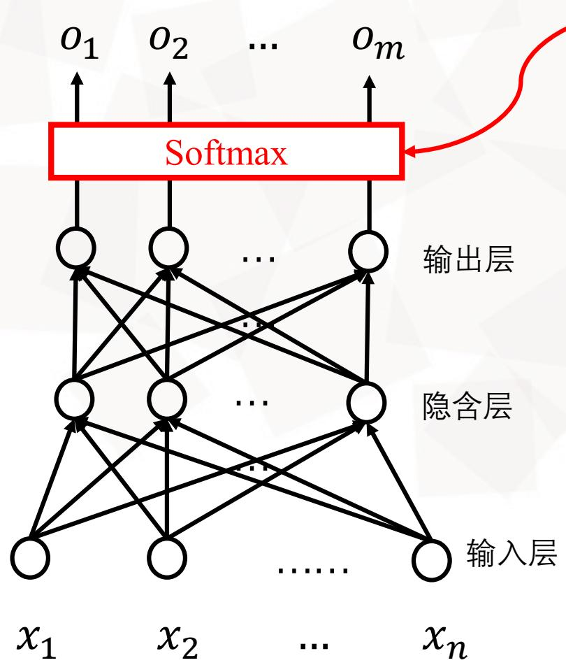  
授课教师：李静瑶

$$
\begin{array} { r } { o _ { k } = \frac { e ^ { n e t _ { k } } } { \sum _ { i = 1 } ^ { m } e ^ { n e t _ { i } } } } \end{array}
$$

$$
\begin{array} { c } { { 0 \leq o _ { k } \leq 1 } } \\ { { \sum _ { k = 1 } ^ { m } o _ { k } = 1 } } \end{array}
$$

## 神经网络的训练

## 交叉熵损失函数

·对于分类问题

·对于给定输入样本d，只有d对应的希望输出为1，其他为0

$$
H _ { d } ( w ) = - \mathrm { l o g } ( o _ { k d } )
$$

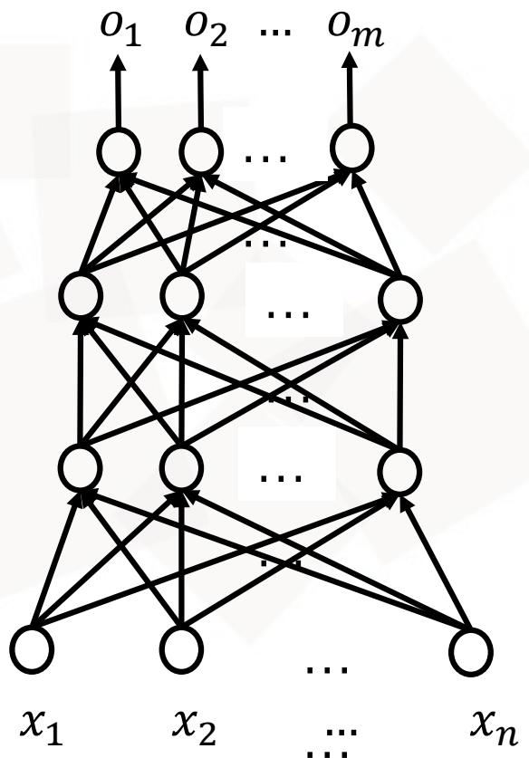

## 神经网络的训练

## 两种损失函数的作用

·误差平方和损失函数

·用于输出是具体数值的问题

·交叉熵损失函数

·用于分类问题

授课教师：李静瑶

## 神经网络的训练

## 神经网络的训练流程

·建立数据集

·损失函数

·误差平方和、交叉熵

·梯度下降法

·批量梯度下降算法

随机梯度下降算法

·小批量梯度下降算法

## ·BP算法

·随机梯度下降算法的一种实现

授课教师：李静瑶

## 卷积神经网络

## 全连接网络的不足

连接权重过多

影响训练速度

影响使用速度

授课教师：李静瑶

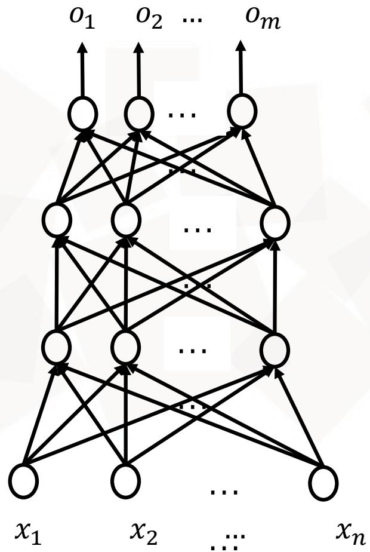

## 卷积神经网络

## 提取局部模式

<table><tr><td>0</td><td></td><td>0</td><td>0</td><td>0</td><td></td><td></td><td>0</td><td>o。00000000</td><td></td><td></td><td></td><td></td><td></td><td></td><td></td><td></td><td></td></tr><tr><td>0</td><td></td><td>1</td><td>1</td><td></td><td>1</td><td>1</td><td>000000000□。</td><td></td><td></td><td></td><td></td><td></td><td></td><td></td><td></td><td></td><td></td></tr><tr><td>0</td><td>1</td><td></td><td>111</td><td>1</td><td></td><td></td><td>□0000□0000□0</td><td></td><td></td><td></td><td></td><td></td><td></td><td></td><td></td><td></td><td></td></tr><tr><td></td><td></td><td></td><td></td><td></td><td></td><td></td><td>00000000000000000</td><td></td><td></td><td></td><td></td><td></td><td></td><td></td><td></td><td></td><td></td></tr><tr><td></td><td></td><td></td><td></td><td></td><td></td><td></td><td>。□□[00000000。□□n。</td><td></td><td></td><td></td><td></td><td></td><td></td><td></td><td></td><td></td><td></td></tr><tr><td></td><td></td><td></td><td></td><td></td><td></td><td></td><td>0111。0000000。111。</td><td></td><td></td><td></td><td></td><td></td><td></td><td></td><td></td><td></td><td></td></tr><tr><td></td><td></td><td></td><td></td><td></td><td></td><td></td><td>0。ooooooo。[0o</td><td></td><td></td><td></td><td></td><td></td><td></td><td></td><td></td><td></td><td></td></tr><tr><td></td><td></td><td></td><td></td><td></td><td></td><td></td><td></td><td></td><td>□□□□0oo□oooo。□nn。</td><td></td><td></td><td></td><td></td><td></td><td></td><td></td><td></td></tr><tr><td></td><td></td><td></td><td></td><td></td><td></td><td></td><td></td><td></td><td>。0[oooaaoaoo[0n。</td><td></td><td></td><td></td><td></td><td></td><td></td><td></td><td></td></tr><tr><td></td><td></td><td></td><td></td><td></td><td></td><td></td><td></td><td></td><td>0□□[000000000□n0</td><td></td><td></td><td></td><td></td><td></td><td></td><td></td><td></td></tr><tr><td>□□[dodaadaao[nn。</td><td></td><td></td><td></td><td></td><td></td><td></td><td></td><td></td><td></td><td></td><td></td><td></td><td></td><td></td><td></td><td></td><td></td></tr><tr><td>□□□□a0000oP00□□。</td><td></td><td></td><td></td><td></td><td></td><td></td><td></td><td></td><td></td><td></td><td></td><td></td><td></td><td></td><td></td><td></td><td></td></tr><tr><td></td><td></td><td></td><td></td><td></td><td></td><td></td><td></td><td></td><td>000099902。</td><td></td><td>0</td><td>。。</td><td></td><td>111</td><td></td><td>?</td><td></td></tr><tr><td></td><td></td><td></td><td></td><td></td><td></td><td></td><td>00□□□□□0</td><td></td><td></td><td>1</td><td>1</td><td>1</td><td>1</td><td></td><td></td><td>1110</td><td></td></tr><tr><td></td><td></td><td></td><td></td><td></td><td></td><td></td><td></td><td></td><td>0000000003500000</td><td></td><td></td><td></td><td></td><td></td><td></td><td></td><td></td></tr><tr><td></td><td></td><td></td><td></td><td>O□□□□□□□□□□□□□0□。</td><td></td><td></td><td></td><td></td><td></td><td></td><td></td><td></td><td></td><td></td><td></td><td></td><td></td></tr><tr><td></td><td></td><td></td><td></td><td>。。。。。。。。。。。。。。。。。</td><td></td><td></td><td></td><td></td><td></td><td></td><td></td><td></td><td></td><td></td><td></td><td></td><td></td></tr></table>

边缘信息

授课教师：李静瑶

## 3 卷积神经网络

## 输入

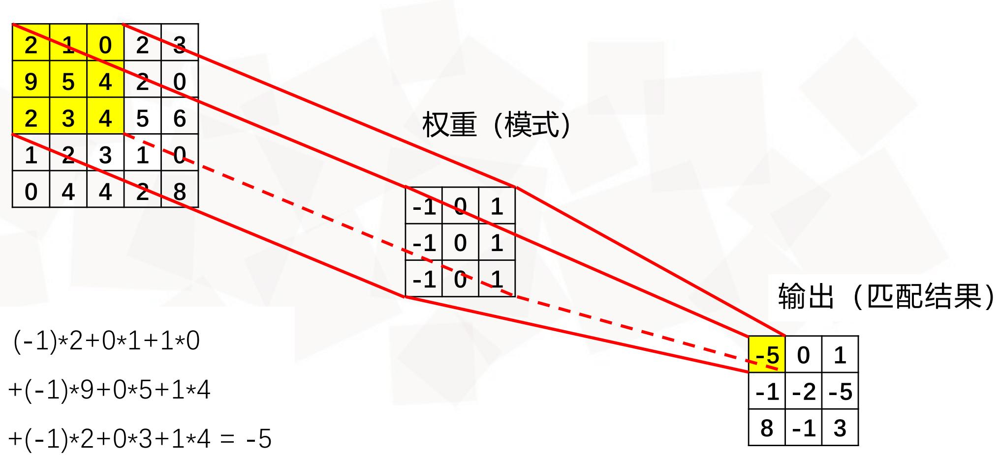  
授课教师：李静瑶

## 3 卷积神经网络

## 输入

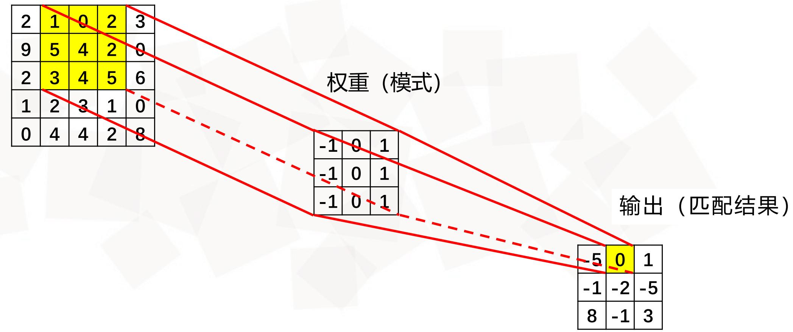  
授课教师：李静瑶

## 3 卷积神经网络

<table><tr><td rowspan=1 colspan=1>2</td><td rowspan=1 colspan=1>1</td><td rowspan=1 colspan=1></td><td rowspan=1 colspan=1>2</td><td rowspan=1 colspan=1>3</td></tr><tr><td rowspan=1 colspan=1>9</td><td rowspan=1 colspan=1>5</td><td rowspan=1 colspan=1>4</td><td rowspan=1 colspan=1>2</td><td rowspan=1 colspan=1>9</td></tr><tr><td rowspan=1 colspan=1>2</td><td rowspan=1 colspan=1>3</td><td rowspan=1 colspan=1>4</td><td rowspan=1 colspan=1>5</td><td rowspan=1 colspan=1>6</td></tr><tr><td rowspan=1 colspan=1>1</td><td rowspan=1 colspan=1>2</td><td rowspan=1 colspan=1>3</td><td rowspan=1 colspan=1>1</td><td rowspan=1 colspan=1>0</td></tr><tr><td rowspan=1 colspan=1>0</td><td rowspan=1 colspan=1>4</td><td rowspan=1 colspan=1>42</td><td rowspan=1 colspan=1>42</td><td rowspan=1 colspan=1>8</td></tr></table>

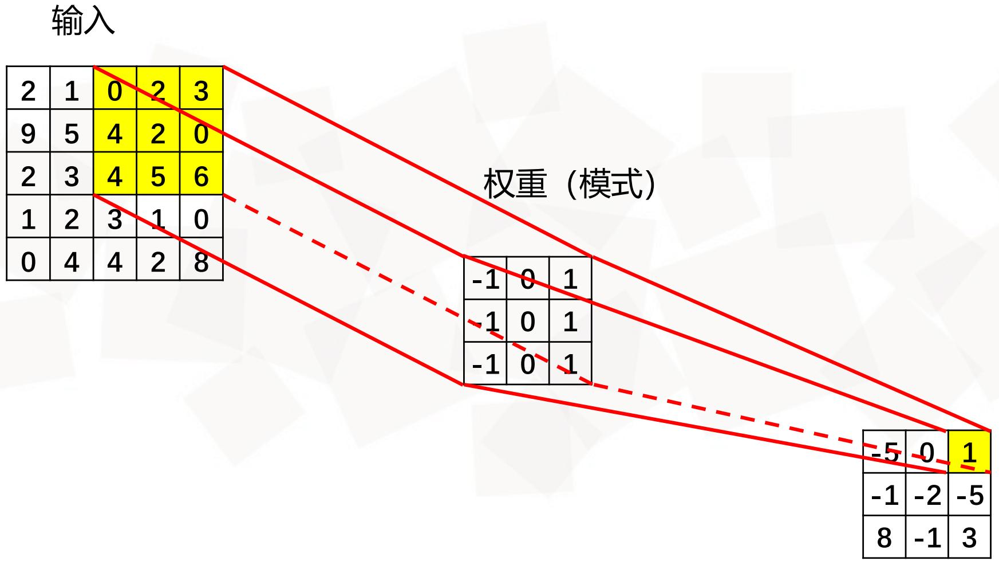  
授课教师：李静瑶  
输出 (匹配结果)

## 卷积神经网络

## 输入

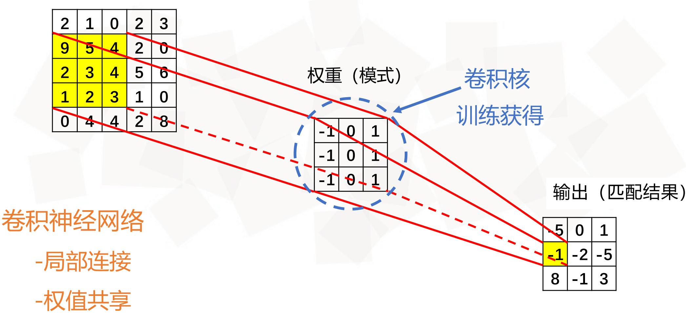  
授课教师：李静瑶

## 3 卷积神经网络

## 全连接、 卷积神经网络对比

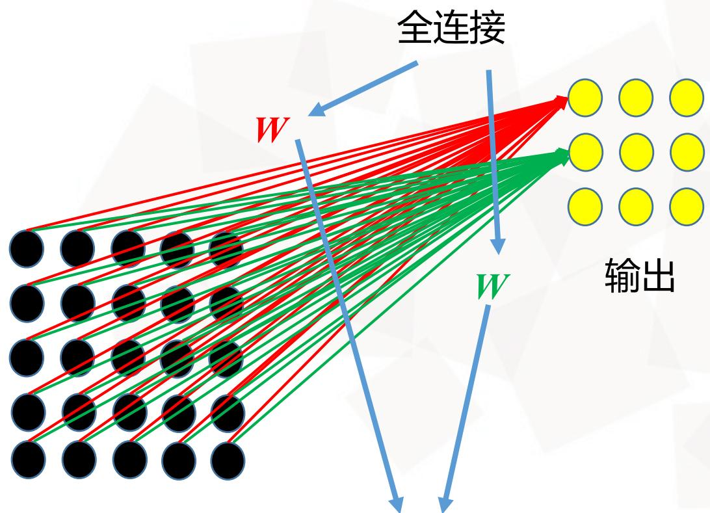

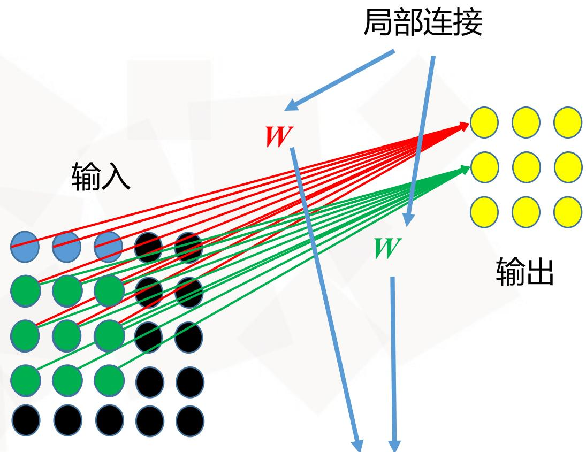  
输入  
权值不同  
权值共享  
授课教师：李静瑶

## 卷积神经网络

## 例：边缘提取

<table><tr><td rowspan=1 colspan=1>0</td><td rowspan=1 colspan=1>0</td><td rowspan=1 colspan=1>0</td><td rowspan=1 colspan=1>0</td><td rowspan=1 colspan=1>0</td><td rowspan=1 colspan=1>0</td><td rowspan=1 colspan=1>0</td><td rowspan=1 colspan=1>0</td><td rowspan=1 colspan=1>0</td><td rowspan=1 colspan=1></td><td rowspan=1 colspan=1></td><td rowspan=1 colspan=1></td><td rowspan=1 colspan=1>0</td><td rowspan=1 colspan=1></td><td rowspan=1 colspan=1></td><td rowspan=1 colspan=1>0</td><td rowspan=1 colspan=1>0</td></tr><tr><td rowspan=1 colspan=1>0</td><td rowspan=1 colspan=1></td><td rowspan=1 colspan=1></td><td rowspan=1 colspan=1></td><td rowspan=1 colspan=1></td><td rowspan=1 colspan=1></td><td rowspan=1 colspan=1></td><td rowspan=1 colspan=1></td><td rowspan=1 colspan=1></td><td rowspan=1 colspan=1></td><td rowspan=1 colspan=1></td><td rowspan=1 colspan=1></td><td rowspan=1 colspan=1></td><td rowspan=1 colspan=1></td><td rowspan=1 colspan=1></td><td rowspan=1 colspan=1></td><td rowspan=1 colspan=1>0</td></tr><tr><td rowspan=1 colspan=1>0</td><td rowspan=1 colspan=1></td><td rowspan=1 colspan=1></td><td rowspan=1 colspan=1></td><td rowspan=1 colspan=1></td><td rowspan=1 colspan=1></td><td rowspan=1 colspan=1></td><td rowspan=1 colspan=1></td><td rowspan=1 colspan=1></td><td rowspan=1 colspan=1></td><td rowspan=1 colspan=1></td><td rowspan=1 colspan=1></td><td rowspan=1 colspan=1></td><td rowspan=1 colspan=1></td><td rowspan=1 colspan=1></td><td rowspan=1 colspan=1></td><td rowspan=1 colspan=1>0</td></tr><tr><td rowspan=1 colspan=1>0</td><td rowspan=1 colspan=1></td><td rowspan=1 colspan=1></td><td rowspan=1 colspan=1></td><td rowspan=1 colspan=1></td><td rowspan=1 colspan=1></td><td rowspan=1 colspan=1></td><td rowspan=1 colspan=1></td><td rowspan=1 colspan=1></td><td rowspan=1 colspan=1></td><td rowspan=1 colspan=1></td><td rowspan=1 colspan=1></td><td rowspan=1 colspan=1></td><td rowspan=1 colspan=1></td><td rowspan=1 colspan=1></td><td rowspan=1 colspan=1></td><td rowspan=1 colspan=1>0</td></tr><tr><td rowspan=1 colspan=1>0</td><td rowspan=1 colspan=1></td><td rowspan=1 colspan=1></td><td rowspan=1 colspan=1></td><td rowspan=1 colspan=1>0</td><td rowspan=1 colspan=1>0</td><td rowspan=1 colspan=1>0</td><td rowspan=1 colspan=1>0</td><td rowspan=1 colspan=1>0</td><td rowspan=1 colspan=1>0</td><td rowspan=1 colspan=1>0</td><td rowspan=1 colspan=1>0</td><td rowspan=1 colspan=1>0</td><td rowspan=1 colspan=1></td><td rowspan=1 colspan=1></td><td rowspan=1 colspan=1>1</td><td rowspan=1 colspan=1></td></tr><tr><td rowspan=1 colspan=1>0</td><td rowspan=1 colspan=1></td><td rowspan=1 colspan=1></td><td rowspan=1 colspan=1></td><td rowspan=1 colspan=1>0</td><td rowspan=1 colspan=1>0</td><td rowspan=1 colspan=1>0</td><td rowspan=1 colspan=1>0</td><td rowspan=1 colspan=1>0</td><td rowspan=1 colspan=1>0</td><td rowspan=1 colspan=1>0</td><td rowspan=1 colspan=1>0</td><td rowspan=1 colspan=1>0</td><td rowspan=1 colspan=1></td><td rowspan=1 colspan=1>1</td><td rowspan=1 colspan=1></td><td rowspan=1 colspan=1></td></tr><tr><td rowspan=1 colspan=1>0</td><td rowspan=1 colspan=1></td><td rowspan=1 colspan=1></td><td rowspan=1 colspan=1></td><td rowspan=1 colspan=1>0</td><td rowspan=1 colspan=1>0</td><td rowspan=1 colspan=1>0</td><td rowspan=1 colspan=1>0</td><td rowspan=1 colspan=1>0</td><td rowspan=1 colspan=1>0</td><td rowspan=1 colspan=1>0</td><td rowspan=1 colspan=1>。</td><td rowspan=1 colspan=1>0</td><td rowspan=1 colspan=1>1</td><td rowspan=1 colspan=1></td><td rowspan=1 colspan=1></td><td rowspan=1 colspan=1>0</td></tr><tr><td rowspan=1 colspan=1>0</td><td rowspan=1 colspan=1></td><td rowspan=1 colspan=1></td><td rowspan=1 colspan=1></td><td rowspan=1 colspan=1>0</td><td rowspan=1 colspan=1>0</td><td rowspan=1 colspan=1>0</td><td rowspan=1 colspan=1>0</td><td rowspan=1 colspan=1>0</td><td rowspan=1 colspan=1>0</td><td rowspan=1 colspan=1>0</td><td rowspan=1 colspan=1>0</td><td rowspan=1 colspan=1>0</td><td rowspan=1 colspan=1>1</td><td rowspan=1 colspan=1></td><td rowspan=1 colspan=1>1</td><td rowspan=1 colspan=1>0</td></tr><tr><td rowspan=1 colspan=1>0</td><td rowspan=1 colspan=1></td><td rowspan=1 colspan=1></td><td rowspan=1 colspan=1></td><td rowspan=1 colspan=1>0</td><td rowspan=1 colspan=1>。</td><td rowspan=1 colspan=1>0</td><td rowspan=1 colspan=1>0</td><td rowspan=1 colspan=1>0</td><td rowspan=1 colspan=1>0</td><td rowspan=1 colspan=1>0</td><td rowspan=1 colspan=1>0</td><td rowspan=1 colspan=1></td><td rowspan=1 colspan=1></td><td rowspan=1 colspan=1></td><td rowspan=1 colspan=1></td><td rowspan=1 colspan=1>0</td></tr><tr><td rowspan=1 colspan=1>0</td><td rowspan=1 colspan=1></td><td rowspan=1 colspan=1></td><td rowspan=1 colspan=1></td><td rowspan=1 colspan=1>0</td><td rowspan=1 colspan=1>0</td><td rowspan=1 colspan=1>0</td><td rowspan=1 colspan=1>o</td><td rowspan=1 colspan=1>0</td><td rowspan=1 colspan=1>0</td><td rowspan=1 colspan=1>0</td><td rowspan=1 colspan=1>0</td><td rowspan=1 colspan=1></td><td rowspan=1 colspan=1></td><td rowspan=1 colspan=1></td><td rowspan=1 colspan=1></td><td rowspan=1 colspan=1>0</td></tr><tr><td rowspan=1 colspan=1>0</td><td rowspan=1 colspan=1></td><td rowspan=1 colspan=1></td><td rowspan=1 colspan=1></td><td rowspan=1 colspan=1>0</td><td rowspan=1 colspan=1>0</td><td rowspan=1 colspan=1>0</td><td rowspan=1 colspan=1>0</td><td rowspan=1 colspan=1>0</td><td rowspan=1 colspan=1>0</td><td rowspan=1 colspan=1></td><td rowspan=1 colspan=1></td><td rowspan=1 colspan=1>0</td><td rowspan=1 colspan=1></td><td rowspan=1 colspan=1></td><td rowspan=1 colspan=1></td><td rowspan=1 colspan=1>0</td></tr><tr><td rowspan=1 colspan=1>0</td><td rowspan=1 colspan=1></td><td rowspan=1 colspan=1></td><td rowspan=1 colspan=1></td><td rowspan=1 colspan=1>0</td><td rowspan=1 colspan=1>0</td><td rowspan=1 colspan=1>0</td><td rowspan=1 colspan=1>0</td><td rowspan=1 colspan=1>0</td><td rowspan=1 colspan=1>0</td><td rowspan=1 colspan=1></td><td rowspan=1 colspan=1>0</td><td rowspan=1 colspan=1>0</td><td rowspan=1 colspan=1></td><td rowspan=1 colspan=1></td><td rowspan=1 colspan=1></td><td rowspan=1 colspan=1>0</td></tr><tr><td rowspan=1 colspan=1>0</td><td rowspan=1 colspan=1></td><td rowspan=1 colspan=1></td><td rowspan=1 colspan=1></td><td rowspan=1 colspan=1>0</td><td rowspan=1 colspan=1>0</td><td rowspan=1 colspan=1>0</td><td rowspan=1 colspan=1>0</td><td rowspan=1 colspan=1>0</td><td rowspan=1 colspan=1>?</td><td rowspan=1 colspan=1>0</td><td rowspan=1 colspan=1>0</td><td rowspan=1 colspan=1>0</td><td rowspan=1 colspan=1></td><td rowspan=1 colspan=1></td><td rowspan=1 colspan=1></td><td rowspan=1 colspan=1>0</td></tr><tr><td rowspan=1 colspan=1>0</td><td rowspan=1 colspan=1></td><td rowspan=1 colspan=1></td><td rowspan=1 colspan=1></td><td rowspan=1 colspan=1></td><td rowspan=1 colspan=1></td><td rowspan=1 colspan=1></td><td rowspan=1 colspan=1></td><td rowspan=1 colspan=1></td><td rowspan=1 colspan=1>7</td><td rowspan=1 colspan=1></td><td rowspan=1 colspan=1></td><td rowspan=1 colspan=1></td><td rowspan=1 colspan=1></td><td rowspan=1 colspan=1></td><td rowspan=1 colspan=1></td><td rowspan=1 colspan=1>0</td></tr><tr><td rowspan=1 colspan=1>0</td><td rowspan=1 colspan=1></td><td rowspan=1 colspan=1></td><td rowspan=1 colspan=1></td><td rowspan=1 colspan=1></td><td rowspan=1 colspan=1></td><td rowspan=1 colspan=1></td><td rowspan=1 colspan=1></td><td rowspan=1 colspan=1></td><td rowspan=1 colspan=1></td><td rowspan=1 colspan=1></td><td rowspan=1 colspan=1></td><td rowspan=1 colspan=1></td><td rowspan=1 colspan=1></td><td rowspan=1 colspan=1></td><td rowspan=1 colspan=1></td><td rowspan=1 colspan=1>0</td></tr><tr><td rowspan=1 colspan=1>0</td><td rowspan=1 colspan=1></td><td rowspan=1 colspan=1></td><td rowspan=1 colspan=1></td><td rowspan=1 colspan=1></td><td rowspan=1 colspan=1></td><td rowspan=1 colspan=1></td><td rowspan=1 colspan=1></td><td rowspan=1 colspan=1></td><td rowspan=1 colspan=1></td><td rowspan=1 colspan=1></td><td rowspan=1 colspan=1></td><td rowspan=1 colspan=1></td><td rowspan=1 colspan=1></td><td rowspan=1 colspan=1></td><td rowspan=1 colspan=1></td><td rowspan=1 colspan=1>0</td></tr><tr><td rowspan=1 colspan=1>0</td><td rowspan=1 colspan=1>0</td><td rowspan=1 colspan=1>0</td><td rowspan=1 colspan=1>0</td><td rowspan=1 colspan=1>0</td><td rowspan=1 colspan=1>0</td><td rowspan=1 colspan=1>0</td><td rowspan=1 colspan=1>0</td><td rowspan=1 colspan=1>0</td><td rowspan=1 colspan=1>0</td><td rowspan=1 colspan=1>0</td><td rowspan=1 colspan=1>0</td><td rowspan=1 colspan=1>0</td><td rowspan=1 colspan=1>0</td><td rowspan=1 colspan=1>0</td><td rowspan=1 colspan=1>0</td><td rowspan=1 colspan=1>0</td></tr></table>

输入

授课教师：李静瑶

## 正迦缘

<table><tr><td></td><td></td><td></td><td>3444 4 44444443</td><td></td><td></td><td></td><td></td><td></td><td></td><td></td><td></td><td></td><td></td></tr><tr><td></td><td></td><td></td><td></td><td></td><td>。。。。。。。。。。。。。。</td><td></td><td></td><td></td><td></td><td></td><td></td><td></td><td></td></tr><tr><td></td><td></td><td></td><td></td><td></td><td></td><td></td><td></td><td></td><td></td><td>00-13-4 -44-4-4-443-100</td><td></td><td></td><td></td></tr><tr><td></td><td></td><td></td><td>00-1-3-4-4-4-4-4-4-4-3-100</td><td></td><td></td><td></td><td></td><td></td><td></td><td></td><td></td><td></td><td></td></tr><tr><td></td><td></td><td>。。00。</td><td></td><td></td><td></td><td></td><td></td><td></td><td></td><td></td><td></td><td>00。。0000。</td><td></td></tr><tr><td></td><td></td><td>oodo</td><td></td><td>0</td><td></td><td></td><td></td><td></td><td></td><td></td><td></td><td>。。。。。。。。。</td><td></td></tr><tr><td></td><td>ood</td><td></td><td></td><td>。</td><td></td><td></td><td></td><td></td><td></td><td></td><td></td><td>oooooddoo。</td><td></td></tr><tr><td></td><td>o0dd</td><td></td><td>。</td><td></td><td></td><td></td><td></td><td></td><td></td><td></td><td></td><td>ooooooood</td><td></td></tr><tr><td></td><td>。。。。</td><td></td><td></td><td>0 。</td><td></td><td></td><td></td><td></td><td></td><td></td><td></td><td>oaaaaoa。</td><td></td></tr><tr><td></td><td>。。</td><td></td><td>。</td><td>0 0</td><td></td><td></td><td></td><td></td><td></td><td></td><td></td><td>Loooaonod</td><td></td></tr><tr><td></td><td>。。。。</td><td></td><td></td><td>0</td><td>0</td><td></td><td></td><td></td><td></td><td></td><td></td><td>oadddodoo</td><td></td></tr><tr><td></td><td></td><td>001344</td><td></td><td></td><td>44</td><td>4</td><td></td><td></td><td></td><td></td><td></td><td>4443000</td><td></td></tr><tr><td></td><td>。01</td><td></td><td>B44414443100</td><td></td><td></td><td></td><td></td><td></td><td></td><td></td><td></td><td></td><td></td></tr><tr><td></td><td></td><td></td><td>。。。。。。。0。。。。。。。</td><td></td><td></td><td></td><td></td><td></td><td></td><td></td><td></td><td></td><td></td></tr><tr><td></td><td></td><td></td><td>-3-4-4-4-4-4-4-4-4-4-4-4-4-4-3</td><td></td><td></td><td></td><td></td><td></td><td></td><td></td><td></td><td></td><td></td></tr></table>

输出

<table><tr><td>-1</td><td>-2</td><td>-1</td></tr><tr><td>0</td><td>0</td><td>0</td></tr><tr><td>1</td><td>2</td><td>1</td></tr></table>

卷积核

## 卷积神经网络

## 例：边缘提取

<table><tr><td></td><td></td><td></td><td></td><td></td><td></td><td></td><td></td><td></td><td></td><td></td><td></td><td></td><td>。。。。。。。。。。。。。。。。。</td><td></td><td></td><td></td></tr><tr><td></td><td></td><td></td><td></td><td></td><td></td><td></td><td></td><td></td><td></td><td></td><td></td><td></td><td>00口000000000000□。</td><td></td><td></td><td></td></tr><tr><td></td><td></td><td></td><td></td><td>0111111111111111。</td><td></td><td></td><td></td><td></td><td></td><td></td><td></td><td></td><td></td><td></td><td></td><td></td></tr><tr><td></td><td></td><td></td><td></td><td>0000000000000000。</td><td></td><td></td><td></td><td></td><td></td><td></td><td></td><td></td><td></td><td></td><td></td><td></td></tr><tr><td></td><td></td><td></td><td></td><td>。0000000000。[00</td><td></td><td></td><td></td><td></td><td></td><td></td><td></td><td></td><td></td><td></td><td></td><td></td></tr><tr><td></td><td></td><td></td><td></td><td>0111。0000。000110。</td><td></td><td></td><td></td><td></td><td></td><td></td><td></td><td></td><td></td><td></td><td></td><td></td></tr><tr><td></td><td></td><td></td><td></td><td>011100000000。10。</td><td></td><td></td><td></td><td></td><td></td><td></td><td></td><td></td><td></td><td></td><td></td><td></td></tr><tr><td></td><td></td><td></td><td></td><td>0111000000000111。</td><td></td><td></td><td></td><td></td><td></td><td></td><td></td><td></td><td></td><td></td><td></td><td></td></tr><tr><td></td><td></td><td></td><td></td><td>。100000000。。01。</td><td></td><td></td><td></td><td></td><td></td><td></td><td></td><td></td><td></td><td></td><td></td><td></td></tr><tr><td></td><td></td><td></td><td></td><td>。0。0ooo0oo。[。</td><td></td><td></td><td></td><td></td><td></td><td></td><td></td><td></td><td></td><td></td><td></td><td></td></tr><tr><td></td><td></td><td></td><td></td><td>0100000000001010</td><td></td><td></td><td></td><td></td><td></td><td></td><td></td><td></td><td></td><td></td><td></td><td></td></tr><tr><td></td><td></td><td></td><td></td><td>010000000000。100</td><td></td><td></td><td></td><td></td><td></td><td></td><td></td><td></td><td></td><td></td><td></td><td></td></tr><tr><td></td><td></td><td></td><td></td><td>。0000000000[0。</td><td></td><td></td><td></td><td></td><td></td><td></td><td></td><td></td><td></td><td></td><td></td><td></td></tr><tr><td></td><td></td><td></td><td></td><td>01111111111111110</td><td></td><td></td><td></td><td></td><td></td><td></td><td></td><td></td><td></td><td></td><td></td><td></td></tr><tr><td></td><td></td><td></td><td></td><td>0000000000000000。</td><td></td><td></td><td></td><td></td><td></td><td></td><td></td><td></td><td></td><td></td><td></td><td></td></tr><tr><td></td><td></td><td></td><td></td><td>01111111111111110</td><td></td><td></td><td></td><td></td><td></td><td></td><td></td><td></td><td></td><td></td><td></td><td></td></tr><tr><td></td><td></td><td></td><td></td><td>。。。□。。。。□。。。□□。。。</td><td></td><td></td><td></td><td></td><td></td><td></td><td></td><td></td><td></td><td></td><td></td><td></td></tr></table>

图像

授课教师：李静瑶

<table><tr><td></td><td></td><td></td><td></td><td></td><td></td><td></td><td></td><td></td><td></td><td></td><td></td><td></td><td>344444444444443</td><td></td></tr><tr><td></td><td></td><td></td><td></td><td></td><td></td><td></td><td></td><td></td><td></td><td></td><td></td><td></td><td>o。。。。。。。。。。。。。。</td><td></td></tr><tr><td></td><td></td><td></td><td></td><td></td><td></td><td></td><td></td><td></td><td></td><td></td><td></td><td></td><td>00-1-3-4-4-4-4-4-4-4-3-100</td><td></td></tr><tr><td></td><td></td><td></td><td></td><td></td><td></td><td></td><td></td><td></td><td></td><td></td><td></td><td></td><td>00-1-3-4-4-4-4-4-4-4-3-100</td><td></td></tr><tr><td></td><td></td><td></td><td></td><td></td><td></td><td></td><td></td><td></td><td></td><td></td><td></td><td></td><td>。。。。。。。。。。。。。。。</td><td></td></tr><tr><td></td><td></td><td></td><td></td><td></td><td></td><td></td><td></td><td></td><td></td><td></td><td></td><td></td><td>0000000000000。</td><td></td></tr><tr><td></td><td></td><td></td><td></td><td></td><td></td><td></td><td></td><td></td><td></td><td></td><td></td><td></td><td>。。。。。。。。。。。。。0。</td><td></td></tr><tr><td></td><td></td><td></td><td></td><td></td><td></td><td></td><td></td><td></td><td></td><td></td><td></td><td></td><td>。。。。。0。。。oo。</td><td></td></tr><tr><td></td><td></td><td></td><td></td><td></td><td></td><td></td><td></td><td></td><td></td><td></td><td></td><td></td><td>ooooooodoodo。</td><td></td></tr><tr><td></td><td></td><td></td><td></td><td></td><td></td><td></td><td></td><td></td><td></td><td></td><td></td><td></td><td>aaadadaaaddadaa</td><td></td></tr><tr><td>。。。。。。。。。。。。。。。</td><td></td><td></td><td></td><td></td><td></td><td></td><td></td><td></td><td></td><td></td><td></td><td></td><td></td><td></td></tr><tr><td>001344444443100</td><td></td><td></td><td></td><td></td><td></td><td></td><td></td><td></td><td></td><td></td><td></td><td></td><td></td><td></td></tr><tr><td></td><td></td><td></td><td></td><td></td><td></td><td></td><td></td><td></td><td></td><td></td><td></td><td></td><td>001344444443100</td><td></td></tr><tr><td></td><td></td><td></td><td></td><td></td><td></td><td></td><td></td><td></td><td></td><td></td><td></td><td></td><td>。。。。。□。。。。。。。。。</td><td></td></tr><tr><td></td><td></td><td></td><td></td><td></td><td></td><td></td><td></td><td></td><td></td><td></td><td></td><td></td><td>-3-4-4-4-4-4-4-4-4-4-4-4-4-4 -3</td><td></td></tr></table>

匹配结果

<table><tr><td rowspan=1 colspan=1>1.0</td><td rowspan=1 colspan=1>1.0</td><td rowspan=1 colspan=1>1.0</td><td rowspan=1 colspan=1>1.0</td><td rowspan=1 colspan=1>1.0</td><td rowspan=1 colspan=1>1.0</td><td rowspan=1 colspan=1>1.0</td><td rowspan=1 colspan=1>1.0</td><td rowspan=1 colspan=1>1.0</td><td rowspan=1 colspan=1>1.0</td><td rowspan=1 colspan=1>1.0</td><td rowspan=1 colspan=1>1.0</td><td rowspan=1 colspan=1>1.0</td><td rowspan=1 colspan=1>1.0</td><td rowspan=1 colspan=1>1.0</td></tr><tr><td rowspan=1 colspan=1>0.5</td><td rowspan=1 colspan=1>0.5</td><td rowspan=1 colspan=1>0.5</td><td rowspan=1 colspan=1>0.5</td><td rowspan=1 colspan=1>0.5</td><td rowspan=1 colspan=1>0.5</td><td rowspan=1 colspan=1>0.5</td><td rowspan=1 colspan=1>0.5</td><td rowspan=1 colspan=1>0.5</td><td rowspan=1 colspan=1>0.5</td><td rowspan=1 colspan=1>0.5</td><td rowspan=1 colspan=1>0.5</td><td rowspan=1 colspan=1>0.5</td><td rowspan=1 colspan=1>0.5</td><td rowspan=1 colspan=1>0.5</td></tr><tr><td rowspan=1 colspan=1>0.5</td><td rowspan=1 colspan=1>0.5</td><td rowspan=1 colspan=1>0.3</td><td rowspan=1 colspan=1>0.0</td><td rowspan=1 colspan=1>0.0</td><td rowspan=1 colspan=1>0.0</td><td rowspan=1 colspan=1>0.0</td><td rowspan=1 colspan=1>0.0</td><td rowspan=1 colspan=1>0.0</td><td rowspan=1 colspan=1>0.0</td><td rowspan=1 colspan=1>0.0</td><td rowspan=1 colspan=1>0.0</td><td rowspan=1 colspan=1>0.3</td><td rowspan=1 colspan=1>0.5</td><td rowspan=1 colspan=1>0.5</td></tr><tr><td rowspan=1 colspan=1>0.5</td><td rowspan=1 colspan=1>0.5</td><td rowspan=1 colspan=1>0.3</td><td rowspan=1 colspan=1>0.0</td><td rowspan=1 colspan=1>0.0</td><td rowspan=1 colspan=1>0.0</td><td rowspan=1 colspan=1>0.0</td><td rowspan=1 colspan=1>0.0</td><td rowspan=1 colspan=1>0.0</td><td rowspan=1 colspan=1>0.0</td><td rowspan=1 colspan=1>0.0</td><td rowspan=1 colspan=1>0.0</td><td rowspan=1 colspan=1>0.3</td><td rowspan=1 colspan=1>0.5</td><td rowspan=1 colspan=1>0.5</td></tr><tr><td rowspan=1 colspan=1>0.5</td><td rowspan=1 colspan=1>0.5</td><td rowspan=1 colspan=1>0.5</td><td rowspan=1 colspan=1>0.5</td><td rowspan=1 colspan=1>0.5</td><td rowspan=1 colspan=1>0.5</td><td rowspan=1 colspan=1>0.5</td><td rowspan=1 colspan=1>0.5</td><td rowspan=1 colspan=1>0.5</td><td rowspan=1 colspan=1>0.5</td><td rowspan=1 colspan=1>0.5</td><td rowspan=1 colspan=1>0.5</td><td rowspan=1 colspan=1>0.5</td><td rowspan=1 colspan=1>0.5</td><td rowspan=1 colspan=1>0.5</td></tr><tr><td rowspan=1 colspan=1>0.5</td><td rowspan=1 colspan=1>0.5</td><td rowspan=1 colspan=1>0.5</td><td rowspan=1 colspan=1>0.5</td><td rowspan=1 colspan=1>0.5</td><td rowspan=1 colspan=1>0.5</td><td rowspan=1 colspan=1>0.5</td><td rowspan=1 colspan=1>0.5</td><td rowspan=1 colspan=1>0.5</td><td rowspan=1 colspan=1>0.5</td><td rowspan=1 colspan=1>0.5</td><td rowspan=1 colspan=1>0.5</td><td rowspan=1 colspan=1>0.5</td><td rowspan=1 colspan=1>0.5</td><td rowspan=1 colspan=1>0.5</td></tr><tr><td rowspan=1 colspan=1>0.5</td><td rowspan=1 colspan=1>0.5</td><td rowspan=1 colspan=1>0.5</td><td rowspan=1 colspan=1>0.5</td><td rowspan=1 colspan=1>0.5</td><td rowspan=1 colspan=1>0.5</td><td rowspan=1 colspan=1>0.5</td><td rowspan=1 colspan=1>0.5</td><td rowspan=1 colspan=1>0.5</td><td rowspan=1 colspan=1>0.5</td><td rowspan=1 colspan=1>0.5</td><td rowspan=1 colspan=1>0.5</td><td rowspan=1 colspan=1>0.5</td><td rowspan=1 colspan=1>0.5</td><td rowspan=1 colspan=1>0.5</td></tr><tr><td rowspan=1 colspan=1>0.5</td><td rowspan=1 colspan=1>0.5</td><td rowspan=1 colspan=1>0.5</td><td rowspan=1 colspan=1>0.5</td><td rowspan=1 colspan=1>0.5</td><td rowspan=1 colspan=1>0.5</td><td rowspan=1 colspan=1>0.5</td><td rowspan=1 colspan=1>0.5</td><td rowspan=1 colspan=1>0.5</td><td rowspan=1 colspan=1>0.5</td><td rowspan=1 colspan=1>0.5</td><td rowspan=1 colspan=1>0.5</td><td rowspan=1 colspan=1>0.5</td><td rowspan=1 colspan=1>0.5</td><td rowspan=1 colspan=1>0.5</td></tr><tr><td rowspan=1 colspan=1>0.5</td><td rowspan=1 colspan=1>0.5</td><td rowspan=1 colspan=1>0.5</td><td rowspan=1 colspan=1>0.5</td><td rowspan=1 colspan=1>0.5</td><td rowspan=1 colspan=1>0.50</td><td rowspan=1 colspan=1>0.5</td><td rowspan=1 colspan=1>0.5</td><td rowspan=1 colspan=1>0.5</td><td rowspan=1 colspan=1>0.5</td><td rowspan=1 colspan=1>0.5</td><td rowspan=1 colspan=1>0.5</td><td rowspan=1 colspan=1>0.5</td><td rowspan=1 colspan=1>0.5</td><td rowspan=1 colspan=1>0.5</td></tr><tr><td rowspan=1 colspan=1>0.5</td><td rowspan=1 colspan=1>0.5</td><td rowspan=1 colspan=1>0.5</td><td rowspan=1 colspan=1>0.5</td><td rowspan=1 colspan=1>0.5</td><td rowspan=1 colspan=1>0.5</td><td rowspan=1 colspan=1>0.5</td><td rowspan=1 colspan=1>0.5</td><td rowspan=1 colspan=1>0.5</td><td rowspan=1 colspan=1>0.5</td><td rowspan=1 colspan=1>0.5</td><td rowspan=1 colspan=1>0.5</td><td rowspan=1 colspan=1>0.5</td><td rowspan=1 colspan=1>0.5</td><td rowspan=1 colspan=1>0.5</td></tr><tr><td rowspan=1 colspan=1>0.5</td><td rowspan=1 colspan=1>0.5</td><td rowspan=1 colspan=1>0.5</td><td rowspan=1 colspan=1>0.5</td><td rowspan=1 colspan=1>0.5</td><td rowspan=1 colspan=1>0.5</td><td rowspan=1 colspan=1>0.5</td><td rowspan=1 colspan=1>0.5</td><td rowspan=1 colspan=1>0.5</td><td rowspan=1 colspan=1>0.5</td><td rowspan=1 colspan=1>0.5</td><td rowspan=1 colspan=1>0.5</td><td rowspan=1 colspan=1>0.5</td><td rowspan=1 colspan=1>0.5</td><td rowspan=1 colspan=1>0.5</td></tr><tr><td rowspan=1 colspan=1>0.5</td><td rowspan=1 colspan=1>0.5</td><td rowspan=1 colspan=1>0.7</td><td rowspan=1 colspan=1>1.0</td><td rowspan=1 colspan=1>1.0</td><td rowspan=1 colspan=1>1.0</td><td rowspan=1 colspan=1>1.0</td><td rowspan=1 colspan=1>1.0</td><td rowspan=1 colspan=1>1.0</td><td rowspan=1 colspan=1>1.0</td><td rowspan=1 colspan=1>1.0</td><td rowspan=1 colspan=1>1.0</td><td rowspan=1 colspan=1>0.7</td><td rowspan=1 colspan=1>0.5</td><td rowspan=1 colspan=1>0.5</td></tr><tr><td rowspan=1 colspan=1>0.5</td><td rowspan=1 colspan=1>0.5</td><td rowspan=1 colspan=1>0.7</td><td rowspan=1 colspan=1>1.0</td><td rowspan=1 colspan=1>1.0</td><td rowspan=1 colspan=1>1.0</td><td rowspan=1 colspan=1>1.0</td><td rowspan=1 colspan=1>1.0</td><td rowspan=1 colspan=1>1.0</td><td rowspan=1 colspan=1>1.0</td><td rowspan=1 colspan=1>1.0</td><td rowspan=1 colspan=1>1.0</td><td rowspan=1 colspan=1>0.7</td><td rowspan=1 colspan=1>0.5</td><td rowspan=1 colspan=1>0.5</td></tr><tr><td rowspan=1 colspan=1>0.5</td><td rowspan=1 colspan=1>0.5</td><td rowspan=1 colspan=1>0.5</td><td rowspan=1 colspan=1>0.5</td><td rowspan=1 colspan=1>0.5</td><td rowspan=1 colspan=1>0.5</td><td rowspan=1 colspan=1>0.5</td><td rowspan=1 colspan=1>0.5</td><td rowspan=1 colspan=1>0.5</td><td rowspan=1 colspan=1>0.5</td><td rowspan=1 colspan=1>0.5</td><td rowspan=1 colspan=1>0.5</td><td rowspan=1 colspan=1>0.5</td><td rowspan=1 colspan=1>0.5</td><td rowspan=1 colspan=1>0.5</td></tr><tr><td rowspan=1 colspan=1>0.0</td><td rowspan=1 colspan=1>0.0</td><td rowspan=1 colspan=1>0.0</td><td rowspan=1 colspan=1>0.0</td><td rowspan=1 colspan=1>0.0</td><td rowspan=1 colspan=1>0.0</td><td rowspan=1 colspan=1>0.0</td><td rowspan=1 colspan=1>0.0</td><td rowspan=1 colspan=1>0.0</td><td rowspan=1 colspan=1>0.0</td><td rowspan=1 colspan=1>0.0</td><td rowspan=1 colspan=1>0.0</td><td rowspan=1 colspan=1>0.0</td><td rowspan=1 colspan=1>0.0</td><td rowspan=1 colspan=1>0.0</td></tr></table>

Sigmoid

## 3 卷积神经网络

## 卷积核的大小

·对于二维输入，一般是3×3、5×5、7×7...

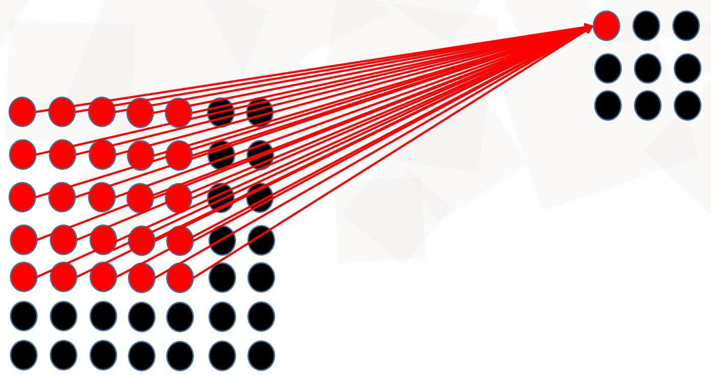  
授课教师：李静瑶

## 3 卷积神经网络

## 填充

##

授课教师：李静瑶

##

## 3 卷积神经网络

## 步长

卷积核每次移动的距离

步长是可以设定的 (以2为例)

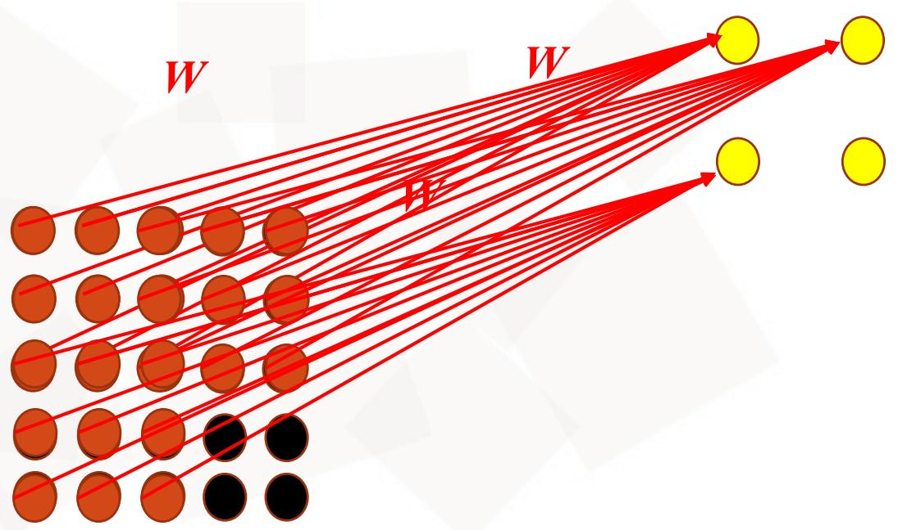  
授课教师：李静瑶

## 卷积神经网络

## 多卷积核

<table><tr><td rowspan=1 colspan=1>0</td><td rowspan=1 colspan=1>0</td><td rowspan=1 colspan=1></td><td rowspan=1 colspan=1></td><td rowspan=1 colspan=1>0</td><td rowspan=1 colspan=1></td><td rowspan=1 colspan=1>.0</td></tr><tr><td rowspan=1 colspan=1>0</td><td rowspan=1 colspan=1>2</td><td rowspan=1 colspan=1>11</td><td rowspan=1 colspan=1>0</td><td rowspan=1 colspan=1>2.</td><td rowspan=1 colspan=1>3</td><td rowspan=1 colspan=1></td></tr><tr><td rowspan=1 colspan=1></td><td rowspan=1 colspan=1></td><td rowspan=1 colspan=1>5</td><td rowspan=1 colspan=1>4</td><td rowspan=1 colspan=1>2</td><td rowspan=1 colspan=1>0</td><td rowspan=1 colspan=1>0</td></tr><tr><td rowspan=1 colspan=1>0</td><td rowspan=1 colspan=1>2</td><td rowspan=1 colspan=1>34</td><td rowspan=1 colspan=1>34□</td><td rowspan=1 colspan=1>5</td><td rowspan=1 colspan=1>6</td><td rowspan=1 colspan=1></td></tr><tr><td rowspan=1 colspan=1>0</td><td rowspan=1 colspan=1>1</td><td rowspan=1 colspan=1>2</td><td rowspan=1 colspan=1>3</td><td rowspan=1 colspan=1>1</td><td rowspan=1 colspan=1>0</td><td rowspan=1 colspan=1>0</td></tr><tr><td rowspan=1 colspan=1>0</td><td rowspan=1 colspan=1>0</td><td rowspan=1 colspan=1>4A</td><td rowspan=1 colspan=1>A</td><td rowspan=1 colspan=1>2A</td><td rowspan=1 colspan=1>8</td><td rowspan=1 colspan=1>0</td></tr><tr><td rowspan=1 colspan=1>0</td><td rowspan=1 colspan=1>0</td><td rowspan=1 colspan=1>0</td><td rowspan=1 colspan=1>0</td><td rowspan=1 colspan=1>0</td><td rowspan=1 colspan=1>0</td><td rowspan=1 colspan=1>0</td></tr></table>

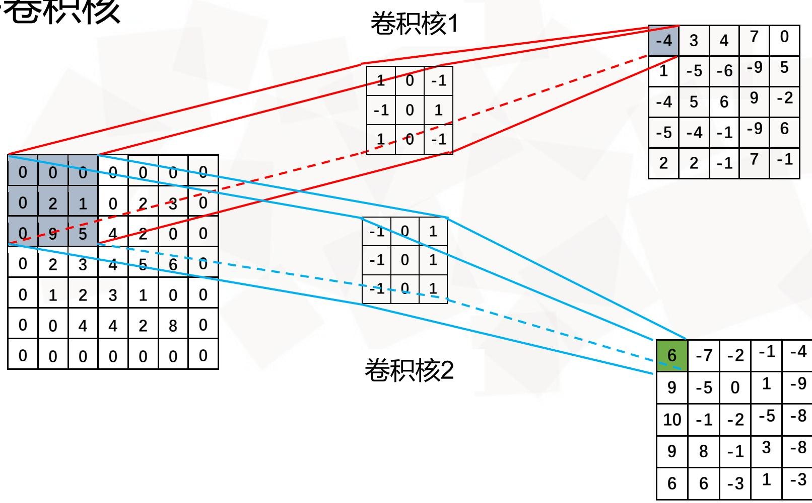

<table><tr><td rowspan=1 colspan=1>-4</td><td rowspan=1 colspan=1>3</td><td rowspan=1 colspan=1>4</td><td rowspan=1 colspan=1>7</td><td rowspan=1 colspan=1>0</td></tr><tr><td rowspan=1 colspan=1>1</td><td rowspan=1 colspan=1>-5</td><td rowspan=1 colspan=1>-6</td><td rowspan=1 colspan=1>河</td><td rowspan=1 colspan=1>5</td></tr><tr><td rowspan=1 colspan=1>-45</td><td rowspan=1 colspan=1>5</td><td rowspan=1 colspan=1>56</td><td rowspan=1 colspan=1>9</td><td rowspan=1 colspan=1>-2</td></tr><tr><td rowspan=1 colspan=1>-5</td><td rowspan=1 colspan=1>-4</td><td rowspan=1 colspan=1>-1</td><td rowspan=1 colspan=1>-9</td><td rowspan=1 colspan=1>6</td></tr><tr><td rowspan=1 colspan=1>2</td><td rowspan=1 colspan=1>2</td><td rowspan=1 colspan=1>-1</td><td rowspan=1 colspan=1>7</td><td rowspan=1 colspan=1>-1</td></tr></table>

## 输出 (通道1)

1\*0+0\*0+(-1)\*0

$$
+ ( - 1 ) { \star } 0 + 0 { \star } 2 + 1 { \star } 1
$$

+1\*0+0\*9+(-1)\*5 = -4

<table><tr><td rowspan=1 colspan=1>6</td><td rowspan=1 colspan=1>-7</td><td rowspan=1 colspan=1>-2</td><td rowspan=1 colspan=1>-1</td><td rowspan=1 colspan=1>-4</td></tr><tr><td rowspan=1 colspan=1>9</td><td rowspan=1 colspan=1>-5</td><td rowspan=1 colspan=1>。</td><td rowspan=1 colspan=1>1</td><td rowspan=1 colspan=1>-9</td></tr><tr><td rowspan=1 colspan=1>10</td><td rowspan=1 colspan=1>-1</td><td rowspan=1 colspan=1>-2</td><td rowspan=1 colspan=1>-5</td><td rowspan=1 colspan=1>-8</td></tr><tr><td rowspan=1 colspan=1>9</td><td rowspan=1 colspan=1>8</td><td rowspan=1 colspan=1>-1]</td><td rowspan=1 colspan=1>3</td><td rowspan=1 colspan=1>-8</td></tr><tr><td rowspan=1 colspan=1>6</td><td rowspan=1 colspan=1>6</td><td rowspan=1 colspan=1>-3</td><td rowspan=1 colspan=1>1</td><td rowspan=1 colspan=1>-3</td></tr></table>

输出 (通道2)

(-1)\*0+0\*0+1\*0

$$
+ ( - 1 ) { \star } 0 + 0 { \star } 2 + 1 { \star } 1
$$

授课教师：李静瑶

$$
+ ( - 1 ) { \star } 0 + 0 { \star } 9 + 1 { \star } 5 = 6
$$

## 3 卷积神经网络

## 多通道输入时的卷积

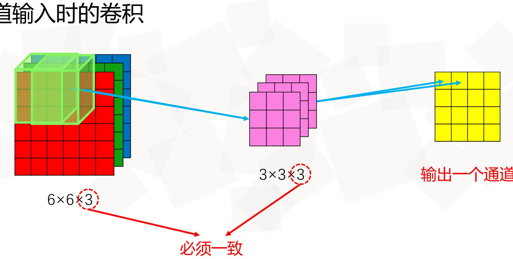  
授课教师：李静瑶

## 卷积神经网络

## 多通道卷积举例

<table><tr><td rowspan=1 colspan=1>2</td><td rowspan=1 colspan=1>T</td><td rowspan=1 colspan=1>0</td><td rowspan=1 colspan=1>23</td><td rowspan=1 colspan=1>3</td></tr><tr><td rowspan=1 colspan=1>9</td><td rowspan=1 colspan=1>5</td><td rowspan=1 colspan=1>4</td><td rowspan=1 colspan=1>2</td><td rowspan=1 colspan=1>0</td></tr><tr><td rowspan=1 colspan=1>2</td><td rowspan=1 colspan=1>3</td><td rowspan=1 colspan=1>4</td><td rowspan=1 colspan=1>5</td><td rowspan=1 colspan=1>6</td></tr><tr><td rowspan=1 colspan=1>1</td><td rowspan=1 colspan=1>2</td><td rowspan=1 colspan=1>3</td><td rowspan=1 colspan=1>10</td><td rowspan=1 colspan=1>10</td></tr><tr><td rowspan=1 colspan=1>0</td><td rowspan=1 colspan=1>4</td><td rowspan=1 colspan=1>4</td><td rowspan=1 colspan=1>2</td><td rowspan=1 colspan=1>8</td></tr></table>

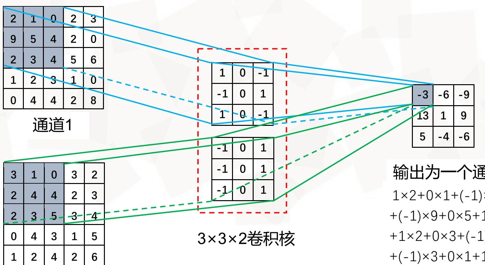

<table><tr><td rowspan=1 colspan=1>3</td><td rowspan=1 colspan=1>1</td><td rowspan=1 colspan=1>0</td><td rowspan=1 colspan=1>3</td><td rowspan=1 colspan=1>2</td></tr><tr><td rowspan=1 colspan=1>2</td><td rowspan=1 colspan=1>4</td><td rowspan=1 colspan=1>4</td><td rowspan=1 colspan=1>23</td><td rowspan=1 colspan=1>23</td></tr><tr><td rowspan=1 colspan=1>22</td><td rowspan=1 colspan=1>3</td><td rowspan=1 colspan=1>5</td><td rowspan=1 colspan=1>3-</td><td rowspan=1 colspan=1>4</td></tr><tr><td rowspan=1 colspan=1>0</td><td rowspan=1 colspan=1>4</td><td rowspan=1 colspan=1>3</td><td rowspan=1 colspan=1>1</td><td rowspan=1 colspan=1>5</td></tr><tr><td rowspan=1 colspan=1>1</td><td rowspan=1 colspan=1>2</td><td rowspan=1 colspan=1>4</td><td rowspan=1 colspan=1>2</td><td rowspan=1 colspan=1>6</td></tr></table>

通道2

<table><tr><td>-3</td><td>-6</td><td>-9</td></tr><tr><td>13</td><td>1</td><td>9</td></tr><tr><td>5</td><td>-4</td><td>-6</td></tr></table>

1×2+0×1+(-1)x0   
+(-1)x9+0×5+1×4   
+1×2+0×3+(-1)×4   
+(-1)x3+0x1+1x0   
+(-1)x2+0x4+1x4   
+(-1)x2+0×3+1×5= -3

授课教师：李静瑶

## 卷积神经网络

## 卷积核的大小

小卷积核：细粒度特征

大卷积核：大粒度特征

多层小卷积实现大卷积

两层3×3卷积等效一个5×5的卷积

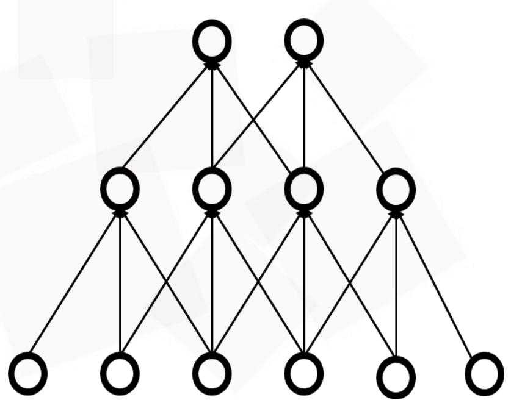  
授课教师：李静瑶

## 卷积神经网络

## 池化

## 一种降维的手段

<table><tr><td></td><td></td><td></td><td>001111111111100</td><td></td><td></td><td></td><td></td><td></td><td></td><td></td><td></td><td></td><td></td></tr><tr><td></td><td></td><td></td><td></td><td></td><td></td><td></td><td>。□□□0□□□0□0□0□。</td><td></td><td></td><td></td><td></td><td></td><td></td></tr><tr><td></td><td></td><td></td><td></td><td></td><td></td><td></td><td>000000000000000</td><td></td><td></td><td></td><td></td><td></td><td></td></tr><tr><td></td><td></td><td></td><td></td><td></td><td></td><td>□0□000000000□0</td><td></td><td></td><td></td><td></td><td></td><td></td><td></td></tr><tr><td></td><td></td><td></td><td></td><td>□0□0。</td><td></td><td>00000001</td><td></td><td></td><td></td><td></td><td></td><td></td><td></td></tr><tr><td></td><td></td><td></td><td></td><td></td><td>□0□0000000000□0</td><td></td><td></td><td></td><td></td><td></td><td></td><td></td><td></td></tr><tr><td></td><td></td><td></td><td></td><td></td><td></td><td></td><td>00000000000000</td><td></td><td></td><td></td><td></td><td></td><td></td></tr><tr><td></td><td></td><td></td><td></td><td></td><td></td><td></td><td>000000□0□00□00</td><td></td><td></td><td></td><td></td><td></td><td></td></tr><tr><td></td><td></td><td></td><td></td><td></td><td>OO□0000000000□O</td><td></td><td></td><td></td><td></td><td></td><td></td><td></td><td></td></tr><tr><td></td><td></td><td></td><td></td><td></td><td>□0□0000000000□0</td><td></td><td></td><td></td><td></td><td></td><td></td><td></td><td></td></tr><tr><td></td><td></td><td></td><td></td><td></td><td>□□□00000000。□□0</td><td></td><td></td><td></td><td></td><td></td><td></td><td></td><td></td></tr><tr><td></td><td></td><td></td><td></td><td></td><td>111。00000000110</td><td></td><td></td><td></td><td></td><td></td><td></td><td></td><td></td></tr><tr><td></td><td></td><td></td><td></td><td></td><td>000000000000000</td><td></td><td></td><td></td><td></td><td></td><td></td><td></td><td></td></tr><tr><td></td><td></td><td></td><td></td><td></td><td>00□□□0□□00000□0</td><td></td><td></td><td></td><td></td><td></td><td></td><td></td><td></td></tr><tr><td></td><td></td><td></td><td></td><td></td><td></td><td></td><td>001111111111100</td><td></td><td></td><td></td><td></td><td></td><td></td></tr></table>

<table><tr><td rowspan=1 colspan=1>0</td><td rowspan=1 colspan=1>1</td><td rowspan=1 colspan=1>1</td><td rowspan=1 colspan=1>1</td><td rowspan=1 colspan=1>0</td></tr><tr><td rowspan=1 colspan=1>1</td><td rowspan=1 colspan=1>0</td><td rowspan=1 colspan=1>0</td><td rowspan=1 colspan=1>0</td><td rowspan=1 colspan=1>1</td></tr><tr><td rowspan=1 colspan=1>0</td><td rowspan=1 colspan=1>1</td><td rowspan=1 colspan=1>1</td><td rowspan=1 colspan=1>1</td><td rowspan=1 colspan=1>0</td></tr><tr><td rowspan=1 colspan=1>1</td><td rowspan=1 colspan=1>0</td><td rowspan=1 colspan=1>0</td><td rowspan=1 colspan=1>0</td><td rowspan=1 colspan=1>1</td></tr><tr><td rowspan=1 colspan=1>0</td><td rowspan=1 colspan=1>1：</td><td rowspan=1 colspan=1>1</td><td rowspan=1 colspan=1>1</td><td rowspan=1 colspan=1>0</td></tr></table>

授课教师：李静瑶

## 卷积神经网络

## 池化方法

最大池化

取窗口内的最大值

窗口大小、步长都可以设定

平均池化

取窗口内的平均值

授课教师：李静瑶

<table><tr><td rowspan=1 colspan=1>1</td><td rowspan=1 colspan=1></td><td rowspan=1 colspan=1>24</td><td rowspan=1 colspan=1>24</td><td rowspan=1 colspan=1>5</td><td rowspan=1 colspan=1>1</td></tr><tr><td rowspan=1 colspan=1>5</td><td rowspan=1 colspan=1>6</td><td rowspan=1 colspan=1>7</td><td rowspan=1 colspan=1>8</td><td rowspan=1 colspan=1>0</td><td rowspan=1 colspan=1>7</td></tr><tr><td rowspan=1 colspan=1>3</td><td rowspan=1 colspan=1>2</td><td rowspan=1 colspan=1></td><td rowspan=1 colspan=1>0</td><td rowspan=1 colspan=1>41</td><td rowspan=1 colspan=1>41</td></tr><tr><td rowspan=1 colspan=1>1</td><td rowspan=1 colspan=1>2</td><td rowspan=1 colspan=1>3</td><td rowspan=1 colspan=1>4</td><td rowspan=1 colspan=1>32</td><td rowspan=1 colspan=1>32</td></tr><tr><td rowspan=1 colspan=1>8</td><td rowspan=1 colspan=1>6</td><td rowspan=1 colspan=1>5</td><td rowspan=1 colspan=1>3</td><td rowspan=1 colspan=1>3</td><td rowspan=1 colspan=1>11</td></tr><tr><td rowspan=1 colspan=1>1</td><td rowspan=1 colspan=1>0</td><td rowspan=1 colspan=1>2</td><td rowspan=1 colspan=1>一</td><td rowspan=1 colspan=1>2</td><td rowspan=1 colspan=1>0</td></tr></table>

输入为一个通道

最大池化窗口：2×2步长：2

<table><tr><td rowspan=1 colspan=1>6</td><td rowspan=1 colspan=1>8</td><td rowspan=1 colspan=1>7</td></tr><tr><td rowspan=1 colspan=1>3</td><td rowspan=1 colspan=1>4</td><td rowspan=1 colspan=1>4</td></tr><tr><td rowspan=1 colspan=1>8</td><td rowspan=1 colspan=1>5</td><td rowspan=1 colspan=1>3</td></tr></table>

## 卷积神经网络

## LeNet神经网络（Yann LeCun，1998)

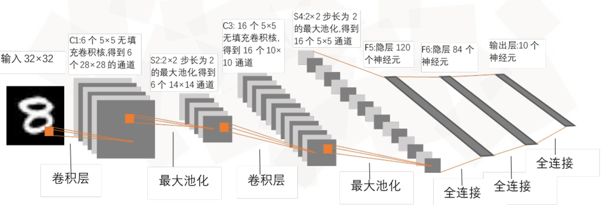  
授课教师：李静瑶

## 3 卷积神经网络

## VGG-16神经网络 (ImageNet)

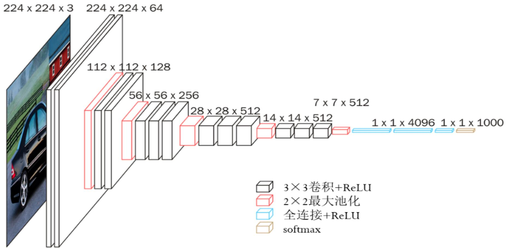  
授课教师：李静瑶

## 梯度消失问题

神经网络训练的两大问题：

梯度消失问题

过拟合问题

授课教师：李静瑶

## 梯度消失问题

什么是梯度消失问题：

$$
\begin{array} { r } { \delta _ { h } = o _ { h } ( 1 - o _ { h } ) \sum _ { k \in \sqrt { \Xi } } \underline { { \zeta } } _ { \underline { { s } } \underline { { s } } } ^ { \pm } ( h ) } \delta _ { k } w _ { k h }  \end{array}
$$

·当神经网络层数增多之后

$$
\delta _ { h } \longrightarrow 0
$$

·梯度消失问题

$$
\triangle \mathrm { w } _ { j i } = \eta \delta _ { j } x _ { j i }
$$

授课教师：李静瑶


## 梯度消失问题

## 解决思路

·使用ReLU激活函数


·ReLU的导数=1

授课教师：李静瑶


## 梯度消失问题

## 两个解决梯度消失问题的网络结构

·GoogLeNet

·ResNet (残差网络)

授课教师：李静瑶

## 梯度消失问题

GoogLeNet

授课教师：李静瑶


输入

## 梯度消失问题

## 高楼供水系统

  
授课教师：李静瑶

## 梯度消失问题

GoogLeNet

Inception模块

授课教师：李静瑶

## 梯度消失问题

  
192个通道

授课教师：李静瑶

## 梯度消失问题

  
192个通道

授课教师：李静瑶

## 梯度消失问题

## Inception模块

  
授课教师：李静瑶  
说明：每个Inception的参数有所不同，这是其中的一个

## 梯度消失问题

GoogLeNet

授课教师：李静瑶

7×7平均池化步长为1，无填充

5×5平均池化步长为3，无填充

## 梯度消失问题

## 残差网络 (ResNet)

·神经网络的退化现象

授课教师：李静瑶


## 梯度消失问题

## 残差网络 (ResNet)

·神经网络的退化现象


  
授课教师：李静瑶

## 梯度消失问题

## 解决思路

  
授课教师：李静瑶

## 梯度消失问题

## 残差模块

  
授课教师：李静瑶

## 4 梯度消失问题

## 残差网络（ResNet)

授课教师：李静瑶


## 过拟合问题

## 什么是过拟合问题

  
授课教师：李静瑶

## 过拟合问题

## 什么是过拟合问题

  
授课教师：李静瑶

## 过拟合问题

## 神经网络的过拟合问题

  
授课教师：李静瑶

## 过拟合问题

## 减少过拟合的方法：正则化项法

·误差平方和损失函数

·加正则化项

$$
\operatorname { E } _ { d } ( w ) = \sum _ { k = 1 } ^ { M } ( t _ { k d } - o _ { k d } ) ^ { 2 }
$$

$$
\operatorname { E } _ { d } ( w ) = \sum _ { k = 1 } ^ { M } ( t _ { k d } - o _ { k d } ) ^ { 2 } + \| w \| _ { 2 } ^ { 2 }
$$

$$
\| w \| _ { 2 } ^ { 2 } = w _ { 1 } ^ { 2 } + w _ { 2 } ^ { 2 } + \cdots + w _ { N } ^ { 2 }
$$

说明：并不限于误差平方和损失函数和2-范数

## 过拟合问题

## 正则化项的作用：降低模型复杂性

·曲线的多项式表示：

$$
\operatorname { f } ( x ) = w _ { 0 } + w _ { 1 } x + w _ { 2 } x ^ { 2 } + \cdots w _ { n } x ^ { n }
$$

f(x)


当w3、W4\` $w _ { 5 }$ 比较小时：

$$
\begin{array} { c } { { w _ { 0 } + w _ { 1 } x + w _ { 2 } x ^ { 2 } + w _ { 3 } x ^ { 3 } + w _ { 4 } x ^ { 4 } + w _ { 5 } x ^ { 5 } } } \\ { { \approx w _ { 0 } + w _ { 1 } x + w _ { 2 } x ^ { 2 } } } \end{array}
$$

授课教师：李静瑶

## 过拟合问题

## L2 (2-范数) 正则化项


## 2-范数：

$$
\| \boldsymbol { w } \| _ { 2 } ^ { 2 } = \sum _ { i } { w _ { i } } ^ { 2 }
$$

效果:

很多参数值很小，但基本不会为0。抗干扰能力强。

授课教师：李静瑶

## 过拟合问题

## L1 (1-范数) 正则化项


1-范数:

授课教师：李静瑶

$$
\| w \| _ { 1 } = \sum _ { i } | w _ { i } |
$$

效果:

一些参数为0，起到特征选择的作用。

## 过拟合问题

减少过拟合的方法：舍弃法 (Dropout)

·随机地临时舍弃一些神经元，每次训练一个神经元子集

  
授课教师：李静瑶

## 过拟合问题

## 减少过拟合的方法：数据增强法

·数据越多，过拟合的风险就越小

  
授课教师：李静瑶

## 过拟合问题

## 如何获得更多的数据？

·数据增强

·通过各种变换增加数据的数量

·图像数据

·缩放、旋转、局部截取、改变颜色等

授课教师：李静瑶

## 过拟合问题

## 如何获得更多的数据？

  
授课教师：李静瑶

## 致谢

本课件源自清华大学马少平教授编著的《深入浅出人工智能》配套课件。

授课教师：李静瑶